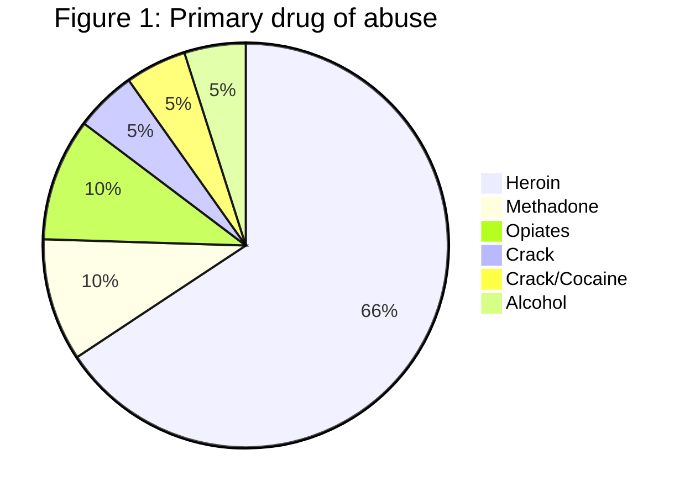
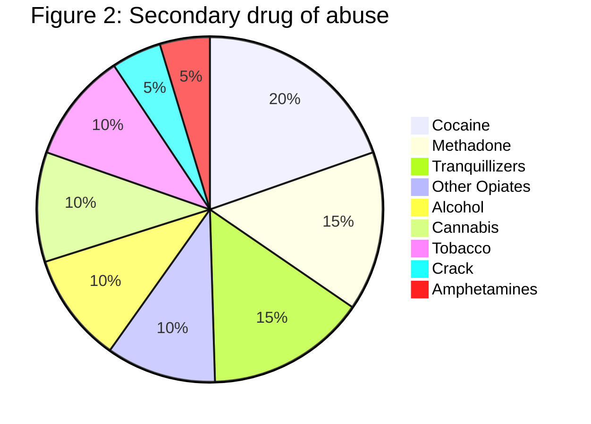
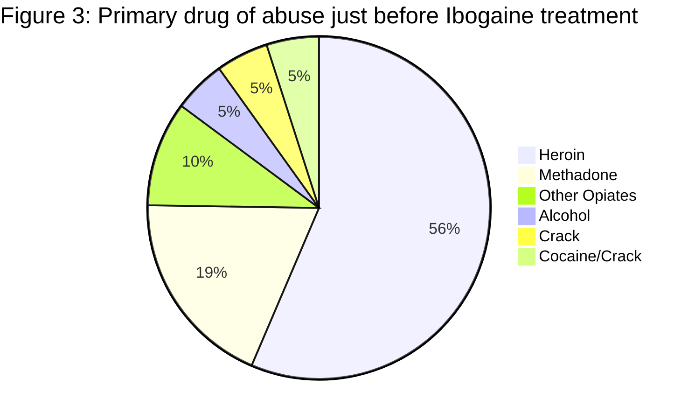
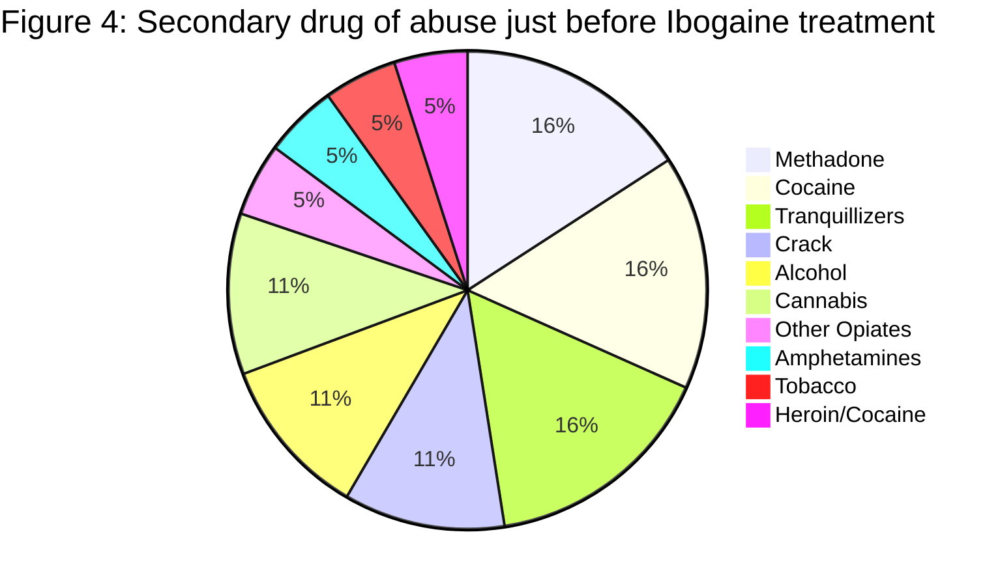

# Life after Ibogaine

**An exploratory study of the long-term effects of ibogaine treatment on drug addicts**

**Science Internship Report**
Vrije Universiteit Amsterdam
Faculty of Medicine
November 2004

**Author:** Ehud Bastiaans **Supervisor:** Prof. Dr. C. Kaplan

---

## Contents

| Section | Page |
| --- | --- |
| **Introduction** | **3** |
| **Background** | **4** |
| Pharmacology | 4 |
| The Bwiti cult in Gabon | 4 |
| The phases of the iboga experience | 5 |
| Research on ibogaine | 6 |
| **Research question** | **8** |
| **Research methods** | **9** |
| **Results** | **12** |
| Sociodemographic characteristics | 12 |
| General drug use history | 12 |
| The ibogaine treatment | 13 |
| Influence on drug use | 15 |
| Personal changes | 16 |
| **Discussion** | **20** |
| Drug use aspects | 20 |
| Medical, psychological, social and legal aspects | 22 |
| Limitations | 24 |
| **Conclusion** | **25** |
| **Literature** | **26** |
|

 |  |

---

## INTRODUCTION

Ibogaine is a psychoactive alkaloid derived from the roots of the rainforest shrub *Tabernanthe Iboga*. The native population of Western Africa uses ibogaine in low doses to combat fatigue, hunger and thirst and in higher doses as a sacrament in religious rituals (Fernandez 1982).

The knowledge of the use of ibogaine for the treatment of drug dependence has been largely based on reports from groups of self-treating addicts that the drug blocked opiate withdrawal and reduced craving for opiates and other drugs for extended time periods (Kaplan, Ketzer et al. 1993; Sheppard 1994; Alper, Lotsof et al. 1999; Alper, Beal et al. 2001).

Scientific research concerning ibogaine is concentrated in various fields including pharmacological, anthropological and to a limited amount clinical studies (Goutarel and Gollnhofer 1997; Dzoljic, Kaplan et al. 1988; Glick, Rossman et al. 1992; Judd 1994; Popick and Glick 1996; Maisonneuve, Mann et al. 1997). In addition, a number of case studies have been published (Sisko 1993).

Due to the relatively slow progress of the research on ibogaine in the academic world, the knowledge gathered focuses mostly on the anthropological, social historical, pharmacological, physiological, immediate and the short term effects on drug use. Very little is known about the medium and the long term effects of the treatment. Moreover, the information that is available, concentrates mostly on only one outcome of the treatment, namely whether the addict ceases the use of drugs or not. There is little research concerning the effect of ibogaine treatment on the wider aspects of the addict's life after the treatment with ibogaine, such as the medical condition and the psychological and social well-being.

This report describes the methodology and preliminary results of a pilot study of the long term effects of ibogaine treatment on drug addicts. The effects explored include, as mentioned above, not only the drug use behavior, but social, psychological, medical and legal aspects of the addicts' life. This interest in a broad range of effects is based on the theory that addiction is a multidimensional construct that includes not only a drug use, abuse and dependence dimension, but other dimensions of medical, psychological and social well-being (Hendriks, Kaplan Charles D et al. 1989; Hendriks, van der Meer et al. 1990).

---

## BACKGROUND

### Pharmacology

Ibogaine (12-Methoxyibogamine) is one of the at least twelve alkaloids found mainly in the cortex of the root of a plant called *Tabernanthe Iboga*, which grows in the forests of West-Africa, including Gabon and Congo. Its molecular formula is . Ibogaine appears to have a novel mechanism of action that differs from other existing pharmacotherapies of addiction, and this mechanism of action does not appear to be readily explained on the basis of existing pharmacological approaches to addiction (Alper, 2001). Ibogaine's effects may result from complex interactions between multiple neurotransmitter systems rather than predominant activity of a single neurotransmitter (Popik & Skolnick, 1999). Ibogaine has micro molar affinities for multiple binding sites within the central nervous system, including NMDA, kappa- and mu-opioid and sigma receptors, sodium channels, and the serotonin transporter (Mah & Tang, 1998).

### The Bwiti cult in Gabon

The Ibogaine that is found in the root of an Africa plant in West Africa can be found in two forms: the *Tabernanthe Iboga* and the *Tabernanthe Manii*. Both types seem to have similar psychotropic qualities (Fernandez, 1982). Iboga has been used for ages by the local population as a part of the Bwiti cult, which is a Gabonese religion. The Bwiti cult uses the Iboga root as a inherent part of the initiation ritual. During the initiation, prayers and songs are usually focused on the plant itself and not on the gods and the spirits. Bwiti are the gods and the ancestors, a connection with who can be made by the means of the Iboga. Bwiti is seen as the common ancestor, which reveals himself in the visions as an intermediator between the living and the gods.

The origin of the Bwiti cult can be found in the Mitsogho people that came to Gabon in the 19th century. The Mitsogho people met the coast population of Gabon, the Fang, and taught them the rituals of eating the Iboga (Goutarel, 1993). Iboga is used in two different ways in the Bwiti cult. If used in low dosages (four to twenty grams) the Iboga does not cause any hallucinogen effects, but stimulates and causes euphoria. In the other way, an extremely high dose (between 200 and 1000 gram) of the substance is taken once or twice in a lifetime during the initiation ritual. The cult takes measures to assure that the initiated person "does not reach too far in the village of the dead" and comes back. Moreover, the initiated person is closely supervised by other initiated individuals (the Iboga parents) during the whole ceremony.

### The phases of the ibogaine experience

The ibogaine experience has been described as being characterized by three distinct phases (Lotsof, 1995).

1. **Phase 1 (0-1 hours):** The onset of the effect progresses gradually. The visual and the physical perception of the body change. Some patients suffer from lowered coordination ability and feel the need to lie down.

2. 
**Phase 2 (1-7 hours):** Often called "the waking dream state". The patients lie down and usually are overwhelmed by the effects of the experience: hallucinations, emotions, changes in perception of their own body, time and space. Patients feel heavy physically and experience difficulties when trying to move.

* 
**Hallucinations include:** hearing African drums; seeing TV screens, animals, deceased people (who often look alive and approach the person, tell him something and disappear again); flying above oceans, cities, woods; traveling through their own brain or DNA; seeing objects in intensive colors; scenes of violence etc..

* In spite of the strong hallucinogenic effects, the patients are able to exit them by opening the eyes. When the eyes are shut again, the hallucinations continue, as if they are shown on TV screens.

* Many patients report visions that can be characterized as complete stories, which mean something to the subject and help him to achieve certain insights. These visions are often memories or events from early childhood.

3. 
**Phase 3 (starts 8-36 hours after intake):** Often called "the cognitive phase of deep introspection". It seems that the body is asleep while the spirit is fully awake. This phase is characterized by an intellectual evaluation of earlier experiences in life and the choices made.

After the end of the third phase, the subjects finally fall asleep for several hours. Often the need to sleep is temporarily reduced after an ibogaine experience, a situation that can last for one month or even longer.

### Research on ibogaine and addiction

Since the discovery of the anti-addictive potential of ibogaine by Howard Lotsof in the beginning of the Sixties, a significant amount of research on ibogaine has been conducted as a treatment for addiction. A large part of these studies points at the possibility that ibogaine is a powerful addiction interrupter.

* **Animal Studies:**
* Glick et al. (1992) found that ibogaine can interrupt or reduce self administration of morphine in rats.

* Ibogaine does not act like an opiate substitute (such as methadone) and does not cause any dependency or withdrawal symptoms (Woods et al., 1990).

* Similar results were found for cocaine addiction; rats' self administration behavior was inhibited (Cappendijk & Dzoljic, 1993).

* Multiple treatments seem more effective than just one (Glick, 1992; Cappendijk & Dzoljic, 1993).

* **Human Studies:**
* Ibogaine was found to suppress almost all withdrawal symptoms of drug addicts (Lotsof, 1991; Kaplan, 1993; Mash, 1998).

* Kaplan et al. (1993) report that heroin seeking behavior was interrupted for relatively long periods.

* Mash et al. (2001) conducted clinical research with 12 opiate dependent patients. It was found that ibogaine provides a safe and effective treatment for withdrawal from heroin and methadone, promoting rapid detoxification without a gradual taper. Subjects had significantly lower craving for drugs at 36 hours post treatment and at one month follow up.

* A clinical trial using therapeutic doses is about to begin in Israel (Aliyah 2004), led by Dr. Moshe Kotler. It will involve 12 heroin patients in a hospital setting with a one year follow-up.

---

## RESEARCH QUESTION

The short term effects of ibogaine are relatively known. It is interesting to examine these effects in the long term and try to determine the average longest drug free period as a result of the ibogaine treatment.

1. How does Ibogaine treatment affect the drug use pattern of drug addicts in the long term?

The ibogaine experience is a highly invasive event in one's life. Many individuals report changes during and after the treatment that are far from limited to hallucinogenic experiences in the first few hours. Going through detoxification with almost no withdrawal symptoms while processing past life events is one of the most intriguing qualities of ibogaine. The short term personal changes reported are not less impressive than the anti addictive outcome.

2. Are the effects of the ibogaine treatment limited to altering the drug behavior of the addicts or are the medical, psychological, social and legal aspects in the addicts' lives affected by the ibogaine treatment as well?

---

## RESEARCH METHODS

### Design

The research design was a prospective longitudinal study. At baseline data were gathered retrospectively, using self-report questionnaires filled in by individuals who were treated by ibogaine at least once for substance dependence. On the average of one year later, participants were contacted once again and sent a follow-up questionnaire to determine changes in addiction and personal behavior.

### Sampling

Because most treatments take place in informal, non-clinical environments coordinated by non-professional 'therapy providers', formidable data collection problems were faced. In order to control for a biased sample, people personally known by the researcher were not selected. Recruitment occurred via an advertisement posted on different ibogaine related web-sites.

* **Procedure:** Initially, respondents were sent an email with the questionnaire as an attachment. This was found burdensome. A more efficient system was introduced where a link to the Vrije University website was added to participating ibogaine websites, allowing direct online completion.

* **Response:** Twenty one properly filled in questionnaires were received during the data collection period of 16 months (March 2003-July 2004). The response rate for the follow-up was 33%.

### Instrument

The web-based questionnaires were largely adapted from the Europe-Addiction Severity Index.

* 
**Section A:** Personal data and drug history.

* 
**Section B:** History of ibogaine treatments.

* 
**Section C:** Results of the treatment (drug use after ibogaine).

* 
**Section D:** Other changes (employment, medical, relationships, psychological state).

### Data Analysis

The coded data were entered in an Excel file. Since this was an exploratory pilot study, statistical analysis was limited to descriptive statistics of central tendency (means and medians) and percentages. Univariate analysis was conducted on personal characteristics, drug history, treatment effects, etc.. Regarding the drug free period, the longest period was measured.

Further analysis defined three specific groups:

* **a)** Participants that have quit using any substances.
* **b)** Participants that have quit using the primary and secondary drugs of abuse, but continued using other substances.
* **c)** Participants that have not quit using the primary or secondary drug of abuse.

Successful treatment is defined as the participant belonging to either group **a** or **b**.

---

## RESULTS

### Socio-demographic characteristics

* 
**Average Age:** 37.8 years.

* 
**Gender:** 71% male, 29% female.

* 
**Residency:** 55% USA, 30% Western Europe, 15% East European.

### General drug use history

The average age of beginning any drug use was 14.9 years.

**Primary Drug of Abuse (General History)**
A vast majority of addicts (87%) reported an opiate-based substance as their primary drug of abuse.

*[Data Source: 164-172]*

**Secondary Drug of Abuse**
The results showed more variation for the secondary drug.

*(Note: Percentages from text description, citations 174-176. Some categories at 11% in text, while graph segments vary).*

**Other Treatments**
100% of participants reported trying other treatments before ibogaine. The average time before seeking the first other treatment was 12.7 years. The average period of staying clean after other treatments was 9 months (median: 4.5 months).

### The Ibogaine treatment

Participants reported different drug use habits just before the first treatment compared to their general history. There was a tendency for transition from heroin to methadone before trying Ibogaine treatment.

**Primary Drug of Abuse (Just before Ibogaine Treatment)**

*[Data Source: 192-204]*

**Secondary Drug of Abuse (Just before Ibogaine Treatment)**

*[Data Source: 205-219]*

**Usage Period:** Participants used the primary drug for 10 years (median 8) and the secondary drug for 14 years (median 10.5) before Ibogaine treatment.

**Treatment Modality:**

* 67% Non-clinical environment with Ibogaine therapist.
* 29% Self-treatment.
* 5% Clinical environment with therapist.

* 85% treated with HCl, 15% with Extract.

**Repeated Treatments:**

* 48% repeated treatment once (average gap 1.8 years).
* 14% treated three times (gap 1 year).

### Influence on drug use

**Group 1: Quit all substances (24%)**
5 out of 21 participants quit using any substances whatsoever.

* Average drug free period: **41.2 months** (~3.5 years).
* Median: **24 months**.

**Group 3: Quit primary/secondary, use others (43%)**
(Note: Text says "56% of the remaining 76%", approx 43% of total).
Quit primary/secondary drugs but continued other substances (mostly alcohol or cannabis).

* Average drug free period: **20.8 months** (~1.5 years).
* Median: **4.5 months**.

**Group 4: Continued use (33%)**
Did not quit primary or secondary drugs.

* Median drug free period: **1 week**.
* However, 6 out of 7 reported consuming **lower quantities** of drugs.

**Overall Results**

* 
**67%** of participants quit using either all kinds of substances or their primary/secondary drugs.

* 
**Overall Mean Drug Free Period:** 21.8 months.

* 
**Overall Median:** 6 months.

**Impact of Ibogaine Type**

* **HCI Treatment:** Average drug free period **26.8 months**.
* 
**Extract Treatment:** Average drug free period **2.1 months**.

### Personal changes

**Employment**
86% were employed before treatment. All participants in the follow-up (6 people) kept their jobs. Occupations ranged from university professor to drug dealers.

**Medical Condition**

* **Before:** 43% reasonable, 24% bad, 19% good, 14% very bad. 29% developed chronic disease during addiction.

* 
**After:** 58% reported improvement, 26% no change, 16% worsened.

**Relationships**
88% reported significant improvement in relationships.

* 
*Participant P12:* "...I have found that I have more interest and empathy for others than I had before...".

* 
*Participant P07:* "I became a reliable, trustworthy person... My family invited me back into the fold.".

**Psychological Well-being**
Significant improvements were reported in anxiety and depression (92% and 100% respectively).

### Table 1: Percentage distribution of psychological symptoms before and after Ibogaine treatment (N=18)

| Symptoms | Before treatment (%) | Improved or disappeared after treatment (%) | No change (%) | Worsened after treatment (%) | Developed after treatment (%) |
| --- | --- | --- | --- | --- | --- |
| **Functional psychosis** | 6 | 100 | 0 | 0 | 0 |
| **Anxiety** | 67 | 92 | 0 | 8 | 0 |
| **Phobias** | 11 | 100 | 0 | 0 | 0 |
| **Depression** | 61 | 100 | 0 | 0 | 6 |
| **OCD** | 17 | 100 | 0 | 0 | 6 |
| **Hypochondria** | 11 | 100 | 0 | 0 | 6 |
| **Eating disorder** | 28 | 80 | 6 | 0 | 6 |
| **Social isolation** | 33 | 100 | 0 | 0 | 0 |
| **Borderline disorder** | 6 | 100 | 0 | 0 | 6 |
|

 |  |  |  |  |  |

**Legal Aspects**
35% reported improvement in relationship with the law; 65% claimed no changes.

* 
*Participant P07:* "Since the treatment I haven't been in any trouble with the law outside of two speeding tickets.".

### Table 2: Mean and median drug free period as a function of number of Ibogaine treatments (in months)

| Treatments | Mean | Median |
| --- | --- | --- |
| **1 treatment** | 9.7 | 2.3 |
| **2 treatments** | 35.7 | 12.0 |
| **3 treatments** | 52.0 | 42.0 |
|

 |  |  |

### Table 3: Number of average months drug free as a result of the number of drugs used

| Number of drugs | 1-2 drugs | 3-4 drugs | 5 and more drugs |
| --- | --- | --- | --- |
| **Number of months drug free** | 25.8 | 19.3 | 20.4 |
|

 |  |  |  |

There appears to be a significant gap between the drug free period after HCI treatment (26.8 months) and extract treatment (2.1 months).

---

## DISCUSSION

### Drug use aspects

This study attempted to determine the long-term effects of Ibogaine treatment. The results confirm prior studies that Ibogaine is a successful addiction interrupter in the short term.

* 
**67% Success Rate:** Participants belonging to Groups 1 and 3 (quit primary/secondary drugs).

* 
**Comparison to Conventional Treatment:** The median drug free period after Ibogaine (6 months) was higher than the median period after other treatments reported by the same sample (4.5 months).

* 
**Multiple Treatments:** The number of additional Ibogaine treatments is positively correlated with the duration of the drug free period.

* 
**Reduced Dosage:** Even those who relapsed (Group 4) reported consuming lower quantities of drugs, supported by Ibogaine's ability to modify CNS sensitivity to opiates.

### Medical, psychological, social and legal aspects

Participants reported major changes in quality of life:

* **Medical:** 58% improved.
* **Social:** 88% improved.
* **Psychological:** Significant improvement in anxiety and depression.
* 
**Legal:** One third reduced criminal behavior.

Even participants whose treatment "failed" (relapsed) benefited in other life aspects. This may be due to the mechanism of *Abreaction*—intense re-experiencing of past events—which may be therapeutic for drug addicts.

### Limitations

1. 
**Self-report:** Method relies on questionnaires which may be misinterpreted or incompletely filled.

2. 
**Reliability:** Web-based data collection cannot be verified by collateral data.

3. 
**Sample Size:** Small sample size complicates generalization.

4. 
**Timing:** Respondents filled questionnaires at different periods after treatment.

---

## CONCLUSION

1. Influence on Life Aspects: Ibogaine influences various aspects of the life of the drug addict, namely medical condition, social functioning, psychological well-being and relationship with the law.

**2. Long Term Effects on Drug Use:**

* 
**67%** quit using either all substances or their primary/secondary drugs.

* 
**33%** decreased the amount of drug used.

* 
**Overall Average Drug Free Period:** 21.8 months (Median: 6 months).

The results are encouraging, showing significant drug free periods among two-thirds of drug addicts. This study is an appropriate starting point for further research using larger samples.

---

## LITERATURE

* Aliyah, A. (2004). Chomer tov (Good stuff). Yediot Achronot. Tel Aviv: 37-40.

* Alper, K., H. Lotsof, et al. (1999). "Treatment of acute opiod withdrawal with ibogaine." The American Journal on Addictions 8(3): 234-242.

* Alper, K. R., D. Beal, et al. (2001). A Contemporary History of Ibogaine in the United States and Europe. Ibogaine: Proceedings of the First International Conference. K. R. Alper and S. D. Glick. San Diego, CA, Academic Press: 249-281.

* Dzoljic, e. d., c. d. Kaplan, et al. (1988). "Effect of ibogaine on naloxone-precipitated withdrawal syndrome in chronic morphine-dependend rats." arch.int.pharmacodyn 294: 64-70.

* Fernandez, J. W. (1982). Bwiti: an Ethnography of the religious imagination in Africa. Princeton, NJ, Princeton University Press.

* Glick, S. D., K. Rossman, et al. (1992). "Effects of ibogaine on acute signs of morphine withdrawal in rats: independence from tremor." Neuropharmacology 31(5): 497-500.

* Golechha, G. R., I. C. Sethi, et al. (1986). "Ketamine abreaction: A new approach to narcoanalysis." Indian Journal of Psychiatry 28(4): 297-304.

* Goutarel, R. H. R. D. and O. S. Gollnhofer, Roger (1997). Pharmacodynamics and therapeutic applications of Iboga and Ibogaine. Psychadelic monographs and essays. Gif-sur-Yvette Cedex, Institute of Chemistry of Natural Substances of the National Scientific Research Centre: 71-111.

* Hendriks, V. M., Kaplan Charles D, et al. (1989). "The Addiction Severity Index: Reliability and Validity in a Dutch Addict Population." Journal of Substance Abuse Treatment 6: 133-141.

* Hendriks, V. M., C. W. van der Meer, et al. (1990). "De Addiction Severity Index: Een multidimensionele ernstlijst voor de verslavingszorg." Tijdschrift voor Psychiatrie. 32: 420-436.

* Higdon, J. F. (1990). "Expressive therapy in conjunction with psychotherapy in the treatment of persons with multiple personality disorder." American Journal of Occupational Therapy 44(11): 991-993.

* Jackson, S. W. (1994). "Catharsis and abreaction in the history of psychological healing." Psychiatric Clinics of North America 17(3): 471-491.

* Judd, B. E. (1994). Ibogaine, psychotherapy and the treatment of substance related disorders. The eight international conference on drug related harm, Washington.

* Kaplan, C., E. Ketzer, et al. (1993). "Reaching a state of wellness: Multistage explorations in social neuroscience." Social Neuroscience Bulletin 6(1): 6-7.

* Lotsof, H. S., C. A. Smith, et al. (1996). Ibogaine, trauma and Abreaction: the treatment of substance-related disorders.

* Mah, S. J., Y. Tang, et. al. (1998). Brain research 797, 173.

* Maisonneuve, I. M., G. L. Mann, et al. (1997). "Ibogaine and the dopaminergic response to nicotine." Psychopharmacology 129: 249-256.

* Peterson, J. (1993). "Abreaction re-evaluated: Comment." Dissociation: Progress in Dissociative Disorders 6(1): 74-75.

* Popick, P. and S. D. Glick (1996). "Ibogaine: antiaddictive alkaloid." Drugs of the future 21(11): 1109-1115.

* Popik, P. and P. Skolnick (1999). "The Alkaloids" p. 197. Academic Press, New York.

* Sheppard, S. G. (1994). "A preliminary investigation of ibogaine: Case reports and recommendations for further study." Journal of Substance Abuse Treatment 11(4): 379-385.

* Sisko, B. (1993). "Interrupting drug dependency: a summery of four case histories." Multidisciplinary Association for Psychedelic Studies 4(2).

* Steele, K. H. (1989). "A model for abreaction with MPD and other dissociative disorders." Dissociation: Progress in the Dissociative Disorders 2(3): 151-159.

* Van der Hart, O. and P. Brown (1993). "Abreaction re-evaluated: Author's reply to Peterson." Dissociation: Progress in Dissociative Disorders 6(1): 76.

---

## See Also

**Parent hub:** [[PURPLE_Phenomenology_Hub]]

- [[1996/Lotsof1996_Trauma_Abreaction]] — Lotsof's psychological framework these outcomes explore
- [[2005/Kroupa2005_Boosters_Maintenance]] — Booster/integration protocols for long-term outcomes
- [[2018/Rodger2018_Healing_Potential_Ibogaine]] — Later phenomenological outcomes research
- [[2020/Kohek2020_Qualitive_Study_Acute_Subjective_Effects_of_Ibogaine]] — Qualitative acute effects study
- [[2025/Espejito2025_Ibogaine_Experience_Scale_Psychometrics_Subjective]] — IES scale for quantifying subjective outcomes