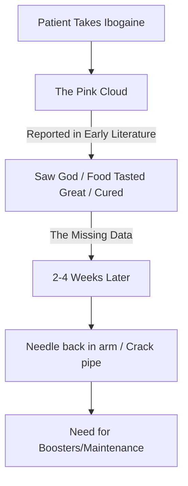
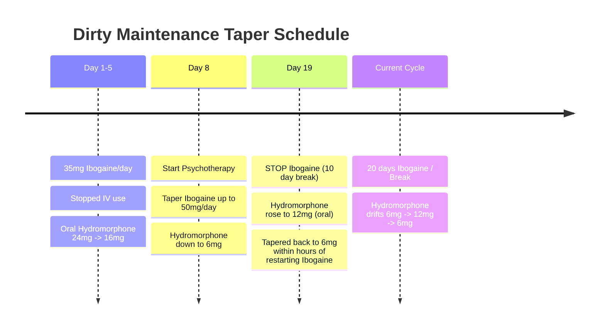

## Ibogaine in the 21st Century: Boosters, Tune-ups and Maintenance

**By Patrick K. Kroupa & Hattie Wells**
*(transcendence@phantom.com)*

**Publication:** MAPS • Volume XV Number 1 • Spring 2005

## History

The history of using ibogaine to break the cycle of drug-dependence is relatively short. While it is likely that the CIBA pharmaceutical company and the US government were aware of ibogaine’s anti-addictive properties as early as 1957, the anecdotal observations of Howard Lotsof in 1962 are generally accepted as the starting point, initiating waves of interest that have continued spreading since that date.

Reading through the early anecdotal literature, the overall tone is overwhelmingly positive. The experiences indicate instant and abrupt cessation of desire to use drugs, the idea being that you take ibogaine once and never want to use drugs again. It is hailed as a “cure” for addiction.

The problem with most of these reports is that they do not withstand the light of day, or correspond with our own experience. Over the last five years, we have treated a total of 45 individuals with ibogaine, for the specific purpose of breaking a cycle of drug dependence. The vast majority of these do not fall under the “instant cure” category. Four people could be categorized as such, having had extremely profound experiences, which facilitated complete cessation of their drug dependency after a single dose. The rest have required additional treatment or more formal follow-up care in order to maintain their goals. “One-hit wonders,” it seems, are exceedingly rare in the 21st century.

> **Information regarding follow-up treatments is not publicized. “I did ibogaine once, and was no longer an addict!” is not followed up with the information, “Oh, and then I took it another 15 times that year for spiritual insight!”**

There are a variety of factors which may account for the discrepancy between initial claims made for ibogaine and subsequent results. Firstly, the categorization of what constitutes a “junkie” is hugely variable. All heroin users eventually develop a tolerance, needing larger doses to achieve the same effect. Daily use combined with ever-increasing tolerance results in physical dependence. However, there is a significant difference between someone who is experimenting with drugs within a social context, and happens to become inadvertently drug-dependent, and a hardcore dope fiend who has been IV-ing heroin for 20 years and whose whole life revolves around junk.

Early reports of individuals dosing with ibogaine may be paraphrased as, “I took ibogaine once, saw God, found myself, came down to Earth, food tasted great, I stopped smoking, starting experiencing life as I haven’t since I was a child, and rode off into a rosy sunset.”

In 2005 there tends to be one additional sentence following up all of that, “...and two to four weeks after I wrote those words, I had a needle back in my arm or was sucking on a crack pipe.”

Another issue is incomplete or missing data. Information regarding follow-up treatments is not publicized. “I did ibogaine once, and was no longer an addict!” is not followed up with the information, “Oh, and then I took it another 15 times that year for spiritual insight!”

The published history of ibogaine administration for drug dependence is relatively consistent in reporting a single-dose modality. In our experience, this has proven to be sub-optimal or ineffective for many people.

However, some treatment providers must maximize the benefit of a single dose because many clients will not have the chance to re-dose with ibogaine following the initial treatment. “Detoxing” prior to treatment, by tapering opiate intake down over a period of months, is one method used to ensure easier reintegration post-ibogaine. Subsequently, patients often return to their home country, where ibogaine is a Schedule I substance, and therefore cannot be retreated if necessary. The “detoxing” strategy has both pros and cons, but evaluating these is beyond the scope of this article.

### The Cycle of Anecdotal Reporting

---

## Boosters, Tune-ups and Maintenance

After an initial treatment with ibogaine, the physical dependency is no longer there. However, the complex series of psychobiological interactions that caused someone to become addicted in the first place are still present. Ibogaine is not a “cure” for drug addiction.

Booster doses of ibogaine HCl can be extremely beneficial and often make the difference between relapse or success. Individuals with a long history of being drug-dependent who have detoxed from extremely high doses of narcotic analgesics will usually have at least 85% to 90% of their withdrawal symptoms lifted after the initial reset.

However, a few days out, many people derive tremendous benefit from one—or more—booster doses. Typically a booster will fall within the 500–800Mg (total dose) range. All the same precautions should be observed, as when doing the higher dose of ibogaine HCl (16–18Mg/kg. range).

### Comparison: Boosters vs. Tune-ups

| Feature | Boosters | Tune-ups |
| :--- | :--- | :--- |
| **Timing** | A few days after initial reset. | Several weeks to many months after full reset. |
| **Intent** | Increase efficacy of initial dose; clear remaining withdrawal (last 10-15%). | Maintain sobriety; address depression/overload; prevent relapse without full trip. |
| **Dose Range** | 500–800 Mg (Total) | 500–800 Mg (Total) - *varies, can be up to a gram*. |
| **Target Audience** | Recent detox patients. | People who reached goals but are slipping, or those who relapsed but fear full tripping. |

### Tune-ups

Tune-ups differ from boosters in intent and timing. While boosters increase the efficacy of an initial full-blown dose of ibogaine HCl, tune-ups usually happen anywhere from several weeks to many months following the last full-blown dose of ibogaine. The dose-range tends to fall within the same 500-800Mg category (as with most things there are no absolutes, someone may do a gram as a tune-up) as boosters. Tune-ups are used by people who reach their goals (presupposing their goal was to remain clear of narcotic analgesics), maintain sobriety, and discover that they’re depressed, overloaded, starting to come undone, or simply develop a desire to do ibogaine again. And for whatever reasons, they want to avoid a full-on psychoactive dose.

Another category is people who haven’t managed to achieve their goals, and have slipped back into active drug-use. These individuals often want to get “reset” again, but have a strong aversion to doing full-blown resets. Dislike of tripping and fear of facing the self may be strong deterrents. A tune-up, followed by a few boosters, will bring someone to roughly the same state they would achieve with an initial 16–18Mg/kg reset.

> **The concept behind clean maintenance is this: What if you could take someone who has been detoxed, and is presently drug-free, who is trying to put their life back together again, and extend the time-frame during which all things are possible to a period of weeks or months, giving them time to develop new coping mechanisms for dealing with life sober?**

### "Clean" Maintenance

Ibogaine is metabolized by the liver and converts to noribogaine (12-hydroxyibogamine). There is also evidence that ibogaine has a high propensity for being deposited in adipose tissue, resulting in a depot-like effect. In practice, for roughly seven to ten days after dosing with ibogaine—assuming you have relatively normal bodyfat levels—your mood will be noticeably enhanced. Life will seem particularly good.

This is the mythical “window of opportunity” that has been mentioned repeatedly with regards to ibogaine administration. It is extremely important to plan ahead and make use of this time in the most effective manner possible, because it *will* pass. A week later, ten days at most, the warm fluffy clouds will break, and you will be left dealing with your life.

Many people who are self-medicating can derive significant benefit from conventional medications which can be extremely helpful during this time period, but the bottom line is many people go from feeling like everything is possible, to . . . nothing is possible. People crash and hit reality.

The concept behind clean maintenance is this: What if you could take someone who has been detoxed, and is presently drug-free, who is trying to put their life back together again, and extend the time-frame during which all things are possible to a period of weeks or months, giving them time to develop new coping mechanisms for dealing with life sober?

**Individual 1:** Male, early 40s and in overall good health, who has done four full-blown resets using ibogaine over a three-year period. He initially did ibogaine with the intent of ending his addiction to crack cocaine. Post-ibogaine he entered aftercare, sought psychotherapy and attended self-help groups. In short, he was the ideal patient. He is extremely intelligent, has a high level of self-awareness, functions within society and has no limitations due to a lack of financial resources.

He thrived immediately post-ibogaine but gradually wandered further and further out, until at roughly three months, he hit the wall, fell apart, and relapsed. This occurred after each session. After the initial relapse the downward spiral began and continued until he was smoking crack on a daily basis and eventually re-dosed with ibogaine once more. Each bottom was getting progressively lower. He had fears that if he repeated this cycle again, he would reach the stage where he simply would not be coming back from the last binge and either die, or come to his senses five years later instead of pulling out after a few months.

The last time he hit the initial relapse, he was dosed with 350Mg of ibogaine HCl in an attempt to halt the downward spiral. This worked in helping him break through this critical phase and allowed him to move onwards. After the initial 350Mg dose, he has continued using ibogaine HCl on an “as needed” basis. For him this amounts to 50Mg twice a week on average, and 100Mg every 45 days or so.

At the present time, utilizing this methodology, he has been clean for seven months, which is his longest period of abstinence in the last ten years. He has continued with psychotherapy but stopped attending self-help groups, and plans to do a full-blown 18Mg/kg dose of ibogaine HCl sometime in the near future, for the purpose of spiritual insight.

## “Dirty” Maintenance

For some, abstinence from narcotic analgesics is not a reality-based goal. Many chronic pain patients are really not going to cast off their crutches, light up some medical marijuana and dance in the meadow, after ibogaine.

In addition to chronic-pain patients, there are many people who are using narcotic analgesics to self-medicate a variety of comorbid conditions. In some cases a “successful” detox from opiates means that somebody can look forward to a lifetime’s worth of maintenance on neuroleptics.

Given the choice between opiates and neuroleptics, there is no simple answer, but the side-effects of current anti-psychotic medications can be devastating. When you compare the quality of someone’s life when they are controlling schizophrenia, for example, through the use of opiates (which tend to have extremely mild side effects) vs. the quality of life attained using sanctioned medicines (usually neuroleptics, with Cogentin to alleviate some of the side-effects anti-psychotics produce), it is entirely possible, even probable, that the person is happier with the opiates.

Ibogaine is remarkably effective in addressing one of the primary problems in any sort of opiate or opioid maintenance: tolerance. Over time, individuals find they must do extremely high doses of their medications in order to achieve any effect whatsoever.

> **WARNING: the following category should be considered highly experimental. There is a complete lack of published scientific data regarding the following examples. The difference between 50mg. And 500mg. Is extremely significant and quite possibly fatal. Ibogaine potentiates the analgesic effect of opiates and opioids.**

> **For some chronic pain patients, abstinence from narcotic analgesics is not a reality-based goal.**

**Individual 1 (Dirty Maintenance):** Male, mid-30’s, in good health, who has experienced full-blown resets using ibogaine HCl in the past. His average daily intake was 20Mgs oxycodone and 4–6Mgs hydromorphone (Dilaudid), which he is prescribed for pain management.

By using a very low-dose regimen of 25–50Mgs of ibogaine HCl on a daily basis, he was able to taper down to a point at which 3.75Mg of oxycodone is subjectively providing him with identical pain relief.

**The Regimen (Individual 1):**

1.  **Start:** 25Mg Ibogaine HCl/day.
    *   *Result:* Immediately halved intake of narcotic analgesics (Oxy/Dilaudid) with no withdrawal.
2.  **Day 6:** Increased Ibogaine HCl to 40Mg/day.
3.  **Week 2:** Increased Ibogaine HCl to 50Mg/day.
4.  **Day 22:** Took a 10-day break from Ibogaine.
5.  **Current:** 50Mg Ibogaine every other day.
    *   *Opiate Intake:* Consistent at 3.75Mg/day Oxycodone.

In his own words, *“The goal with adding ibogaine to the oxycodone is to minimize if not end the need for it [oxycodone] for pain management. The HCl seems to help with the pain, or at least gives me awareness to take better care of my body by stretching, drinking more water and to get outside for exercise and sunshine.”*

*“Most importantly the HCl has given me a feeling of well being and feeling comfortable in my place in the universe, allowing me to process through a depression I have been suffering from. I feel GREAT. The darkness has lifted, the impending doom is cast away! The low dose regimen has also been extremely helpful in musical inspiration; songs I had half-written are coming to completion and new songs are being created. There is a distinct connection between ibo and rhythm/melody, and further underscores for me the important aspect of music in the Bwiti ceremonies.”*

**Individual 2 (Dirty Maintenance):** Female, early 40s, overall good health but suffering from anorexia, has been physically dependent on narcotic analgesics for 19 years. Her use started with heroin and eventually shifted to methadone maintenance and finally hydromorphone (Dilaudid). She has extreme fear and dislike of “tripping” and has repeatedly refused to take a full-blown ibogaine reset.

Her average daily intake was 28Mg of hydromorphone which she “cold-shakes” (breaks down the pills in a cooker so they can be injected) and IVs.

She began by doing 35Mg of ibogaine HCl and was immediately able to stop injecting the hydromorphone and obtained similar analgesia from 24Mg of Dilaudid. Over a period of five days she maintained on 35Mg of ibogaine HCl while continuously decreasing the hydromorphone, which she was taking orally, as prescribed. After five days she was on 16Mg of hydromorphone.

**Timeline (Individual 2):**

At six months out, this cycle appears to be consistent. She takes a break from ibogaine maintenance every 20 days. Slowly drifts from 6Mg/day of hydromorphone, up to 12Mg, before restarting ibogaine at 35Mg/day, at which point she drops back to 6Mg—which appears to be her comfort zone—while gradually increasing ibogaine HCl to 50Mg/day.

She has plans to try a 500Mg dose of ibogaine HCl, and attempt complete cessation of narcotic analgesics.

## Ibogaine Maintenance: Hitting the Wall

Whether an individual is doing ibogaine maintenance while clean, or with narcotic analgesics—utilizing daily maintenance, or skipping days—there seems to be a point of diminishing returns somewhere between day 20 and 25. At this point people discover that for all intent and purposes they’re “speeding”. There is a general feeling of being wired, jittery, and severe sleep disturbances begin manifesting themselves.

Taking a break from ibogaine for a week or two at this point appears to be sufficient time to allow roughly another three-week cycle of ibogaine before once again hitting the wall. Three weeks “on” followed by ten days to two weeks “off” has been a cycle people have maintained without any particular side effects.

> **Currently, however, ibogaine boosters, tune ups and maintenance are improving the long-term effects of ibogaine administration.**

## Conclusion

Drug-dependent individuals have a variety of obstacles to surmount. One of the largest tends to be years—or decades—of being at the receiving end of what passes for drug treatment in Western society. This includes years of being categorized as disease-afflicted criminals.

Ibogaine is akin to the peeling away of a veil, the removal of the soft focus glasses. After the noribogaine disappears (the so-called window of opportunity) the harsh reality of life is often unbearably uncomfortable. Ibogaine doesn’t eradicate the underlying causes of addiction, which for many people may take years to understand and come to terms with. Ibogaine is more than a detox, but it’s a catalyst, not a “cure.”

Ibogaine treatment is in its infancy. The future holds the possibility of second-generation drugs such as noribogaine and 18-mc, which may—or may not—supersede ibogaine maintenance. Currently, however, ibogaine boosters, tune ups and maintenance are improving the long-term effects of ibogaine administration.

Post-ibogaine, all that anyone absolutely must have in order to progress towards whatever goal they have set for themselves, can be distilled down to one word: **BELIEF**. What exactly you choose to believe in is irrelevant, so long as you infuse it with enough energy to make it real. Unfortunately, what most drug-dependent individuals have been taught is that they are powerless, diseased, and flawed. Which creates the need for two more words: **SUPPORT SYSTEM**. This is some sort of environment where your beliefs and goals will be supported instead of attacked and invalidated.

http://ibogaine.mindvox.com
http://www.ibogaine.org/manual.html
http://www.ibogaine.co.uk

---

## See Also

**Parent hub:** [[GREEN_Clinical_Protocols_Hub]]

- [[2001/Lotsof2001_Case_Studies_Patient_Management]] — Howard Lotsof's earlier patient management approach this booster protocol extends
- [[1999/Alper1999_Acute_Opioid_Withdrawal]] — Acute treatment data this maintenance approach builds upon
- [[Clinical_Guidelines/GITA2015_Clinical_Guidelines]] — Later guidelines incorporating booster dose considerations
- [[2017/Wilkins2017_Methadone_Low_Dose]] — Low-dose methadone detoxification approach in same pragmatic tradition
- [[2017/Noller2017_Ibogaine_Opioid_12Month_Outcomes]] — Observational outcomes data supporting sustained treatment effects

