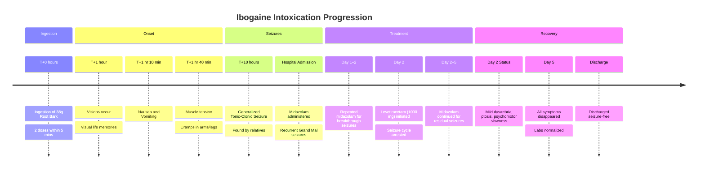

# "Herbal seizures" – atypical symptoms after ibogaine intoxication: a case report

**Journal of Medical Case Reports** (2015) 9:243 **DOI:** 10.1186/s13256-015-0731-4

**Authors:** Lorenz Breuer, Burkhard S. Kasper, Bernd Schwarze, Juergen M. Gschossmann, Johannes Kornhuber, and Helge H. Müller

---

## Abstract

**Introduction:** Misuse of various new psychotropic substances such as ibogaine is increasing rapidly. Knowledge of their negative side effects is sparse.

**Case presentation:** We present a case of intoxication with the herbal substance ibogaine in a 22-year-old white man. After taking a cumulative dose of 38 g (taken in two doses), he developed visual memories, nausea and vomiting. He developed a generalized tonic-clonic seizure with additional grand mal seizures. He was treated with midazolam and levetiracetam. Extended drug screenings and computed tomography and magnetic resonance imaging findings were all negative.

**Conclusions:** Knowledge of the side effects of ibogaine has mainly come from reports of cardiovascular complications; seizures are rarely mentioned and experimental findings are inconsistent. It seems that ibogaine acts like a proconvulsive drug at high doses.

**Keywords:** Ibogaine misuse, Intoxication, Reactive seizures, Side effects

---

## Key Findings

Knowledge about the potential side effects of ibogaine is sparse. Sudden deaths have been related to ibogaine use, usually due to concomitant medication, comorbidities, or self-treatment for detoxification. Most reports note fatal cardiac symptoms with QT prolongation and arrhythmias. In contrast, this patient survived without severe ECG abnormalities.

Alper et al. reported a patient with seizures directly related to ibogaine (not used for detox). In our case, the patient had no history of drug abuse or interaction with prescribed substances, excluding those as triggers.

**Dosage Analysis**:While the exact concentration in the dried root bark is unknown, a dose of **38 g** is high compared to literature reports of 2 to 30 g.

- Assuming a 7% ibogaine concentration, the paper states this corresponds to **2260 mg or 35 mg/kg**. *Vault note: This contains a source arithmetic inconsistency. 38 g × 7% = **2660 mg**, not 2260 mg, and 2660 mg / 76.6 kg ≈ **34.7 mg/kg**, which is consistent with the 35 mg/kg figure. The mg-per-kg figure is therefore correct; the absolute milligram figure printed in the source is off by 400 mg. The vault YAML `dosing_range` uses the corrected ~35 mg/kg.*

- It is assumed that at this high dose, ibogaine acted as a **proconvulsive drug**, whereas in lower doses it is generally supposed to be anticonvulsive.

---

## Case Details

**Patient Profile:** A 22-year-old white man in good physical health (height 184 cm; weight 76.6 kg) used ibogaine for the first time.

- 

**History:** No history of acute or chronic illness, no drug dependence, and no concomitant use of prescribed medications.

- 

**Intent:** He wanted to achieve a "spiritual cleansing and reboot".

- 

**Intake:** He ordered dried ibogaine root bark via the Internet and took a **cumulative dose of 38 g**. He ground it, dissolved it in water, and took two portions with &lt;5 minutes latency between doses.

### Clinical Timeline

The following timeline illustrates the progression of symptoms and treatment .

**Hospital Course and Findings:**

- **Seizures:** Ten hours after intake, he suffered a generalized tonic-clonic seizure. In the ICU, he had several grand mal seizures requiring repeated midazolam .

- **Resolution:** Levetiracetam (1000 mg) was initiated on day two. The paper states levetiracetam "immediately stopped the symptoms", but in the same passage notes that repeated midazolam was needed over the next three days to control persistent generalised seizures, with full clinical resolution only by day five. The transparent reading is that levetiracetam arrested the seizure-recurrence cycle rather than producing instantaneous symptom cessation; residual seizures still required benzodiazepine cover, and non-seizure neurological symptoms (dysarthria, ptosis, psychomotor slowing) cleared over the following days. The patient remained awake throughout with no further neurologic progression (no tremor, clonus, or hyperreflexia).

- 

**Imaging:** Cranial CT and MRI showed no pathological findings.

- **Labs:** Initial tests showed unspecific alterations likely related to multiple seizures (slightly increased CRP, WBC, decreased platelets, elevated CK). No signs of infection .

- 

**Neurology (Day 2):** Mild dysarthria (heaviness of tongue), mild bilateral ptosis, and psychomotor slowness.

- **Follow-up:** On day five, symptoms disappeared. During a 3-month control period with documented abstinence, he had no further seizures without levetiracetam (which was tapered off).

### Electroencephalogram (EEG) Findings

*Vault note on source timing inconsistency: The case-presentation prose introduces the EEG findings under the patient's day-two neurological status, but the Figure 1 caption explicitly reads "Electroencephalogram at day four" and Table 1 places the abnormal EEG entry in the day 4 column. Day 4 is treated here as the more reliable timepoint, since the table and figure agree. The narrative-text reference is taken to be a paper-internal inconsistency.*

**Figure 1 Description:**

> The Electroencephalogram at day four after ibogaine intoxication shows an irregular alpha rhythm and a significant portion of diffuse theta waves consistent with recent intoxication. No focal slowing and no epileptiform discharges are shown.

---

## Laboratory and Diagnostic Findings

**Table 1: Apparatus and laboratory findings during the observation period after ibogaine intoxication**

| Type of Analysis | Day 1 | Day 2 | Day 3 | Day 4 | Month 3 | Reference Values |
|---|---|---|---|---|---|---|
| Computed Tomography | — | No pathological findings | — | — | — | — |
| Magnetic Resonance Imaging | — | — | No pathological findings | — | — | — |
| Electrocardiogram | Sinus tachycardia (>120 bpm) / Sinus rhythm | Sinus rhythm | Sinus rhythm 55 bpm; QTc 100% | — | — | — |
| Electroencephalogram | — | — | — | Irregular alpha rhythm, significant portion of diffuse theta waves, no focal slowing, no epileptiform discharges | Regular alpha rhythm, no focal slowing, no epileptiform discharges | — |
| White blood cell count (×10³/μl) | **11.7** | **10.6** | 6.2 | 5.1 | 4.4 | 4.0–9.4 |
| Platelet count (×10³/μl) | 248 | **164** | **136** | **127** | 176 | 150–440 |
| Lymphocyte count (%) | **5.8** | **11.7** | 25 | 29.4 | 28.0 | 25–40 |
| Neutrophil count (%) | **87.8** | **79.2** | 62.4 | 59.9 | 58.8 | 50–75 |
| Creatinine (mg/dl) | **1.24** | 0.84 | 0.75 | 0.79 | 0.76 | < 1.2 |
| Creatine-kinase (U/l) | — | — | **370** | **234** | 194 | < 190 |
| C-reactive protein (mg/l) | **0.69** | — | **0.71** | 0.39 | 0.35 | 0.0–0.5 |
| Carbohydrate-deficient-transferrin (%) | — | — | — | — | 1.59 | < 2.6 |
| Ibogaine concentration in hair (pg/mg) | — | — | 22 | — | — | — |
| Noribogaine concentration in hair (pg/mg) | — | — | 70 | — | — | — |
| Noribogaine concentration in urine (ng/mg) | — | — | 9.2 | — | — | — |

**Notes:**

- Pathological findings are marked in **bold**, matching the source table's indication.
- Cells marked "—" indicate no measurement reported in that column.
- Routine drug screenings were extensive and all negative. **Urine panel:** benzodiazepine, amphetamine, morphine/opiate/heroin, barbiturates, ecstasy/3,4-methylenedioxy-methamphetamine (MDMA), methadone, cocaine metabolites, methamphetamine, tetrahydrocannabinol, fentanyl, tricyclic antidepressants, and buprenorphine. **Serum panel:** barbiturates, benzodiazepine, and tricyclic antidepressants.
- Routine laboratory parameters not tabulated above were also assessed and showed no pathological findings: liver enzymes, electrolytes, coagulation status, triglycerides, cholesterol, thyroid-stimulating hormone, free triiodothyronine, and free thyroxine.

---

## Pharmacological Background

The use of synthetic legal or semi-legal substances is increasing rapidly, especially in patients under the age of 30 years. One such substance is ibogaine, a natural alkaloid extracted from the roots of the rain forest shrub *Tabernanthe iboga*.

Ibogaine is known in alternative and rural medicine. In Gabon, it is used for initiation ceremonies to induce a near-death experience for psychological purposes and to produce a rural-spiritual contact with the ancestors. It acts as a traditional "high" that includes hallucinations and feelings of depersonalization.

In Western countries, the substance is used off-label and experimentally for the specific indication of detoxification from opiates, stimulants, alcohol and nicotine; in particular, it is used to treat withdrawal symptoms.

**Pharmacology and Mechanism:**

- 

**Anticonvulsive/Stimulant Effects:** Anticonvulsive and stimulant *in vitro* and *in vivo* effects were described for ibogaine.

- 

**Forms:** The most commonly used form is the hydrochloride salt of ibogaine (HCl), but alkaloid extracts or dried root bark are also used.

- 

**Neurotransmission:** Experimental findings suggested that ibogaine elevates plasma prolactin and corticosterone levels and that it is involved in decreasing dopamine (DA) neurotransmission. It also decreases neurotransmission of serotonin receptors (5-hydroxytryptamine; 5-HT) in the striatum.

- 

**NMDA Antagonism:** The anticonvulsive mode of action occurs via an N-methyl-d-aspartate (NMDA) receptor antagonism, a finding that has been well documented in experimental and therapeutic examinations.

**Psychoactive State**:The psychoactive state associated with ibogaine has been likened to a waking dream/dreamy state that sometimes includes interrogatory verbal exchanges. Another described experience is panoramic memory or the recall of rapid dense successions of autobiographical visual memories. These experiences have been associated with functional muscarinic cholinergic effects, which are prominent in the mechanisms of dreaming and memory.

**Dosage and Legality**:Ibogaine is used most frequently as a single oral dose in the range of 10 to 25 mg/kg of body weight. In the USA and most European countries, ibogaine is classified as an illegal drug.

---

## Mechanism of Action

*Vault note on reference-to-claim alignment: Several citations supporting the dose-dependent proconvulsive hypothesis address related but not identical topics. Reference 19 (Alper et al. 2012) is cited for a patient with "observed and well-documented seizures directly related to ibogaine", but its scope is fatalities temporally associated with ibogaine. References 20 (memantine) and 21 (agmatine) are cited as evidence that NMDA receptor antagonism mediates ibogaine's anticonvulsive effect, but neither paper concerns ibogaine. Reference 24 is cited for the claim that MK-801 paradoxically enhances electrographic seizures, but the cited paper is titled "Ibogaine neurotoxicity assessment". Titles do not always reflect the full content of a citation, but readers should be aware that the source's mechanistic argument rests on a citation chain that is at least partially indirect.*

**Mechanism of Action Debate**:The induction of seizures is rare and contrasts with the supposed anticonvulsive mode of action via **NMDA receptor antagonism**.

1. 

**Paradoxical Exacerbation:** In clinical settings, paradoxical seizure exacerbation by anti-epileptic medication is a known phenomenon.

2. **Disinhibition/Glucocorticoids:** A possible explanation is enhanced disinhibition by dose-dependent suppression of inhibitory interneurons. Ibogaine, like MK-801 (dizocilpine), stimulates glucocorticoid release, which increases seizure susceptibility. MK-801 has been shown to paradoxically enhance electrographic seizures.

This finding could stimulate further experimental studies to examine the hypothesis of a dose-dependent convulsive mode of action of ibogaine.

---

## Clinical Implications

This case introduces seizure risk as a clinically distinct dimension of ibogaine toxicity, separate from the cardiac dangers that dominate the safety literature. The ibogaine adverse event profile is overwhelmingly characterised by QTc prolongation and torsade de pointes — the mechanisms reviewed comprehensively by [Koenig & Hilber, 2015](Koenig2015_Cardiac_Mechanisms.md) — and seizures appear in neither the major fatality reviews nor the clinical guidelines as a primary screening concern. Breuer et al.'s observation that ibogaine acts as a proconvulsive agent at high doses therefore represents a genuinely novel safety signal, one that clinical screening protocols may need to accommodate.

The pharmacological paradox is striking: ibogaine is a known NMDA receptor antagonist, and NMDA antagonism is conventionally anticonvulsive. That generalised tonic-clonic seizures occurred despite this mechanism suggests either that the proconvulsive pathways (possibly serotonergic or sigma receptor-mediated) overwhelm the NMDA-antagonist protection at supratherapeutic doses, or that the extremely high dose (estimated \~35 mg/kg from 38 g of root bark at 7% alkaloid content) produced neurotoxic effects qualitatively different from those at therapeutic ranges. This dose is roughly 3–4 times the upper end of the therapeutic window documented by [Alper et al., 2012](../2012/Alper2012_Ibogaine_Fatalities.md), placing it firmly in uncharted pharmacological territory.

For clinical practice, the implications are twofold. First, seizure history should be considered among screening exclusion criteria alongside the cardiac and hepatic contraindications established in the [GITA Clinical Guidelines (2015)](../Clinical_Guidelines/GITA2015_Clinical_Guidelines.md). Second, the case underscores the dangers of unregulated iboga root bark use, where dose standardisation is impossible — the patient consumed crude root bark rather than pharmaceutical-grade ibogaine HCl, making precise dosing a matter of estimation rather than measurement. Emergency departments encountering ibogaine-related presentations should maintain awareness that seizure activity, not only cardiac arrhythmia, may require acute management, with benzodiazepines (midazolam) and anticonvulsants (levetiracetam) constituting the treatment approach documented here.

---

## Limitations

The authors acknowledge two limitations:

- This is a single case (n=1).
- The exact ibogaine concentration of the dried root bark used is unknown; the 7% estimate is based on previously reported concentrations.

Additional unacknowledged limitations identified during vault analytical review:

- **Midazolam dosing not reported.** Without the cumulative benzodiazepine load, the relative contribution of midazolam vs levetiracetam to seizure control cannot be assessed, nor can interaction effects with ibogaine/noribogaine be evaluated.
- **Exact seizure count not quantified.** The paper describes "several" grand mal seizures and "persistent generalized seizures" without precise enumeration, limiting reproducibility and comparability with other case reports.
- **No baseline EEG or ECG.** Pre-existing subclinical epileptiform activity or QT-interval baseline cannot be excluded as confounders.
- **Levetiracetam route, schedule, and taper protocol unspecified.** The dose (1000 mg) is given but not the route (oral vs IV), the dosing interval, or the taper regimen used during the 3-month follow-up.
- **Bark not assayed for contaminants or adulterants.** Internet-sourced root bark could contain other psychoactive or toxic constituents; no toxicological assay of the source material is reported.
- **No family history of seizures or epilepsy noted.** Genetic predisposition cannot be ruled out as a contributing factor.
- **"Documented abstinence" during the 3-month follow-up is not operationalised.** The criteria for confirmation (urine screens? supervised abstinence? self-report?) are not stated.
- **Toxicology timing.** The hair and urine ibogaine/noribogaine concentrations are reported at day 3, but the paper does not specify the time-window over which the hair sample was assayed (which determines whether the result reflects acute exposure vs longer-term use).

*Note: The paper's contributions section lists "LM" as one of the treating clinicians, but no author has the initials LM (the author list is LB, BSK, BS, JMG, JK, HHM). This is almost certainly a typographical error for "LB" (Lorenz Breuer).*

---

## Administrative Information

**Consent:** Written informed consent was obtained from the patient for publication. **Competing interests:** The authors declare that they have no competing interests. **Authors' contributions:** LM, JMG, HHM, and BSK treated the patient. LB and HHM wrote the manuscript. BS performed forensic/lab analytics. BSK, JK, JMG, and HHM critically revised the manuscript and provided expert opinions . **Acknowledgements:** Support acknowledged by Deutsche Forschungsgemeinschaft and Friedrich-Alexander-Universität Erlangen-Nürnberg (FAU).

**Author Details:**

- Medical Campus University of Oldenburg, School of Medicine and Health Sciences, Psychiatry and Psychotherapy, University Hospital Karl-Jaspers-Klinik, Bad Zwischenahn, Germany.
- Friedrich-Alexander University of Erlangen-Nuremberg, Erlangen, Germany (Depts of Neurology, Psychiatry and Psychotherapy, Forensic Medicine, Internal Medicine).

---

## References

 1. Nelson ME, Bryant SM, Aks SE. Emerging drugs of abuse. *Emerg Med Clin North Am.* 2014;32:1–28.
 2. Muller H, Huttner HB, Kohrmann M, Wielopolski JE, Kornhuber J, Sperling W. Panic attack after spice abuse in a patient with ADHD. *Pharmacopsychiatry.* 2010;43:152–3.
 3. Muller H, Sperling W, Kohrmann M, Huttner HB, Kornhuber J, Maler JM. The synthetic cannabinoid Spice as a trigger for an acute exacerbation of cannabis induced recurrent psychotic episodes. *Schizophr Res.* 2010;118:309–10.
 4. Cabriales JA, Cooper TV, Taylor T. Prescription drug misuse, illicit drug use, and their potential risk and protective correlates in a Hispanic college student sample. *Exp Clin Psychopharmacol.* 2013;21:235–44.
 5. Brown TK. Ibogaine in the treatment of substance dependence. *Curr Drug Abuse Rev.* 2013;6:3–16.
 6. Gevirtz C. Anesthesia for opiate detoxification and the ibogaine controversy. *Int Anesthesiol Clin.* 2011;49:31–48.
 7. Leal MB, de Souza DO, Elisabetsky E. Long-lasting ibogaine protection against NMDA-induced convulsions in mice. *Neurochem Res.* 2000;25:1083–7.
 8. Ali SF, Newport GD, Slikker Jr W, Rothman RB, Baumann MH. Neuroendocrine and neurochemical effects of acute ibogaine administration: a time course evaluation. *Brain Res.* 1996;737:215–20.
 9. Antonio T, Childers SR, Rothman RB, Dersch CM, King C, Kuehne M, et al. Effect of Iboga alkaloids on micro-opioid receptor-coupled G protein activation. *PLoS One.* 2013;8:e77262.
10. Popik P, Layer RT, Fossom LH, Benveniste M, Geter-Douglass B, Witkin JM, et al. NMDA antagonist properties of the putative antiaddictive drug, ibogaine. *J Pharmacol Exp Ther.* 1995;275:753–60.
11. Popik P, Wrobel M. Anxiogenic action of ibogaine. *Alkaloids Chem Biol.* 2001;56:227–33.
12. Wasterlain CG, Naylor DE, Liu H, Niquet J, Baldwin R. Trafficking of NMDA receptors during status epilepticus: therapeutic implications. *Epilepsia.* 2013;54 Suppl 6:78–80.
13. Kornhuber J, Weller M, Schoppmeyer K, Riederer P. Amantadine and memantine are NMDA receptor antagonists with neuroprotective properties. *J Neural Transm Suppl.* 1994;43:91–104.
14. Cantero JL, Atienza M, Stickgold R, Kahana MJ, Madsen JR, Kocsis B. Sleep-dependent theta oscillations in the human hippocampus and neocortex. *J Neurosci.* 2003;23:10897–903.
15. Ross S. Serotonergic hallucinogens and emerging targets for addiction pharmacotherapies. *Psychiatr Clin North Am.* 2012;35:357–74.
16. Galea S, Lorusso M, Newcombe D, Walters C, Williman J, Wheeler A. Ibogaine - be informed before you promote or prescribe. *J Prim Health Care.* 2011;3:86–7.
17. Alper KR. Ibogaine: a review. *Alkaloids Chem Biol.* 2001;56:1–38.
18. Hoelen DW, Spiering W, Valk GD. Long-QT syndrome induced by the antiaddiction drug ibogaine. *N Engl J Med.* 2009;360:308–9.
19. Alper KR, Stajic M, Gill JR. Fatalities temporally associated with the ingestion of ibogaine. *J Forensic Sci.* 2012;57:398–412.
20. Dhir A, Chopra K. Memantine delayed N-Methyl-D-Aspartate (NMDA)-induced convulsions in neonatal rats. *Fundam Clin Pharmacol.* 2014;29(1):72–8.
21. Xu H, Ou F, Wang P, Naren M, Tu D, Zheng R. High dosage of agmatine alleviates pentylenetetrazole-induced chronic seizures in rats possibly by exerting an anticonvulsive effect. *Exp Ther Med.* 2014;8:73–8.
22. Rheims S, Ryvlin P. Pharmacotherapy for tonic-clonic seizures. *Expert Opin Pharmacother.* 2014;15:1417–26.
23. Chen HY, Albertson TE, Olson KR. Treatment of drug-induced seizures. *Br J Clin Pharmacol.* 2015. doi:10.1111/bcp.12720.
24. Binienda ZK, Scallet AC, Schmued LC, Ali SF. Ibogaine neurotoxicity assessment: electrophysiological, neurochemical, and neurohistological methods. *Alkaloids Chem Biol.* 2001;56:193–210.
25. Alper KR, Lotsof HS, Kaplan CD. The ibogaine medical subculture. *J Ethnopharmacol.* 2008;115:9–24.
26. Mazoyer C, Carlier J, Boucher A, Peach M, Lemeur C, Gaillard Y. Fatal case of a 27-year-old male after taking iboga in withdrawal treatment: GC-MS/MS determination of ibogaine and ibogamine in iboga roots and postmortem biological material. *J Forensic Sci.* 2013;58:1666–72.

---

## See Also

**Parent hub:** [RED_Cardiac_Safety_Hub](../Hubs/RED_Cardiac_Safety_Hub.md)

- [Alper2012_Ibogaine_Fatalities](../2012/Alper2012_Ibogaine_Fatalities.md) — Systematic fatality review documenting electrolyte abnormalities
- [Koenig2015_Cardiac_Mechanisms](Koenig2015_Cardiac_Mechanisms.md) — Cardiac mechanisms including seizure risk context
- [Ekaghba2020_Acute_Toxicity_Aqueous_Iboga_TA](../2020/Ekaghba2020_Acute_Toxicity_Aqueous_Iboga_TA.md) — Toxicity profiling
- [Marta2015_Ibogaine_Mania_Case_Reports](Marta2015_Ibogaine_Mania_Case_Reports.md) — Other adverse psychiatric events (mania)
- [GITA2015_Clinical_Guidelines](../Clinical_Guidelines/GITA2015_Clinical_Guidelines.md) — Contraindications including seizure history
