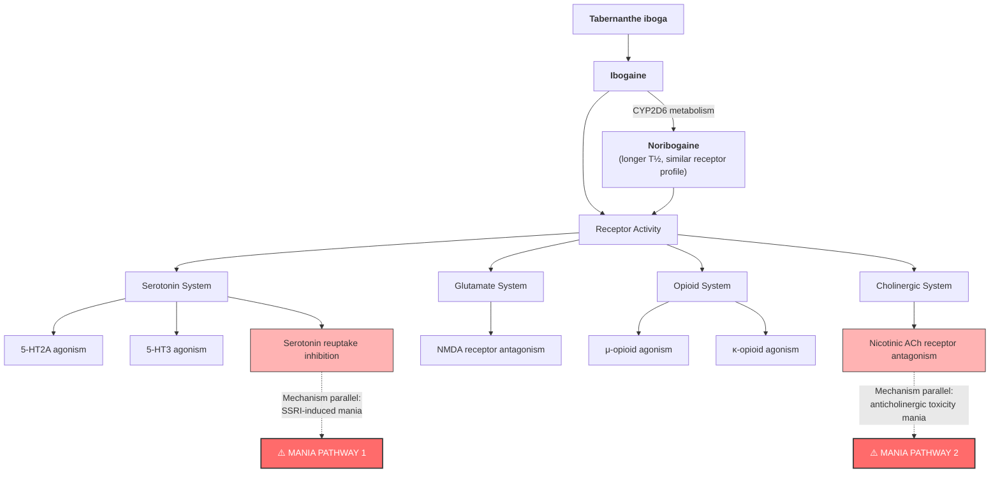

# Mania Following Use of Ibogaine: A Case Series

**Citation:** Marta, C.J., Ryan, W.C., Kopelowicz, A., & Koek, R.J. (2015). Mania following use of ibogaine: A case series. *American Journal on Addictions*, 24(3), 203–205. doi:10.1111/ajad.12209

## Abstract

Ibogaine is a naturally occurring hallucinogen with postulated anti-addictive qualities. While illegal domestically, a growing number of individuals have sought it out for treatment of opiate dependence, primarily in poorly regulated overseas clinics. Existing serious adverse events include cardiac and vestibular toxicity, though ours is the first report of mania stemming from its use. Two cases of reported ibogaine ingestion for self-treatment of addictions, and one for psycho-spiritual experimentation resulted in symptoms consistent with mania. No prior reports of mania were found in the literature, and the literature suggests growing popularity of ibogaine's use. The three cases presented demonstrate a temporal association between ibogaine ingestion and subsequent development of mania.

## Key Findings

This is the first published report of mania associated with ibogaine ingestion. Three patients with no prior diagnosis of bipolar illness presented to a county psychiatric emergency room in Los Angeles with de novo, florid mania temporally linked to ibogaine use. All three were independently diagnosed with Bipolar I disorder, current episode mania, by multiple physicians across multiple settings.

**Naranjo Adverse Drug Reaction Scale** confirmed causal relationship: "probable" for two patients (score 6) and "possible" for the third (score 4, reduced by concurrent psilocybin and cannabis use). The scale ranges from 0–13, with ≥5 indicating "probable" causality.

**Critical clinical features across cases:**
- Onset occurred within hours to days of ibogaine ingestion
- Ages at onset (35, 36, 40) were outside the typical age of onset for spontaneous bipolar disorder, arguing against coincidence
- Two patients had substantial collateral corroboration (family, partners, outpatient physicians) confirming no prior mania
- Amphetamine and cocaine testing was negative in all cases, ruling out stimulant-induced mania
- Symptoms were severe: 14 days without sleep (Mr. A), psychotic features including grandiose and persecutory delusions, involuntary psychiatric holds, and hospitalisations of 3–13 days
- Mr. A had one prior ibogaine use without neuropsychiatric effects — suggesting dose-dependence or sensitisation

## Methodology

Retrospective case series of three patients identified through clinical presentation to the psychiatric emergency room at Olive View Medical Center, Los Angeles County. Each had new-onset mania (DSM-V criteria) with recent ibogaine use. Charts were reviewed, courses of treatment described, and the Naranjo Adverse Drug Reaction Probability Scale applied to assess causal likelihood. A PubMed literature review of all English-language articles on ibogaine was performed. IRB exemption granted by LA County–Olive View Medical Center.

**Key limitation of design:** No toxicological verification of ibogaine ingestion was possible — patients presented days to weeks after use, and ibogaine/noribogaine assays require LC-MS/MS not routinely available in psychiatric emergency settings.

## Case Summary Data

| Parameter | Mr. A (Case 1) | Ms. B (Case 2) | Mr. C (Case 3) |
|-----------|----------------|-----------------|-----------------|
| Age/Sex | 36, M, Caucasian | 35, F, Caucasian | 40, M, Caucasian |
| Reason for ibogaine | Opiate dependence | Opiate dependence | Spiritual/experiential |
| Prior ibogaine use | Yes (1×, no AE) | No | No |
| Onset after ingestion | ~2 months prior to ED | ~3 weeks prior to ED | ~2 weeks prior to ED |
| Prior psychiatric Hx | ADHD; adolescent depression (paroxetine) | None | None |
| Substance Hx | Opiates, cocaine, alcohol; methadone 4 years | Heroin → methadone (5 yr remission) | Cannabis (daily); psilocybin (recent) |
| Key symptoms | Insomnia (14 days), grandiose delusions, aggression, tangential speech | Insomnia, aggression, hyper-religious psychotic delusions, hallucinations | Grandiosity, racing thoughts, suicidal ideation, decreased sleep |
| Diagnosis | Bipolar I, manic episode | Bipolar I, manic episode | Bipolar I, manic episode |
| Naranjo score | 6 (Probable) | 6 (Probable) | 4 (Possible) |
| Treatment | Divalproex ER 1500mg, risperidone 2mg BID, atomoxetine 80mg | Olanzapine (therapeutic dose) | Refused all treatment |
| Hospitalisation | 13 days; marked improvement | 3 days + readmission 1 week later | 6 days; discharged still symptomatic |
| Outcome | Discharged improved | Lost to follow-up after transfer | Left hospital; poor insight, labile |
| Confounders | Prior paroxetine exposure (SSRI mania risk?) | None identified | Psilocybin + daily cannabis |

## Proposed Pharmacological Mechanisms for Mania

The authors note that ibogaine's exact mechanism for inducing mania is unclear, but identify two pharmacological pathways with precedent for mania induction in other drug classes. The following diagram maps ibogaine's known receptor profile to the two candidate mania mechanisms discussed in the paper:

**Note:** The two highlighted pathways are the authors' proposed mechanisms. SSRI-induced mania is well-documented in bipolar-vulnerable individuals, and anticholinergic toxicity mania is a recognised clinical phenomenon. The remaining receptor activities (NMDA, opioid) are part of ibogaine's known pharmacological profile but are not specifically implicated in mania by this paper.

## Clinical Implications

This paper establishes mania as a clinically significant adverse event of ibogaine — one that had been entirely absent from the literature prior to 2015. The implications for screening, monitoring, and integration protocols are substantial:

1. **Psychiatric screening must extend beyond psychosis.** Prior ibogaine safety literature focused on cardiac risk and cerebellar toxicity; psychiatric adverse events were limited to a single case of psychosis in a patient with pre-existing schizophrenia (Houenou 2011). These cases demonstrate that ibogaine can precipitate de novo Bipolar I mania in individuals with no psychiatric history. Screening protocols should assess not only personal history of bipolar disorder or psychosis but also family history of mood disorders, prior antidepressant exposure (Mr. A had prior paroxetine — a known mania trigger in bipolar-vulnerable individuals), and any features suggesting bipolar diathesis.

2. **Post-treatment psychiatric monitoring is essential.** Onset ranged from days to weeks post-ingestion, consistent with noribogaine's extended half-life (28–49 h) maintaining pharmacological activity long after the acute ibogaine phase. All three patients presented to emergency departments — none to the ibogaine treatment providers. This mandates structured psychiatric follow-up protocols, not just cardiac monitoring, in the days and weeks after treatment. For clinical practice, this supports integration sessions that specifically screen for emergent mood symptoms, sleep disturbance, and grandiosity.

3. **The "reduced need for sleep" phenomenon may be a prodrome.** Brown (2013) had noted reports of prolonged insomnia at anti-addictive doses. The authors suggest mania may represent the extreme end of this spectrum — sleep disruption as prodrome rather than side effect. Mr. A reportedly did not sleep for 14 days. Clinically, persistent insomnia beyond 48–72 hours post-treatment should trigger psychiatric evaluation.

4. **Unregulated settings compound the risk.** All three cases involved ibogaine obtained from unregulated clinics or internet sources, with no psychiatric screening, no dosing standardisation, and no follow-up. Two patients (A, B) were on methadone — highlighting that people seeking ibogaine for opiate dependence are precisely the population most likely to have comorbid psychiatric vulnerability. The authors note that prior clinical studies may have missed mania due to small sample sizes and systematic exclusion of patients with psychiatric histories.

5. **Ibogaine's serotonergic profile parallels known mania triggers.** The SSRI-induced mania mechanism is well-characterised: serotonin reuptake inhibition can precipitate mania in bipolar-vulnerable individuals, even those without prior manic episodes. Ibogaine's serotonin reuptake inhibition, combined with 5-HT2A agonism and anticholinergic effects, creates a pharmacological profile with multiple convergent mania-promoting mechanisms. This has implications for the field's understanding of ibogaine's risk-benefit profile beyond cardiac safety.

## Limitations

- **No toxicological verification of ibogaine ingestion** — patients presented days to weeks after use; ibogaine/noribogaine assays require LC-MS/MS not available in psychiatric emergency settings, so causation relies on self-report and temporal association
- **Unknown doses in all cases** — none of the three patients had verified dosing information, precluding dose-response analysis
- **Confounders in Case 3** — Mr. C's concurrent psilocybin and daily cannabis use reduce confidence in ibogaine as sole cause (reflected in lower Naranjo score of 4 vs 6)
- **Limited collateral for Case 3** — Mr. C refused to allow collateral contact, so pre-existing psychiatric history cannot be definitively excluded
- **Retrospective design** — cases were identified through clinical practice and retrospectively assessed, not prospectively monitored
- **No re-challenge data** — ethically infeasible; Mr. A's prior uneventful ibogaine use is noted but dosing details are unknown
- **Selection bias** — only patients presenting to a single county psychiatric ER were captured; milder manic episodes or hypomania may have been missed or not attributed to ibogaine
- **No neuroimaging or EEG data** — the neurobiological basis of the manic episodes was not investigated beyond standard laboratory workup

---

## See Also

**Parent hub:** [[RED_Cardiac_Safety_Hub]]

- [[2012/Alper2012_Ibogaine_Fatalities]] — Systematic adverse events review; mania not identified in this earlier series, suggesting it was previously unrecognised
- [[2021/Ona2021_Adverse_Events_Ibogaine_Updated_Review_2015-2020]] — Updated adverse events review incorporating this paper's mania findings in broader AE taxonomy
- [[Clinical_Guidelines/GITA2015_Clinical_Guidelines]] — Psychiatric contraindications section; this paper provides evidence base for those exclusion criteria
- [[2015/Breuer2015_Herbal_Seizures_Case_Report]] — Other psychiatric/neurological adverse event case report (seizures)
- [[2018/Rodger2018_Healing_Potential_Ibogaine]] — Psychological outcomes perspective; integration protocols should screen for mania risk identified here
- [[2016/Alper2016_hERG_Blockade]] — hERG data contextualising the cardiac risks that dominate ibogaine safety literature; this mania paper expands the AE profile beyond cardiac
