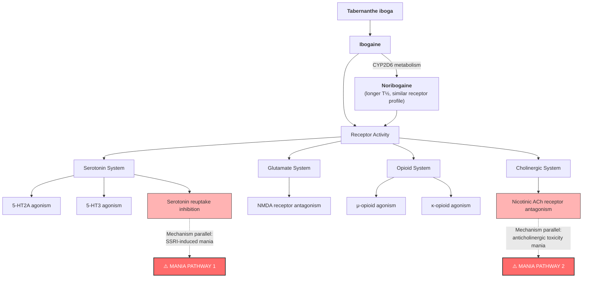

# Mania Following Use of Ibogaine: A Case Series

**Citation:** Marta, C.J., Ryan, W.C., Kopelowicz, A., & Koek, R.J. (2015). Mania following use of ibogaine: A case series. *American Journal on Addictions*, 24(3), 203–205. doi:10.1111/ajad.12209

## Abstract

Ibogaine is a naturally occurring hallucinogen with postulated anti-addictive qualities. While illegal domestically, a growing number of individuals have sought it out for treatment of opiate dependence, primarily in poorly regulated overseas clinics. Existing serious adverse events include cardiac and vestibular toxicity, though ours is the first report of mania stemming from its use. Two cases of reported ibogaine ingestion for self-treatment of addictions, and one for psycho-spiritual experimentation resulted in symptoms consistent with mania. No prior reports of mania were found in the literature, and the literature suggests growing popularity of ibogaine's use. The three cases presented demonstrate a temporal association between ibogaine ingestion and subsequent development of mania.

## Key Findings

This is the first published report of mania associated with ibogaine ingestion. Three patients with no prior diagnosis of bipolar illness presented to a county psychiatric emergency room in Los Angeles with de novo, florid mania temporally linked to ibogaine use. All three were independently diagnosed with Bipolar I disorder, current episode mania, by multiple physicians across multiple settings.

The paper applies no formal causality instrument; instead it argues for ibogaine causality through three lines of reasoning: (a) temporal association between ingestion and mania onset, (b) negative amphetamine and cocaine toxicology in all three cases ruling out stimulant-induced mania, and (c) explicit dismissal of opiate withdrawal as cause using Mr. C's opiate-naïve history as a control argument. The authors note that ages at onset (35, 36, 40) fall outside the typical onset range for spontaneous bipolar disorder.

**Critical clinical features across cases:**

- Onset occurred within hours to days of ibogaine ingestion
- Ages at onset (35, 36, 40) were outside the typical age of onset for spontaneous bipolar disorder, arguing against coincidence
- Two patients had substantial collateral corroboration (family, partners, outpatient physicians) confirming no prior mania
- Amphetamine and cocaine testing was negative in all cases, ruling out stimulant-induced mania
- Symptoms were severe: 14 days without sleep (Mr. A), psychotic features including grandiose and persecutory delusions, involuntary psychiatric holds, and hospitalisations of 3–13 days
- Mr. A had one prior ibogaine use without neuropsychiatric effects — suggesting dose-dependence or sensitisation

## Methodology

Retrospective case series of three patients identified through clinical presentation to a county psychiatric emergency room in Los Angeles. Each had new-onset mania (DSM-V criteria) with recent ibogaine use. Charts were reviewed and treatment courses described. A PubMed literature review of all English-language articles on ibogaine was performed. The paper does not report a formal causality instrument and does not state an IRB exemption.

**Key limitation of design:** No toxicological verification of ibogaine ingestion was possible — patients presented days to weeks after use, and ibogaine/noribogaine assays require LC-MS/MS not routinely available in psychiatric emergency settings.

## Case Summary Data

| Parameter | Mr. A (Case 1) | Ms. B (Case 2) | Mr. C (Case 3) |
|---|---|---|---|
| Demographics | 36-year-old Caucasian man | 35-year-old Caucasian female | 40-year-old Caucasian male |
| Psychiatric History | ADHD, adolescent depression | Negative for prior affective or psychotic episodes | No known psychiatric history |
| Substance History | Polysubstance dependence (primarily opiates, cocaine, alcohol); 4 years on methadone prior to relapse | Opiate dependence (in full sustained remission); methadone take-home privileges recently reduced to daily | Longstanding daily marijuana use |
| Ibogaine Context | Self-treatment for relapse; one prior use had no neuropsychiatric effects | Procured in an unstructured setting | Ingested in Mexico for "spiritual reasons" |
| Co-ingestants | Positive for benzodiazepines (administered in ED) | Methadone; later positive for opiates and benzodiazepines (ED) | Psilocybin mushrooms; positive for cannabinoids |
| Symptom Onset | Family reported no sleep for 14 days following use | Husband noted symptom onset the day of an "apparent single oral ingestion" (3 weeks prior to ED presentation) | Began soon after returning from Mexico |
| Presentation | Irritability, grandiose delusions, rapid tangential speech, aggressive behaviour | Aggression, impulsivity, agitation, hallucinations, hyper-religious delusions (NASA, aliens) | Distractibility, irritability, grandiosity, emotional lability, racing thoughts, suicidal ideation |
| Treatment Course | Divalproex ER (1500 mg), risperidone (2 mg BID), atomoxetine (80 mg); quetiapine discontinued due to insomnia. Discharged after 13 days | Initially stabilised at outside hospital on quetiapine, risperidone, and olanzapine (2 weeks); self-discontinued. Treated at authors' facility with olanzapine | Diagnosed with bipolar I disorder (mania) but refused treatment; left involuntary hold after 6 days |

## Vault Synthesis: Candidate Mania Mechanisms

> **Vault analytical addition — not content from the paper.** Marta et al. (2015) describe ibogaine only as a "hallucinogenic indole" and do not propose a receptor mechanism for the mania observed in their three cases. The receptor profile and candidate mechanism pathways below are vault-level synthesis drawing on the broader ibogaine pharmacology literature (Glick & Maisonneuve 1998; Mash et al. 1998; Sweetnam et al. 1995; Popik & Skolnick 1999), included here because clinical readers consulting a mania case series will want to know whether plausible pharmacological pathways exist. They are not findings from this paper.

**Note:** SSRI-induced mania is well-documented in bipolar-vulnerable individuals, and anticholinergic toxicity mania is a recognised clinical phenomenon. The remaining receptor activities (NMDA, opioid) are part of ibogaine's known pharmacological profile and are included for completeness; they are not specifically implicated in mania induction by this or any other paper.

## Clinical Implications

This paper establishes mania as a clinically significant adverse event of ibogaine — one that had been entirely absent from the literature prior to 2015. The implications for screening, monitoring, and integration protocols are substantial:

1. **Psychiatric screening must extend beyond psychosis.** Prior ibogaine safety literature focused on cardiac risk and cerebellar toxicity; psychiatric adverse events were limited to a single case of psychosis in a patient with pre-existing schizophrenia (Houenou 2011). These cases demonstrate that ibogaine can precipitate de novo Bipolar I mania in individuals with no psychiatric history. Screening protocols should assess not only personal history of bipolar disorder or psychosis but also family history of mood disorders, prior antidepressant exposure (Mr. A had prior paroxetine — a known mania trigger in bipolar-vulnerable individuals), and any features suggesting bipolar diathesis.

2. **Post-treatment psychiatric monitoring is essential.** Onset ranged from days to weeks post-ingestion. The paper itself does not address pharmacokinetics; the temporal pattern is consistent with noribogaine's extended half-life (28–49 h, Mash et al. 1998), but this is vault-level inference, not the authors' framing. All three patients presented to emergency departments — none to the ibogaine treatment providers. This mandates structured psychiatric follow-up protocols, not just cardiac monitoring, in the days and weeks after treatment. For clinical practice, this supports integration sessions that specifically screen for emergent mood symptoms, sleep disturbance, and grandiosity.

3. **The "reduced need for sleep" phenomenon may be a prodrome.** Brown (2013) had noted reports of prolonged insomnia at anti-addictive doses. The authors suggest mania may represent the extreme end of this spectrum — sleep disruption as prodrome rather than side effect. Mr. A reportedly did not sleep for 14 days. Clinically, persistent insomnia beyond 48–72 hours post-treatment should trigger psychiatric evaluation.

4. **Unregulated settings compound the risk.** All three cases involved ibogaine obtained from unregulated clinics or internet sources, with no psychiatric screening, no dosing standardisation, and no follow-up. Two patients (A, B) were on methadone — highlighting that people seeking ibogaine for opiate dependence are precisely the population most likely to have comorbid psychiatric vulnerability. The authors note that prior clinical studies may have missed mania due to small sample sizes and systematic exclusion of patients with psychiatric histories.

5. **Vault synthesis — convergent mechanistic plausibility.** This paper does not propose a receptor mechanism, but the broader ibogaine pharmacology literature (see Vault Synthesis section above) makes the SSRI-induced mania mechanism plausible: serotonin reuptake inhibition can precipitate mania in bipolar-vulnerable individuals, even those without prior manic episodes. Ibogaine's serotonin reuptake inhibition, combined with 5-HT2A agonism and anticholinergic effects, creates a profile with multiple convergent mania-promoting mechanisms. This is vault-level synthesis offered to support clinical screening; readers should not infer that Marta et al. (2015) endorse this mechanism.

## Limitations

- **No toxicological verification of ibogaine ingestion** — patients presented days to weeks after use; ibogaine/noribogaine assays require LC-MS/MS not available in psychiatric emergency settings, so causation relies on self-report and temporal association
- **No formal causality instrument** — the paper does not apply the Naranjo Adverse Drug Reaction Probability Scale or any other standardised causality assessment tool. Causality reasoning is presented as temporal association + exclusion of stimulant-induced mania (negative tox) + dismissal of opiate withdrawal (Mr. C's opiate-naïve history as control argument). Vault entries for this paper prior to 2026-05-03 incorrectly reported Naranjo scores; this has been corrected.
- **Unknown doses in all cases** — none of the three patients had verified dosing information, precluding dose-response analysis
- **Route and formulation underspecified** — Ms. B's case explicitly notes "apparent single oral ingestion" (verbatim quote, single per-case oral confirmation). Mr. A and Mr. C have only "ingestion" wording without explicit oral confirmation. No formulation details (capsule, powder, decoction, root bark) for any case. The `route: oral` YAML value is well-supported for Ms. B and inferred for the other two cases.
- **Confounders in Case 3** — Mr. C's concurrent psilocybin and daily cannabis use reduce confidence in ibogaine as sole cause
- **Limited collateral for Case 3** — Mr. C refused to allow collateral contact, so pre-existing psychiatric history cannot be definitively excluded
- **Retrospective design** — cases were identified through clinical practice and retrospectively assessed, not prospectively monitored
- **No re-challenge data** — ethically infeasible; Mr. A's prior uneventful ibogaine use is noted but dosing details are unknown
- **Selection bias** — only patients presenting to a single county psychiatric ER were captured; milder manic episodes or hypomania may have been missed or not attributed to ibogaine
- **No neuroimaging or EEG data** — the neurobiological basis of the manic episodes was not investigated beyond standard laboratory workup

---

## See Also

**Parent hub:** [RED_Cardiac_Safety_Hub](../Hubs/RED_Cardiac_Safety_Hub.md)

- [Alper2012_Ibogaine_Fatalities](../2012/Alper2012_Ibogaine_Fatalities.md) — Systematic adverse events review; mania not identified in this earlier series, suggesting it was previously unrecognised
- [Ona2021_Adverse_Events_Ibogaine_Updated_Review_2015-2020](../2021/Ona2021_Adverse_Events_Ibogaine_Updated_Review_2015-2020.md) — Updated adverse events review incorporating this paper's mania findings in broader AE taxonomy
- [GITA2015_Clinical_Guidelines](../Clinical_Guidelines/GITA2015_Clinical_Guidelines.md) — Psychiatric contraindications section; this paper provides evidence base for those exclusion criteria
- [Breuer2015_Herbal_Seizures_Case_Report](Breuer2015_Herbal_Seizures_Case_Report.md) — Other psychiatric/neurological adverse event case report (seizures)
- [Rodger2018_Healing_Potential_Ibogaine](../2018/Rodger2018_Healing_Potential_Ibogaine.md) — Psychological outcomes perspective; integration protocols should screen for mania risk identified here
- [Alper2016_hERG_Blockade](../2016/Alper2016_hERG_Blockade.md) — hERG data contextualising the cardiac risks that dominate ibogaine safety literature; this mania paper expands the AE profile beyond cardiac
