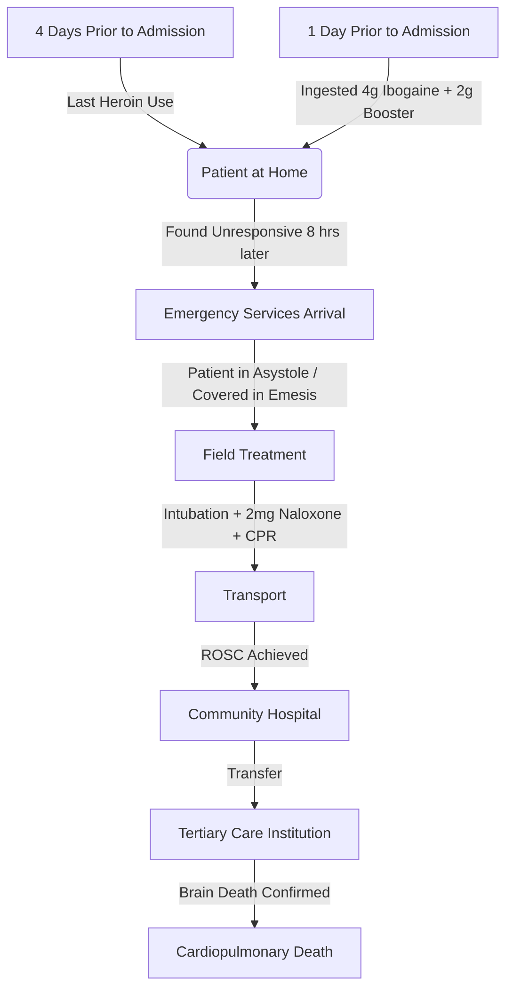

# Ibogaine-associated cardiac arrest and death: case report and review of the literature

**Journal:** *Therapeutic Advances in Psychopharmacology*
**Year:** 2016, Vol. 6(2) 95–98
**DOI:** 10.1177/2045125315626073
**Authors:** Jessica A. Meisner, Susan R. Wilcox and Jeremy B. Richards

---

## Abstract

A naturally occurring hallucinogenic plant alkaloid, ibogaine has been used as an adjuvant for opiate withdrawal for the past 50 years. In the setting of an escalating nationwide opiate epidemic, use of substances such as ibogaine may also increase. Therefore, familiarity with the mechanisms and potential adverse effects of ibogaine is important for clinicians. We present the case report of a man whose use of ibogaine resulted in cardiac arrest and death, complemented by a review of the literature regarding ibogaine’s clinical effects. A 40-year-old man who used ibogaine for symptoms of heroin withdrawal suffered acute cardiac arrest leading to cerebral edema and brain death. His presentation was consistent with ibogaine-induced cardiotoxicity and ibogaine-induced cardiac arrest, and a review of the literature regarding the history, mechanisms, risks and clinical outcomes associated with ibogaine is presented. The case presented underscores the significant potential clinical risks of ibogaine. It is important the healthcare community be aware of the possible effects of ibogaine such that clinicians can provide informed counseling to their patients regarding the risks of attempting detoxification with ibogaine.

**Keywords:** cardiac arrest, ibogaine, medication effects

---

## Introduction

Opiate use in the United States has increased dramatically over the past several decades, and there is widespread consensus that the country is in the midst of an ‘opiate epidemic’ [Manchikanti *et al.* 2012]. Both prescription and illegal opiate use have increased during this time period, and individual and societal consequences of increasing opiate use are ever more apparent to healthcare providers and policymakers [Beauchamp *et al.* 2014]. With increased opiate use and its consequences, patients are seeking methods to treat opiate dependence, including novel and unregulated treatment options such as the plant alkaloid ibogaine. In this case report and review of the literature, we describe the case of a man who self-administered ibogaine to assist with withdrawal from opiates, and suffered an ultimately fatal cardiac arrest attributable to ibogaine. The literature regarding ibogaine’s use and adverse effects are reviewed to increase awareness of this unregulated medication for clinicians, as use of this medication may increase concomitant with the opiate epidemic (see **Table 1**).

### Table 1: Ibogaine Toxicity – Key Points

| Category | Details |
| :--- | :--- |
| **Origin** | Ibogaine is a naturally occurring plant alkaloid. |
| **Traditional Use** | Traditionally used in ritualistic ceremonies due to its hallucinogenic effects. |
| **Medical Use** | Based on limited evidence, it has been used for its possible anti-addictive properties. |
| **Pharmacology** | Ibogaine is highly lipophilic and is slowly released in the body. |
| **Mechanism** | The mechanism(s) of action of ibogaine is unknown. |
| **Adverse Effects** | Case reports and small series demonstrate an association with ibogaine and prolonged QTc, arrhythmias, seizure and death. |

---

## Case Presentation

A 40-year-old man with history of heroin use was found down at home, unresponsive for an unknown period of time. Per his family, he had last used heroin 4 days prior to admission and had attempted self-detoxification the day prior to admission with **4 g of ibogaine** and **2 g of an uncharacterized ‘booster’** that he bought on the Internet. After taking ibogaine and the booster, he was found 8 hours later, unresponsive and covered in emesis.

Emergency service providers found him to be in asystole. He was intubated in the field, given 2 mg of naloxone, and cardiopulmonary resuscitation was initiated. He had a return of spontaneous circulation en route to a community hospital.

### Visualization of Case Timeline
*(Diagram generated based on case narrative)*

At the community hospital, his pupils were fixed and dilated. He was persistently hypotensive despite volume resuscitation and ultimately required vasopressors for hemodynamic support. Laboratory studies on presentation were remarkable for leukocytosis, anion gap metabolic acidosis, and an elevated creatinine (see **Table 2**).

Head computerized tomography was concerning for anoxic brain injury. A serum toxicology screen was negative for aspirin, ethanol, acetaminophen, benzodiazepines, barbiturates, and tricyclic antidepressants, but positive for opiates as he had received a dose of morphine, for unclear reasons, on arrival. Therapeutic hypothermia protocol was initiated, and he was transferred to our hospital for further care.

### Table 2: Laboratory Values on Arrival

| Initial Labs | Value | Unit |
| :--- | :--- | :--- |
| Sodium | 143 | mEq/l |
| Potassium | 4.3 | mEq/l |
| Chloride | 111 | mEq/l |
| Bicarbonate | 22 | mEq/l |
| Creatinine | 1.9 | mg/dl |
| Glucose | 129 | mg/dl |
| Magnesium | 2.7 | mg/dl |
| Phosphorous | 5.3 | mg/dl |
| Calcium | 7.8 | mg/dl |
| pH | 7.11 | |
| Creatine kinase | 1440 | IU/l |
| Troponin | 0.06 | ng/ml |
| Creatine kinase, MB isoenzyme | 29 | ng/ml |
| White blood cell | 15.4 | K/µl |
| Hemoglobin | 14.2 | g/dl |
| Aspartate aminotransferase | 140 | IU/l |
| Alanine aminotransferase | 94 | IU/l |

On presentation to our institution, he had signs of severe anoxic brain damage with nonreactive pupils, no response to noxious stimuli, and negative vestibulo-ocular reflexes. An electroencephalogram performed during therapeutic hypothermia showed no activity of definite cerebral origin. An electrocardiogram undertaken on arrival was significant for a QTc of 435 ms, which widened to 523 ms 1 hour later. His QTc peaked at 588 ms, but then decreased to 450 ms approximately 4 hours after initiation of therapeutic hypothermia. After the therapeutic hypothermia protocol was completed, his clinical exam was consistent with brain death. Confirmatory testing verified the diagnosis of brain death, as he failed an apnea test and a brain perfusion scan confirmed the diagnosis of brain death. Mechanical ventilation was stopped and he experienced cardiopulmonary death shortly after. His family declined post-mortem examination.

---

## Discussion

Ibogaine, a plant alkaloid that originates from *Tabernathe iboga*, has traditionally been used in West and Central Africa as part of ritualistic ceremonies for its deliriogenic and psychoactive effects [Alper *et al.* 2008]. Ibogaine’s use as an anti-addictive drug began in the 1960s, when a New York City-based group discovered that ibogaine appeared to prevent cravings for heroin and opiate withdrawal symptoms [Alper and Lotsof, 2007]. Ibogaine was made illegal in the United States in 1967 along with other psychotropic drugs such as LSD and hallucinogenic mushrooms, and it was classified as an FDA Schedule I drug in 1970. Despite being banned in the United States, the use of ibogaine for anti-addiction purposes has increased throughout the Western world, both by self-administration and by institutions at addiction treatment centers in the Netherlands, Mexico, and other countries [Alper *et al.* 2008].

As its popularity rose, the FDA approved a Phase I clinical trial of ibogaine in 1993; however, the trial was never completed due to contractual disputes, limited funding, and safety concerns [Vastag, 2005]. To date, there have been no formal human studies on the effects of ibogaine.

As ibogaine is illegal or unregulated in many countries, there is no accurate account of the prevalence of its current use. In a 2008 ethnographic study assessing reasons for ibogaine use, 68% of providers of ibogaine in all associated settings outside of Africa used ibogaine for substance abuse disorder, and 53% for treatment of opioid dependence [Alper *et al.* 2008]. The study estimates more than 5000 people have used ibogaine in a single organized clinic since it opened in Amsterdam in the late 1980s. More worrisome than the number of clinics is the ease at which a simple Internet search yields thousands of results listing clinics or websites from where ibogaine can be purchased.

Ibogaine’s exact mechanism of action is not completely understood. As it is highly lipophilic, it is stored in the brain and adipose tissue and slowly released into the body. Ibogaine and its metabolite noribogaine act on various receptors and neurotransmitters in the brain, including opioid, serotonin, muscarinic, and nicotinic receptors [Brown, 2013]. At high doses it has been found to be toxic to His-Perkinje fibers in the cerebellum. Relevant to the reports of fatal arrhythmias from ibogaine, animal models have shown that ibogaine inhibits the human Ether-à-go-go-Related Gene (hERG) channels, which play a role in repolarization of cardiac action potential [Kovar *et al.* 2011; Koenig *et al.* 2013].

Clinically, ibogaine has a variety of effects. Ibogaine’s hallucinogenic effects are distinctly different from more commonly used hallucinogens, as ibogaine-induced hallucinations are reportedly more intense when one’s eyes are closed. Hallucinations from ibogaine have been described as a ‘waking dream’ that could include verbal interactions with ‘ancestral and archetypal beings’ or rapid vivid visual memories [Vastag, 2005]. Recently, a small case series described three patients suffering clinically significant mania after ibogaine use [Marta *et al.* 2015]. As Lotsof observed in the 1960s, ibogaine appears to reduce cravings for heroin for weeks to months [Alper *et al.* 2008]. In addition, ibogaine has been reported to eliminate signs or symptoms of withdrawal from heroin or other opiates. Some studies using rat models have demonstrated decreased self-administration of both morphine and cocaine after a single ibogaine dose [Glick *et al.* 1991; Glick *et al.* 1994], although the implications of these results for ibogaine’s role in withdrawal are uncertain as other studies in morphine-dependent rats or mice demonstrated no effect of ibogaine on reducing naloxone-precipitated withdrawal [Sharpe and Jaffe, 1990; Fraces *et al.* 1992]. Dangerous clinical effects attributed to ibogaine that have been reported include fatal arrhythmias, seizures, and sudden death from unexplained causes [Alper *et al.* 2012].

While there have been no controlled trials of ibogaine, case reports have described sudden death, prolonged QTc, arrhythmias, and seizures after ibogaine use [Hoelen *et al.* 2009]. An early case report describes a 24-year-old female who died while receiving ibogaine at a treatment center in the Netherlands [Alper *et al.* 1999]. Another brief report summarizes a 25-year-old man who died from multiorgan system failure, likely due to aspiration and pneumonia, after ingesting ibogaine in an attempt to decrease withdrawal symptoms from heroin [Jalal *et al.* 2013]. A separate series of 3 case reports describes a 49-year-old male found to be in *torsade de pointes* after he collapsed; a 31-year-old female who had a seizure-like episode, found to have a prolonged QTc; and a 43-year-old woman with profound unresponsiveness; all attributed to ibogaine use [Paling *et al.* 2012]. A review by Alper and colleagues identified 19 worldwide deaths attributed to ibogaine from 1990 to 2008, 15 of which were associated with detoxification, and 6 listed cardiac complications as a contributing factor [Alper *et al.* 2012].

---

## Conclusion

In summary, we report the case of a patient who was found unresponsive, in asystole, with evidence of recent emesis after having used ibogaine to facilitate heroin detoxification. While it is possible that his cardiac arrest could have been secondary to vomiting, aspiration, and hypoxemia, his suffering a cardiac arrest less than 8 hours after ibogaine use is consistent with previous case reports linking ibogaine and cardiac toxicity. Beside a history of mild liver enzyme abnormalities and substance abuse, our patient had no other medical problems or family history of cardiac problems, which supports the clinical impression that ibogaine was a major factor in his cardiac arrest and death.

Without any published controlled studies, the risks of ibogaine can only be based on the increasing number of case reports that demonstrate an increased risk of sudden death, arrhythmias, and seizures associated with ibogaine use. In the absence of specific treatments for ibogaine, heightened clinical suspicion coupled with meticulous supportive care is the cornerstone of diagnosis and treatment for cases of ibogaine toxicity. As the frequency of unregulated illegal use of ibogaine increases, it is important the healthcare community be aware of the possible effects such that clinicians can provide informed counseling to their patients regarding the risks of attempting detoxification with ibogaine and identify potential complications attributable to ibogaine use.

---

### Funding
This case report received no specific grant from any funding agency in the public, commercial, or not-for-profit sectors.

### Conflict of interest statement
The authors declare that there is no conflict of interest.

---

## References

1.  Alper, K. and Lotsof, H. (2007) The use of ibogaine in the treatment of addictions. In: Winkelman, M. and Roberts, T. (eds), *Psychedelic medicine*. Westport, CT: Praeger/Greenwood Publishing Group, pp. 43–66.
2.  Alper, K., Lotsof, H. and Kaplan, C. (2008) The ibogaine medical subculture. *J Ethnopharmacol* 115: 9–24.
3.  Alper, K., Lotsof, H., Frenken, G., Luciano, D. and Bastiaans, J. (1999) Treatment of acute opioid withdrawal with ibogaine. *Am J Addiction* 8: 234–242.
4.  Alper, K., Stajic, M. and Gill, J. (2012) Fatalities temporally associated with the ingestion of ibogaine. *J Forensic Sci* 57: 398–412.
5.  Beauchamp, G., Winstanley, E., Ryan, S. and Lyons, M. (2014) Moving beyond misuse and diversion: the urgent need to consider the role of iatrogenic addition in the current opioid epidemic. *Am J Public Health* 104: 2023–2029.
6.  Brown, T. (2013) Ibogaine in the treatment of substance dependence. *Curr Drug Abuse Rev* 6: 3–16.
7.  Fraces, B., Gout, R., Cros, J. and Zajac, J. (1992) Effects of ibogaine on naloxone-precipitated withdrawal in morphine-dependent mice. *Fundam Clin Pharmacol* 6: 327–332.
8.  Glick, S., Kuehne, M., Raucci, J, Wilson, T., Larson, D., Keller, R. Jr, *et al.* (1994) Effects of iboga alkaloids on morphine and cocaine self-administration in rats: relationship to tremorigenic effects and to effects on dopamine release in nucleus accumbens and striatum. *Brain Res* 657: 14–22.
9.  Glick, S., Rossman, K., Steindorf, S., Maisonneuve, I. and Carlson, J. (1991) Effects and aftereffects of ibogaine on morphine self-administration in rats. *Eur J Pharmacol* 195: 341–345.
10. Hoelen, D., Spiering, W. and Valk, G. (2009) Long-QT syndrome induced by antiaddiction drug ibogaine. *N Engl J Med* 360: 308–309.
11. Jalal, S., Daher, E. and Hilu, R. (2013) A case of death due to ibogaine use for heroin addiction: a case report. *Am J Addict* 22: 302.
12. Koenig, X., Kovar, M., Rubi, L., Mike, A., Lukacs, P., Gawali, V. *et al.* (2013) Anti-addiction drug ibogaine inhibits voltage-gated ionic currents: a study to assess the drug’s cardiac ion channel profile. *Toxicol Appl Pharmacol* 273: 259–268.
13. Kovar, M., Koenig, X., Mike, A., Cervenka, R., Lukacs, P., Todt, H. *et al.* (2011) The anti-addictive drug ibogaine modulates voltage-gated ion channels and may trigger cardiac arrhythmias. *BMC Pharmacol* 11: A1.
14. Manchikanti, L., Helm, S. II, Fellows, B., Janata, J., Pampati, V., Grider, J. *et al.* (2012) Opioid epidemic in the United States. *Pain Physician* 15: ES9–ES38.
15. Marta, C., Ryan, W., Kopelowicz, A. and Koek, R. (2015) Mania following use of ibogaine: A case series. *Am J Addict* 24: 203–205.
16. Paling, F., Andrews, L., Valk, G. and Blom, H. (2012) Life-threatening complications of ibogaine: three case reports. *Neth J Med* 70: 422–424.
17. Sharpe, L. and Jaffe, J. (1990) Ibogaine fails to reduce naloxone-precipitated withdrawal in the morphine-dependent rat. *Neuroreport* 1: 17–19.
18. Vastag, B. (2005) Ibogaine therapy: a 'vast, uncontrolled experiment'. *Science* 308: 345–346.

---

### Correspondence to:

**Jeremy B. Richards, MD, MA**
Division of Pulmonary and Critical Care Medicine, Medical University of South Carolina, 96 Jonathan Lucas Street, Suite 812-CSB, MSC 630, Charleston, SC, 29425-6300, USA.
richarje@musc.edu

**Jessica A. Meisner, MD**
Department of Medicine, Beth Israel Deaconess Medical Center, Boston, MA, USA

**Susan R. Wilcox, MD**
Division of Emergency Medicine, Medical University of South Carolina, Charleston, South Carolina, USA
Division of Pulmonary and Critical Care Medicine, Medical University of South Carolina, Charleston, SC, USA

---

## See Also

**Parent hub:** [[RED_Cardiac_Safety_Hub]]

- [[2001/Baumann2001_Neurobiological_Effects_Noribogaine]] — Noribogaine profiling foundation
- [[2015/Glue2015_Noribogaine_Ascending_Doses]] — Human noribogaine PK
- [[2023/Castro-Nin2024_Noribogaine_Wakefulness_Sleep_Effects]] — Noribogaine sleep effects
- [[2023/Ona2023_Ibogaine_Noribogaine_Putative_Anti-Addictive_Effects]] — Mechanism synthesis
- [[2001/Mash2001_Ibogaine_Heroin_Withdrawal]] — Earlier anti-withdrawal work