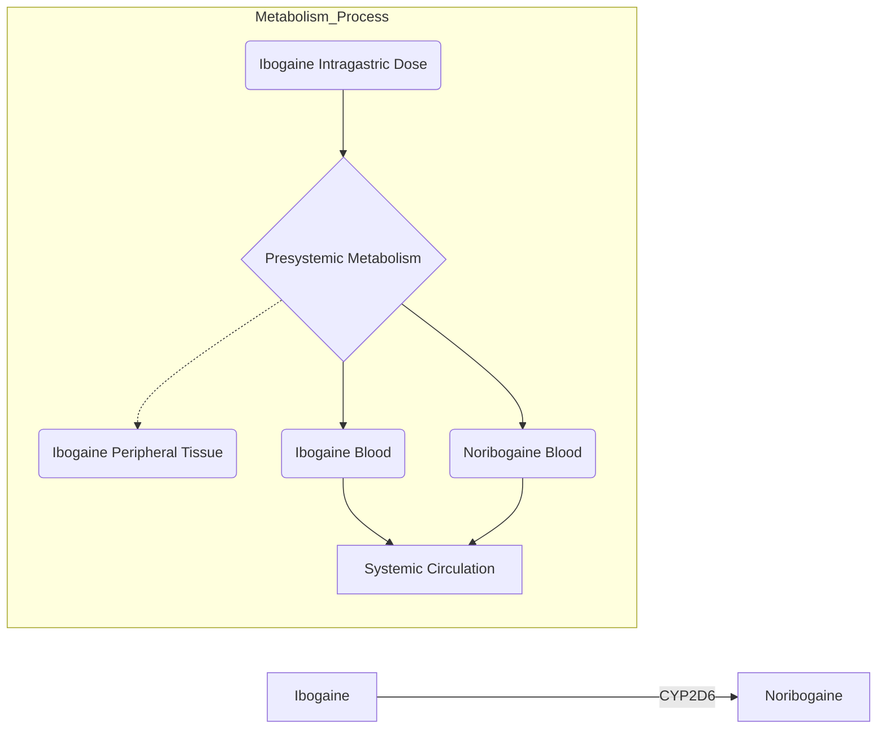

# Ibogaine Detoxification Transitions Opioid and Cocaine Abusers Between Dependence and Abstinence: Clinical Observations and Treatment Outcomes

> **Format note:** This paper retains its original academic structure. All YAML metadata and cross-references are complete. A full analytical conversion to vault format is planned for v1.1.

**Authors:** Deborah C. Mash, Linda Duque, Bryan Page, and Kathleen Allen-Ferdinand
**Affiliations:**

* Department of Neurology, Leonard M. Miller School of Medicine, Miami, FL, United States

* Department of Molecular and Cellular Pharmacology, Leonard M. Miller School of Medicine, Miami, FL, United States

* Department of Anthropology, University of Miami, Coral Gables, FL, United States

* General Medical Practice, Basseterre, Saint Kitts and Nevis

**Journal:** Frontiers in Pharmacology **Published:** 05 June 2018 **DOI:** 10.3389/fphar.2018.00529

---

## Abstract

Ibogaine may be effective for transitioning opioid and cocaine dependent individuals to sobriety. American and European self-help groups provided public testimonials that ibogaine alleviated drug craving and opioid withdrawal symptoms after only a single dose administration. Preclinical studies in animal models of addiction have provided proof-of-concept evidence in support of these claims. However, the purported therapeutic benefits of ibogaine are based on anecdotal reports from a small series of case reports that used retrospective recruitment procedures. We reviewed clinical results from an open label case series (N = 191) of human volunteers seeking to detoxify from opioids or cocaine with medical monitoring during inpatient treatment. Whole blood was assayed to obtain pharmacokinetic measures to determine the metabolism and clearance of ibogaine. Clinical safety data and adverse events (AEs) were studied in male and female subjects. There were no significant adverse events following administration of ibogaine in a dose range that was shown to be effective for blocking opioid withdrawal symptoms in this study. We used multi-dimensional craving questionnaires during inpatient detoxification to test if ibogaine was effective in diminishing heroin and cocaine cravings. Participants also completed standardized questionnaires about their health and mood before and after ibogaine treatment, and at program discharge. One-month follow-up data were reviewed where available to determine if ibogaine’s effects on drug craving would persist outside of an inpatient setting. We report here that ibogaine therapy administered in a safe dose range diminishes opioid withdrawal symptoms and reduces drug cravings. Pharmacological treatments for opioid dependence include detoxification, narcotic antagonists and long-term opioid maintenance therapy. Our results support product development of single oral dose administration of ibogaine for the treatment of opioid withdrawal during medically supervised detoxification to transition drug dependent individuals to abstinence.

**Keywords:** noribogaine, ibogaine, detoxification, withdrawal, craving, opioid dependence

---

## Introduction

Ibogaine is an indole alkaloid isolated from the roots of the West African shrub *Tabernanthe iboga*. The therapeutic and oneirophrenic (dream-like) effects of iboga roots have been described in the ethnobotanical literature for centuries, where ingestion of Ibogaine root preparations ceremonial and medicinal use (Goutarel et al., 1993; Samorini, 1995). In Africa, approximately 2–3 million members of the Bwiti religion in Gabon, Zaire, and the Cameroun take large doses for "the ‘Bwiti initiation ritual’ a powerful ‘rebirth’ ceremony that group members typically undergo before the commencement of their teenage years" (Fernandez and Fernandez, 2001).

Ibogaine was marketed in France in the pharmaceutical preparation Lambarene (200 mg tablet). The root extract contained approximately 5 mg ibogaine and other minor iboga alkaloids. In the early 20th century, this preparation was marketed as a neuromuscular stimulant at a dose of 2–4 tablets/day (Goutarel et al., 1993).

Several groups reported on the potential benefit of ibogaine for the treatment of drug dependence (Lotsof, 1985; Sheppard, 1994; Luciano, 1998; Mash et al., 1998; Alper et al., 1999). Academic researchers reported descriptions of robust effects of the drug in preclinical animal models and *in vitro* data were obtained which identified possible mechanism(s) of action (Glick et al, 1994, 2000; Popik et al., 1995; Mash et al., 1995; Staley et al., 1996; Baumann et al., 2001; for review, Belgers et al., 2016; Mash et al., 2016).

Despite the fact that ibogaine was never approved as a medicine for the treatment of drug addiction in most western countries (Vastag, 2005; IND39,680), human experience suggested the effectiveness of single large doses of ibogaine to block withdrawal symptoms and cravings in drug dependent individuals (Sheppard, 1994; Alper et al., 1999; Mash et al., 2000, 2001; Lotsof and Alexander, 2001; Bastiaans, 2004). Self-treating heroin addicts made the original discovery in the 1960s that ibogaine eliminates the signs and symptoms of opioid withdrawal. Alper and coworkers collected data from people who took ibogaine between 1962 and 1993 with the intention of "interrupting" their heroin addiction (Alper et al., 1999). Out of 33 human subjects treated with 6–29 mg/kg ibogaine (average 19 mg/kg), 25 reported blockade of opioid withdrawal symptoms and no further desire to take heroin in the days following treatment.

We reported results for a small case series following lower oral doses of ibogaine (10–12 mg/kg) in patients who had undergone pre-treatment screening and physical evaluation (Mash et al., 2000, 2001). Objective physician ratings demonstrated that ibogaine reduced opiate withdrawal scores in twenty seven heroin dependent patients. Patients reported diminished opioid craving and significantly improved mood after treatment. Interestingly, these effects appeared to persist over a long period of time based on self-reports at a 1-month follow up interview. The recent observational studies from Mexico (Brown and Alper, 2017; Davis et al., 2017) and New Zealand (Noller et al., 2018) endorse the efficacy of ibogaine as pharmacological treatment for opioid detoxification (Mash, 2018).

Although 1000s of patients suffering from opioid use disorder have been treated with ibogaine, clinical efficacy data from the published case series are hardly comparable, and the reports vary widely with regard to the assessment of outcome measures. Also, there have yet to be any clinical trials to demonstrate efficacy of the drug for opioid dependence. Like most CNS drugs, ibogaine is a highly lipophilic compound that is subject to complex biotransformation and variable half-life due to genetic polymorphisms (Obach et al., 1998; Mash et al., 1998, 2000, 2001). This issue among other lingering concerns for patient safety continue to hinder the drug development of ibogaine in the US or elsewhere.

Heroin and prescription opioid dependence is a growing concern that has great societal impact and rising health care costs in the hundreds of billions of dollars (Cornish et al., 2010; Degenhardt et al., 2011; Volkow et al., 2014; Kolodny et al., 2015). We report here clinical observations of ibogaine treatments taken from an open label study to assess the safety and efficacy of ibogaine in individuals seeking detoxification from opioids and cocaine. The results demonstrate that medically assisted ibogaine detoxification affords a safe and effective method to discontinue substance dependence and misuse.

---

## Materials and Methods

### Inclusion and Exclusion Criteria

Individuals participated in a 12-day inpatient study to determine the safety and open-label efficacy of ibogaine as a pharmacological treatment for managing withdrawal symptoms. The study was conducted in a 12-bed freestanding facility in St. Kitts, West Indies. The treatment program had a planned duration of 12 days and stated goals of: (1) safe physical detoxification from opioids or cocaine, (2) motivational counseling, and (3) referral to aftercare programs and community support groups (12-step programs) (Mash et al., 1998, 2000).

Subjects were self-referred for inpatient detoxification and met inclusion/exclusion criteria. All participants signed an informed consent at program entry to allow medical record review of study results for submission to the Food and Drug Administration (FDA). Retrospective chart review of patient records was conducted under University of Miami Institutional Review Board approval (IRB 04-0366). All individuals were subjected to a physician’s review of the history and physical examination, clinical laboratory results and electrocardiograms for inclusion in the study. The results of the electrocardiogram and clinical laboratory testing were within predetermined normal limits at program entry. Exclusion criteria included histories of stroke, epilepsy and axis I psychotic disorders, cardiovascular and liver pathology, and HIV/AIDS.

### Oral Dose Ibogaine

Participants included 191 self-referred treatment seeking opioid and cocaine dependent men (n = 144) and women (n = 47). All subjects met DSM-IV criteria for opioid or cocaine dependence and demonstrated active use with positive urine screens at program entry to the study. Participants were administered oral doses of ibogaine HCl (8–12 mg/kg) in gel caps under open-label conditions. Opioid dependent patients were switched at program entry to morphine sulfate (Oral Morphine Solution 10 mg/5 ml) for opioid withdrawal control prior to ibogaine detoxification.

Safety evaluations included physical examinations, physician ratings of AEs, safety laboratory tests, vital signs, 12-lead ECG and ECG telemetry from 1 h to 24 h. Whole blood concentrations of ibogaine and noribogaine were measured using a validated GC/MS method with deuterated internal standards  (Hearn et al., 1995). Ibogaine and noribogaine concentrations above the lower limit of quantification were used to calculate pharmacokinetic parameters. Subjects were genotyped for the CYP2D6 alleles as described previously (Heim and Meyer, 1992).

On admission, participants were administered the Addiction Severity Index (McLellan et al., 1992, 1999) and participated in the Structured Clinical Interview for DSM-IV Axis I Disorders (SCID I). A comprehensive psychosocial assessment was used to obtain additional information about substance use history, and past and current medical condition(s) later cross-referenced to ensure accuracy. Physicians assessed opioid withdrawal signs and symptoms on the day of treatment, before and after ibogaine administration (OOWS, range 0–13; Handelsman et al., 1987).

### Mood and Craving Measures

Subjects were asked to provide ratings of their current level of craving for cocaine or opioids using questions from the Heroin (HCQ-29) and Cocaine (CCQ-45) Craving Questionnaires (Tiffany et al., 1993; Singelton, 1998; Heinz et al., 2006). The HCQ is designed to capture five theoretically distinct conceptualizations of drug craving: (1) desire to use, (2) intention to use, (3) anticipation of positive outcome, (4) anticipation of relief from withdrawal or dysphoria, and (5) lack of control over use.

The depressive symptoms were measured using the Beck Depression Inventory version II (BDI-II) (Beck et al., 1996a,b), Profile of Moods (POMS, 2nd edition) and Symptoms Checklist-90 scales (SCL-90). Subjects’ scores from the Beck Depression Inventory, POMS, SCL-90 and the HCQ-29 and CCQ-45 craving subscales were analyzed by primary drug of abuse (opioids or cocaine) across treatment phase (pre-ibogaine, post-ibogaine, and 30 days after discharge).

### Elicitation Narratives

A licensed therapist worked with the subjects to provide psychological support during and after administration of ibogaine. A semi-structured elicitation narrative was used to capture perceptual changes and subjects’ interpretation of the drug effects. Subjects narrated their subjective experience to oral doses of ibogaine HCL within 3 days after receiving an oral dose of ibogaine. Once transcribed, we used a content coding system based on a modified version of the Outline of Cultural Materials (Murdock et al., 1987) to mark places in each of the interviews where key elements of content appeared.

---

## Results

### Demographics

Table 1: Demographic characteristics of opioid dependent subjects

| Variable | Total (N = 102) | Female (n = 34) | Male (n = 68) |
| --- | --- | --- | --- |
| **Age, Mean ± SD** | 35.8 ± 9.9 | 33.0 ± 9.1 | 37.1 ± 10.1 |
| **Ethnicity (% of subjects)** |  |  |  |
| Caucasian | 95.1% (n = 97) | 33.3% (n = 34) | 61.8% (n = 63) |
| African American | 0% | 0% | 0% |
| Hispanic | 2.9% (n = 3) | 0% | 2.9% (n = 3) |
| Native American | 2.0% (n = 2) | 0% | 2.0% (n = 2) |
| **Years of Education, Mean ± SD** | 15.2 ± 3.2 | 14.8 ± 2.5 | 15.3 ± 3.4 |
| **Years of Opioid Use, Mean ± SD** | 11.2 ± 8.6 | 8.9 ± 6.8 | 12.4 ± 9.3 |
| **Days of Opioid Use in Past 30**, Mean ± SD | 19.2 ± 13.0 (n = 95) | 19.1 ± 13.1 (n = 31) | 19.3 ± 13.0 (n = 64) |
| **Previous Drug Treatments, Mean ± SD** | 5.5 ± 7.2 | 5.5 ± 5.5 | 5.5 ± 8.0 |
| **Coexisting Axis I-II Disorders** |  |  |  |
| Anxiety Disorders except PTSD | 20.6% (n = 21) | 23.5% (n = 8) | 19.1% (n = 13) |
| Bipolar Disorder | 3.9% (n = 4) | 0% | 5.9% (n = 4) |
| Depressive Disorders | 52.9% (n = 54) | 64.7% (n = 22) | 47.1% (n = 32) |
| Obsessive-Compulsive Disorder | 4.9% (n = 5) | 5.9% (n = 2) | 4.4% (n = 3) |
| Posttraumatic Stress Disorder | 8.8% (n = 9) | 17.7% (n = 6) | 4.4% (n = 3) |
| Attention-Deficit Disorder (II) | 5.9% (n = 6) | 2.9% (n = 1) | 7.4% (n = 5) |
| Antisocial Personality Disorder (II) | 19.6% (n = 20) | 20.6% (n = 7) | 19.1% (n = 13) |
| Borderline Personality Disorder (II) | 18.6% (n = 19) | 32.4% (n = 11) | 11.8% (n = 8) |
| Schizotypal/Schizophreniform PD (II) | 19.6% (n = 20) | 11.8% (n = 4) | 23.5% (n = 16) |

Table 2: Demographic characteristics of cocaine dependent subjects

| Variable | Total (N = 89) | Female (n = 13) | Male (n = 76) |
| --- | --- | --- | --- |
| **Age, Mean ± SD** | 36.1 ± 9.1 | 35.1 ± 5.9 | 36.3 ± 9.6 |
| **Ethnicity (% of subjects)** |  |  |  |
| Caucasian | 78.7% (n = 70) | 13.5% (n = 12) | 65.2% (n = 58) |
| African American | 2.2% (n = 2) | 0% | 2.2% (n = 2) |
| Hispanic | 15.7% (n = 14) | 0% | 15.7% (n = 14) |
| Native American | 3.4% (n = 3) | 1.1% (n = 1) | 3.4% (n = 2) |
| **Years of Education, Mean ± SD** | 14.1 ± 2.2 | 14.6 ± 2.1 | 14.0 ± 2.2 |
| **Years of Cocaine Use, Mean ± SD** | 13.1 ± 6.4 | 14.0 ± 8.1 | 13.0 ± 6.1 |
| **Days of Cocaine Use in Past 30**, Mean ± SD | 9.1 ± 10.7 (n = 82) | 15.3 ± 14.2 (n = 12) | 8.2 ± 9.8 (n = 69) |
| **Previous Drug Treatments, Mean ± SD** | 5.1 ± 6.1 | 9.1 ± 8.9 | 4.4 ± 5.2 |
| **Coexisting Axis I-II Disorders** |  |  |  |
| Anxiety Disorders except PTSD | 11.2% (n = 10) | 7.7% (n = 1) | 11.8% (n = 9) |
| Bipolar Disorder | 23.6% (n = 21) | 23.1% (n = 3) | 23.7% (n = 18) |
| Depressive Disorders | 40.4% (n = 36) | 46.2% (n = 6) | 39.5% (n = 30) |
| Obsessive-Compulsive Disorder | 1.1% (n = 1) | 0% | 1.3% (n = 1) |
| Posttraumatic Stress Disorder | 4.5% (n = 4) | 0% | 5.3% (n = 4) |
| Attention-Deficit Disorder (II) | 22.5% (n = 20) | 7.7% (n = 1) | 25.0% (n = 19) |
| Antisocial Personality Disorder (II) | 27.0% (n = 24) | 0% | 31.6% (n = 24) |
| Borderline Personality Disorder (II) | 28.1% (n = 25) | 23.1% (n = 3) | 29.0% (n = 22) |
| Schizotypal/Schizophreniform PD (II) | 7.9% (n = 7) | 7.7% (n = 1) | 7.9% (n = 6) |

The average age of the opioid abusers was 35.8 ± 9.9 years. The subjects were habitual users with at least 5.5 ± 7.2 prior treatment admissions for their opioid dependence. The cocaine dependent subjects had an average age of 36.1 ± 9.1 years and 13.1 ± 6.4 years of lifetime use at program admission.

### Safety and Cardiovascular Changes

Ibogaine was well tolerated in this study in male and female subjects, with nausea and vomiting and ataxia of gait as the most common side effects observed shortly after drug administration. Orthostatic hypotension occurred in 5% of the subjects. We observed several cases of orthostatic hypotension and bradycardic heart rate early after ibogaine administration in cocaine dependent subjects. Interestingly, this effect of ibogaine was not observed in our study in opioid abusers. Volume depletion (either acute or subacute) that was a likely consequence of cocaine abuse was recognized by our consulting cardiologist as a likely cause of orthostatic hypotension.

### Ibogaine Pharmacokinetics and Opioid Withdrawal

Ibogaine is metabolized in the gut wall and liver by the action of cytochrome P4502D6. Ibogaine is rapidly converted to 12-hydroxyibogamine (noribogaine) with a T_max observed between 0.5 and 4 h.

#### Figure 1: Ibogaine Metabolism

*Description:* **(A)** Molecular structures of ibogaine and noribogaine illustrate that ibogaine undergoes O-demethylation to form 12-hydroxyibogamine (noribogaine) by the action of cytochrome P4502D6 (CYP2D6). **(B)** Ibogaine is metabolized to noribogaine in the gut wall and liver. Genetic polymorphisms of CYP2D6 influence the biotransformation of ibogaine in humans, resulting in complex pharmacokinetics.

Table 3: Comparison of pharmacokinetic data and opioid withdrawal ratings by genotype

*Note: OOWS = Objective Opiate Withdrawal Rating Scale (range 0-13).*

| Code | Dose (mg) | **Ibogaine** T_max (h) | **Ibogaine** C_max (ng/ml) | **Ibogaine** t_1/2 (h) | **Ibogaine** AUC_inf (mg/h/kg) | **Noribogaine** T_max (h) | **Noribogaine** C_max (ng/ml) | CYP2D6 | OOWS Pre-dose | OOWS Post-dose |
| --- | --- | --- | --- | --- | --- | --- | --- | --- | --- | --- |
| F12 | 500 | 1.5 | 900 | 6.1 | 7.1 | 8 | 397 | wt/4 | 5 | 0 |
| F10 | 500 | 2 | 1075 | 3.9 | 5.7 | 6 | 518 | wt/4 | 12 | 2 |
| M6 | 700 | 4 | 940 | 2.8 | 8.46 | 2 | 452 | wt/4 | 8 | 0 |
| M26 | 800 | 1 | 468 | 1.8 | 2.09 | 6 | 763 | wt/4 | 5 | 0 |
| M13 | 800 | 2 | 1245 | 4.3 | 10.4 | 22 | 673 | wt/4 | 5 | 1 |
| M11 | 800 | 1 | 1753 | 3.2 | 10.6 | 8 | 632 | wt/4 | 5 | 0 |
| M21 | 800 | 4 | 1300 | 4.7 | 15.7 | 22 | 217 | wt/4 | 5 | 0 |
| M5 | 500 | NQ | NQ | 1.3 | 0.98 | 4 | 1339 | wt/wt | 7 | 2 |
| F20 | 500 | 2 | 531 | 1.7 | 3.36 | 8 | 1294 | wt/wt | 5 | 0 |
| F2 | 500 | 1.5 | 39 | NQ | 0.82 | 6 | 706 | wt/wt | 5 | 0 |
| M14 | 600 | 1 | 464 | 2.4 | 2.94 | 4 | 624 | wt/wt | 8 | 0 |
| M30 | 750 | 1 | 1178 | 1.8 | 1.46 | 8 | 874 | wt/wt | 3 | 2 |
| F31 | 750 | 4 | 885 | NQ | 5.75 | 8 | 1033 | wt/wt | 12 | 2 |
| M16 | 800 | 0.5 | 1425 | 1.1 | 2.67 | 4 | 1164 | wt/wt | 3 | 1 |
| M41 | 800 | 2 | 1330 | 3.8 | 7.65 | 6 | 1606 | wt/wt | 10 | 1 |
| M63 | 800 | 2 | 653 | 3.8 | 3.43 | 4 | 1250 | wt/wt | 6 | 1 |
| M18 | 800 | 1.5 | 823 | 2.7 | 4.08 | 4 | 962 | wt/wt | 5 | 2 |
| M53 | 800 | 4 | 986 | 3.6 | 10 | 4 | 1027 | wt/wt | 13 | 1 |
| M62 | 900 | 4 | 1122 | 2.8 | 8.35 | 12 | 1176 | wt/wt | 5 | 1 |
| M15 | 1000 | 1.3 | 1251 | 2.2 | 6.47 | 6 | 1194 | wt/wt | 13 | 1 |

### Drug Craving and Mood Following Ibogaine Detoxification

Ibogaine subjects undergoing opioid detoxification reported significantly decreased drug craving on five measures taken from the heroin (HCQ-29) craving questionnaire post-treatment and 1 month follow up assessments compared to baseline measures (Table 4; p < 0.0001).

Table 4: Self-reported dimensions of craving of opioid dependent participants

| Subscale | Pre-Ibogaine (N = 75) | Discharge (N = 74) | 1 Month (N = 37) | F | P |
| --- | --- | --- | --- | --- | --- |
| **HCQ-NOW Factor 1: Emotionality** 

 (Negative mood state) | 3.51 (0.22) | 2.02 (0.14) | 1.69 (0.19) | 26.53 | 0.0001 |
| **HCQ-NOW Factor 2: Purposefulness** 

 (Desire or intent to use drug now) | 4.10 (0.23) | 2.21 (0.15) | 2.04 (0.22) | 33.36 | 0.0001 |
| **HCQ-NOW Factor 3: Compulsivity** 

 (Lack of confidence in ability to quit) | 3.23 (0.19) | 2.04 (0.13) | 1.64 (0.14) | 23.62 | 0.0001 |
| **HCQ-NOW Factor 4: Expectancy** 

 (Expected positive benefits of drug use) | 4.51 (0.20) | 3.74 (0.19) | 2.90 (0.29) | 11.47 | 0.0001 |

Table 5: Self-reported dimensions of craving of cocaine dependent participants

| Subscale | Pre-Ibogaine (N = 81) | Discharge (N = 79) | 1 Month (N = 32) | F | P |
| --- | --- | --- | --- | --- | --- |
| **CCQ-NOW Factor 1: Emotionality** | 1.85 (0.13) | 1.09 (0.03) | 1.19 (0.05) | 22.11 | 0.0001 |
| **CCQ-NOW Factor 2: Purposefulness** | 2.60 (0.14) | 1.54 (0.20) | 1.57 (0.09) | 28.37 | 0.0001 |
| **CCQ-NOW Factor 3: Compulsivity** | 4.27 (0.16) | 2.95 (0.13) | 3.15 (0.20) | 24.44 | 0.0001 |
| **CCQ-NOW Factor 4: Expectancy** | 2.51 (0.14) | 1.93 (0.11) | 1.76 (0.20) | 8.60 | 0.0003 |
| **Minnesota Cocaine Craving Scale (MCCS)** | **Pre-Ibogaine** | **Discharge** | **1 Month** | **F** | **P** |
| Factor 1: Craving Intensity | 5.51 (0.38) (n = 83) | 1.47 (0.14) (n = 74) | 1.96 (0.23) (n = 25) | 56.35 | 0.0001 |
| Factor 2: Craving Frequency | 2.28 (0.19) (n = 83) | 0.29 (0.10) (n = 75) | 0.52 (0.51) (n = 25) | 46.42 | 0.0001 |
| Factor 3: Craving Duration | 2.51 (0.24) (n = 81) | 1.36 (0.14) (n = 73) | 1.21 (0.12) (n = 24) | 10.75 | 0.0001 |

Depression severity was determined before and after ibogaine by the Beck Depression Inventory (BDI) and compared to self-reported scores on the POMS and SCL-90-R where available. The Beck Depression Inventory total score means were significantly decreased at 1-month follow up assessments compared to pre-ibogaine baseline and program discharge (p < 0.001).

Table 6: Self-reported depressive symptoms in opioid dependent subjects

| Measure | Pre-Ibogaine | Discharge | 1 Month | F | P |
| --- | --- | --- | --- | --- | --- |
| **BDI Total Score Mean** | 16.5 (3.8) (n = 88) | 8.9 (2.1) (n = 82) | 4.5 (1.9) (n = 32) | 29.79 | 0.0001 |
| **POMS Depression Subscale** | 22.1 (14.7) (n = 85) | 10.8 (11.2) (n = 87) | 5.8 (7.3) (n = 30) | 24.45 | 0.01 |
| **SCL-90-R Depression Subscale** | 1.7 (0.9) (n = 85) | 0.8 (0.7) (n = 86) | 0.4 (0.6) (n = 28) | 31.99 | 0.001 |

Table 7: Self-reported depressive symptoms of cocaine dependent subjects

| Measure | Pre-Ibogaine | Discharge | 1 Month | F | P |
| --- | --- | --- | --- | --- | --- |
| **BDI Total Score Mean** | 14.3 (3.9) (n = 82) | 4.2 (1.0) (n = 76) | 4.5 (1.5) (n = 35) | 36.86 | 0.0001 |
| **POMS Depression Subscale** | 19.4 (15.4) (n = 81) | 7.1 (6.7) (n = 76) | 5.8 (5.2) (n = 35) | 26.21 | 0.0001 |
| **SCL-90-R Depression Subscale** | 1.2 (0.9) (n = 81) | 0.5 (0.6) (n = 81) | 0.3 (0.3) (n = 32) | 29.38 | 0.0001 |

### Self-Reports of Ibogaine Treatment

Oral doses of ibogaine (10–12 mg/kg) were reported to produce a period of active visualizations, beginning approximately 30–45 min after ingestion. Most subjects reported a dream-like experience lasting between 4 and 8 h.

Table 8: Self-reports of ibogaine experience

| Self-Report Element | Percentage Reported (N = 60) |
| --- | --- |
| Connection to higher power, universe | 58.3% |
| Dreamlike state | 45.0% |
| Self as child | 43.3% |
| **Able to resist/control experience** | |
| *Cocaine-dependent subjects* | 40.0% |
| *Opiate-dependent subjects* | 16.7% |
| As film or movie | 36.7% |
| Passive/outside observer | 28.3% |
| Life review | 16.7% |
| Unaware of reality/immersed in experience | 11.7% |

Table 9: Frequently reported interpretations of the ibogaine experience

| Interpretation | Percentage Reported (N = 60) |
| --- | --- |
| Useful for drug problems | 91.7% |
| Given Insight | 86.7% |
| Need to become sober/abstinent now | 68.3% |
| Cleansed/healed/reborn | 50.0% |
| Second chance at life | 40.0% |
| Increased self-confidence | 33.3% |
| Impending self-destruction if drug use continued | 18.3% |
| Willingness to repeat ibogaine experience | 16.7% |

---

## Discussion

### Safety of Ibogaine

The safety of oral doses of ibogaine was evaluated in a dose range finding study for 191 subjects who elected to undergo detoxification from opioids and cocaine. Ibogaine was well tolerated in the dose range (8–12 mg/kg) in males and females. However, bradycardia and hypotension was observed in some cocaine-dependent subjects, which resolved with volume repletion (Mash et al., 1998, 2000). Because ibogaine is a medicinal investigational product, these observations underscore the importance of strict inclusion/exclusion criteria to ensure patient safety. Ibogaine and noribogaine interact with hERG channels *in vitro* (~5 micromolar; Koenig et al., 2014) and QTc prolongation has been reported in some subjects (Hoelen et al., 2009; Alper et al., 2012). We required cardiovascular assessments to identify persons with pronounced QT prolongation who would be at risk for a possible fatal arrhythmia.

### Opioid Withdrawal Blockade

Physician ratings of the objective signs of opioid withdrawal demonstrate that ibogaine brings about a rapid detoxification from heroin and methadone. At 36 h post-ibogaine administration, the objective opioid withdrawal score was significantly lower than baseline measures at 2 h prior to ibogaine administration. The average half-life of ibogaine in blood was 1.6–6 h, suggesting that the lasting after effects of the drug were likely due to the CNS activity of noribogaine. These studies demonstrate that ibogaine effectively blocks the acute signs of opioid withdrawal and the drug cravings and depression associated with the post-acute withdrawal syndrome.

### Conclusion

Ibogaine reportedly has helped people transition from heroin and cocaine to sobriety (Alper et al., 2008; Brown and Alper, 2017; Davis et al., 2017; Noller et al., 2018). The after effects of ibogaine are likely mediated by noribogaine, which may explain the lasting improvement in mood and diminished drug cravings for opioids and cocaine reported by most subjects in this report. The rapid improvement in depressive mood following ibogaine administration may offer an additional benefit for opioid detoxification when compared to an opioid substitution taper or lofexidine as withdrawal agents. In spite of the lack of therapeutic evidence from well-designed clinical trials, open-label observations in patient volunteers support the conclusion that ibogaine should be considered for clinical development as a medication assisted therapy to help patients transition from opioid maintenance to drug-free abstinence.

---

## References

1. Alper, K. R., Lotsof, H. S., Frenken, G. M., Luciano, D. J., and Bastiaans, J. (1999). Treatment of acute opioid withdrawal with ibogaine. Am. J. Addict. 8, 234–242.

2. Alper, K. R., Lotsof, H. S., and Kaplan, C. D. (2008). The ibogaine medical subculture. J. Ethnopharmacol. 115, 9–24.

3. Alper, K. R., Stajic, M., and Gill, J. R. (2012). Fatalities temporally associated with the ingestion of ibogaine. J. Forensic Sci. 57, 398–412.

4. Amato, L., Minozzi, S., Davoli, M., Vecchi, S., Ferri, M., and Mayet, S. (2008). Psychosocial combined with agonist maintenance treatments versus agonist maintenance treatments alone for treatment of opioid dependence. Database Syst. Rev. 5:CD004147.

5. Bastiaans, E. (2004). Life after Ibogaine: An Exploratory Study of the Long-Term Effects of Ibogaine Treatment on Drug Addicts. Doctorandus thesis, Vrije Universiteit Amsterdam, Amsterdam.

6. Baumann, M. H., Rothman, R. B., Pablo, J. P., and Mash, D. C. (2001). In vivo neurobiological effects of ibogaine and its O-desmethyl metabolite, 12-hydroxyibogamine (noribogaine), in rats. J. Pharmacol. Exp. Ther. 297, 531–539.

7. Beck, A. T., Steer, R. A., Ball, R., and Ranieri, W. (1996a). Comparison of beck depression inventories-IA and -II in psychiatric outpatients. J. Pers. Assess. 67, 588–597.

8. Beck, A. T., Steer, R. A., and Brown, G. K. (1996b). Manual for the Beck Depression Inventory-II, Vol. 1. San Antonio, TX: Psychological Corporation, 82.

9. Belgers, M., Leenaars, M., Homberg, J. R., Riskes-Hoitinga, M., Schellekens, A. F., and Hooijmans, C. R. (2016). Ibogaine and addiction in the animal model, a systematic review and meta-analysis. Transl. Psychiatry 6:e826.

10. Brown, K. T., and Alper, K. (2017). Treatment of opioid use disorder with ibogaine: detoxification and drug use outcomes. Am. J. Drug Alcohol Abuse.

11. Cornish, R., Macleod, J., Strang, J., Vickerman, P., and Hickman, M. (2010). Risk of death during and after opiate substitution treatment in primary care: prospective observational study in UK General Practice Research Database. Br. Med. J. 341:c5475.

12. Davis, A. K., Barsuglia, J. P., Windham-Herman, A. M., Lynch, M., and Polanco, M. (2017). Subjective effectiveness of ibogaine treatment for problematic opioid consumption: short and long-term outcomes and current psychological functioning. J. Psych. Stud. 1:2.

13. Degenhardt, L., Bucello, C., Mathers, B., Briegleb, C., Ali, H., Hickman, M., et al. (2011). Mortality among regular or dependent users of heroin and other opioids: a systematic review and meta-analysis of cohort studies. Addiction 106, 32–51.

14. Fernandez, J. W., and Fernandez, R. L. (2001). "Returning to the path": the use of iboga[ine] in an equatorial African ritual context and the binding of time, space, and social relationships. Alkaloids Chem. Biol. 56, 235–247.

15. Furlanetto, L. M., Medlowicz, M. V., and Romildo Beeno, J. (2005). The validity of the beck depression inventory-short form as a screening and diagnostic instrument for moderate and severe depression in medical inpatients. J. Affect. Disord. 86, 87–91.

16. Glick, S. D., Kuehne, M. E., Raucci, J., Wilson, T. E., Larson, D., Keller, R. W. Jr., et al. (1994). Effects of iboga alkaloids on morphine and cocaine self-administration in rats: relationship to tremorigenic effects and to effects on dopamine release in nucleus accumbens and striatum. Brain Res. 657, 14–22.

17. Glick, S. D., Maisonneuve, I. M., and Szumlinski, K. K. (2000). 18-Methoxycoronaridine (18-MC) and ibogaine: comparison of antiaddictive efficacy, toxicity, and mechanisms of action. Ann. N. Y. Acad. Sci. 914, 369–386.

18. Glue, P., Lockhart, M., Lam, F., Hung, N., Hung, C. T., and Friedhoff, L. (2015a). Ascending-dose study of noribogaine in healthy volunteers: pharmacokinetics, pharmacodynamics, safety, and tolerability. J. Clin. Pharmacol. 55, 189–194.

19. Glue, P., Winter, H., Garbe, K., Jakobi, H., Lyudin, A., Lenagh-Glue, Z., et al. (2015b). Influence of CYP2D6 activity on the pharmacokinetics and pharmacodynamics of a single 20 mg dose of ibogaine in healthy volunteers. J. Clin. Pharmacol. 55, 680–687.

20. Goutarel, R., Gollnhofer, O., and Sillans, R. (1993). Pharmacodynamics and therapeutic applications of iboga and ibogaine. Psych. Monogr. Essays 6, 70–111.

21. Grant, B. F. (1995). Comorbidity between DSM-IV drug use disorders and major depression: results of a national survey. J. Subst. Abuse 7, 481–497.

22. Halikas, J. A., Kuhn, K., Crosby, R., Carlson, G., and Crea, F. (1991). The measurement of craving in cocaine patients using the Minnesota cocaine craving scale. Comp. Psychiatry 32, 22–27.

23. Handelsman, L., Cochrane, K. J., Aronson, M. J., et al. (1987). Two new rating scales for opiate withdrawal. Am. J. Alcohol Abuse 13, 293–308.

24. Hearn, W. L., Pablo, J., Hime, G., and Mash, D. C. (1995). Identification and quantitation of ibogaine and an O-demethylated metabolite in brain and biological fluids using gas chromatography/mass spectrometry. J. Anal. Toxicol. 19, 427–434.

25. Heim, M. H., and Meyer, U. A. (1992). Evolution of a highly polymorphic human cytochrome P450 gene cluster: CYP2D6. Genomics 14, 49–58.

26. Heinz, A. J., Epstein, D. H., Schroeder, J. R., Singleton, E. G., Heishman, S. J., and Preston, K. L. (2006). Heroin and cocaine craving and use during treatment: measurement validation and potential relationships. J. Subst. Abuse Treat. 31, 355–364.

27. Hoelen, D. W., Spiering, W., and Valk, G. (2009). Long-QT syndrome induced by the antiaddiction drug ibogaine. N. Engl. J. Med. 360, 308–309.

28. Katchman, A. N., McGroary, K. A., Kilborn, M. J., Kornick, C. A., Manfredi, P. L., Woosley, R. L., et al. (2002). Influence of opioid agonists on cardiac human ether-a-go-go-related gene K(+) currents. J. Pharmacol. Exp. Ther. 303, 688–694.

29. Kleber, H. D. (2007). Pharmacologic treatments for opioid dependence: detoxification and maintenance options. Dialogues Clin. Neurosci. 9, 455–470.

30. Koenig, X., Kovar, M., Boehm, S., Sandtner, W., and Hilber, K. (2014). Anti-addiction drug ibogaine inhibits hERG channels: a cardiac arrhythmia risk. Addict. Biol. 19, 237–239.

31. Kolodny, A., Courtwright, D. T., Hwang, C. S., Kreiner, P., Eadie, J. L., Clark, T. W., et al. (2015). The prescription opioid and heroin crisis: a public health approach to an epidemic of addiction. Annu. Rev. Public Health 36, 559–574.

32. Kontrimavici, V., Mathieu, O., Mathieu-Daud, J. C., Vainauskas, P., Casper, T., Baccino, E., et al. (2006). Distribution of ibogaine and noribogaine in a man following a poisoning involving root bark of the Tabernanthe iboga shrub. J. Anal. Toxicol. 30, 434–440.

33. Kubiliene, A., Marksiene, R., Kazlauskas, S., Sadauskiene, I., Razukas, A., and Ivanov, L. (2008). Acute toxicity of ibogaine and noribogaine. Medicina 44, 984–988.

34. Ling, W., Hillhouse, M., Domier, C., Doraimani, G., Hunter, J., Thomas, C., et al. (2009). Buprenorphine tapering schedule and illicit opioid use. Addiction 104, 256–265.

35. Lotsof, H. S., and Alexander, N. E. (2001). Case studies of ibogaine treatment: implications for patient management strategies. Alkaloids Chem. Biol. 56, 293–313.

36. Lotsof, H. S. (1985). Rapid method for interrupting the narcotic addiction syndrome. Patent No. 4,499,096.

37. Luciano, D. (1998). Observations on treatment with ibogaine. Am. J. Addict. 7, 89–90.

38. Mash, D. C. (2018). Breaking the cycle of opioid use disorder with ibogaine. Am. J. Drug Alcohol Abuse.

39. Mash, D. C., Ameer, B., Prou, D., Howes, J. F., and Maillet, E. L. (2016). Oral noribogaine shows high brain uptake and anti-withdrawal effects not associated with place preference in rodents. J. Psychopharmacol. 30, 688–697.

40. Mash, D. C., Kovera, C. A., Buck, B. E., Norenberg, M. D., Shapshak, P., Hearn, W. L., et al. (1998). Medication development of ibogaine as a pharmacotherapy for drug dependence. Ann. N. Y. Acad. Sci. 844, 274–292.

41. Mash, D. C., Kovera, C. A., Pablo, J., Tyndale, R., Ervin, F. R., Kamlet, J. D., et al. (2001). Ibogaine in the treatment of heroin withdrawal. Alkaloids Chem. Biol. 56, 155–171.

42. Mash, D. C., Kovera, C. A., Pablo, J., Tyndale, R. F., Ervin, F. D., Williams, I. C., et al. (2000). Ibogaine: complex pharmacokinetics, concerns for safety, and preliminary efficacy measures. Ann. N. Y. Acad. Sci. 914, 394–401.

43. Mash, D. C., Staley, J. K., Baumann, M. H., Rothman, R. B., and Hearn, W. L. (1995). Identification of a primary metabolite of ibogaine that targets serotonin transporters and elevates serotonin. Life Sci. 57, 45–50.

44. McLellan, A. T., Kushner, H., Metzger, D., Peters, R., Smith, I, Grissom, G., et al. (1992). The fifth edition of the addiction severity index. J. Subst. Abuse Treat. 9, 199–213.

45. McLellan, T., Cacciola, J., Carise, D., and Coyne, T. H. (1999). Addiction Severity Index Lite-CF. Clinical/Training Version.

46. Murdock, G. P., Ford, C. S., Hudson, A. E., Kennedy, R., Simmons, L. W., and Whiting, J. W. (1987). Outline of Cultural Materials (HRAF Manuals), 5th Edn. New Haven, CT: Human Relations Area Files, Inc.

47. Noller, G. E., Framptom, C. M., and Yazar-Klosinski, B. (2018). Ibogaine treatment outcomes for opioid dependence from a twelve-month follow-up observational study. Am. J. Drug Alcohol Abuse 44, 37–46.

48. Nunes, E. V., and Levin, F. R. (2004). Treatment of depression in patients with alcohol and other drug dependence: a Meta-analysis. JAMA 291, 1887–1896.

49. Obach, R. S., Pablo, J., and Mash, D. C. (1998). Cytochrome P4502D6 catalyzes the O-demethylation of the psychoactive alkaloid ibogaine to 12-hydroxyibogamine. Drug Metab. Disposition 25, 1359–1369.

50. Popik, P., Layer, R. T., and Skolnick, P. (1995). 100 years of ibogaine: neurochemical and pharmacological actions of a putative anti-addictive drug. Pharmacol. Rev. 47, 235–253.

51. Rudd, R. A., Aleshire, N., Zibbell, J. E., and Gladden, R. M. (2016). Increases in drug and opioid overdose deaths—United States, 2000–2014. Morb. Mortal. Wkly. Rep. 64, 1378–1382.

52. Samorini, G. (1995). The Bwiti religion and the psychoactive plant *Tabernathe iboga* (Equatorial Africa). Integration 5, 105–114.

53. Sheppard, S. G. (1994). A preliminary investigation of ibogaine: case reports and recommendations for further study. J. Subst. Abuse Treat. 11, 379–385.

54. Singelton, E. (1998). Hcq-now-sf-14R: Revised Version of the Heroin Craving Questionnaire – Brief. Baltimore, MD: Johns Hopkins University.

55. Staley, J. K., Ouyang, Q., Pablo, J., Hearn, W. L., and Mash, D. C. (1996). Pharmacological screen for activities of 12-hydroxyibogamine: a primary metabolite of the indole alkaloid ibogaine. Psychopharmacology 127, 10–18.

56. Tiffany, S. T., Singleton, E., Haertzen, C. A., and Henningfield, J. E. (1993). The development of a cocaine craving questionnaire. Drug Alcohol Depend. 34, 19–28.

57. Vastag, B. (2005). Addiction research. Ibogaine therapy: a ‘vast, uncontrolled experiment. Science 308, 345–346.

58. Volkow, N. D., Frieden, T. R., Hyde, P. S., and Cha, S. S. (2014). Medication-assisted therapies—tackling the opioid-overdose epidemic. N. Engl. J. Med. 370, 2063–2066.

---

## See Also

**Parent hub:** [BLUE_Outcomes_Hub](../Hubs/BLUE_Outcomes_Hub.md)

- [Mash2000_Ibogaine_Pharmacokinetics_Safety](../2000/Mash2000_Ibogaine_Pharmacokinetics_Safety.md) — Same author's earlier PK/safety work this clinical programme built upon
- [Alper2012_Ibogaine_Fatalities](../2012/Alper2012_Ibogaine_Fatalities.md) — Safety documentation informing protocols used in this cohort
- [Noller2017_Ibogaine_Opioid_12Month_Outcomes](../2017/Noller2017_Ibogaine_Opioid_12Month_Outcomes.md) — Comparison 12-month observational data from New Zealand
- [GITA2015_Clinical_Guidelines](../Clinical_Guidelines/GITA2015_Clinical_Guidelines.md) — Industry guidelines implementing this clinical experience
- [Davis2020_SpecialOps_Veterans_Trauma](../2020/Davis2020_SpecialOps_Veterans_Trauma.md) — Later outcomes research extending to different population