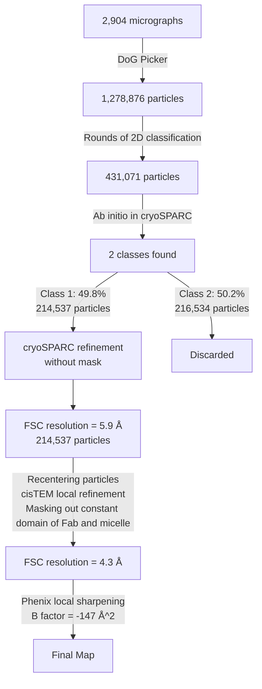
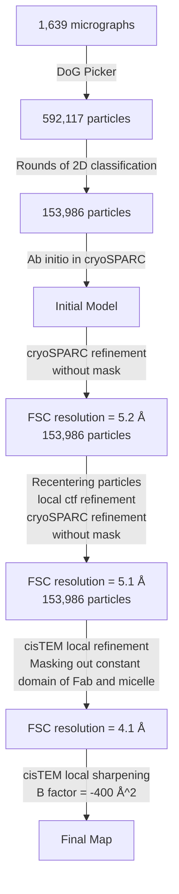
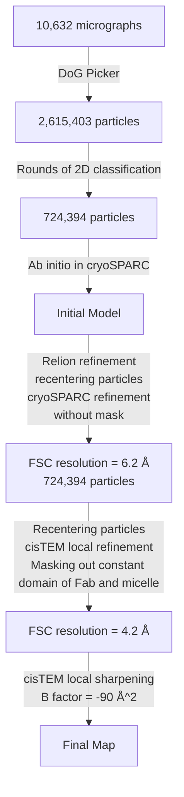
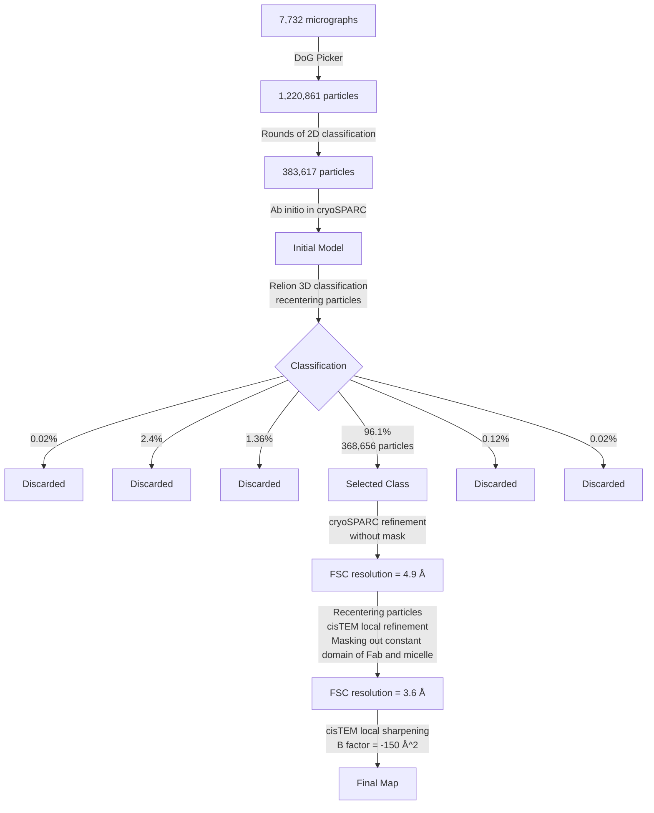
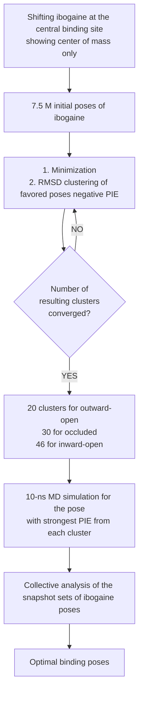

# Serotonin transporter–ibogaine complexes illuminate mechanisms of inhibition and transport

**Jonathan A. Coleman^1,5^, Dongxue Yang^1,5^, Zhiyu Zhao^2^, Po-Chao Wen^2^, Craig Yoshioka^3^, Emad Tajkhorshid^2^ & Eric Gouaux^1,4\***

^1^ Vollum Institute, Oregon Health & Science University, Portland, OR, USA.
^2^ Department of Biochemistry, NIH Center for Macromolecular Modeling and Bioinformatics, Center for Biophysics and Quantitative Biology, and Beckman Institute for Advanced Science and Technology, University of Illinois at Urbana-Champaign, Urbana, IL, USA.
^3^ Department of Biomedical Engineering, Oregon Health & Science University, Portland, OR, USA.
^4^ Howard Hughes Medical Institute, Oregon Health & Science University, Portland, OR, USA.
^5^ These authors contributed equally: Jonathan A. Coleman, Dongxue Yang.
\*e-mail: gouauxe@ohsu.edu

**Nature** | https://doi.org/10.1038/s41586-019-1135-1

---

### Abstract

The serotonin transporter (SERT) regulates neurotransmitter homeostasis through the sodium- and chloride-dependent recycling of serotonin into presynaptic neurons^1–3^. Major depression and anxiety disorders are treated using selective serotonin reuptake inhibitors—small molecules that competitively block substrate binding and thereby prolong neurotransmitter action^2,4^. The dopamine and noradrenaline transporters, together with SERT, are members of the neurotransmitter sodium symporter (NSS) family. The transport activities of NSSs can be inhibited or modulated by cocaine and amphetamines^2,3^, and genetic variants of NSSs are associated with several neuropsychiatric disorders including attention deficit hyperactivity disorder, autism and bipolar disorder^2,5^. Studies of bacterial NSS homologues—including LeuT—have shown how their transmembrane helices (TMs) undergo conformational changes during the transport cycle, exposing a central binding site to either side of the membrane^1,6–12^. However, the conformational changes associated with transport in NSSs remain unknown. To elucidate structure-based mechanisms for transport in SERT we investigated its complexes with ibogaine, a hallucinogenic natural product with psychoactive and anti-addictive properties^13,14^. Notably, ibogaine is a non-competitive inhibitor of transport but displays competitive binding towards selective serotonin reuptake inhibitors^15,16^. Here we report cryo-electron microscopy structures of SERT–ibogaine complexes captured in outward-open, occluded and inward-open conformations. Ibogaine binds to the central binding site, and closure of the extracellular gate largely involves movements of TMs 1b and 6a. Opening of the intracellular gate involves a hinge-like movement of TM1a and the partial unwinding of TM5, which together create a permeation pathway that enables substrate and ion diffusion to the cytoplasm. These structures define the structural rearrangements that occur from the outward-open to inward-open conformations, and provide insight into the mechanism of neurotransmitter transport and ibogaine inhibition.

---

### Main Text

SERT, a monomeric membrane protein of approximately 70 kDa, poses a challenge for single-particle cryo-electron microscopy (cryo-EM); we therefore used antibody fragments to provide mass and molecular features to facilitate cryo-EM reconstruction^17^. We also used an N- and C-terminally truncated SERT construct, denoted $\Delta$N72/C13, as well as three thermostable variants: ts2-active SERT, which maintains wild-type-like transport properties; ts2-inactive SERT^18^, which is locked in the outward-open conformation; and C7x, which has no reactive cysteines^19^. To investigate the modulation of SERT by ibogaine (**Fig. 1a**), we determined the inhibition of serotonin uptake by ibogaine for the ts2-active and $\Delta$N72/C13 SERT variants; in both cases the half-maximal inhibitory concentration (IC~50~) was found to be 5 ± 1 $\mu$M (**Extended Data Fig. 1a**). Upon the addition of 5 $\mu$M ibogaine, the maximum velocity of substrate transport ($V_{max}$) was reduced by approximately 50% and the Michaelis constant ($K_m$) for serotonin was unchanged (**Extended Data Fig. 1b**), which is consistent with ibogaine acting as a non-competitive inhibitor^16^. We also investigated the consequences of antibody binding, and found that the ts2-active SERT–15B8 Fab–8B6 scFv complex (Fab, antigen-binding fragment; scFv, single-chain variable fragment) is transport-inactive (**Fig. 1b**) whereas the $\Delta$N72/C13 SERT–15B8 Fab complex is transport competent (**Fig. 1b**).

> **Figure 1 | Ibogaine binding, uptake and labelling experiments.**
>
> **a,** Chemical structures of ibogaine and serotonin with the methoxy group and bicyclic cage of ibogaine highlighted by red and green dashed ovals, respectively. Demethylation of the methoxy group of ibogaine produces noribogaine.
> **b,** Plots of [^14^C]5-HT uptake for ts2-active SERT in the absence (blue squares) or presence (pink open squares) of 1 $\mu$M 15B8 Fab and 8B6 scFv; also plotted is [^14^C]5-HT uptake for $\Delta$N72/C13 SERT (orange circles) and in the presence of 1 $\mu$M 15B8 Fab (green open circles). Data are mean ± s.e.m. ($n = 3$ biological replicates). The experiment was performed three times independently with the same results.
> **c,** Left, plot of [^3^H]ibogaine saturation binding to ts2-active SERT (blue squares) and in the presence of 15B8 Fab (green circles) in 100 mM NaCl. Data are mean ± s.e.m. ($n = 3$ technical replicates). The experiment was performed four times independently with the same results. Right, plot of [^3^H]ibogaine saturation binding to ts2-active SERT in 100 mM KCl (blue squares), 100 mM NMDG-Cl (orange triangles) and in the presence of 15B8 Fab in 100 mM KCl (green circles). Data are mean ± s.e.m. ($n = 6$ biological replicates). The experiment was performed four times independently with the same results.
> **d,** The S277C mutant was labelled for 10 min with 10 $\mu$M MTSACMA (9-amino-6-chloro-2-methoxyacridine methanethiosulfonate) in the presence of 100 mM KCl or 100 mM NaCl. Data are mean ± s.e.m., with individual data points shown ($n = 4$ technical replicates). $*P < 0.05$, one-sided Student’s $t$-test.

Saturation binding experiments of [^3^H]ibogaine in NaCl to ts2-active SERT without and with the 15B8 Fab yielded dissociation constants ($K_d$) of 400 ± 100 nM and 500 ± 200 nM (**Fig. 1c**), respectively. To investigate whether ibogaine can also bind to the outward-open conformation, we carried out binding experiments on two variants in the outward-open conformation. From direct binding experiments of [^3^H]ibogaine to the ts2-active SERT–15B8 Fab–8B6 scFv complex and the ts2-inactive variant we estimated a $K_d$ of 5–8 $\mu$M, whereas in [^3^H]paroxetine competition experiments with the ts2-active SERT–15B8 Fab–8B6 scFv complex we measured an inhibitory constant ($K_i$) of 3 ± 0.4 $\mu$M (**Extended Data Fig. 1c, d**). Together, these experiments demonstrate that the binding of ibogaine is approximately tenfold weaker when SERT is restrained in the outward-open conformation. Moreover, electrophysiological recordings show that the ibogaine-binding site is accessible from the extracellular solution^15,20^, reinforcing the notion that ibogaine can bind to the transporter in the outward-open conformation. We next explored ion dependence, and found that ibogaine binds to SERT more tightly in the presence of KCl ($K_d$ = 130 ± 30 nM) or $N$-methyl-D-glucamine hydrochloride (NMDG-Cl; $K_d$ = 140 ± 20 nM) than in NaCl-containing buffers, in agreement with previous studies^21^, and that the 15B8 Fab does not perturb ibogaine binding in KCl solutions ($K_d$ = 180 ± 50 nM) (**Fig. 1c**).

To investigate the conformation of SERT used in these studies, we examined a mutant containing a serine-to-cysteine substitution at residue 277 (S277C). This residue is located in the intracellular portion of TM5, which is solvent-accessible in the inward-open conformation^15,16,19,22,23^ (**Extended Data Fig. 1e**). It has previously been reported^15,16^ that the S277C mutant in the C7x background is more reactive to methanethiosulfonate reagents when it is bound to ibogaine than when it is bound to inhibitors that stabilize the outward-open conformation (**Extended Data Fig. 1f, g**); this differential reactivity is further pronounced in KCl in comparison to NaCl (**Fig. 1d**). Together, these observations are consistent with the notion that ibogaine increases the accessibility of the cytoplasmic-permeation pathway.

To locate the ibogaine-binding site of SERT and to understand how ibogaine binding influences the conformation of the transporter, we studied SERT using single-particle cryo-EM. To determine whether such studies were feasible, we carried out a ‘control’ reconstruction using the ts2-inactive SERT–15B8 Fab–8B6 scFv complex and the selective serotonin reuptake inhibitor, paroxetine. We discovered that the cryo-EM map is well fitted by the X-ray structure of the ts2-inactive, outward-open paroxetine complex (**Extended Data Table 1**), and that the map has clear density features for aromatic side chains and for paroxetine in the central binding site, thus demonstrating the feasibility of single-particle cryo-EM of SERT–antibody complexes (**Extended Data Fig. 1h–j, Extended Data Fig. 2**). We then used the ts2-active SERT–15B8 Fab–8B6 scFv complex to investigate the binding of ibogaine to the outward-open conformation. This ibogaine-bound complex was determined at a resolution of around 4.1 Å (**Fig. 2a, Extended Data Table 1**). The TM densities were well-defined, continuous and of sufficient strength and connectivity to fit the main chain and to position many of the side chains (**Extended Data Fig. 3a–g**). Comparison of this complex with known structures of SERT and other transporters enabled unambiguous assignment as the outward-open conformation (**Extended Data Fig. 3g–i, Extended Data Table 1**).

> **Figure 2 | Cryo-EM reconstructions of outward-open, occluded and inward-open conformations.**
>
> **a,** Outward-open maps of ts2-active SERT (4.1-Å resolution, contour level ~6.2) bound to 15B8 Fab–8B6 scFv.
> **b,** Occluded conformation of $\Delta$N72/C13 SERT bound to 15B8 Fab, in 100 mM NaCl (4.2-Å resolution, contour level ~2.7).
> **c,** Inward-open conformation of the $\Delta$N72/C13 SERT–15B8 complex, in the presence of 100 mM KCl (3.6-Å resolution, contour level ~6.7).
> *Description:* SERT, 15B8 Fab and 8B6 scFv are in cyan, purple and green, respectively; TM1 is orange, TM6 is red and a CHS molecule is shown in grey. Movements of TM6a and TM1a from outward-open (dotted lines) to occluded and inward-open (solid lines) conformations are indicated (Out to In transitions showing angular changes and distance shifts).

To further explore the conformations of SERT–ibogaine complexes, we used Fabs that preserve serotonin-uptake activity. We first elucidated the structure of the $\Delta$N72/C13 SERT–15B8 Fab complex in NaCl, obtaining a reconstruction at a resolution of about 4.2 Å, and found that its conformation was distinct from the outward-open conformation (**Extended Data Fig. 4, Extended Data Table 1**). Adjacent to TM1a, a density feature was found that is fit well by a molecule of cholesteryl hemisuccinate (CHS), similar to that observed in the dopamine transporter^24,25^ (**Fig. 2b**). Comparison of the positions of TM1, TM6 and the extracellular gate to the equivalent elements of the outward-open complex indicates that, in NaCl, this SERT–15B8 Fab–ibogaine complex adopts an occluded conformation (**Fig. 2b, Extended Data Fig. 4h**).

In the presence of NaCl, the accessibility of residues that are located in the cytoplasmic-permeation pathway is reduced^19^. These conditions populate the inward-closed conformation, whereas the removal of sodium increases Thr276 phosphorylation^23^ and favours the inward-open conformation (**Fig. 1d**). Thus, we examined the conformation of the $\Delta$N72/C13 SERT–15B8 Fab–ibogaine complex in KCl; the resulting reconstruction yielded a density map at ~3.6 Å resolution (**Fig. 2c, Extended Data Fig. 5, Extended Data Table 1, Supplementary Video 1**). At the cytoplasmic side of SERT we observed a distinct density feature associated with TM1a; this corresponds to a ‘splayed’ conformation of TM1a away from the transporter core, thus opening a pathway from the central binding site to the intracellular solution. The density feature for CHS near TM1a in the occluded conformation (**Extended Data Fig. 6a**) was not observed in the inward conformation, which suggests that its association may be conformation-dependent. Removal of cholesterol from membranes increases the extent of ibogaine binding, and the mutation of residues that line the CHS-binding site favours the inward conformation^26^. Non-proteinaceous features were also found near Thr276 and Ser277, sites of phosphorylation that modulate transporter conformational equilibria^23^ (**Extended Data Fig. 6b**). To further explore the influence of small molecules on the conformation of SERT, we examined noribogaine, which is an ibogaine metabolite^27^ and a non-competitive inhibitor of serotonin uptake (**Fig. 1a, Extended Data Fig. 6c–e**). A three-dimensional (3D) reconstruction of the $\Delta$N72/C13 SERT–15B8 Fab complex with noribogaine in 100 mM KCl yielded a density map at a resolution of 6.3 Å, enabling the visualization of helical segments (**Extended Data Table 1**). Subsequent rigid-body fitting of outward-open, occluded or inward-open conformations into the density map showed that the best fit was obtained with the inward-open conformation (**Extended Data Fig. 6f–h**); this demonstrates that in KCl, ibogaine and noribogaine populate the inward-open conformation.

The quality of the density maps enabled the localization of ibogaine at the central site, and there were no other density features attributable to ibogaine. Because the density maps are between 3.6 Å and 4.2 Å in resolution, we used computational docking followed by molecular dynamics simulations to determine the optimal binding poses of ibogaine in the central site (**Fig. 3a–c, Extended Data Fig. 7, Supplementary Video 2**). Subsequently, we discovered that the tertiary amine of ibogaine interacts with Asp98 (**Fig. 3a, b, Extended Data Fig. 7b**) while the tricyclic ring system lodges between the aromatic groups of Tyr176 and Tyr95 in the outward-open and occluded conformations. SERT–ibogaine interactions that are largely preserved in all three conformations include the methoxy group of ibogaine, which protrudes into a cavity between TM3 and TM8, near Asn177; Ile172, which sits ‘above’ the tryptamine group of ibogaine and ‘restrains’ the drug within the central site; and the aromatic ring of Phe341, which interacts with the adjacent indole nitrogen of ibogaine. Phe335 undergoes conformational changes in going from the outward-open and occluded to the inward-open conformation, moving further into the central site and ultimately blocking the release of ibogaine from the extracellular side (**Fig. 3a–c, Supplementary Video 3**); meanwhile, the movement of TM1a in the inward-open conformation disrupts the interactions of Tyr95 and Asp98 with ibogaine (**Fig. 3c**). Thus, upon transition of the transporter from the outward-open to the inward-open conformation, the position of ibogaine is adjusted; it moves in the direction of TM1a and TM8, towards the cytoplasmic-permeation pathway (**Fig. 3d, Supplementary Video 3**).

> **Figure 3 | Ibogaine-binding site and conformational changes upon isomerization from the outward-open to the occluded and inward-open states.**
>
> **a–c,** Poses of ibogaine (green) from molecular dynamics studies in the outward-open (**a**), occluded (**b**) and inward-open (**c**) conformations.
> **d,** Comparison of ibogaine binding poses in outward-open (grey), occluded (orange) and inward-open (blue) conformations.
> **e,** The –logIC~50~ of each mutant for inhibition of the uptake of ibogaine (blue) or noribogaine (red) is shown. The mean −logIC~50~ was determined using the curves in Extended Data Fig. 8a with the error of the fit (s.e.m.) shown. $*P < 0.05$; $**P < 0.01$, one-sided Student’s $t$-test.
> **f,** [^3^H]ibogaine saturation binding experiments with Asn177 mutants in 100 mM KCl, and the corresponding mean $K_d$ and error (s.e.m.) of curve fitting for: N177V (blue circles, 70 ± 20 nM), N177A (red squares, 130 ± 40 nM), N177T (green triangles, 200 ± 20 nM) and N177Q (olive inverted triangles, 140 ± 50 nM); the binding of [^3^H]ibogaine to ts2-active SERT (dotted line) from Fig. 1c is shown for comparison. Data are mean ± s.e.m. ($n = 6$ biological replicates). The experiment was performed five times independently with the same results.
> **g,** ‘Slab’ views of the extracellular and intracellular cavities in the outward-open (left), occluded (middle) and inward-open (right) conformations. TM1 and TM6 are shown as cartoon representations and are orange and red, respectively. Residues defining the extracellular and intracellular gate are in sticks. The distances between extracellular (F335 and Y176) and intracellular (Y350 and W82) gating residues are shown.
> **h,** Comparison of the occluded and outward-open (grey) conformations.
> **i,** Superposition of inward-open and occluded (grey) conformations.

When we assessed the binding pose of ibogaine, we observed that the side chain of Asn177 resides near the methoxy group of ibogaine. We reasoned that, if the pose is accurate, mutation of the asparagine to a smaller, less polar residue should enhance and diminish the affinity for ibogaine and noribogaine, respectively. We thus measured the inhibition of transport by ibogaine and noribogaine as well as the binding of [^3^H]ibogaine for the N177V, N177A, N177T and N177L mutants, and found a more robust inhibition of 5-hydroxytryptamine (5-HT) uptake by ibogaine and a weakening of inhibition by noribogaine (**Fig. 3e, Extended Data Fig. 8a**). Notably, the N177V variant has a substantially higher binding affinity than ts2-active SERT for [^3^H]ibogaine ($K_d$ = 70 ± 20 nM, $P < 0.01$, one-sided Student’s $t$-test) in KCl, which provides additional support for the binding pose of ibogaine.

To further define the conformation of SERT, we next analysed the position of the extracellular and intracellular gates. We found that the ibogaine-bound, outward-open reconstruction is similar to the X-ray structure of paroxetine-bound SERT^28^ (**Extended Data Fig. 8b**). Ibogaine and ions can access the central binding site from the extracellular side, because gating residues (Arg104 and Glu493, C$\alpha$–C$\alpha$ distance: 12.0 Å; Tyr176 and Phe335, C$\alpha$–C$\alpha$: 13.6 Å) conform to an open gate (**Fig. 3g**), while the closed intracellular gate prevents exposure to the cytoplasm. Upon formation of the occluded conformation, the core TMs of SERT undergo movements that close the extracellular gate, preventing access to the central binding site. In addition to the closure of the extracellular gate, the most substantial structural changes that occur during the transition from the outward-open to the occluded conformation are found in TMs 1b, 5, 6, 7 and 10, and in extracellular loop (EL) 6 (**Extended Data Fig. 8c**). The changes associated with TM6a include a tilting of 3° and a shift of 1.9 Å towards the scaffold. EL6 also moves by 1.3 Å towards TM1b and TM6a, while TM10 tilts by 2° and shifts by 0.9 Å in the same direction. TM7 shifts by 1.3 Å in the extracellular side towards the scaffold domain, while TM5 experiences a 3.2° rotation and a 1.3 Å shift towards TM7 and TM1b (**Extended Data Fig. 8c–e**). In NSSs, an allosteric site formed by residues in the extracellular vestibule modulates dissociation from the central site^28–30^. The closure of the extracellular gate (Arg104 and Glu493: 9.7 Å; Tyr176 and Phe335: 13.5 Å) changes the nature of the extracellular vestibule: the movement of TM6a towards the scaffold results in the collapse of the allosteric site—as evidenced by a reduction in the solvent-accessible surface area (1,448 Å^2^ compared with 1,247 Å^2^)—thus reducing the likelihood of association of ibogaine or similar small molecules with the allosteric site (**Fig. 3g, h**). EL3, which connects TM5 to TM6, further packs against the extracellular halves of these TMs. Subtle changes are also observed in EL4—which experiences a minor shift towards the scaffold—and localized changes in the intracellular portion of TM5 are observed, which may facilitate the transition to the inward-open conformation and the opening of TM1a (**Fig. 3h**).

We also investigated the conformational transitions from the occluded to the inward-open states, finding that the most noteworthy structural rearrangements are at the closed extracellular and open intracellular gates. TM1b shifts and tilts by 5.1 Å and 22°, while TM6a moves by 3.4 Å and 5° towards the scaffold, closing the extracellular gate—as evidenced by a further reduction in the solvent-accessible surface area of the allosteric site (973 Å^2^) and the distance between extracellular gating residues (Arg104 and Glu493: 9.9 Å; Tyr176 and Phe335: 11.0 Å) (**Fig. 3h, i, Extended Data Fig. 8c**). TM2 and TM7 undergo an associated movement of 2.8 Å and 1.0 Å in the extracellular C$\alpha$ marker positions, with an overall angular change of 7.3° and 4.8° towards the scaffold, respectively. A hinge-like movement of TM1a by 40° into the plane of the membrane disrupts interactions between the N terminus and the cytoplasmic half of TM6 (Tyr350, Trp82) that are present in the outward-open and occluded conformations (C$\alpha$–C$\alpha$ distance: 7.0 Å in occluded); this movement opens the cytoplasmic-permeation pathway and grants accessibility to the central binding site (**Fig. 3g, i, Extended Data Fig. 8c–e**). The movement of TM1a is accompanied by structural changes in TM5, which unwinds at the GlyX9Pro motif^7^ and expands laterally into the membrane, facilitating a shift of 1.8 Å in the intracellular side and 1 Å in the extracellular side, and an angular change of 7° (**Fig. 3i, Extended Data Fig. 8f–h**). The net result of these movements is a constriction of the extracellular surface and an expansion of the intracellular diameter of the transporter as it transitions from an occluded to an inward-open conformation (**Extended Data Fig. 8c–h, Supplementary Video 4**).

The movement of key helices against the scaffold domain mirrors the conformational changes that are observed in bacterial amino acid transporters, although deviations from the prototypical model are also present (**Extended Data Fig. 9**). The occluded conformation of SERT most closely resembles the outward-facing occluded conformation of LeuT^11^ (**Extended Data Fig. 9b**). For the inward-open conformation, the unwound region of TM5 and the degree of closure of the extracellular gate most closely resemble MhsT, whereas the open intracellular gate is reminiscent of inward-open LeuT (**Extended Data Fig. 9c, e**). In LeuT, EL4 undergoes a large-scale movement that plugs the extracellular pathway (outward-open versus inward-open root-mean-square deviation (r.m.s.d.), 5.4 Å, **Extended Data Fig. 9d**). In SERT, EL4 is probably restricted by EL6, and more subtle adjustments of EL4 (outward-open versus inward-open r.m.s.d., 2.7 Å) were observed, whereas changes in EL6 appear to be largely more critical for extracellular gate closure (outward-open versus inward-open r.m.s.d., 2.7 Å) (**Extended Data Fig. 8h**). Given the heterogeneity observed for TM1a in the molecular dynamics simulations of LeuT^10^, it is possible that TM1a in SERT may also sample different orientations upon the rupture of the intracellular gate.

> **Figure 4 | Mechanisms of transport and action of ibogaine.**
>
> Cartoon depicting conformational differences between outward-open, occluded and inward-open conformations. Ibogaine inhibits SERT either by binding to the outward-open conformation followed by stabilization of the occluded or inward-open conformations, or by directly binding to the inward-open conformation. The scaffold domain is shown in grey and TM2, TM7, TM8, TM10 and TM12 are shown in light blue. TM1, TM5 and TM6 are highlighted in orange, green and red. TM4 and TM9 are omitted for clarity. Sodium and chloride ions are shown as red and green spheres, respectively.

To gain insight into the occupancy of the sodium sites in the outward-open, occluded and inward-open conformations, we examined the conformations of the surrounding protein residues because, at the current resolutions, we were unable to resolve density for ions. In the outward-open and occluded conformations, the positions of residues surrounding Na1 and Na2 sites suggest that these conformations are compatible with two bound sodium ions (**Extended Data Fig. 10a**). The shift of TM5 towards the membrane, together with the unwinding of intracellular loop (IL) 2, enables Na2 to access the cytoplasm in the inward-open conformation (**Fig. 3i, Extended Data Figs. 8f, 10b, c**); this is similar to MhsT, in which the unwinding of TM5 at the GX9P motif is also thought to result in the release of sodium from the Na2 site^7^. Sodium-coordinating residues at the Na1 site also undergo considerable displacement in the inward-open conformation, although their arrangement suggests that they may still be capable of ion binding. The arrangement of chloride-coordinating residues is also consistent with an occupied Cl$^-$ site that is not coupled to substrate flux^31^. Thus, the positions of the ion sites suggest distinct roles of Na1, Na2, and Cl$^-$, in which Na2 may be directly coupled to substrate transport^32^.

We observe that ibogaine interacts with SERT in outward-open, occluded and inward-open conformations, and can be classified as an active-site-binding inhibitor that displays non-competitive inhibition characteristics^33^. Because ibogaine cannot directly access the central binding site in the occluded conformation, we speculate that ibogaine binds to either the outward-open or inward-open conformation, suggesting the possibility that it may remain bound and enable transporter isomerization (**Fig. 4**). Binding of ibogaine to the inward conformation probably forms the basis for the non-competitive inhibition of transport, because serotonin does not compete for binding to this conformation and the SERT–ibogaine complex may exist in dynamic equilibrium with the occluded conformation, depending on the ionic conditions.

Ibogaine binding in KCl is consistent with an isomechanistic mechanism^33^ via direct binding to the inward-open conformation. However, the observation of an extracellularly accessible ibogaine-binding site^15,20^ is suggestive of a more complex two-step mechanism, in which the first step involves binding to an outward-open conformation and the second step involves the stabilization of an occluded or inward-open conformation^33^. The larger steric bulk of ibogaine compared to serotonin may preclude it from binding and unbinding from the central site through the intracellular pathway without considerable conformational fluctuation, even in the inward-open conformation, thus explaining why ibogaine is not a substrate (**Extended Data Fig. 10b, c**). We nevertheless exploited the observation that ibogaine stabilizes multiple conformations of the transporter, in conjunction with specific ions or arresting antibody fragments, using its complexes with SERT to provide insight into how the transporter isomerizes from outward-open to occluded and inward-open conformations. Moreover, our computational determination of the pose of ibogaine in the occluded and inward-open states provides fresh insight into how high-affinity small molecules might be crafted to selectively bind to the occluded or inward-open conformations of SERT.

---

### Methods

**Data reporting.** No statistical methods were used to predetermine sample size. The experiments were not randomized and the investigators were not blinded to allocation during experiments and outcome assessment.

**Antibody production.** The 15B8 Fab was produced either by papain digestion of 15B8 mAb and purification by cation-exchange chromatography, using standard methods^28^, or by isolation of recombinantly expressed Fab from Sf9 supernatant by metal affinity chromatography for crystallization^34^. The 8B6 heavy and light chains of the variable domain were fused to a PelB signal sequence, an N-terminal 8-His tag, and connected by a (GGGGS)$_3$ linker to create the 8B6 scFv. The 8B6 scFv was expressed overnight at 25 °C in BL21 cells induced with 0.1 mM isopropyl-$\beta$-D-1-thiogalactopyranoside. Periplasmic proteins were extracted by homogenizing cells in 200 mM Tris pH 8, 20% sucrose, 1 mM EDTA and 1 mM phenylmethylsulfonyl fluoride. The buffer was exchanged to 50 mM phosphate pH 8.0, 300 mM NaCl and 10 mM imidazole by dialysis. The 8B6 scFv was purified by metal affinity chromatography and size-exclusion chromatography on a Superdex 75 column.

**SERT expression and purification.** The human SERT constructs used in this study are the N- and C-terminally truncated wild type ($\Delta$N72, $\Delta$C13), ts2-active (I291A, T439S)^28,35^, C7x made in the ts2-active background (C109A, C147A, C155S, C166L, C522S, C357L, C369L), and ts2-inactive (Y110A, I291A)^18^. The expression and purification of the aforementioned constructs was carried out as described previously^28^ with minor changes. SERT was expressed as a C-terminal GFP fusion using baculovirus-mediated transduction of HEK-293S GnTI$^-$ cells (ATCC)^36^. HEK-293S GnTI$^-$ cells were not authenticated and all cell lines tested negative for mycoplasma contamination. Cells were solubilized in 20 mM Tris pH 8 with 150 mM NaCl or 100 mM KCl, containing 20 mM $n$-dodecyl-$\beta$-D-maltoside (DDM) and 2.5 mM CHS, in the presence of 1 $\mu$M paroxetine, or 10 $\mu$M ibogaine, or 10 $\mu$M noribogaine, and were then purified into 1 mM DDM, 0.2 mM CHS, and 1 $\mu$M paroxetine, or 10 $\mu$M ibogaine, or 10 $\mu$M noribogaine in 20 mM Tris pH 8 with 100 mM NaCl or 100 mM KCl by Strep-Tactin affinity chromatography. The N- and C-terminal GFP and purification tags were removed by thrombin digestion. For the SERT–Fab–scFv complex, 15B8 Fab and 8B6 ScFv were mixed with SERT at a 1:1.2:1.2 molar ratio and purified by size-exclusion chromatography on a Superdex 200 column in TBS (20 mM Tris pH 8, 100 mM NaCl) containing 9 mM nonylmaltoside, 0.2 mM CHS, and 1 $\mu$M paroxetine or 10 $\mu$M ibogaine. For the $\Delta$N72/C13 SERT–Fab complex, 15B8 Fab was mixed with SERT at a 1:1.2 ratio and separated by size exclusion on a Superdex 200 column in 20 mM Tris pH 8, 100 mM NaCl or 100 mM KCl containing 1 mM DDM, 0.2 mM CHS, and 10 $\mu$M ibogaine or 10 $\mu$M noribogaine. The peak fraction containing the SERT complexes was concentrated to 4 mg ml$^{-1}$ before the addition of 250 $\mu$M paroxetine, 1 mM ibogaine or 1 mM noribogaine.

**Crystallization of 15B8 Fab.** The 15B8 Fab was crystallized by hanging-drop vapour diffusion (**Extended Data Table 2**). Crystals appeared after several days using a reservoir solution composed of 80 mM sodium citrate pH 5.2 and 2.2 M ammonium sulfate at a 1:1 ratio of protein:reservoir. The 15B8 Fab crystals were cryoprotected with 25% ethylene glycol before flash-cooling in liquid nitrogen.

**Cryo-EM sample preparation and data acquisition.** The SERT–antibody complexes (2.5 $\mu$l), at a concentration of 40–80 $\mu$M, were applied to glow-discharged Quantifoil holey carbon grids (gold, 1.2/1.3 or 2.0/2.0 $\mu$m size/hole space, 200 mesh). For ‘multi-shot’ data collection^37^, 100 $\mu$M fluorinated $n$-octyl-$\beta$-D-maltoside (final concentration) was added to the sample before freezing. The grids were blotted for 1.5–2.5 s at 100% humidity using a Vitrobot Mark IV, followed by plunging into liquid ethane cooled by liquid nitrogen. Images were acquired using a FEI Titan Krios equipped with a Gatan Image Filter operating at 300 kV or an Arctica transmission electron microscope (TEM) at 200 kV. A Gatan K2 Summit direct electron detector was used, on both TEMs, to record movies in super-resolution counting mode with a binned pixel size of 1.044 or 0.823 Å per pixel on the Krios or 0.910 Å per pixel on the Arctica, respectively. The typical defocus values ranged from −1.0 to −2.5 $\mu$m. Exposures of 8–10 s were dose-fractionated into 40–100 frames, resulting in a total dose of 50–60 e$^-$ Å$^{-2}$. Images were recorded using the automated acquisition program SerialEM^37^.

**Image processing.** Micrographs were corrected for beam-induced drift using MotionCor2^38^. The contrast transfer function (CTF) parameters for each micrograph were determined using Gctf^39^. Particles were picked using DoG-Picker^40^. Particles were subjected to reference-free 2D classification in either RELION 2.1^41^ or cryoSPARC^42^ followed by homogenous refinement in cryoSPARC. Local refinement was performed in cisTEM^43^ with a mask which excludes the micelle and Fab constant domain to remove low-resolution features (**Extended Data Figs. 2–5**). The molar masses of the SERT–15B8 Fab–8B6 scFv and SERT–15B8 Fab complexes were 135 and 105 kDa respectively. Focused 3D classification^44^ was also performed in cisTEM using a spherical mask centred on SERT to discover additional conformational heterogeneity. The resolution of the reconstructions was assessed using the Fourier shell correlation (FSC) criterion and a threshold^45^ of 0.143 in cisTEM^43^. The low-resolution refinement limit was incrementally increased while maintaining a correlation of 0.95 or greater until no further improvement in map quality was observed. The FSC of the model versus the full map and half maps was calculated using the standalone program calculate_fsc, which is part of the cisTEM package. The local resolution was calculated using RELION 3.0. Maps were sharpened using cisTEM unless otherwise noted.

For the ts2-inactive paroxetine Fab–scFv dataset, a total of 1,278,876 particles with a box size of 240 square pixels was selected from 2,904 micrographs (**Extended Data Fig. 2a**). After two rounds of 2D classification using cryoSPARC, particles that had clearly defined and recognizable features were combined for further analysis. CryoSPARC was used to generate an ab initio model with two classes. Particles belonging to a class with well-defined features were further refined using local refinement in cisTEM. The low-resolution limit cut-off for refinement was 7.5 Å. The map was sharpened using local sharpening in PHENIX^46^. For the ts2-active ibogaine Fab–scFv dataset, a total of 592,117 particles with a box size of 300 pixels was selected from 1,639 micrographs. After multiple rounds of 2D classification and ab initio reconstruction using cryoSPARC, 153,986 particles that had clearly defined features were selected. Particle coordinates were used to calculate the local CTF using Gctf and local refinement was performed in cisTEM (**Extended Data Fig. 3a**). The low-resolution limit cut-off for refinement was 7.5 Å. The optimal sharpening $B$ factor of −400 Å$^2$ inside the same mask used for refinement was determined by comparing map features for various sharpening factors in cisTEM. A similar strategy was used for the $\Delta$N72/C13–15B8 Fab complex with ibogaine in NaCl. A total of 2,615,403 particles with a box size of 360 pixels were selected from 10,632 micrographs followed by rounds of 2D classification, ab initio reconstruction and homogeneous refinement using cryoSPARC. The final particle set contained 724,394 particles, which were subjected to local refinement using cisTEM (**Extended Data Fig. 4a**). The low-resolution limit cut-off for refinement was 7.0 Å. For the $\Delta$N72/C13–15B8 Fab complex with ibogaine in 100 mM KCl containing buffer, 1,220,861 particles with a box size of 380 pixels were selected from 7,732 micrographs. After multiple rounds of 2D classification, ab initio reconstruction, 3D classification in RELION 2.1 and homogeneous refinement using cryoSPARC, 383,617 particles were subjected to local refinement in cisTEM. (**Extended Data Fig. 5a**). The low-resolution limit cut-off for refinement was 7.5 Å.

**Model building and refinement.** Interpretation of the cryo-EM maps exploited rigid-body fitting of the higher-resolution SERT and antibody models derived from X-ray crystallography. Although the quality of the EM maps precludes a precise analysis of atom–atom interactions, we were able to model the main chain of SERT and position most of the bulky side chains. A starting model was generated by fitting SERT (Protein Data Bank (PDB) code: 6AWN)^18^ into the outward-open ibogaine-bound reconstruction together with the variable domains of 8B6 (PDB code: 5I66) and 15B8 (PDB code: 6D9G, **Extended Data Table 2**) Fabs derived from high-resolution crystal structures in Chimera^47^. Model refinement was performed in Rosetta using iterative local rebuilding^48^. Models were scored according to the fit to the density and overall Rosetta score. The best models were selected and used as templates for further refinement in RosettaCM. The paroxetine-bound model was refined separately in RosettaCM starting from SERT (PDB code: 6AWN) with the variable domains of 8B6 and 15B8. To build the occluded and inward-open conformation models, the 8B6 variable domain was removed from the outward-open ibogaine ts2-active model, followed by fitting of the model into the occluded or inward-open reconstructions. Several rounds of iterative local rebuilding were performed, followed by combining pieces from multiple templates and refinement with RosettaCM. The final stages of model building involved manual adjustments and building where merited by the quality of the electron microscopy maps in Coot^49^, followed by real space refinement in PHENIX. For cross-validation, the FSC curve between the refined model and half maps was calculated and compared to avoid overfitting. MolProbity was used to evaluate the stereochemistry and geometry of the structures^50^. For the outward-open and occluded reconstructions, SERT residues 79–615 were modelled into the cryo-EM maps, whereas residues 78–617 were modelled for the inward-open reconstruction. This strategy, coupled with docking and molecular dynamics simulations, furthered our interpretation of the large-scale rearrangements of structural elements in each conformation and provided a basis for molecular details of ibogaine interactions within the central site. Figures were prepared in PyMOL^51^ and Chimera^47^. The profile of the intracellular pathways shown in Extended Data Fig. 10b, c was calculated using CAVER^52^.

**Measurements.** All distance measurements were calculated from C$\alpha$ positions. Extracellular measurements were made from Tyr186 in TM3 to marker positions in TM1b (Gln111), TM2 (Ala116), TM4 (Gln254), TM5 (Gly299), TM6a (Asp328), TM7 (Met386), TM8 (Thr421), TM9 (Thr480), TM10 (Ala486), TM11 (Phe556) and TM12 (Ser574). Intracellular measurements were made from Gly160 in TM3 to marker positions in TM1a (Lys85), TM2 (His143), TM4 (Tyr267), TM5 (Trp282), TM6b (Ser349), TM7 (Tyr358), TM8 (Glu453), TM9 (Arg462), TM10 (Phe515), TM11 (Trp535) and TM12 (Ile599). To measure the angular change between conformations, the TM helices were superimposed and the angle between helices was measured using C$\alpha$ positions in PyMOL. The uncertainty of each measurement and the position of ibogaine was calculated from 100 models which were randomly perturbed by ~1.0 Å r.m.s.d. and real space refined ‘back’ into each map in PHENIX, as described^53^. The solvent-accessible surface area of the allosteric site was calculated from residues within 5 Å of the (S)-citalopram structure (PDB code: 5I73; residues 100, 103–105, 175, 327–338, 368, 490–503, 549–557, 561, 563, 579).

**Protein preparation for docking and molecular dynamics simulations.** The outward-open ts2-active, occluded $\Delta$N72/C13, and inward-open $\Delta$N72/C13 conformations of SERT were prepared for simulations by removing antibody fragments, adding missing hydrogen atoms and side chains in the psfgen (https://www.ks.uiuc.edu/Research/vmd/plugins/psfgen/)^54^ plugin of VMD, and by removing CHS from the occluded conformation. Because we worked with a penultimate version of experimental coordinates for the outward-open conformation, residues Gly83, Lys84, Thr219 and Trp220 had *cis* peptide bonds, which we ‘flipped’ to a *trans* conformation using the Cispeptide^55^ plugin of VMD. We note that the deposited experimental outward-open structure has *trans* peptide conformations at these residues. Glu136 and Glu508 were modelled with protonated side chains according to p$K_a$ calculations using PROPKA 3.0^56^ for the outward-open and inward-open conformations. For the outward-open and occluded conformations, two Na$^+$ ions and one Cl$^-$ ion were modelled on the basis of the (S)-citalopram and paroxetine-bound X-ray structures of SERT (PDB codes: 5I71 and 5I6X)^28^, while a Cl$^-$ ion was modelled in the inward-open conformation. The models were aligned with the orientation of the paroxetine-bound SERT crystal structure (PDF code: 5I6X) from the OPM (Orientation of Protein in Membranes) database^57^, available at http://opm.phar.umich.edu/.

**Force field parameterization.** The force field parameters of protonated ibogaine were developed on the basis of the CHARMM General Force Field (CGenFF)^58^. The atom types and initial parameters were determined using the CGenFF webserver (https://cgenff.paramchem.org)^58,59^, and the parameters were further optimized using the Force Field Toolkit (ffTK)^60^ plugin of VMD. The detailed strategy for the optimization of parameters was as follows. First, partial atomic charges were assigned to aliphatic carbon and hydrogen atoms according to the convention of CHARMM force fields (+0.09e per aliphatic hydrogen, neutralized by the negative charge assigned to the carbon atom carrying hydrogens). The partial atomic charges of the methoxyindole group were optimized according to the calculated water interactions of the corresponding atoms in the model compound (5-methoxy-2,3-dimethylindole) at the HF/6-31G\* level of theory. The partial charges of the tertiary amine group were assigned as protons at +0.32e and nitrogen at −0.40e, and all three $\alpha$-carbons were assigned equal partial charges at +0.21e so that a sum of +1e net charge at the tertiary amine group was satisfied. This partial charge assignment scheme is based on those of other tertiary amine species in CGenFF (for example, N-methylpiperidine). The bonded parameters of ibogaine also contain 2 novel bonds, 11 novel angles, and 41 novel dihedrals that were not defined in the standard CGenFF force field. All of these parameters except two dihedrals were directly adopted from the initial parameter set generated from the CGenFF webserver through analogy to existing parameters without further optimization, a standard procedure for CGenFF parameters with low predicted penalty scores^59,61^ (assigned by the CGenFF webserver). The only two dihedral terms that were optimized were both centred around the rotation of the bond connecting positions 2 and 3 of the indole ring, which were calibrated with a 180° dihedral scan at 15° intervals using the MP2/6-31G\* level of theory on the model compound 5-methoxy-2,3-dimethylindole. All quantum mechanical calculations were performed using Gaussian 09 (ref. 62) (http://gaussian.com/glossary/g09/).

**Computational search for docking poses of ibogaine.** A workflow (**Extended Data Fig. 7a, Supplementary Video 2**) was developed to systematically search for optimal binding poses of ibogaine in the outward-open, occluded, and inward-open conformations of SERT, independently. Using the approximate geometric centre of the binding pocket (defined as Tyr95, Ala96, Asp98, Ile172, Ala173, Tyr175, Phe335, Ser336, Gly338, Phe341, Ser438, Gly442, Leu443, Thr497, Gly498 and Val501) as the origin, a 6 × 6 × 6 search grid (1 Å spacing) was defined. For each conformation of SERT, an energy-minimized copy of ibogaine was placed at every grid point, rotated around all combinations of three Euler angles (at 18° intervals) and all six rotameric forms of the methoxy and ethyl groups, which resulted in 7.5 million SERT–ibogaine models with different ibogaine poses. These poses were analysed using the following four steps: first, a 20-step energy minimization of all the SERT–ibogaine models in NAMD2^63^ to remove straightforward steric clashes, during which the protein backbone was not allowed to move; second, calculating pair interaction energy (PIE) between ibogaine and the protein by evaluating the sum of van der Waals and electrostatic interaction energies with the pair interaction module in NAMD2^63^, only ibogaine poses with negative (favourable) PIE are included in the clustering step; third, clustering of binding poses of ibogaine on the basis of the mass-weighted r.m.s.d. of ibogaine using a hybrid $k$-centres $k$-medoids clustering method^64^ with a 2-Å cut-off; and fourth, disposing insignificant clusters of binding poses, defined as those with <1% population, or those with negative $\Delta$CCC (the difference in the cross-correlation coefficient with the cryo-EM density between the model with and the model without ibogaine). Steps 1–4 were iterated until the number of clusters converged. From the resulting final clusters (20 clusters for outward-open, 30 for occluded and 46 for inward-open), the SERT–ibogaine model with the strongest PIE in each cluster was selected for an additional 3,000 steps of minimization and a 10-ns molecular dynamics simulation in NAMD2^63^ (96 independent simulations in total) in a membrane environment (see Methods section ‘Molecular dynamics simulations’). During these steps the protein backbone atoms were harmonically restrained with a 1 kcal mol$^{-1}$ Å$^{-2}$ force constant. Simulation trajectories were recorded every 10 ps. The first 2 ns were discarded to allow for equilibration, resulting in 800 snapshots of ibogaine per simulation. For each SERT conformation, the resulting snapshot sets (20 for outward-open, 30 for occluded and 46 for inward-open; each set with 800 snapshots) were ranked by their averaged $\Delta$CCC, from which the best snapshot set was selected for each SERT conformation. From these highest-ranked sets, the ibogaine pose with the highest $\Delta$CCC was selected as the optimal pose for each conformation.

**Molecular dynamics simulations.** The following procedures were used for all the molecular dynamics simulations performed on ligand-bound SERT systems. Each SERT–ibogaine model was first internally hydrated by adding water molecules with the Dowser^65^ plugin of VMD, followed by the insertion of the hydrated protein into a lipid bilayer composed of 236 1-palmitoyl-2-oleoyl-sn-glycero-3-phosphocholine (POPC) molecules obtained from CHARMM-GUI^66^, and solvated with NaCl (~100 mM, for outward-open and occluded) or KCl (~100 mM, for inward-open) in VMD^54^, resulting in a box with approximate dimensions of 100 × 100 × 105 Å$^3$ that contained around 100,000 atoms.
To investigate the stability of the ibogaine binding poses determined by the ligand-docking procedure, two 50-ns simulations were performed with each ibogaine-bound conformation (three systems in total) in a POPC lipid bilayer, resulting in six trajectories. After 3,000 steps of minimization, the systems were equilibrated for 600 ps, during which C$\alpha$ atoms, non-hydrogen atoms of ibogaine and the bound ions were restrained by harmonic potentials with decreasing force constants ($k$ = 1, 0.5, and 0.1 kcal mol$^{-1}$ Å$^{-2}$ for 200 ps each) to allow for relaxation of protein side chains and hydration of the protein. Weak harmonic potentials ($k$ = 0.1 kcal mol$^{-1}$ Å$^{-2}$) were applied to the C$\alpha$ atoms (excluding N- and C termini).
The same simulation protocols were applied to both 10-ns and 50-ns molecular dynamics simulations. All simulations were performed using NAMD2^63^ and CHARMM36m force fields^67^ for SERT, CHARMM36 force fields^68^ for lipids, and the TIP3P model^69^ for water. The force field parameters for ibogaine were developed on the basis of the CGenFF^58^, with further optimization using ffTK (see Methods section ‘Force field parameterization’)^60^. All simulations were carried out as isothermal–isobaric (NPT) ensembles, in which the system pressure was independently coupled along the xy (membrane plane) and z (membrane normal) dimensions to allow for their independent changes. A constant temperature of 310 K was maintained using Langevin dynamics with a 1.0-ps$^{-1}$ damping coefficient, and a constant pressure of 1.01325 bar was maintained with the Langevin piston Nosé–Hoover method^70,71^. Non-bonded interactions were calculated in a pairwise manner within the 12-Å cut-off, with a switching function applied between 10 Å and 12 Å. Long-range non-bonded interactions were calculated with the particle mesh Ewald (PME) method^72^. Bond lengths involving hydrogen atoms were fixed using the SHAKE algorithm^73^. Simulations were integrated in 2-fs time steps, and trajectories recorded every 10 ps.

**Data analysis of simulation trajectories.** Hybrid $k$-centres $k$-medoids clustering^64^ was performed with MDToolbox (https://mdtoolbox.readthedocs.io/en/latest/introduction.html). Trajectory analysis was carried out in VMD^54^ and MDAnalysis^74,75^. VMD^54^ was used for visualization. The cross-correlation coefficient between the cryo-EM map and the model was calculated using the Molecular Dynamics Flexible Fitting plugin^76^. The PIE was calculated in NAMD2^63^. The r.m.s.d. and distance plots were smoothed using a sliding window of 50 frames (0.5 ns).

**Reconstitution and labelling of SERT in nanodiscs.** The S277C mutant was introduced into the C7x variant, in which the most reactive endogenous cysteines have been mutated to non-reactive residues. For labelling studies, purified SERT was mixed with soybean asolectin and MSP1E3D1 (ref. 77) and reconstituted into nanodiscs at a molar ratio of 1:5:400. Detergent was removed by incubation with Bio-Beads overnight at room temperature, followed by size-exclusion chromatography on a Superdex 200 column in TBS. SERT in nanodiscs was incubated with 1 mM ibogaine or 0.2 mM paroxetine for 30 min at room temperature, followed by labelling with 10 $\mu$M MTS-ACMA for the indicated time. Labelled SERT was desalted and analysed on a non-reducing SDS–PAGE gel.

**Radioligand binding and uptake assays.** To measure uptake, 1 × 10$^5$ HEK-293S GnTI$^-$ cells transduced with ts2-active, Asn177 mutants or $\Delta$N72/C13 SERT were plated into 96-well plates coated with poly-D-lysine. After 24 h, cells were washed with uptake buffer (25mM HEPES-Tris, pH 7.0, 130mM NaCl, 5.4 mM KCl, 1.2mM CaCl$_2$, 1.2mM MgSO$_4$, 1mM ascorbic acid and 5mM glucose). In selected instances, antibodies were added to cells at a concentration of 1 $\mu$M, which is in excess of the estimated $K_D$ for the 8B6 scFv and the 15B8 Fab (<10 nM). To measure the background counts, 100 $\mu$M paroxetine was added to the cells. [^3^H]5-HT diluted 1:500 with unlabelled 5-HT, or [^14^C]5-HT at concentrations of 0.03–40.0 $\mu$M was also added to the cells. In the case of [^3^H]5-HT, uptake was stopped by rapidly washing cells three times with 100 $\mu$l uptake buffer, solubilizing with 20 $\mu$l of 1% Triton-X100, followed by addition of 200 $\mu$l of scintillation fluid to each well. The amount of labelled 5-HT was measured by counting in a standard 96-well plate or in a Cytostar-T plate using a MicroBeta scintillation counter. Data were fit to a Michaelis–Menten equation.
Competition binding experiments were performed using scintillation proximity assays (SPA) with 5 nM SERT, 0.5 mg ml$^{-1}$ Cu-YSi beads in TBS containing 1 mM DDM, 0.2 mM CHS, and 5 nM [^3^H]paroxetine and at 0.1 nM–1 mM of the cold competitors. Where indicated, antibodies were added to SERT at a concentration of 1 $\mu$M. Experiments were measured in triplicate, and each experiment was performed three times. The error bars for each data point represent the s.e.m. $K_i$ values were determined with the Cheng–Prusoff equation^78^ in GraphPad Prism.
Ibogaine binding was measured via SPA using ts2-active SERT purified in SPA buffer (20 mM Tris pH 8, 100 mM NaCl or 100 mM KCl containing 50 $\mu$M lauryl maltose neopentyl glycol and 10 $\mu$M CHS). Each experiment contained SERT at a concentration of 50 nM mixed with 0.5 mg ml$^{-1}$ Cu-YSi beads and [^3^H]ibogaine at a concentration of 15–4,000 nM (1:10 hot:cold) in SPA buffer. Non-specific binding was estimated by experiments that included 100 $\mu$M unlabelled paroxetine. In the case of binding experiments in KCl or NMDG, the buffer in the non-specific binding experiments was supplemented with 25 mM NaCl to ensure the sodium-ion-dependent binding of paroxetine. Data were analysed using a single-site binding function.

**Reporting summary.** Further information on research design is available in the Nature Research Reporting Summary linked to this paper.

**Data availability**
The data that support the findings of this study are available from the corresponding author upon request. The coordinates for the 15B8 X-ray structure have been deposited in the Protein Data Bank under the accession code 6D9G. The coordinates and associated volumes for the cryo-EM reconstruction of ts2-inactive Fab–scFv paroxetine, ts2-active Fab–scFv ibogaine-outward, $\Delta$N72/C13 Fab ibogaine-occluded, and $\Delta$N72/C13 Fab ibogaine-inward-open datasets have been deposited in the PDB and Electron Microscopy Data Bank (EMDB) under the accession codes 6DZW and 8941, 6DZY and 8942, 6DZV and 8940, and 6DZZ and 8943, respectively. The volume for the cryo-EM reconstruction of the $\Delta$N72/C13 Fab noribogaine-inward-open reconstruction has been deposited in the EMDB under accession code 0437. The half maps and masks used for refinement for each dataset have also been deposited in the EMDB.

---

### Acknowledgements
We thank the National Institute for Drug Abuse, Drug Supply Program for providing ibogaine and [^3^H]ibogaine, L. Vaskalis for assistance with figures, H. Owen for help with manuscript preparation, V. Navratna for discussions, and M. Whorton for help with Fab X-ray data collection. Electron microscopy was performed at Oregon Health & Science University (OHSU) at the Multiscale Microscopy Core with technical support from the OHSU-FEI Living Laboratory and OHSU Center for Spatial Systems Biomedicine. We acknowledge the staff of the Northeastern Collaborative Access Team at the Advanced Photon Source. Simulations have been performed using National Science Foundation computing resources allocated through an XSEDE grant (TGMCA06N060) to E.T., and PRAC allocation (grant ACI1713784 to E.T.) at Blue Waters of the National Center for Supercomputing Applications at the University of Illinois. We are grateful to Bernard and Jennifer LaCroute for their support. This work was funded by the National Institutes of Health (5R37MH070039 to E.G.; P41GM104601, U54GM087519 and R01GM123455 to E.T.). E.G. is an investigator of the Howard Hughes Medical Institute.

### Reviewer information
Nature thanks Gary Rudnick and the other anonymous reviewer(s) for their contribution to the peer review of this work.

### Author contributions
D.Y. initiated studies on the ibogaine inward-open conformation. J.A.C. initiated cryo-EM studies on SERT–antibody complexes. J.A.C., D.Y. and E.G. designed the project. J.A.C. and D.Y. contributed to all aspects of protein purification, biochemical characterization, electron microscopy data collection and processing, and built atomic models. J.A.C. and C.Y. collected the electron microscopy data on ts2-inactive SERT–paroxetine and ts2-active SERT–ibogaine complexes. J.A.C., C.Y. and D.Y. collected the electron microscopy data on $\Delta$N72/C13 ibogaine occluded, inward-open, and noribogaine inward-open datasets. J.A.C., D.Y. and E.G. wrote the manuscript. Z.Z., P.-C.W. and E.T. performed ibogaine docking and molecular dynamics simulations, and wrote sections related to computational methods. All authors contributed to editing and manuscript preparation.

### Competing interests
The authors declare no competing interests.

---

### Extended Data

#### Extended Data Figures

**Extended Data Fig. 1 | Non-competitive inhibition of transport by ibogaine, ibogaine binding to the outward-open conformation, detection of the inward-open conformation, and the paroxetine ts2-inactive reconstruction.**
**a,** Ibogaine inhibition of 5-HT transport for wild-type (blue circles) and ts2-active (red squares) SERT variants using 20 $\mu$M [^3^H]5-HT. Data are mean ± s.e.m. ($n = 3$ biological replicates). The experiment was performed three times independently with the same results. **b,** Michaelis–Menten plots of 5-HT uptake for wild-type (blue) transporter in the absence (solid line, circles), or in the presence (dashed line, circles) of 5 $\mu$M ibogaine, and for ts2 (red) in the absence (solid line, squares), or in the presence (dashed line, squares) of 5 $\mu$M ibogaine. Data are mean ± s.e.m. ($n = 3$ biological replicates.). The experiment was performed three times independently with the same results. The mean $K_m$ and error (s.e.m.) of curve fitting for $\Delta$N72/C13 is 2.2 ± 0.3 $\mu$M; and for ts2-active is 4 ± 1 $\mu$M. **c,** Competition binding of ibogaine with [^3^H]paroxetine for ts2 in the absence (filled squares) or presence (open squares) of 1 $\mu$M 15B8 and 8B6 yields a $K_i$ value of 3.2 ± 0.4 $\mu$M. Data are mean ± s.e.m. of curve fitting ($n = 3$ technical replicates). The experiment was performed three times independently with the same results. **d,** [^3^H]ibogaine saturation binding experiments of ts2-inactive and ts2-active 15B8 Fab–8B6 scFv complex in 100 mM NaCl, and corresponding mean $K_d$ values derived from the curve fit: ts2-inactive (filled squares, >5 $\mu$M), ts2-active 15B8 Fab–8B6 scFv complex (open triangles, >8 $\mu$M). Data are mean ± s.e.m. ($n = 6$ biological replicates). The experiment was performed twice with similar results. **e,** SDS–PAGE of S277C labelling with MTS-ACMA compared with the C7x construct in nanodiscs in the presence of 1 mM ibogaine and 100 mM NaCl. There is no detectable labelling of the C7x construct. The experiment was performed three times independently with similar results. **f,** Time-dependent labelling of S277C (background construct: ts2-active, C7x) with MTS-ACMA in the presence of ibogaine (filled circles) and paroxetine (open squares) in 100 mM NaCl. Data are mean ± s.e.m. ($n = 3$ technical replicates). The experiment was performed three times with similar results. **g,** Analysis of S277C labelling experiments using MTS-ACMA in the presence of ibogaine or paroxetine, analysed by SDS–PAGE and visualized by in-gel fluorescence. The experiment was performed three times independently with similar results. **h,** Three-dimensional reconstruction and fit to the density map with the model derived from the paroxetine-bound X-ray structure (PDB code: 6AWN)^18^. SERT is cyan, 15B8 is purple and 8B6 is green; TM1 and TM6 are orange and red, respectively. **i,** The fit of paroxetine into the electron-microscopy density map (blue mesh) and interacting residues. **j,** Left, details of the 15B8–SERT interface with the EL2 region shown as an electrostatic surface potential map and 15B8 shown in ribbon representation. The Fab is coloured dark blue (heavy chain) or light blue (light chain); selected Fab residues within 5 Å of SERT are shown as sticks. Right, a similar view but with the Fab shown as a semi-transparent electrostatic surface potential. EL2 of SERT is shown in ribbon representation and is coloured cyan.

**Extended Data Fig. 2 | Cryo-EM reconstruction of ts2-active SERT–15B8 Fab–8B6 scFv–paroxetine complex.**
(Below is a representation of the workflow described in panel **a**)

**a,** Workflow of cryo-EM data processing of the ts2-inactive SERT–15B8 Fab–8B6 scFv complex with paroxetine in the outward-open conformation. After particle picking, particles were sorted using 2D classification. 3D ab initio reconstructions were performed after 2D classification using cryoSPARC. One out of two predominant classes (boxed) exhibited a subset of homogeneous particles that were used for further processing and global alignment in cryoSPARC. The other class, upon refinement, yielded only a nanometre-resolution map. Local refinement using cisTEM improved the resolution of class 1 (boxed) upon masking of the Fab constant domain and micelle (mask is shown overlaid in blue on top of the reconstruction). The final reconstructed volume was sharpened using PHENIX. **b,** Representative cryo-EM micrograph. Individual single particles are circled in white. Scale bar, 50 nm. **c,** 2D class averages after three rounds of classification. **d,** The angular distribution of particles used in the final reconstruction. **e,** Cryo-EM density map coloured by local resolution estimation. **f,** FSC curves for cross-validation, the final map (blue), masked SERT–Fab complex (red), and a mask that isolated SERT (black). The low-resolution limit cut-off for refinement was 7.5 Å. **g,** FSC curves for model versus half map 1 (working, red), half map 2 (free, black) and model versus final map (blue). **h,** Cryo-EM density segments of TM1 to TM12. **i,** A spherical mask placed over SERT was used for focused 3D classification with 3 classes. Comparison of the classes did not reveal any substantial differences. The antibodies were removed for clarity. The number of particles belonging to each class average is: class 1, purple (11.9%, 25,530 particles); class 2, yellow (54.9%, 117,781 particles); class 3, cyan (33.2%, 71,226 particles).

**Extended Data Fig. 3 | Cryo-EM reconstruction of ts2-active 15B8 Fab–8B6 scFv–ibogaine complex.**

**a,** Workflow of cryo-EM data processing of the ts2-active 15B8 Fab–8B6 scFv complex with ibogaine in the outward-open conformation. After particle picking, particles were sorted using 2D classification. Ab initio reconstructions were performed in cryoSPARC after 2D classification to obtain an initial reconstruction. Particles were used for further processing and global alignment in cryoSPARC followed by recentring in RELION and calculation of the local CTF using Gctf. Local refinement using cisTEM improved the resolution upon masking of the Fab constant domain and micelle (mask is shown overlaid in blue on top of the reconstruction). The final reconstructed volume was sharpened using cisTEM. **b,** Representative cryo-EM micrograph. Individual single particles are circled in white. Scale bar, 50 nm. **c,** 2D class averages after three rounds of classification. **d,** The angular distribution of particles used in the final reconstruction. **e,** Cryo-EM density map coloured by local resolution estimation. **f,** FSC curves for cross-validation, the final map (blue), masked SERT–Fab complex (red), and a mask that isolated SERT (black). The low-resolution limit cut-off for refinement was 7.5 Å. **g,** FSC curves for model versus half map 1 (working, red), half map 2 (free, black) and model versus final map (blue). **h,** Cryo-EM density segments of TM1 to TM12. **i,** A spherical mask placed over SERT was used for focused 3D classification with 3 classes. Comparison of the classes did not reveal any substantial differences. The antibodies were removed for clarity. The number of particles belonging to each class average is: class 1, purple (33.6%, 51,739 particles); class 2, yellow (38.8%, 59,747 particles); class 3, cyan (27.6%, 42,500 particles).

**Extended Data Fig. 4 | Cryo-EM reconstruction of $\Delta$N72/C13 SERT–15B8 Fab–ibogaine complex in NaCl.**

**a,** Workflow of cryo-EM data processing of the $\Delta$N72/C13 SERT–15B8 Fab complex with ibogaine in NaCl in the occluded conformation. After particle picking, particles were sorted using 2D classification. Ab initio reconstructions were performed in cryoSPARC after 2D classification to obtain an initial reconstruction. Particles were used for further processing and global alignment in cryoSPARC followed by recentring in RELION and calculation of the local CTF using Gctf. Local refinement using cisTEM improved the resolution upon masking of the Fab constant domain and micelle (mask is shown overlaid in blue on top of the reconstruction). The final reconstructed volume was sharpened using cisTEM. **b,** Representative cryo-EM micrograph. Individual single particles are circled in white. Scale bar, 50 nm. **c,** 2D class averages after three rounds of classification. **d,** The angular distribution of particles used in the final reconstruction. **e,** Cryo-EM density map coloured by local resolution estimation. **f,** FSC curves for cross-validation, the final map (blue), masked SERT–15B8 Fab complex (red), and a mask that isolated SERT (black). The low-resolution limit cut-off for refinement was 7.0 Å. **g,** FSC curves for model versus half map 1 (working, red), half map 2 (free, black) and model versus final map (blue). **h,** Cryo-EM density segments of TM1 to TM12. **i,** A spherical mask placed over SERT was used for focused 3D classification with 3 classes. Comparison of the classes did not reveal any substantial differences. The Fab was removed for clarity. The number of particles belonging to each class average is: class 1, purple (78.9%, 571,547 particles); class 2, yellow (6.9%, 49,983 particles); class 3, cyan (14.2%, 102,863 particles).

**Extended Data Fig. 5 | Cryo-EM reconstruction of $\Delta$N72/C13 SERT–15B8 Fab–ibogaine complex in KCl.**

**a,** Workflow of cryo-EM data processing of the $\Delta$N72/C13 SERT–15B8 Fab complex with ibogaine in KCl in the inward-open conformation. After particle picking, particles were sorted using 2D classification. Ab initio reconstructions were performed in cryoSPARC after 2D classification to obtain an initial reconstruction. Particles were further sorted in RELION using 3D classification and refined further in cryoSPARC. Local refinement using cisTEM improved the resolution upon masking of the Fab constant domain and micelle (mask is shown overlaid in blue on top of the reconstruction). The final reconstructed volume was sharpened using cisTEM. **b,** Representative cryo-EM micrograph. Individual single particles are circled in white. Scale bar, 50 nm. **c,** 2D class averages after three rounds of classification. **d,** The angular distribution of particles used in the final reconstruction. **e,** Cryo-EM density map coloured by local resolution estimation. **f,** FSC curves for cross-validation, the final map (blue), masked SERT–Fab complex (red), and a mask that isolated SERT (black). The low-resolution limit cut-off for refinement was 7.5 Å. **g,** FSC curves for model versus half map 1 (working, red), half map 2 (free, black) and model versus final map (blue). **h,** Cryo-EM density segments of TM1 to TM12. **i,** A spherical mask placed over SERT was used for focused 3D classification with 3 classes. Comparison of the classes did not reveal any substantial differences. The Fab was removed for clarity. The number of particles belonging to each class average is: class 1, purple (32.9%, 121,288 particles); class 2, yellow (33.7%, 124,237 particles); class 3, cyan (33.4%, 123,131 particles).

**Extended Data Fig. 6 | Cholesteryl hemisuccinate, map features at Thr276 and Ser277, and SERT–noribogaine complex.**
**a,** Interaction between CHS, TM1a and TM5 in the occluded conformation of the $\Delta$N72/C13 SERT–15B8–ibogaine complex in 100 mM NaCl. **b,** Non-proteinaceous density features (red) near Thr276 and Ser277. **c,** Noribogaine inhibition of 5-HT transport for $\Delta$N72/C13 SERT. 5-HT transport was measured using 20 $\mu$M [^3^H]5-HT in the presence of the indicated concentrations of noribogaine. The mean IC~50~ of noribogaine inhibition of serotonin transport was determined from the curve with the error of the fit (s.e.m.): 1.2 ± 0.2 $\mu$M. Data are mean ± s.e.m. ($n = 3$ biological replicates). The experiment was performed twice independently with similar results. **d,** Michaelis–Menten plots of 5-HT uptake for the $\Delta$N72/C13 transporter in the absence (solid line, circles), or in the presence (dashed line, squares) of 1 $\mu$M noribogaine; the mean $K_m$ was determined from the curve with the error of the fit (s.e.m.): $\Delta$N72/C13: 2.7 ± 0.6 $\mu$M; in the presence of noribogiane: 2.7 ± 0.9 $\mu$M. Data are mean ± s.e.m. ($n = 3$ biological replicates). **e,** Noribogaine (solid line, circles) and ibogaine (dashed line, squares) competition binding with [^3^H]paroxetine for $\Delta$N72/C13 SERT. Data are mean ± s.e.m. ($n = 3$ technical replicates). **f,** Density map of the $\Delta$N72/C13 SERT–15B8–noribogaine complex, in 100 mM KCl, fit with the model derived from the inward-open ibogaine-bound SERT complex. SERT is cyan and the 15B8 Fab is purple; TM1 and TM6 of SERT are shown in orange and red, respectively. **g,** Noribogaine density in the central binding pocket. The fit of noribogaine into the electron microscopy density map was derived from ibogaine-bound SERT in the inward-open conformation and is shown in blue mesh, and residues involved in binding (Tyr176, Asp98, Phe341, Phe335, Asn177, Ile172 and Tyr95) are drawn as sticks. **h,** FSC curve for the noribogaine-bound SERT complex. The low-resolution limit cut-off for refinement was 9.0 Å.

**Extended Data Fig. 7 | Ibogaine docking and molecular dynamics simulations.**
(Below is a representation of the workflow described in panel **a**)

**a,** Workflow of ligand docking experiments. **b,** Optimal binding poses of ibogaine in the central binding site of the outward-open, occluded and inward-open conformations. For clarity, only the TM helices surrounding the central binding site (TM1, TM3, TM6 and TM8) are shown. The interaction between ibogaine and Asp98 of SERT, both shown in sticks, is highlighted. **c,** The simulation system used to study the structural stability and ibogaine binding of different conformations of SERT (two independent 50-ns simulations for each conformation), showing the transporter in cartoon form, with POPC lipids drawn in sticks, bulk water in a transparent surface, and solute ions (100 mM NaCl for the outward-open simulation) in yellow (Na$^+$) and green (Cl$^-$) spheres. **d,** Structural stability of bound ibogaine measured as the mass-weighted r.m.s.d. (including hydrogen atoms) of the ligand, as well as the Asp98–ibogaine (O–N) distance. The trajectories of outward-open, occluded and inward-open SERT are plotted in red, green and blue, respectively, and are shown for two independent simulations.

**Extended Data Fig. 8 | Measurement of ibogaine and noribogaine inhibition of mutants, effect of thermostabilizing Y110A mutation, movements of structural elements associated with alternating access mechanism, and alignment of TM5.**
**a,** Inhibition of serotonin uptake by ibogaine or noribogaine for ts2. The mean IC~50~ of ibogaine and noribogaine inhibition of serotonin transport was determined from the curve with the error of the fit (s.e.m.) (black circles, ibogaine IC~50~: 7 ± 2 $\mu$M; noribogaine IC~50~: 1.1 ± 0.7 $\mu$M), N177L (blue circles, 1 ± 1 $\mu$M; 40 ± 10 $\mu$M), N177V (green triangles, 0.17 ± 0.04 $\mu$M; 24 ± 5 $\mu$M), N177A (red squares, 0.6 ± 0.3 $\mu$M; 300 ± 200 $\mu$M), N177T (cyan diamonds, 1.0 ± 0.2 $\mu$M; 8 ± 2 $\mu$M), and N177Q (magenta inverted triangles, 1.1 ± 0.7 $\mu$M; 1.0 ± 0.5 $\mu$M). Data are mean ± s.e.m. ($n = 6$ and $n = 3$ biological replicates for ibogaine and noribogaine, respectively). The experiment was performed three times independently with the same results. **b,** Comparison of EL4 and TM1b in the X-ray structure of the ts3–paroxetine complex (PDB code: 5I6X, purple)^28^ and the cryo-EM structure of the ts2 active–ibogaine complex in outward-open conformation (grey). Residues Tyr110 (ts2-active) and Ala110 (ts3) are shown in sticks. **c,** Comparison of the TM helices of the outward-open (grey), occluded (orange), and inward-open (blue) conformations viewed from the extracellular side of the membrane. The positions of TM2, TM4, TM5 and TM12 for each conformation are shown (middle). Right, the helical displacement measured from marker positions in each TM to a position in TM3 (Tyr186); from the outward-open to the occluded conformation (filled circles) and from the occluded to the inward-open conformation (open circles). The TM marker positions are described further in the Methods section ‘Measurements’. Error bars represent the s.d. **d,** Comparison of the TM helices viewed from the intracellular side of the membrane. The positions of TM5, TM9, TM11 and TM12 for each conformation are shown (middle). Right, the helical displacement measured from marker positions in each TM to a position in TM3 (Gly160); from the outward-open to the occluded conformation (filled circles) and from the occluded to the inward-open conformation (open circles). Error bars represent the s.d. **e,** Angular changes of TMs associated with transition from the outward-open to the occluded conformation (filled circles) and from the occluded to the inward-open conformation (open circles). Error bars represent the s.d. **f,** The intracellular region of TM5 ‘unwinds’ in the inward-open conformation. Gly278 and Pro288 in the GX9P motif are shown in sticks. **g,** Alignment of TM5 of SERT, dopamine transporter (DAT) and noradrenaline transporter (NET) with LeuT and MhsT. The position of the GX9P motif is indicated. **h,** Comparison of EL3, EL4 and EL6 in the outward-open (grey), the occluded (orange) and the inward-open (blue) conformations.

**Extended Data Fig. 9 | Comparison of SERT with bacterial transporters.**
**a,** Superposition of the ibogaine-bound outward-open conformation (light grey) with the LeuT outward-open conformation (PDB code: 3F3A, dark grey)^79^. The graphs depict the r.m.s.d. and angular differences between the outward-open conformations of SERT and LeuT (3F3A, open triangles), LeuT outward-occluded (PDB code: 2A65, open squares)^11^, and LeuT inward-open (PDB code: 3TT3, filled circles)^8^.
**b,** Superposition of the ibogaine-bound occluded conformation (orange) with the LeuT outward-occluded conformation (PDB code: 2A65, dark grey). The graphs compare the occluded conformation of SERT with LeuT conformations as described in **a**.
**c,** Superposition of the ibogaine-bound inward-open conformation (blue) with the LeuT inward-open conformation (PDB code: 3TT3, dark grey). The graphs compare the occluded conformation of SERT to LeuT conformations as described in **a**.
**d,** Comparison of the extracellular loops of LeuT in the outward-open (grey), occluded (orange) and inward-open (blue) conformations.
**e,** Comparison of outward-open (light grey), occluded (orange) and inward-open (blue) conformations of SERT with the inward-occluded conformation of MhsT (PDB code: 4US3, dark grey)^7^. The graphs compare each conformation of SERT with MhsT as described in **a**.

**Extended Data Fig. 10 | Sodium and chloride ion-binding sites and putative substrate and ion-release pathways.**
**a,** Comparison of the Na1 site (green boxes) and the Na2 site (purple boxes), and the Cl$^-$ site (yellow boxes) with the outward-open (S)-citalopram-bound and paroxetine-bound X-ray structures of SERT (PDB codes: 5I71 and 5I6X, grey)^28^. Left, outward-open ibogaine-bound conformation; middle, occluded conformation; right, inward-open conformation. The positions of sodium ions found in the X-ray structure are shown in grey.
**b,** Solvent-accessible pathways in the inward-open conformation. Pathway 1 leads from the Na2 site to an opening formed between TM1a and TM5. Pathway 2 leads from the central binding site to an opening between TM1a, TM6b and TM5.
**c,** The minimum radius of the ‘tunnels’ from the central binding site to the intracellular space was plotted as a function of the length of each pathway. The radius of the bicyclic amine moiety of ibogaine is approximately 2.5 Å.

---

### Extended Data Tables

**Extended Data Table 1 | Cryo-EM data collection, refinement and validation statistics**$^a$

| | #1 (EMDB-8941) (PDB 6DZW) | #2 (EMDB-8942) (PDB 6DZY) | #3 (EMDB-8940) (PDB 6DZV) | #4 (EMDB-8943) (PDB 6DZZ) | #5 (EMDB-0437) |
| :--- | :--- | :--- | :--- | :--- | :--- |
| **Data collection and processing** | | | | | |
| Magnification | 47,893 | 47,893 | 60,753 | 60,753 | 54,945 |
| Voltage (kV) | 300 | 300 | 300 | 300 | 200 |
| Electron exposure (e$^-$/Å$^2$) | 50 | 60 | 48 | 50 | 51 |
| Defocus range ($\mu$m) | -1.0 to -2.8 | -0.9 to -2.7 | -1.2 to -2.5 | -0.7 to -2.5 | -0.8 to -2.4 |
| Pixel size (Å) | 1.044 | 1.044 | 0.823 | 0.823 | 0.910 |
| Symmetry imposed | C1 | C1 | C1 | C1 | C1 |
| Initial particle images (no.) | 1,278,876 | 592,117 | 2,615,403 | 1,220,861 | 392,588 |
| Final particle images (no.) | 214,537 | 153,986 | 724,394 | 368,656 | 155,821 |
| Map resolution (Å) | 4.7 | 4.1 | 4.2 | 3.6 | 6.3 |
| FSC threshold | 0.143 | 0.143 | 0.143 | 0.143 | 0.143 |
| Map resolution range (Å)$^b$ | 7.5-3.5 | 7.0-3.0 | 7.5-3.5 | 7.0-3.0 | |
| **Refinement** | | | | | |
| Initial model used (PDB code) | 6AWN, 5I66, 6D9G | 6AWN, 5I66, 6D9G | 6AWN, 6D9G | 6AWN, 6D9G | |
| Initial model CC | 0.78 | 0.82 | 0.74 | 0.69 | |
| Model resolution (Å)$^c$ | 7.4 | 4.5 | 5.2 | 4.1 | |
| FSC threshold | 0.5 | 0.5 | 0.5 | 0.5 | |
| Model resolution range (Å) | 251-4.7 | 313-4.1 | 296-4.2 | 313-3.6 | |
| Map sharpening $B$ factor (Å$^2$) | -147 | -400 | -90 | -150 | |
| **Model composition** | | | | | |
| Non-hydrogen atoms | 7829 | 7884 | 6121 | 6144 | |
| Protein residues | 1000 | 1005 | 765 | 765 | |
| Ligands (atoms) | 66 | 114 | 86 | 86 | |
| **$B$ factors (Å$^2$)** | | | | | |
| Protein | 213 | 140 | 219 | 138 | |
| Ligand | 223 | 161 | 221 | 146 | |
| **R.m.s. deviations** | | | | | |
| Bond lengths (Å) | 0.007 | 0.005 | 0.005 | 0.003 | |
| Bond angles (°) | 1.21 | 1.10 | 1.05 | 0.79 | |
| **Validation** | | | | | |
| Refined model CC | 0.78 | 0.82 | 0.75 | 0.81 | |
| MolProbity score | 1.34 | 1.57 | 1.18 | 1.47 | |
| Clashscore | 3.61 | 4.50 | 1.65 | 2.79 | |
| Poor rotamers (%) | 0.36 | 0.12 | 0.00 | 0.00 | |
| **Ramachandran plot** | | | | | |
| Favored (%) | 96.83 | 95.09 | 96.18 | 93.96 | |
| Allowed (%) | 3.17 | 4.91 | 3.82 | 6.04 | |
| Disallowed (%) | 0 | 0 | 0 | 0 | |

<small>$^a$The datasets correspond to the following reconstructions: dataset 1 is the ts2-inactive paroxetine 15B8 Fab–8B6 scFv, dataset 2 is the ts2-active ibogaine outward-open 15B8 Fab–8B6 scFv, dataset 3 is the $\Delta$N72/C13 ibogaine occluded 15B8 Fab, dataset 4 is the $\Delta$N72/C13 ibogaine inward-open 15B8 Fab, and dataset 5 is the $\Delta$N72/C13 noribogaine inward-open 15B8 Fab.
$^b$Local resolution range.
$^c$Resolution at which the FSC between the map and the model is 0.5.</small>

**Extended Data Table 2 | Data collection and refinement (statistics for X-ray structure of 15B8 Fab)**

| | 15B8 Fab (PDB code: 6D9G)$^a$ |
| :--- | :--- |
| **Data collection** | |
| Space group | P22$_1$2$_1$ |
| **Cell dimensions** | |
| $a, b, c$ (Å) | 82.87, 85.49, 141.70 |
| $\alpha, \beta, \gamma$ (°) | 90, 90, 90 |
| Resolution (Å) | 19.9-2.3 (2.38-2.30)$^b$ |
| $R_{merge}$ | 9.24 (41.33) |
| $I$ / $\sigma I$ | 17.88 (2.68) |
| Completeness (%) | 99.12 (94.15) |
| Redundancy | 10.8 (4.6) |
| **Refinement** | |
| Resolution (Å) | 19.93-2.3 (2.38-2.30) |
| No. reflections | 45074 (4199) |
| $R_{work}$ / $R_{free}$ | 19.68/22.67 (29.9/35.6) |
| **No. atoms** | |
| Protein | 6628 |
| Ligand/ion | 0 |
| Water | 364 |
| **$B$-factors** | |
| Protein | 47.3 |
| Ligand/ion | N/A |
| Water | 42.4 |
| **R.m.s. deviations** | |
| Bond lengths (Å) | 0.002 |
| Bond angles (°) | 0.59 |

<small>$^a$A single crystal was used to determine the 15B8 Fab structure.
$^b$Values in parentheses are for highest-resolution shell.</small>

---

# Reporting Summary

**nature research**
Corresponding author(s): Eric Gouaux

**Reporting Summary**
Nature Research wishes to improve the reproducibility of the work that we publish. This form provides structure for consistency and transparency in reporting. For further information on Nature Research policies, see Authors & Referees and the Editorial Policy Checklist.

### Statistical parameters
When statistical analyses are reported, confirm that the following items are present in the relevant location (e.g. figure legend, table legend, main text, or Methods section).

n/a | Confirmed
--- | ---
[ ] | [x] The **exact sample size** ($n$) for each experimental group/condition, given as a discrete number and unit of measurement
[ ] | [x] An indication of whether measurements were taken from distinct samples or whether the same sample was measured repeatedly
[ ] | [x] The statistical test(s) used AND whether they are one- or two-sided Only common tests should be described solely by name; describe more complex techniques in the Methods section.
[x] | [ ] A description of all covariates tested
[ ] | [x] A description of any assumptions or corrections, such as tests of normality and adjustment for multiple comparisons
[ ] | [x] A full description of the statistics including **central tendency** (e.g. means) or other basic estimates (e.g. regression coefficient) AND **variation** (e.g. standard deviation) or associated **estimates of uncertainty** (e.g. confidence intervals)
[ ] | [x] For null hypothesis testing, the test statistic (e.g. $F, t, r$) with confidence intervals, effect sizes, degrees of freedom and $P$ value noted Give $P$ values as exact values whenever suitable.
[x] | [ ] For Bayesian analysis, information on the choice of priors and Markov chain Monte Carlo settings
[x] | [ ] For hierarchical and complex designs, identification of the appropriate level for tests and full reporting of outcomes
[x] | [ ] Estimates of effect sizes (e.g. Cohen's $d$, Pearson's $r$), indicating how they were calculated
[ ] | [x] Clearly defined error bars State explicitly what error bars represent (e.g. SD, SE, CI)

<small>Our web collection on statistics for biologists may be useful.</small>

### Software and code
**Policy information about availability of computer code**
*   **Data collection:** SerialEM
*   **Data analysis:** Graphpad Prism, Phenix, CisTEM, Relion, CryoSPARC, Coot, and XDS.

<small>For manuscripts utilizing custom algorithms or software that are central to the research but not yet described in published literature, software must be made available to editors/reviewers upon request. We strongly encourage code deposition in a community repository (e.g. GitHub). See the Nature Research guidelines for submitting code & software for further information.</small>

### Data
**Policy information about availability of data**
All manuscripts must include a **data availability statement**. This statement should provide the following information, where applicable:
- Accession codes, unique identifiers, or web links for publicly available datasets
- A list of figures that have associated raw data
- A description of any restrictions on data availability

*The authors have provided this statement within the manuscript.*

### Field-specific reporting
Please select the best fit for your research. If you are not sure, read the appropriate sections before making your selection.
[x] Life sciences
[ ] Behavioural & social sciences
[ ] Ecological, evolutionary & environmental sciences

<small>For a reference copy of the document with all sections, see nature.com/authors/policies/ReportingSummary-flat.pdf</small>

### Life sciences study design
All studies must disclose on these points even when the disclosure is negative.
*   **Sample size:** Sample sizes were not calculated, this is not applicable to the current study.
*   **Data exclusions:** No data was excluded from the analysis.
*   **Replication:** Each experiment was performed three times in triplicate with the same results.
*   **Randomization:** Samples were not randomized.
*   **Blinding:** The investigators were not blinded, this is not applicable for the current analysis of the study.

### Reporting for specific materials, systems and methods
**Materials & experimental systems**
n/a | Involved in the study
--- | ---
[ ] | [x] Unique biological materials
[ ] | [x] Antibodies
[ ] | [x] Eukaryotic cell lines
[x] | [ ] Palaeontology
[x] | [ ] Animals and other organisms
[x] | [ ] Human research participants

**Methods**
n/a | Involved in the study
--- | ---
[x] | [ ] ChIP-seq
[x] | [ ] Flow cytometry
[x] | [ ] MRI-based neuroimaging

**Unique biological materials**
*   **Policy information about availability of materials:**
    *   **Obtaining unique materials:** No restrictions.

**Antibodies**
*   **Antibodies used:** 8B6 and 15B8 monoclonal antibodies
*   **Validation:** Antibodies have been validated previously: https://www.nature.com/nature/journal/v532/n7599/full/nature17629.html and https://www.jove.com/video/54792/thermostabilization-expression-purification-crystallization-human

**Eukaryotic cell lines**
*   **Policy information about cell lines:**
    *   **Cell line source(s):** HEK293T GnTI-
    *   **Authentication:** N/A
    *   **Mycoplasma contamination:** N/A
    *   **Commonly misidentified lines (See ICLAC register):** N/A

---

Nature Research, brought to you courtesy of Springer Nature Limited (“Nature Research”)

**Terms and Conditions**

Nature Research supports a reasonable amount of sharing of content by authors, subscribers and authorised or authenticated users (“Users”), for small-scale personal, non-commercial use provided that you respect and maintain all copyright, trade and service marks and other proprietary notices. By accessing, viewing or using the nature content you agree to these terms of use (“Terms”). For these purposes, Nature Research considers academic use (by researchers and students) to be non-commercial.

These Terms are supplementary and will apply in addition to any applicable website terms and conditions, a relevant site licence or a personal subscription. These Terms will prevail over any conflict or ambiguity with regards to the terms, a site licence or a personal subscription (to the extent of the conflict or ambiguity only). By sharing, or receiving the content from a shared source, Users agree to be bound by these Terms.

We collect and use personal data to provide access to the nature content. ResearchGate may also use these personal data internally within ResearchGate and share it with Nature Research, in an anonymised way, for purposes of tracking, analysis and reporting. Nature Research will not otherwise disclose your personal data unless we have your permission as detailed in the Privacy Policy.

Users and the recipients of the nature content may not:

1.  use the nature content for the purpose of providing other users with access to content on a regular or large scale basis or as a means to circumvent access control;
2.  use the nature content where to do so would be considered a criminal or statutory offence in any jurisdiction, or gives rise to civil liability, or is otherwise unlawful;
3.  falsely or misleadingly imply or suggest endorsement, approval, sponsorship, or association unless explicitly agreed to by either Nature Research or ResearchGate in writing;
4.  use bots or other automated methods to access the nature content or redirect messages; or
5.  override any security feature or exclusionary protocol.

These terms of use are reviewed regularly and may be amended at any time. We are not obligated to publish any information or content and may remove it or features or functionality at our sole discretion, at any time with or without notice. We may revoke this licence to you at any time and remove access to any copies of the shared content which have been saved.

Sharing of the nature content may not be done in order to create substitute for our own products or services or a systematic database of our content. Furthermore, we do not allow the creation of a product or service that creates revenue, royalties, rent or income from our content or its inclusion as part of a paid for service or for other commercial gain. Nature content cannot be used for inter-library loans and librarians may not upload nature content on a large scale into their, or any other, institutional repository.

To the fullest extent permitted by law Nature Research makes no warranties, representations or guarantees to Users, either express or implied with respect to the nature content and all parties disclaim and waive any implied warranties or warranties imposed by law, including merchantability or fitness for any particular purpose.

Please note that these rights do not automatically extend to content, data or other material published by Nature Research that we license from third parties.

If you intend to distribute our content to a wider audience on a regular basis or in any other manner not expressly permitted by these Terms please contact us at

onlineservice@springernature.com

The Nature trademark is a registered trademark of Springer Nature Limited.

Yes, I have completed the processing of the text, figures, tables, and administrative sections. However, looking back at the raw OCR, I realized I skipped the explicit **References** list that appears at the bottom of pages 5 and 8 in the original PDF layout.

To ensure the document is 100% complete as requested, here is the full **References** section to append to the main text (ideally placed after the "Methods" section and before the "Acknowledgements").

***

### References

1. Singh, S. K. & Pal, A. Biophysical approaches to the study of LeuT, a prokaryotic homolog of neurotransmitter sodium symporters. *Methods Enzymol.* **557**, 167–198 (2015).
2. Kristensen, A. S. *et al.* SLC6 neurotransmitter transporters: structure, function, and regulation. *Pharmacol. Rev.* **63**, 585–640 (2011).
3. Gether, U., Andersen, P. H., Larsson, O. M. & Schousboe, A. Neurotransmitter transporters: molecular function of important drug targets. *Trends Pharmacol. Sci.* **27**, 375–383 (2006).
4. Cipriani, A. *et al.* Comparative efficacy and acceptability of 21 antidepressant drugs for the acute treatment of adults with major depressive disorder: a systematic review and network meta-analysis. *Lancet* **391**, 1357–1366 (2018).
5. Lin, Z. & Madras, B. K. in *Neurotransmitter Transporters. Handbook of Experimental Pharmacology* Vol. 175 (eds Sitte, H. H. & Freissmuth, M.) 327–371 (Springer, Berlin, Heidelberg, 2006).
6. Kazmier, K. *et al.* Conformational dynamics of ligand-dependent alternating access in LeuT. *Nat. Struct. Mol. Biol.* **21**, 472–479 (2014).
7. Malinauskaite, L. *et al.* A mechanism for intracellular release of Na+ by neurotransmitter/sodium symporters. *Nat. Struct. Mol. Biol.* **21**, 1006–1012 (2014).
8. Krishnamurthy, H. & Gouaux, E. X-ray structures of LeuT in substrate-free outward-open and apo inward-open states. *Nature* **481**, 469–474 (2012).
9. Merkle, P. S. *et al.* Substrate-modulated unwinding of transmembrane helices in the NSS transporter LeuT. *Sci. Adv.* **4**, eaar6179 (2018).
10. Grouleff, J., Søndergaard, S., Koldsø, H. & Schiøtt, B. Properties of an inward-facing state of LeuT: conformational stability and substrate release. *Biophys. J.* **108**, 1390–1399 (2015).
11. Yamashita, A., Singh, S. K., Kawate, T., Jin, Y. & Gouaux, E. Crystal structure of a bacterial homologue of Na+/Cl−-dependent neurotransmitter transporters. *Nature* **437**, 215–223 (2005).
12. Terry, D. S. *et al.* A partially-open inward-facing intermediate conformation of LeuT is associated with Na+ release and substrate transport. *Nat. Commun.* **9**, 230 (2018).
13. Belgers, M. *et al.* Ibogaine and addiction in the animal model, a systematic review and meta-analysis. *Transl. Psychiatry* **6**, e826 (2016).
14. Dybowski, J. & Landrin, E. Concerning Iboga, its excitement-producing properties, its composition, and the new alkaloid it contains, ibogaine. *C.R. Acad. Sci.* **133**, 748 (1901).
15. Bulling, S. *et al.* The mechanistic basis for noncompetitive ibogaine inhibition of serotonin and dopamine transporters. *J. Biol. Chem.* **287**, 18524–18534 (2012).
16. Jacobs, M. T., Zhang, Y. W., Campbell, S. D. & Rudnick, G. Ibogaine, a noncompetitive inhibitor of serotonin transport, acts by stabilizing the cytoplasm-facing state of the transporter. *J. Biol. Chem.* **282**, 29441–29447 (2007).
17. Wu, S. *et al.* Fabs enable single particle cryoEM studies of small proteins. *Structure* **20**, 582–592 (2012).
18. Coleman, J. A. & Gouaux, E. Structural basis for recognition of diverse antidepressants by the human serotonin transporter. *Nat. Struct. Mol. Biol.* **25**, 170–175 (2018).
19. Zhang, Y. W. & Rudnick, G. The cytoplasmic substrate permeation pathway of serotonin transporter. *J. Biol. Chem.* **281**, 36213–36220 (2006).
20. Burtscher, V., Hotka, M., Li, Y., Freissmuth, M. & Sandtner, W. A label-free approach to detect ligand binding to cell surface proteins in real time. *eLife* **7**, e34944 (2018).
21. Tavoulari, S., Forrest, L. R. & Rudnick, G. Fluoxetine (Prozac) binding to serotonin transporter is modulated by chloride and conformational changes. *J. Neurosci.* **29**, 9635–9643 (2009).
22. Ramamoorthy, S., Samuvel, D. J., Buck, E. R., Rudnick, G. & Jayanthi, L. D. Phosphorylation of threonine residue 276 is required for acute regulation of serotonin transporter by cyclic GMP. *J. Biol. Chem.* **282**, 11639–11647 (2007).
23. Zhang, Y. W., Turk, B. E. & Rudnick, G. Control of serotonin transporter phosphorylation by conformational state. *Proc. Natl Acad. Sci. USA* **113**, E2776–E2783 (2016).
24. Penmatsa, A., Wang, K. H. & Gouaux, E. X-ray structure of dopamine transporter elucidates antidepressant mechanism. *Nature* **503**, 85–90 (2013).
25. Wang, K. H., Penmatsa, A. & Gouaux, E. Neurotransmitter and psychostimulant recognition by the dopamine transporter. *Nature* **521**, 322–327 (2015).
26. Laursen, L. *et al.* Cholesterol binding to a conserved site modulates the conformation, pharmacology, and transport kinetics of the human serotonin transporter. *J. Biol. Chem.* **293**, 3510–3523 (2018).
27. Mash, D. C., Staley, J. K., Baumann, M. H., Rothman, R. B. & Hearn, W. L. Identification of a primary metabolite of ibogaine that targets serotonin transporters and elevates serotonin. *Life Sci.* **57**, PL45–PL50 (1995).
28. Coleman, J. A., Green, E. M. & Gouaux, E. X-ray structures and mechanism of the human serotonin transporter. *Nature* **532**, 334–339 (2016).
29. Chen, F. *et al.* Characterization of an allosteric citalopram-binding site at the serotonin transporter. *J. Neurochem.* **92**, 21–28 (2005).
30. Navratna, V., Tosh, D. K., Jacobson, K. A. & Gouaux, E. Thermostabilization and purification of the human dopamine transporter (hDAT) in an inhibitor and allosteric ligand bound conformation. *PLoS ONE* **13**, e0200085 (2018).
31. Hasenhuetl, P. S., Freissmuth, M. & Sandtner, W. Electrogenic binding of intracellular cations defines a kinetic decision point in the transport cycle of the human serotonin transporter. *J. Biol. Chem.* **291**, 25864–25876 (2016).
32. Felts, B. *et al.* The two Na+ sites in the human serotonin transporter play distinct roles in the ion coupling and electrogenicity of transport. *J. Biol. Chem.* **289**, 1825–1840 (2014).
33. Blat, Y. Non-competitive inhibition by active site binders. *Chem. Biol. Drug Des.* **75**, 535–540 (2010).
34. Coleman, J. A., Green, E. M. & Gouaux, E. Thermostabilization, expression, purification, and crystallization of the human serotonin transporter bound to S-citalopram. *J. Vis. Exp.* **117**, e54792 (2016).
35. Green, E. M., Coleman, J. A. & Gouaux, E. Thermostabilization of the human serotonin transporter in an antidepressant-bound conformation. *PLoS ONE* **10**, e0145688 (2015).
36. Goehring, A. *et al.* Screening and large-scale expression of membrane proteins in mammalian cells for structural studies. *Nat. Protoc.* **9**, 2574–2585 (2014).
37. Mastronarde, D. N. Automated electron microscope tomography using robust prediction of specimen movements. *J. Struct. Biol.* **152**, 36–51 (2005).
38. Zheng, S. Q. *et al.* MotionCor2: anisotropic correction of beam-induced motion for improved cryo-electron microscopy. *Nat. Methods* **14**, 331–332 (2017).
39. Zhang, K. Gctf: Real-time CTF determination and correction. *J. Struct. Biol.* **193**, 1–12 (2016).
40. Voss, N. R., Yoshioka, C. K., Radermacher, M., Potter, C. S. & Carragher, B. DoG Picker and TiltPicker: software tools to facilitate particle selection in single particle electron microscopy. *J. Struct. Biol.* **166**, 205–213 (2009).
41. Scheres, S. H. RELION: implementation of a Bayesian approach to cryo-EM structure determination. *J. Struct. Biol.* **180**, 519–530 (2012).
42. Punjani, A., Rubinstein, J. L., Fleet, D. J. & Brubaker, M. A. cryoSPARC: algorithms for rapid unsupervised cryo-EM structure determination. *Nat. Methods* **14**, 290–296 (2017).
43. Grant, T., Rohou, A. & Grigorieff, N. cisTEM, user-friendly software for single-particle image processing. *eLife* **7**, e35383 (2018).
44. Zhang, C. *et al.* Analysis of discrete local variability and structural covariance in macromolecular assemblies using Cryo-EM and focused classification. *Ultramicroscopy* https://doi.org/10.1016/j.ultramic.2018.11.016 (2018).
45. Rosenthal, P. B. & Henderson, R. Optimal determination of particle orientation, absolute hand, and contrast loss in single-particle electron cryomicroscopy. *J. Mol. Biol.* **333**, 721–745 (2003).
46. Adams, P. D. *et al.* PHENIX: a comprehensive Python-based system for macromolecular structure solution. *Acta Crystallogr. D* **66**, 213–221 (2010).
47. Pettersen, E. F. *et al.* UCSF Chimera—a visualization system for exploratory research and analysis. *J. Comput. Chem.* **25**, 1605–1612 (2004).
48. Wang, R. Y. *et al.* Automated structure refinement of macromolecular assemblies from cryo-EM maps using Rosetta. *eLife* **5**, e17219 (2016).
49. Emsley, P. & Cowtan, K. Coot: model-building tools for molecular graphics. *Acta Crystallogr. D* **60**, 2126–2132 (2004).
50. Chen, V. B. *et al.* MolProbity: all-atom structure validation for macromolecular crystallography. *Acta Crystallogr. D* **66**, 12–21 (2010).
51. *The PyMOL Molecular Graphics System v.2.0* (Schrödinger, 2017).
52. Chovancova, E. *et al.* CAVER 3.0: a tool for the analysis of transport pathways in dynamic protein structures. *PLOS Comput. Biol.* **8**, e1002708 (2012).
53. Afonine, P. V. *et al.* New tools for the analysis and validation of cryo-EM maps and atomic models. *Acta Crystallogr. D* **74**, 814–840 (2018).
54. Humphrey, W., Dalke, A. & Schulten, K. VMD: visual molecular dynamics. *J. Mol. Graph.* **14**, 33–38 (1996).
55. Schreiner, E., Trabuco, L. G., Freddolino, P. L. & Schulten, K. Stereochemical errors and their implications for molecular dynamics simulations. *BMC Bioinformatics* **12**, 190 (2011).
56. Olsson, M. H., Søndergaard, C. R., Rostkowski, M. & Jensen, J. H. PROPKA3: consistent treatment of internal and surface residues in empirical pKa predictions. *J. Chem. Theory Comput.* **7**, 525–537 (2011).
57. Lomize, M. A., Pogozheva, I. D., Joo, H., Mosberg, H. I. & Lomize, A. L. OPM database and PPM web server: resources for positioning of proteins in membranes. *Nucleic Acids Res.* **40**, D370–D376 (2012).
58. Vanommeslaeghe, K. *et al.* CHARMM general force field: A force field for drug-like molecules compatible with the CHARMM all-atom additive biological force fields. *J. Comput. Chem.* **31**, 671–690 (2010).
59. Vanommeslaeghe, K., Raman, E. P. & MacKerell, A. D., Jr. Automation of the CHARMM General Force Field (CGenFF) II: assignment of bonded parameters and partial atomic charges. *J. Chem. Inf. Model.* **52**, 3155–3168 (2012).
60. Mayne, C. G., Saam, J., Schulten, K., Tajkhorshid, E. & Gumbart, J. C. Rapid parameterization of small molecules using the force field toolkit. *J. Comput. Chem.* **34**, 2757–2770 (2013).
61. Vanommeslaeghe, K. & MacKerell, A. D., Jr. Automation of the CHARMM General Force Field (CGenFF) I: bond perception and atom typing. *J. Chem. Inf. Model.* **52**, 3144–3154 (2012).
62. *Gaussian 09 v.A.02* (Gaussian, 2016).
63. Phillips, J. C. *et al.* Scalable molecular dynamics with NAMD. *J. Comput. Chem.* **26**, 1781–1802 (2005).
64. Beauchamp, K. A. *et al.* MSMBuilder2: modeling conformational dynamics at the picosecond to millisecond scale. *J. Chem. Theory Comput.* **7**, 3412–3419 (2011).
65. Gumbart, J., Trabuco, L. G., Schreiner, E., Villa, E. & Schulten, K. Regulation of the protein-conducting channel by a bound ribosome. *Structure* **17**, 1453–1464 (2009).
66. Jo, S., Kim, T., Iyer, V. G. & Im, W. CHARMM-GUI: a web-based graphical user interface for CHARMM. *J. Comput. Chem.* **29**, 1859–1865 (2008).
67. Huang, J. *et al.* CHARMM36m: an improved force field for folded and intrinsically disordered proteins. *Nat. Methods* **14**, 71–73 (2017).
68. Klauda, J. B. *et al.* Update of the CHARMM all-atom additive force field for lipids: validation on six lipid types. *J. Phys. Chem. B* **114**, 7830–7843 (2010).
69. Jorgensen, W. L., Chandrasekhar, J., Madura, J. D., Impey, R. W. & Klein, M. L. Comparison of simple potential functions for simulating liquid water. *J. Chem. Phys.* **79**, 926–935 (1983).
70. Feller, S. E., Zhang, Y., Pastor, R. W. & Brooks, B. R. Constant pressure molecular dynamics simulation: the Langevin piston method. *J. Chem. Phys.* **103**, 4613–4621 (1995).
71. Martyna, G. J., Tobias, D. J. & Klein, M. L. Constant pressure molecular dynamics algorithms. *J. Chem. Phys.* **101**, 4177–4189 (1994).
72. Darden, T., York, D. & Pedersen, L. Particle mesh Ewald: an N·log(N) method for Ewald sums in large systems. *J. Chem. Phys.* **98**, 10089–10092 (1993).
73. Ryckaert, J.-P., Ciccotti, G. & Berendsen, H. J. C. Numerical integration of the cartesian equations of motion of a system with constraints: molecular dynamics of n-alkanes. *J. Comput. Phys.* **23**, 327–341 (1977).
74. Gowers, R. *et al.* MDAnalysis: a python package for the rapid analysis of molecular dynamics simulations (eds Benthall, S. and Rostrup, S.) *Proc. 15th Python Science Conf.* 98–105 (2016).
75. Michaud-Agrawal, N., Denning, E. J., Woolf, T. B. & Beckstein, O. MDAnalysis: a toolkit for the analysis of molecular dynamics simulations. *J. Comput. Chem.* **32**, 2319–2327 (2011).
76. Trabuco, L. G., Villa, E., Mitra, K., Frank, J. & Schulten, K. Flexible fitting of atomic structures into electron microscopy maps using molecular dynamics. *Structure* **16**, 673–683 (2008).
77. Bayburt, T. H. & Sligar, S. G. Membrane protein assembly into Nanodiscs. *FEBS Lett.* **584**, 1721–1727 (2010).
78. Cheng, Y.-C. & Prusoff, W. H. Relationship between the inhibition constant (KI) and the concentration of inhibitor which causes 50 per cent inhibition (I50) of an enzymatic reaction. *Biochem. Pharmacol.* **22**, 3099–3108 (1973).
79. Singh, S. K., Piscitelli, C. L., Yamashita, A. & Gouaux, E. A competitive inhibitor traps LeuT in an open-to-out conformation. *Science* **322**, 1655–1661 (2008).

***

**Now** the document is fully converted.

---

## See Also

**Parent hub:** [[ORANGE_Mechanisms_Hub]]

- [[2010/Ray2010_Psychedelics_Human_Receptorome]] — Binding data for SERT this structural study elaborates
- [[2001/Baumann2001_Neurobiological_Effects_Noribogaine]] — Noribogaine SERT affinity this structure explains
- [[2023/Arias2023_Catharanthine_18-MC]] — SERT/NET characterisation for 18-MC building on this structural work
- [[2020/Bhat2020_Tropane_Ibo_Analog_SERT_DAT]] — Analogue SERT/DAT binding in structural context
- [[2023/Ona2023_Ibogaine_Noribogaine_Putative_Anti-Addictive_Effects]] — Mechanism synthesis incorporating SERT role

