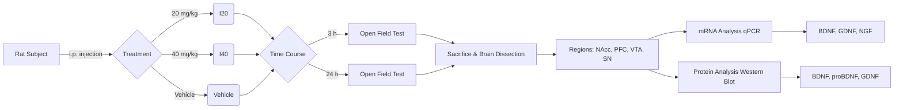

# Ibogaine Administration Modifies GDNF and BDNF Expression in Brain Regions Involved in Mesocorticolimbic and Nigral Dopaminergic Circuits

**Journal:** Frontiers in Pharmacology | Neuropharmacology
**Published:** 05 March 2019
**DOI:** 10.3389/fphar.2019.00193

**Authors:**
Soledad Marton$^{1\dagger}^{2\dagger}^1$, Ernesto Miquel$^1$, Laura Martinez-Palma$^1$, Mariana Pazos$^2$, José Pedro Prieto$^3$, Paola Rodriguez$^2$, Dalibor Sames$^4$, Gustavo Seoane$^2$, Cecilia Scorza

**Affiliations:**

1. Departamento de Histología y Embriología, Facultad de Medicina, Universidad de la República, Montevideo, Uruguay
2. Laboratorio de Síntesis Orgánica, Departamento de Química Orgánica, Facultad de Química, Universidad de la República, Montevideo, Uruguay
3. Departamento de Neurofarmacología Experimental, Instituto de Investigaciones Biológicas Clemente Estable, Montevideo, Uruguay
4. Department of Chemistry, Columbia University, New York, NY, United States

 **Correspondence:** Cecilia Scorza (cscorza@iibce.edu.uy), Patricia Cassina (pcassina@fmed.edu.uy), Ignacio Carrera (icarrera@fq.edu.uy)
 These authors have contributed equally to this work.

---

## Abstract

Ibogaine is an atypical psychedelic alkaloid, which has been subject of research due to its reported ability to attenuate drug-seeking behavior. Recent work has suggested that ibogaine effects on alcohol self-administration in rats are related to the release of Glial cell Derived Neurotrophic Factor (GDNF) in the Ventral Tegmental Area (VTA), a mesencephalic region which hosts the soma of dopaminergic neurons. Although previous reports have shown ibogaine's ability to induce GDNF expression in rat midbrain, there are no studies addressing its effect on the expression of GDNF and other neurotrophic factors (NFs) such as Brain Derived Neurotrophic Factor (BDNF) or Nerve Growth Factor (NGF) in distinct brain regions containing dopaminergic neurons.

In this work, we examined the effect of ibogaine acute administration on the expression of these NFs in the VTA, Prefrontal Cortex (PFC), Nucleus Accumbens (NAcc) and the Substantia Nigra (SN). Rats were i.p. treated with ibogaine 20 mg/kg (I₂₀), 40 mg/kg (I₄₀) or vehicle, and NFs expression was analyzed after 3 and 24 h. At 24 h an increase of the expression of the NFs transcripts was observed in a site and dose dependent manner. Only for , GDNF was selectively upregulated in the VTA and SN. Both doses elicited a large increase in the expression of BDNF transcripts in the NAcc, SN and PFC, while in the VTA a significant effect was found only for . Finally, NGF mRNA was upregulated in all regions after , while  showed a selective upregulation in PFC and VTA.

Regarding protein levels, an increase of GDNF was observed in the VTA only for  but no significant increase for BDNF was found in all the studied areas. Interestingly, an increase of proBDNF was detected in the NAcc for both doses. These results show for the first time a selective increase of GDNF specifically in the VTA for  but not for  after 24 h of administration, which agrees with the effective dose found in previous self-administration studies in rodents. Further research is needed to understand the contribution of these changes to ibogaine's ability to attenuate drug-seeking behavior.

**Keywords:** ibogaine, neurotrophic factors, GDNF, BDNF, NGF

---

## Introduction

Ibogaine is the main indole alkaloid isolated from the root bark of the African shrub *Tabernanthe iboga* (Lavaud and Massiot, 2017). Traditionally used in African religious ceremonies as a psychedelic, ibogaine became a subject of interest to the scientific community due to its reported ability to reduce craving and self-administration of several drugs of abuse in humans (Brown, 2013). These effects found mainly in uncontrolled clinical trials and observational studies, have been reported to be long-lasting enduring weeks to months after a single administration of large doses of ibogaine (Schenberg et al., 2014; Brown and Alper, 2017; Noller et al., 2017; Corkery, 2018; Malcolm et al., 2018; Mash et al., 2018).

In animal models for drug dependence, ibogaine also reduces the self-administration of morphine and heroin (Glick et al., 1991, 1994; Dworkin et al., 1995), cocaine (Cappendijk and Dzoljic, 1993; Glick et al., 1994), and alcohol (He et al., 2005), with long-lasting effects that persists beyond pharmacokinetic elimination of the drug (Alper, 2001). In addition, ibogaine administration to animals also reduces naloxone or naltrexone precipitated-withdrawal signs (Dzoljic et al., 1988; Glick et al., 1992; Leal et al., 2003).

Although a vast amount of research has been done regarding the pharmacology of ibogaine, the mechanism of action of its ability to attenuate drug-seeking behavior remains unresolved (Alper, 2001; Maciulaitis et al., 2008; Brown, 2013). Ibogaine binds to numerous central nervous system (CNS) targets at the micromolar range such as: nicotinic acetylcholine receptors ( and ) (Fryer and Lukas, 1999; Arias et al., 2010, 2015), N-methyl-D-aspartate (NMDA) (Mash et al., 1995b), kappa and mu opioid (Antonio et al., 2013; Maillet et al., 2015),  and  receptors (Glick et al., 2000) and the dopamine and serotonin transporters (Mash et al., 1995a; Glick et al., 2001; Asjad et al., 2017). However, these ibogaine-receptor interactions do not seem to account for the long-lasting effects of ibogaine found in rodents which are described to last for 48 to 72 h after ibogaine administration (Glick et al., 1991, 1994; Cappendijk and Dzoljic, 1993). In rodents, ibogaine has a short half-life of 1–2 h raising the hypothesis that its longer lived active metabolite, noribogaine, could be responsible for the enduring effects elicited by ibogaine. Both, the parent drug and its metabolite have differences in their binding profiles and affinities to the abovementioned CNS receptors (Staley et al., 1996). However, no appreciable amounts of noribogaine have been found in rodents' brain tissue 19 h after ibogaine intraperitoneal (i.p.) administration (Pearl et al., 1997), and only approximately 5% of the noribogaine  was detected in serum 24 h after the same treatment (Baumann et al., 2001b).

A few years ago, a novel hypothesis linking ibogaine's attenuation of alcohol self-administration in rodents to its ability to modulate the expression of Glial Cell Derived Neurotrophic Factor (GDNF) in the brain was proposed. It was shown that a single ibogaine i.p. administration (40 mg/kg) increased the expression of GDNF in the midbrain of rats and mice for up to 24 h (He et al., 2005). In addition, microinjection of ibogaine into the Ventral Tegmental Area (VTA), produced a long-lasting reduction of ethanol self-administration, a response that was attenuated by the intra-VTA delivery of anti-GDNF neutralizing antibodies. These results suggested that ibogaine mediates its effects against ethanol consumption by increasing GDNF content in the VTA (He et al., 2005). Accordingly, another study from the same research group showed that the intra-VTA infusion of noribogaine induced a long-lasting decrease in ethanol self-administration (Carnicella et al., 2010). Further, ibogaine-derived synthetic derivatives were recently shown to induce the release of GDNF *in vitro*, in established cell line systems (Gassaway et al., 2016).

These observations formed the basis for a new rationale to explain the long-lasting effects of ibogaine; i.e., the induction of GDNF by ibogaine/noribogaine may activate an autocrine loop, leading a long-term synthesis and release of GDNF (that persists beyond elimination of both substances). This mechanism may reverse the biochemical adaptations to chronic exposure to drugs of abuse in the reward system (He and Ron, 2006).

Neurotrophic Factors (NFs), such as GDNF and BDNF (Brain Derived Neurotrophic Factor) are small proteins that promote the growth, differentiation, synaptogenesis, and survival of neurons. Their expression in the nervous tissue is relatively high during the development of the CNS, where substantial growth, differentiation and remodeling of the nervous system occur (Barde, 1990; Lu and Figurov, 1997). More recently, it has been discovered that NFs play important roles in the adult brain where they modulate maintenance, protection, repair and plasticity of the nervous tissue (Reichardt, 2006; Schmidt and Duman, 2007). Furthermore, accumulating evidence has suggested that GDNF and BDNF mediate neuronal remodeling processes that occur during the development of substance use disorders (SUDs) (Bolaños and Nestler, 2004; McGough et al., 2004; Angelucci et al., 2007; Jeanblanc et al., 2009; Bie et al., 2012). Particularly, the role of GDNF and BDNF in the neuroadaptations in the mesocorticolimbic dopamine system (Prefrontal Cortex, PFC- VTA-Nucleus Accumbens, NAcc pathway) induced by repeated exposure to drugs of abuse has been extensively studied, including the impact of manipulating NFs levels on drug-seeking behavior in animal models (Russo et al., 2009; Ghitza et al., 2010; Koskela et al., 2017).

It has been shown that the administration of BDNF or GDNF can either promote or inhibit drug-taking behaviors depending mainly on the brain site of administration, along with other several factors such as the drug type, the addiction phase (initiation, maintenance, abstinence or relapse), the time interval between site-specific NFs injections and the related behavioral assessments (Ghitza et al., 2010). For example, BDNF infusion into the NAcc increases cocaine-seeking behavior (Graham et al., 2007), while BDNF infusion into the medial pre-frontal cortex (mPFC) suppresses it (Berglind et al., 2007). Additionally, infusion of BDNF into the dorsolateral striatum decreases ethanol self-administration in rats (Jeanblanc et al., 2009).

Given the importance and the site-specificity of the elicited responses, we decided to analyze the effect of a single administration of ibogaine on the expression of GDNF and BDNF (mRNA transcripts and protein content) at two time points in those brain areas which define the mesocorticolimbic dopamine system such as VTA, PFC and NAcc (Figure 1). As the Substantia Nigra (SN) is a major nucleus of dopaminergic neurons important in the basal ganglia functioning, the expression of these NFs in this region was also studied. In order to examine the impact of ibogaine administration on the expression of other relevant NFs (which impact on drug-seeking behaviors has been much less studied) the Nerve Growth Factor (NGF) transcript content was also analyzed in the abovementioned brain areas.

Selected time points were chosen considering previous pharmacokinetics reports in rats using i.p. administration (Pearl et al., 1997; Zubaran et al., 1999; Baumann et al., 2001a,b). In this manner, we chose to study NFs expression/content in the selected brain areas at 3 h, where ibogaine and noribogaine are present in relevant concentrations (Baumann et al., 2001b), and at 24 h where ibogaine is no longer detected and no significant amounts of noribogaine would be present in the brain (Pearl et al., 1997). In this manner, is expected that the observed effects found at 24 h, would be due to long lasting mechanisms elicited by the drug which remain after it has been cleared from the brain, but not from the acute effects of ibogaine/noribogaine. Finally, a behavioral study recording the locomotor activity of the control and drug-treated animals was performed using an open field test for each time point.

---

### Figure 1: Experimental Design

*Visual Representation of the experimental workflow described in the paper.*

**Figure 1 Legend:** Schematic showing the experimental design of this work. Experimental groups of animals were i.p. treated with ibogaine  20 mg/kg (I₂₀),  40 mg/kg (I₄₀) or vehicle. After 3 and 24 h, locomotion of control and treated animals was recorded using an open field test. Afterward, animals were sacrificed, and selected brain regions were dissected. mRNA levels for BDNF, GDNF, and NGF were determined by qPCR. Western Blot was used to determine BDNF, proBDNF, and GDNF protein content. PFC = Prefrontal Cortex, NAcc = Nucleus Accumbens, VTA = Ventral Tegmental Area, and SN = Substantia Nigra, GDNF = Glial Cell Derived Neurotrophic Factor, BDNF = Brain Derived Neurotrophic Factor, NGF = Nerve Growth Factor.

---

## Materials and Methods

### Ibogaine HCl

The ibogaine used in this study was chemically synthesized using voacangine as starting material, which was extracted from the root bark of *Voacanga africana* (purchased from CAPE LABS) using a modification of a previously described procedure (Jenks, 2002).

* **Extraction:** 100g of grounded root bark was extracted with 1% aqueous HCl (6×500 mL). Extracts were basified with concentrated  (pH 10–11). Precipitate was dried, dissolved in acetone, filtered, and evaporated to obtain 3.5–4.0 g of total alkaloid extract.
* **Purification:** Column chromatography (, Hex:EtOAc:, 90:10:0.01) yielded 1g of pure voacangine.
* **Synthesis:** Voacangine was decarboxylated in EtOH (0.45 M) with KOH (5 equivalents) under reflux. After solvent removal, residue was dissolved in 6% aqueous HCl (, pH 1), refluxed for 5 min, then basified with 50% NaOH (pH 10–11).
* **Isolation:** Ibogaine precipitated as a white solid, was extracted with EtOAc, dried over , and purified via column chromatography (, hexanes:ethyl acetate  ammonium hydroxide).
* **Yield & Purity:** Ibogaine free base (86% yield) was crystallized from EtOH and converted to hydrochloride salt using diethyl ether saturated with HCl(g). Purity was 98.3% (GC-MS).
* **Preparation:** Ibogaine-HCl was dissolved in warm, nitrogen-degassed saline for injection.

### Experimental Animals

Thirty-six male Wistar adult rats (270–300 g) were assigned to the following groups ( per group):

* Vehicle group at 3 and 24 h
* Ibogaine 20 (20 mg/kg) group at 3 and 24 h
* Ibogaine 40 (40 mg/kg) group at 3 and 24 h

Animals were housed 4–5 per cage, maintained on a 12-h light/dark cycle (lights on 07:00 h) with food and water *ad libitum*. All procedures complied with National Animal Care Law (#18611), the "Guide to the care and use of laboratory animals" (8th ed, 2010), and were approved by the local Institutional Animal Care Committee (IIBCE, Protocol 007/05/2014).

### Behavioral Analysis

* **Apparatus:** Open field (OF) square area (45 cm wide×45 cm long×40 cm high) with transparent walls, indirectly illuminated (35 luxes).
* **Procedure:** Rats (not habituated) were recorded for novelty-induced motor activity for 30 min, starting 3 and 24 h after administration.
* **Tracking:** Total distance traveled (m) was measured using Ethovision XT 12.0 software.
* **Observation:** Serotonergic syndrome-related behaviors (tremor, flat body posture, forepaw treading) were assessed every 5 min by a trained investigator.
* **Conditions:** Experiments performed between 9 AM and 3 PM.

### Ex vivo Studies: Brain Dissection

Animals were sacrificed by decapitation 3 or 24 h after injection. Brains were chilled in ice-cold saline. The following areas were dissected according to Paxinos and Watson (2005) and stored at :

* Nucleus Accumbens (NAcc, shell and core)
* Prefrontal Cortex (PFC, including mPFC)
* Substantia Nigra (SN, pars compacta and pars reticulata)
* Ventral Tegmental Area (VTA)

### Semiquantitative qPCR

* **RNA Extraction:** Trizol reagent (Thermo Fisher Scientific), chloroform extraction, isopropanol precipitation. DNA eliminated with DNase free Kit.
* **Reverse Transcription:** 500 ng total RNA transcibed using 200 U M-MLV-reverse transcriptase.
* **PCR:** 25 ng cDNA in Biotools Quantimix Easy master mix. Triplicates performed using Rotor-Gene 6000 System.
* **Primers:**
* **GAPDH:** F: 5'-CAC TGA GCA TCT CCC TCA CAA-3', R: 5'-TGG TAT TCG AGA GAA GGG AGG-3'
* **BDNF:** F: 5'-GAG GGG TAG ATT TCT GTT TGT T-3', R: 5'-TTG CCT TAA TTT TTA TTC GTT T-3'
* **GDNF:** F: 5'-AAA TCG GGG GTG CGT CTT AAC T-3', R: 5'-AAC ATG GGC CTA CCT TGT C-3'
* **NGF:** F: 5'-AAG TTA TCC CAG CCA AAC TA-3', R: 5'-ATG TCA GTG TTG GGA GTA GG-3'

* **Analysis:**  method using vehicle as negative control and GAPDH as reference.

### Western Blot Analysis

* **Lysis:** Sonicated in buffer (50 mM NaCl, 50 mM HEPES, 2 mM sodium orthovanadate, 1% Triton X-100, SigmaFAST Protease inhibitor).
* **Separation:** 12% SDS-PAGE, transferred to nitrocellulose.
* **Antibodies:**
* Primary: GDNF (1:500, Abcam), BDNF (1:400, Promega), proBDNF (1:500, Invitrogen), alpha-tubulin (1:3000, Abcam).
* Secondary: IRDye conjugated antibodies (LI-COR Biosciences).

* **Detection:** Odyssey system and Image Studio software.

### Data Analysis

GraphPad Prism 5 was used. Data presented as mean ± SEM.

* **qPCR/Western Blot:** One-way ANOVA followed by Tukey’s Multiple Comparison Test (P<0.05).
* **Motor Activity:** Two-way ANOVA for repeated measures followed by Newman-Keuls post hoc and Unpaired t-test.

---

## Results

### Behavioral Effect (Locomotor Activity)

**Figure 2 Summary:**

* **3 Hours:**  was not effective to induce any behavioral alterations. Locomotion was similar to controls.
* **24 Hours:**  elicited a significant reduction in animal locomotion (Total distance moved: Vehicle  vs , ).
* **Observations:** No abnormal behaviors (serotonergic syndrome) were present at 3 or 24 h.

### qPCR Quantification of NFs mRNA

*(Summarized from Figures 3, 4, and 5)*

**Table 1: Changes in mRNA Expression (Fold Change vs Control)**

| Neurotrophic Factor | Time Point | Brain Region | Dose:  (20 mg/kg) | Dose:  (40 mg/kg) |
| --- | --- | --- | --- | --- |
| **GDNF** | 3 h | All Regions | No change | No change |
|  | **24 h** | **VTA** | No change | **Up (12-fold)*** |
|  |  | **SN** | No change | **Up (6-fold)*** |
|  |  | PFC | No change | No change |
|  |  | NAcc | No change | No change |
|  |  |  |  |  |
| **BDNF** | **3 h** | **PFC** | **Down (1.7-fold)** | **Down (2-fold)** |
|  |  | Other Regions | No change | No change |
|  | **24 h** | **NAcc** | **Up (220-fold)** | **Up (340-fold)** |
|  |  | **PFC** | **Up (55-fold)** | **Up (107-fold)** |
|  |  | **VTA** | No change | **Up (43-fold)** |
|  |  | **SN** | No change | **Up (21-fold)** |
|  |  |  |  |  |
| **NGF** | 3 h | All Regions | No change | No change |
|  | **24 h** | **PFC** | **Up (7-fold)** | **Up (14-fold)** |
|  |  | **NAcc** | No change | **Up (15-fold)** |
|  |  | **VTA** | **Up (5-fold)** | **Up (11-fold)** |
|  |  | **SN** | No change | **Up (4-fold)** |

*Note: Bold "Up" or "Down" indicates statistically significant changes ( or better).*

### GDNF, BDNF and proBDNF Protein Content (Western Blot)

*(Summarized from Figure 6, taken at 24 hours)*

**Table 2: Changes in Protein Content at 24 h**

| Protein | Brain Region |  Effect |  Effect |
| --- | --- | --- | --- |
| **Mature GDNF** | **VTA** | No change | **Increased (2-fold)** |
|  | Other Regions | No change | No change |
| **Mature BDNF** | All Regions | No change | No change |
| **proBDNF** | **NAcc** | **Increased (2.7-fold)** | **Increased (2.8-fold)** |
|  | Other Regions | No change | No change |

---

## Discussion

In the present study, we have demonstrated that ibogaine administration simultaneously alters the transcripts levels of GDNF and BDNF in a dose and time-dependent manner. Additionally, NGF expression was also modified.

**Key Findings & Interpretations:**

1. **Locomotor Activity:**  reduced novelty-related motor activity at 24 h. This might be related to the neurochemical imbalance in the basal ganglia output (SN changes) or a decrease in overall motivation, though no serotonin syndrome behaviors persisted.
2. **GDNF Upregulation in VTA:**
* At 3 h, no GDNF changes were found.
* At 24 h,  selectively increased GDNF mRNA and protein in the VTA.
* This confirms VTA as the key region for GDNF upregulation, supporting the hypothesis that this mechanism underlies ibogaine's anti-addictive effects (He et al., 2005). The lack of effect with  aligns with its lack of efficacy in self-administration studies.

3. **BDNF Expression Dynamic:**
* **3 h:** Downregulation in PFC (potentially due to corticosterone release).
* **24 h:** Massive upregulation of mRNA in all regions, especially NAcc and PFC.
* **Protein Levels:** Despite high mRNA, mature BDNF protein did not increase. However, **proBDNF** increased selectively in the NAcc.
* **Implication:** proBDNF often opposes mature BDNF (via p75 receptor vs TrkB). Since BDNF in NAcc promotes cocaine seeking, an increase in proBDNF might have an opposite, beneficial impact.

4. **NGF Upregulation:** Observed at 24 h (mainly ), but less studied in addiction contexts.
5. **Mechanism:** Ibogaine/noribogaine are serotonin reuptake inhibitors. Increased serotonin transmission is known to induce BDNF and GDNF expression (iPlasticity).

---

## Conclusion and Future Perspectives

This study demonstrates that ibogaine alters GDNF, BDNF, and NGF expression in dopaminergic brain regions.

* **VTA GDNF:** The selective increase of GDNF in the VTA by  reinforces this pathway as a primary mechanism for ibogaine's anti-addictive effects.
* **NAcc proBDNF:** The increase in proBDNF in the NAcc may be another crucial factor.
* **Safety:** Understanding these mechanisms is vital for developing safer analogs, given ibogaine's cardiac risks (QT prolongation).

---

## References

**Aloe, L., Bracci-Laudiero, L., and Tirassa, P. (1993).** The effect of chronic ethanol intake on brain NGF level and on NGF-target tissues of adult mice. *Drug Alcohol Depend.* 31, 159–167. doi: 10.1016/0376-8716(93)90068-2

**Alper, K. R. (2001).** Ibogaine: a review. *Alkaloids Chem. Biol.* 56, 1–38. doi: 10.1016/S0099-9598(01)56005-8

**Angelucci, F., Ricci, V., Pomponi, M., Conte, G., Mathe, A. A., Attilio Tonali, P., et al. (2007).** Chronic heroin and cocaine abuse is associated with decreased serum concentrations of the nerve growth factor and brain-derived neurotrophic factor. *J. Psychopharmacol.* 21, 820–825. doi: 10.1177/0269881107078491

**Antonio, T., Childers, S. R., Rothman, R. B., Dersch, C. M., King, C., Kuehne, M., et al. (2013).** Effect of Iboga alkaloids on micro-opioid receptor-coupled G protein activation. *PLoS One* 8:e77262. doi: 10.1371/journal.pone.0077262

**Arias, H. R., Rosenberg, A., Targowska-Duda, K. M., Feuerbach, D., Yuan, X. J., Jozwiak, K., et al. (2010).** Interaction of ibogaine with human alpha3beta4-nicotinic acetylcholine receptors in different conformational states. *Int. J. Biochem. Cell Biol.* 42, 1525–1535. doi: 10.1016/j.biocel.2010.05.011

**Arias, H. R., Targowska-Duda, K. M., Feuerbach, D., and Jozwiak, K. (2015).** Coronaridine congeners inhibit human alpha3beta4 nicotinic acetylcholine receptors by interacting with luminal and non-luminal sites. *Int. J. Biochem. Cell Biol.* 65, 81–90. doi: 10.1016/j.biocel.2015.05.015

**Asjad, H. M. M., Kasture, A., El-Kasaby, A., Sackel, M., Hummel, T., Freissmuth, M., et al. (2017).** Pharmacochaperoning in a Drosophila model system rescues human dopamine transporter variants associated with infantile/juvenile parkinsonism. *J. Biol. Chem.* 292, 19250–19265. doi: 10.1074/jbc.M117.797092

**Bahi, A., Boyer, F., Chandrasekar, V., and Dreyer, J. L. (2008).** Role of accumbens BDNF and TrkB in cocaine-induced psychomotor sensitization, conditioned-place preference, and reinstatement in rats. *Psychopharmacology* 199, 169–182. doi: 10.1007/s00213-008-1164-1

**Barde, Y. A. (1990).** The nerve growth factor family. *Prog. Growth Factor Res.* 2, 237–248. doi: 10.1016/0955-2235(90)90021-B

**Baumann, M. H., Pablo, J., Ali, S. F., Rothman, R. B., and Mash, D. C. (2001a).** Comparative neuropharmacology of ibogaine and its O-desmethyl metabolite, noribogaine. *Alkaloids Chem. Biol.* 56, 79–113. doi: 10.1016/S0099-9598(01)56009-5

**Baumann, M. H., Rothman, R. B., Pablo, J. P., and Mash, D. C. (2001b).** In vivo neurobiological effects of ibogaine and its O-desmethyl metabolite, 12-hydroxyibogamine (noribogaine), in rats. *J. Pharmacol. Exp. Therap.* 297, 531–539.

**Benarroch, E. E. (2015).** Brain-derived neurotrophic factor: regulation, effects, and potential clinical relevance. *Neurology* 84, 1693–1704. doi: 10.1212/WNL.0000000000001507

**Berglind, W. J., See, R. E., Fuchs, R. A., Ghee, S. M., Whitfield, T. W. Jr, Miller, S. W., et al. (2007).** A BDNF infusion into the medial prefrontal cortex suppresses cocaine seeking in rats. *Eur. J. Neurosci.* 26, 757–766. doi: 10.1111/j.1460-9568.2007.05692.x

**Bie, B., Wang, Y., Cai, Y. Q., Zhang, Z., Hou, Y. Y., and Pan, Z. Z. (2012).** Upregulation of nerve growth factor in central amygdala increases sensitivity to opioid reward. *Neuropsychopharmacology* 37, 2780–2788. doi: 10.1038/npp.2012.144

**Bolaños, C. A., and Nestler, E. J. (2004).** Neurotrophic mechanisms in drug addiction. *Neuromol. Med.* 5, 69–83. doi: 10.1385/NMM:5:1:069

**Borodinova, A. A., and Salozhin, S. V. (2016).** [Diversity of proBDNF and mBDNF functions in the central nervous system]. *Zh Vyssh Nerv Deiat Im I P Pavlova* 66, 3–23.

**Brown, T. K. (2013).** Ibogaine in the treatment of substance dependence. *Curr. Drug Abuse Rev.* 6, 3–16. doi: 10.2174/15672050113109990001

**Brown, T. K., and Alper, K. (2017).** Treatment of opioid use disorder with ibogaine: detoxification and drug use outcomes. *Am. J. Drug Alcohol Abuse* 44, 24–36. doi: 10.1080/00952990.2017.1320802

**Bulling, S., Schicker, K., Zhang, Y. W., Steinkellner, T., Stockner, T., Gruber, C. W., et al. (2012).** The mechanistic basis for noncompetitive ibogaine inhibition of serotonin and dopamine transporters. *J. Biol. Chem.* 287, 18524–18534. doi: 10.1074/jbc.M112.343681

**Burke, A. R., and Miczek, K. A. (2015).** Escalation of cocaine self-administration in adulthood after social defeat of adolescent rats: role of social experience and adaptive coping behavior. *Psychopharmacology* 232, 3067–3079. doi: 10.1007/s00213-015-3947-5

**Calabresi, P., Picconi, B., Tozzi, A., Ghiglieri, V., and Di Filippo, M. (2014).** Direct and indirect pathways of basal ganglia: a critical reappraisal. *Nat. Neurosci.* 17, 1022–1030. doi: 10.1038/nn.3743

**Cappendijk, S. L., and Dzoljic, M. R. (1993).** Inhibitory effects of ibogaine on cocaine self-administration in rats. *Eur. J. Pharmacol.* 241, 261–265. doi: 10.1016/0014-2999(93)90212-Z

**Carnicella, S., Ahmadiantehrani, S., Janak, P. H., and Ron, D. (2009).** GDNF is an endogenous negative regulator of ethanol-mediated reward and of ethanol consumption after a period of abstinence. *Alcohol. Clin. Exp. Res.* 33, 1012–1024. doi: 10.1111/j.1530-0277.2009.00922.x

**Carnicella, S., He, D. Y., Yowell, Q. V., Glick, S. D., and Ron, D. (2010).** Noribogaine, but not 18-MC, exhibits similar actions as ibogaine on GDNF expression and ethanol self-administration. *Addict. Biol.* 15, 424–433. doi: 10.1111/j.1369-1600.2010.00251.x

**Carnicella, S., Kharazia, V., Jeanblanc, J., Janak, P. H., and Ron, D. (2008).** GDNF is a fast-acting potent inhibitor of alcohol consumption and relapse. *Proc. Natl. Acad. Sci. U.S.A.* 105, 8114–8119. doi: 10.1073/pnas.0711755105

**Carnicella, S., and Ron, D. (2009).** GDNF—a potential target to treat addiction. *Pharmacol. Ther.* 122, 9–18. doi: 10.1016/j.pharmthera.2008.12.001

**Castren, E., and Antila, H. (2017).** Neuronal plasticity and neurotrophic factors in drug responses. *Mol. Psychiatry* 22, 1085–1095. doi: 10.1038/mp.2017.61

**Corkery, J. M. (2018).** Ibogaine as a treatment for substance misuse: potential benefits and practical dangers. *Prog. Brain Res.* 242, 217–257. doi: 10.1016/bs.pbr.2018.08.005

**Dauer, W., and Przedborski, S. (2003).** Parkinson's disease: mechanisms and models. *Neuron* 39, 889–909. doi: 10.1016/S0896-6273(03)00568-3

**Day, M., Wokosin, D., Plotkin, J. L., Tian, X., and Surmeier, D. J. (2008).** Differential excitability and modulation of striatal medium spiny neuron dendrites. *J. Neurosci.* 28, 11603–11614. doi: 10.1523/JNEUROSCI.1840-08.2008

**de Sousa Abreu, R., Penalva, L. O., Marcotte, E. M., and Vogel, C. (2009).** Global signatures of protein and mRNA expression levels. *Mol. Biosyst.* 5, 1512–1526. doi: 10.1039/b908315d

**Di Chiara, G., and Imperato, A. (1988).** Drugs abused by humans preferentially increase synaptic dopamine concentrations in the mesolimbic system of freely moving rats. *Proc. Natl. Acad. Sci. U.S.A.* 85, 5274–5278. doi: 10.1073/pnas.85.14.5274

**Dwivedi, Y., Rizavi, H. S., and Pandey, G. N. (2006).** Antidepressants reverse corticosterone-mediated decrease in brain-derived neurotrophic factor expression: differential regulation of specific exons by antidepressants and corticosterone. *Neuroscience* 139, 1017–1029. doi: 10.1016/j.neuroscience.2005.12.058

**Dworkin, S. I., Gleeson, S., Meloni, D., Koves, T. R., and Martin, T. J. (1995).** Effects of ibogaine on responding maintained by food, cocaine and heroin reinforcement in rats. *Psychopharmacology* 117, 257–261. doi: 10.1007/BF02246099

**Dzoljic, E. D., Kaplan, C. D., and Dzoljic, M. R. (1988).** Effect of ibogaine on naloxone-precipitated withdrawal syndrome in chronic morphine-dependent rats. *Arch. Int. Pharmacodyn. Ther.* 294, 64–70.

**Evans, S. F., Irmady, K., Ostrow, K., Kim, T., Nykjaer, A., Saftig, P., et al. (2011).** Neuronal brain-derived neurotrophic factor is synthesized in excess, with levels regulated by sortilin-mediated trafficking and lysosomal degradation. *J. Biol. Chem.* 286, 29556–29567. doi: 10.1074/jbc.M111.219675

**Fryer, J. D., and Lukas, R. J. (1999).** Noncompetitive functional inhibition at diverse, human nicotinic acetylcholine receptor subtypes by bupropion, phencyclidine, and ibogaine. *J. Pharmacol. Exp. Ther.* 288, 88–92.

**Gassaway, M. M., Jacques, T. L., Kruegel, A. C., Karpowicz, R. J. Jr, Li, X., Li, S., et al. (2016).** Deconstructing the iboga alkaloid skeleton: potentiation of FGF2-induced glial cell line-derived neurotrophic factor release by a novel compound. *ACS Chem. Biol.* 11, 77–87. doi: 10.1021/acschembio.5b00678

**Ghitza, U. E., Zhai, H., Wu, P., Airavaara, M., Shaham, Y., and Lu, L. (2010).** Role of BDNF and GDNF in drug reward and relapse: a review. *Neurosci. Biobehav. Rev.* 35, 157–171. doi: 10.1016/j.neubiorev.2009.11.009

**Glick, S. D., Kuehne, M. E., Raucci, J., Wilson, T. E., Larson, D., Keller, R. W., et al. (1994).** Effects of iboga alkaloids on morphine and cocaine self-administration in rats: relationship to tremorigenic effects and to effects on dopamine release in nucleus accumbens and striatum. *Brain Res.* 657, 14–22. doi: 10.1016/0006-8993(94)90948-2

**Glick, S. D., Maisonneuve, I. M., and Szumlinski, K. K. (2000).** 18-Methoxycoronaridine (18-MC) and ibogaine: comparison of antiaddictive efficacy, toxicity, and mechanisms of action. *Ann. N. Y. Acad. Sci.* 914, 369–386. doi: 10.1111/j.1749-6632.2000.tb05211.x

**Glick, S. D., Maisonneuve, I. M., and Szumlinski, K. K. (2001).** Mechanisms of action of ibogaine: relevance to putative therapeutic effects and development of a safer iboga alkaloid congener. *Alkaloids Chem. Biol.* 56, 39–53. doi: 10.1016/S0099-9598(01)56006-X

**Glick, S. D., Rossman, K., Rao, N. C., Maisonneuve, I. M., and Carlson, J. N. (1992).** Effects of ibogaine on acute signs of morphine withdrawal in rats: independence from tremor. *Neuropharmacology* 31, 497–500. doi: 10.1016/0028-3908(92)90089-8

**Glick, S. D., Rossman, K., Steindorf, S., Maisonneuve, I. M., and Carlson, J. N. (1991).** Effects and aftereffects of ibogaine on morphine self-administration in rats. *Eur. J. Pharmacol.* 195, 341–345. doi: 10.1016/0014-2999(91)90474-5

**Golan, M., Schreiber, G., and Avissar, S. (2011).** Antidepressants elevate GDNF expression and release from C(6) glioma cells in a beta-arrestin1-dependent, CREB interactive pathway. *Int. J. Neuropsychopharmacol.* 14, 1289–1300. doi: 10.1017/S1461145710001550

**Gonzalez, J., Prieto, J. P., Rodriguez, P., Cavelli, M., Benedetto, L., Mondino, A., et al. (2018).** Ibogaine acute administration in rats promotes wakefulness, long-lasting REM sleep suppression, and a distinctive motor profile. *Front. Pharmacol.* 9:374. doi: 10.3389/fphar.2018.00374

**Graham, D. L., Edwards, S., Bachtell, R. K., Dileone, R. J., Rios, M., and Self, D. W. (2007).** Dynamic BDNF activity in nucleus accumbens with cocaine use increases self-administration and relapse. *Nat. Neurosci.* 10, 1029–1037. doi: 10.1038/nn1929

**He, D.-Y., McGough, N. N. H., Ravindranathan, A., Jeanblanc, J., Logrip, M. L., Phamluong, K., et al. (2005).** Glial cell line-derived neurotrophic factor mediates the desirable actions of the anti-addiction drug ibogaine against alcohol consumption. *J. Neurosci.* 25, 619–628. doi: 10.1523/JNEUROSCI.3959-04.2005

**He, D.-Y., and Ron, D. (2006).** Autoregulation of glial cell line-derived neurotrophic factor expression: implications for the long-lasting actions of the anti-addiction drug, Ibogaine. *FASEB J.* 20, 2420–2422. doi: 10.1096/fj.06-6394fje

**Hisaoka, K., Nishida, A., Koda, T., Miyata, M., Zensho, H., Morinobu, S., et al. (2001).** Antidepressant drug treatments induce glial cell line-derived neurotrophic factor (GDNF) synthesis and release in rat C6 glioblastoma cells. *J. Neurochem.* 79, 25–34. doi: 10.1046/j.1471-4159.2001.00531.x

**Huang, Z., Zhong, X. M., Li, Z. Y., Feng, C. R., Pan, A. J., and Mao, Q. Q. (2011).** Curcumin reverses corticosterone-induced depressive-like behavior and decrease in brain BDNF levels in rats. *Neurosci. Lett.* 493, 145–148. doi: 10.1016/j.neulet.2011.02.030

**Jacobs, M. T., Zhang, Y. W., Campbell, S. D., and Rudnick, G. (2007).** Ibogaine, a noncompetitive inhibitor of serotonin transport, acts by stabilizing the cytoplasm-facing state of the transporter. *J. Biol. Chem.* 282, 29441–29447. doi: 10.1074/jbc.M704456200

**Jeanblanc, J., He, D. Y., Carnicella, S., Kharazia, V., Janak, P. H., and Ron, D. (2009).** Endogenous BDNF in the dorsolateral striatum gates alcohol drinking. *J. Neurosci.* 29, 13494–13502. doi: 10.1523/JNEUROSCI.2243-09.2009

**Jenks, C. W. (2002).** Extraction studies of *Tabernanthe iboga* and *Voacanga africana*. *Nat. Prod. Lett.* 16, 71–76. doi: 10.1080/10575630290014881

**Kalivas, P. W., and Volkow, N. D. (2005).** The neural basis of addiction: a pathology of motivation and choice. *Am. J. Psychiatry* 162, 1403–1413. doi: 10.1176/appi.ajp.162.8.1403

**Koenig, X., and Hilber, K. (2015).** The anti-addiction drug ibogaine and the heart: a delicate relation. *Molecules* 20, 2208–2228. doi: 10.3390/molecules20022208

**Koob, G. F., and Bloom, F. E. (1988).** Cellular and molecular mechanisms of drug dependence. *Science* 242, 715–723. doi: 10.1126/science.2903550

**Koskela, M., Bäck, S., Võikar, V., Richie, C. T., Domanskyi, A., Harvey, B. K., et al. (2017).** Update of neurotrophic factors in neurobiology of addiction and future directions. *Neurobiol. Dis.* 97(Pt B), 189–200. doi: 10.1016/j.nbd.2016.05.010

**Krishnan, V., Han, M. H., Graham, D. L., Berton, O., Renthal, W., Russo, S. J., et al. (2007).** Molecular adaptations underlying susceptibility and resistance to social defeat in brain reward regions. *Cell* 131, 391–404. doi: 10.1016/j.cell.2007.09.018

**Lavaud, C., and Massiot, G. (2017).** The iboga alkaloids. *Prog. Chem. Org. Nat. Prod.* 105, 89–136. doi: 10.1007/978-3-319-49712-9_2

**Leal, M. B., Michelin, K., Souza, D. O., and Elisabetsky, E. (2003).** Ibogaine attenuation of morphine withdrawal in mice: role of glutamate N-methyl-D-aspartate receptors. *Prog. Neuropsychopharmacol. Biol. Psychiatry* 27, 781–785. doi: 10.1016/S0278-5846(03)00109-X

**Li, J. Y., Liu, J., Manaph, N. P. A., Bobrovskaya, L., and Zhou, X. F. (2017).** ProBDNF inhibits proliferation, migration and differentiation of mouse neural stem cells. *Brain Res.* 1668, 46–55. doi: 10.1016/j.brainres.2017.05.013

**Li, L., Cao, J., Zhang, S., Wang, C., Wang, J., Song, G., et al. (2014).** NCAM signaling mediates the effects of GDNF on chronic morphine-induced neuroadaptations. *J. Mol. Neurosci.* 53, 580–589. doi: 10.1007/s12031-013-0224-0

**Lu, B., and Figurov, A. (1997).** Role of neurotrophins in synapse development and plasticity. *Rev. Neurosci.* 8, 1–12. doi: 10.1515/REVNEURO.1997.8.1.1

**Lu, B., Pang, P. T., and Woo, N. H. (2005).** The yin and yang of neurotrophin action. *Nat. Rev. Neurosci.* 6, 603–614. doi: 10.1038/nrn1726

**Ly, C., Greb, A. C., Cameron, L. P., Wong, J. M., Barragan, E. V., Wilson, P. C., et al. (2018).** Psychedelics promote structural and functional neural plasticity. *Cell Rep.* 23, 3170–3182. doi: 10.1016/j.celrep.2018.05.022

**Maciulaitis, R., Kontrimaviciute, V., Bressolle, F. M., and Briedis, V. (2008).** Ibogaine, an anti-addictive drug: pharmacology and time to go further in development. A narrative review. *Hum. Exp. Toxicol.* 27, 181–194. doi: 10.1177/0960327107087802

**Maier, T., Guell, M., and Serrano, L. (2009).** Correlation of mRNA and protein in complex biological samples. *FEBS Lett.* 583, 3966–3973. doi: 10.1016/j.febslet.2009.10.036

**Maillet, E. L., Milon, N., Heghinian, M. D., Fishback, J., Schurer, S. C., Garamszegi, N., et al. (2015).** Noribogaine is a G-protein biased kappa-opioid receptor agonist. *Neuropharmacology* 99, 675–688. doi: 10.1016/j.neuropharm.2015.08.032

**Malcolm, B. J., Polanco, M., and Barsuglia, J. P. (2018).** Changes in withdrawal and craving scores in participants undergoing opioid detoxification utilizing ibogaine. *J. Psychoactive Drugs* 50, 256–265. doi: 10.1080/02791072.2018.1447175

**Mash, D. C., Duque, L., Page, B., and Allen-Ferdinand, K. (2018).** Ibogaine detoxification transitions opioid and cocaine abusers between dependence and abstinence: clinical observations and treatment outcomes. *Front. Pharmacol.* 9:529. doi: 10.3389/fphar.2018.00529

**Mash, D. C., Staley, J. K., Baumann, M. H., Rothman, R. B., and Hearn, W. L. (1995a).** Identification of a primary metabolite of ibogaine that targets serotonin transporters and elevates serotonin. *Life Sci.* 57, 145–150.

**Mash, D. C., Staley, J. K., Pablo, J. P., Holohean, A. M., Hackman, J. C., and Davidoff, R. A. (1995b).** Properties of ibogaine and its principal metabolite (12-hydroxyibogamine) at the MK-801 binding site of the NMDA receptor complex. *Neurosci. Lett.* 192, 53–56.

**McGough, N. N., He, D. Y., Logrip, M. L., Jeanblanc, J., Phamluong, K., Luong, K., et al. (2004).** RACK1 and brain-derived neurotrophic factor: a homeostatic pathway that regulates alcohol addiction. *J. Neurosci.* 24, 10542–10552. doi: 10.1523/JNEUROSCI.3714-04.2004

**Meikle, M. N., Prieto, J. P., Urbanavicius, J., Lopez, X., Abin-Carriquiry, J. A., Prunell, G., et al. (2013).** Anti-aggressive effect elicited by coca-paste in isolation-induced aggression of male rats: influence of accumbal dopamine and cortical serotonin. *Pharmacol. Biochem. Behav.* 110, 216–223. doi: 10.1016/j.pbb.2013.07.010

**Mercier, G., Lennon, A. M., Renouf, B., Dessouroux, A., Ramauge, M., Courtin, F., et al. (2004).** MAP kinase activation by fluoxetine and its relation to gene expression in cultured rat astrocytes. *J. Mol. Neurosci.* 24, 207–216. doi: 10.1385/JMN:24:2:207

**Messer, C. J., Eisch, A. J., Carlezon, W. A., Whisler, K., Shen, L., Wolf, D. H., et al. (2000).** Role for GDNF in biochemical and behavioral adaptations to drugs of abuse. *Neuron* 26, 247–257. doi: 10.1016/S0896-6273(00)81154-X

**Noller, G. E., Frampton, C. M., and Yazar-Klosinski, B. (2017).** Ibogaine treatment outcomes for opioid dependence from a twelve-month follow-up observational study. *Am. J. Drug Alcohol Abuse* 44, 37–46. doi: 10.1080/00952990.2017.1310218

**Paxinos, G., and Watson, C. (2005).** *The Rat Brain in Stereotaxic Coordinates*. Sydney, NSW: Academic Press.

**Pearl, S. M., Hough, L. B., Boyd, D. L., and Glick, S. D. (1997).** Sex differences in ibogaine antagonism of morphine-induced locomotor activity and in ibogaine brain levels and metabolism. *Pharmacol. Biochem. Behav.* 57, 809–815. doi: 10.1016/S0091-3057(96)00383-8

**Popova, N. K., Ilchibaeva, T. V., and Naumenko, V. S. (2017).** Neurotrophic factors (BDNF and GDNF) and the serotonergic system of the brain. *Biochemistry* 82, 308–317. doi: 10.1134/S0006297917030099

**Rantamaki, T., Hendolin, P., Kankaanpaa, A., Mijatovic, J., Piepponen, P., Domenici, E., et al. (2007).** Pharmacologically diverse antidepressants rapidly activate brain-derived neurotrophic factor receptor TrkB and induce phospholipase-Cgamma signaling pathways in mouse brain. *Neuropsychopharmacology* 32, 2152–2162. doi: 10.1038/sj.npp.1301345

**Reichardt, L. F. (2006).** Neurotrophin-regulated signalling pathways. *Philos. Trans. R. Soc. Lond. B. Biol. Sci.* 361, 1545–1564. doi: 10.1098/rstb.2006.1894

**Russo, S. J., Mazei-Robison, M. S., Ables, J. L., and Nestler, E. J. (2009).** Neurotrophic factors and structural plasticity in addiction. *Neuropharmacology* 56(Suppl. 1), 73–82. doi: 10.1016/j.neuropharm.2008.06.059

**Schenberg, E. E., De Castro Comis, M. A., Chaves, B. R., and Da Silveira, D. X. (2014).** Treating drug dependence with the aid of ibogaine: a retrospective study. *J. Psychopharmacol.* 28, 993–1000. doi: 10.1177/0269881114552713

**Schmidt, H. D., and Duman, R. S. (2007).** The role of neurotrophic factors in adult hippocampal neurogenesis, antidepressant treatments and animal models of depressive-like behavior. *Behav. Pharmacol.* 18, 391–418. doi: 10.1097/FBP.0b013e3282ee2aa8

**Scorza, M. C., Carrau, C., Silveira, R., Zapata-Torres, G., Cassels, B. K., and Reyes-Parada, M. (1997).** Monoamine oxidase inhibitory properties of some methoxylated and alkylthio amphetamine derivatives: structure-activity relationships. *Biochem. Pharmacol.* 54, 1361–1369. doi: 10.1016/S0006-2952(97)00405-X

**Shadfar, S., Kim, Y. G., Katila, N., Neupane, S., Ojha, U., Bhurtel, S., et al. (2018).** Neuroprotective effects of antidepressants via upregulation of neurotrophic factors in the MPTP model of Parkinson's disease. *Mol. Neurobiol.* 55, 554–566. doi: 10.1007/s12035-016-0342-0

**Staley, J. K., Ouyang, Q., Pablo, J., Hearn, W. L., Flynn, D. D., Rothman, R. B., et al. (1996).** Pharmacological screen for activities of 12-hydroxyibogamine: a primary metabolite of the indole alkaloid ibogaine. *Psychopharmacology* 127, 10–18. doi: 10.1007/BF02805969

**Sun, Y., Lim, Y., Li, F., Liu, S., Lu, J. J., Haberberger, R., et al. (2012).** ProBDNF collapses neurite outgrowth of primary neurons by activating RhoA. *PLoS One* 7:e35883. doi: 10.1371/journal.pone.0035883

**Teng, H. K., Teng, K. K., Lee, R., Wright, S., Tevar, S., Almeida, R. D., et al. (2005).** ProBDNF induces neuronal apoptosis via activation of a receptor complex of p75NTR and sortilin. *J. Neurosci.* 25, 5455–5463. doi: 10.1523/JNEUROSCI.5123-04.2005

**Tsuchioka, M., Takebayashi, M., Hisaoka, K., Maeda, N., and Nakata, Y. (2008).** Serotonin (5-HT) induces glial cell line-derived neurotrophic factor (GDNF) mRNA expression via the transactivation of fibroblast growth factor receptor 2 (FGFR2) in rat C6 glioma cells. *J. Neurochem.* 106, 244–257. doi: 10.1111/j.1471-4159.2008.05357.x

**Wei, D., Maisonneuve, I. M., Kuehne, M. E., and Glick, S. D. (1998).** Acute iboga alkaloid effects on extracellular serotonin (5-HT) levels in nucleus accumbens and striatum in rats. *Brain Res.* 800, 260–268. doi: 10.1016/S0006-8993(98)00527-7

**Wells, G. B., Lopez, M. C., and Tanaka, J. C. (1999).** The effects of ibogaine on dopamine and serotonin transport in rat brain synaptosomes. *Brain Res. Bull.* 48, 641–647. doi: 10.1016/S0361-9230(99)00053-2

**Woo, N. H., Teng, H. K., Siao, C. J., Chiaruttini, C., Pang, P. T., Milner, T. A., et al. (2005).** Activation of p75NTR by proBDNF facilitates hippocampal long-term depression. *Nat. Neurosci.* 8, 1069–1077. doi: 10.1038/nn1510

**Xu, Z. Q., Sun, Y., Li, H. Y., Lim, Y., Zhong, J. H., and Zhou, X. F. (2011).** Endogenous proBDNF is a negative regulator of migration of cerebellar granule cells in neonatal mice. *Eur. J. Neurosci.* 33, 1376–1384. doi: 10.1111/j.1460-9568.2011.07635.x

**Yang, J. W., Ma, W., Yang, Y. L., Wang, X. B., Li, X. T., Wang, T. T., et al. (2017).** Region-specific expression of precursor and mature brain-derived neurotrophic factors after chronic alcohol exposure. *Am. J. Drug Alcohol Abuse* 43, 602–608. doi: 10.1080/00952990.2016.1263642

**Zubaran, C., Shoaib, M., Stolerman, I. P., Pablo, J., and Mash, D. C. (1999).** Noribogaine generalization to the ibogaine stimulus: correlation with noribogaine concentration in rat brain. *Neuropsychopharmacology* 21, 119–126. doi: 10.1016/S0893-133X(99)00003-2

---

## See Also

**Parent hub:** [[ORANGE_Mechanisms_Hub]]

- [[2006/He2006_Ibogaine_and_GDNF]] — Foundational GDNF paper this dual-pathway study extends
- [[2015/Gassaway2015_Iboga_Alkaloid_Skeleton_GDNF_Release]] — Structure-activity for GDNF release complementing neurotrophic mechanism
- [[2024/Govender2024_Ibogaine_Following_Repeated_Morphine_Upregulates_Myelination]] — Downstream myelination effects of neurotrophic signalling
- [[2001/Baumann2001_Neurobiological_Effects_Noribogaine]] — Noribogaine neurobiological profile supporting metabolite role
- [[2023/Boukandou2023_Mechanisms_Involved_Neuroprotection_Neurotoxicity_Iboga_Alkaloids]] — Neuroprotection/neurotoxicity balance including BDNF

