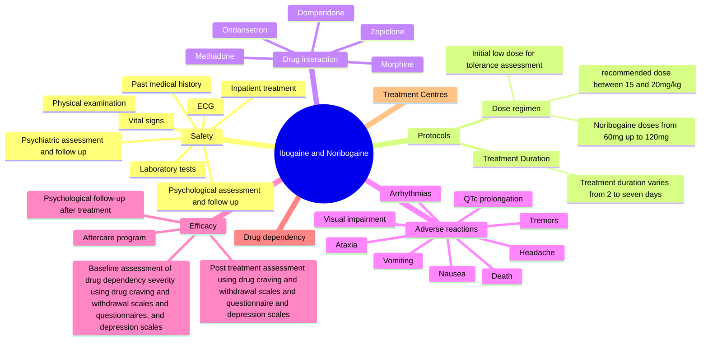

# Ibogaine & Noribogaine Safety & Efficacy Review (Canessa, 2020)

**University of Hertfordshire**
**Ibogaine and Noribogaine in the Treatment of Drug Dependency: A State of the Art Review about Safety and Efficacy**

**Carlos Canessa**
**17060987**

A dissertation submitted to the University of Hertfordshire in partial fulfilment of the requirements for the degree of MSc in **Physician Associate Studies**, **June 2020**.

---

## Safety and Efficacy of Ibogaine and Noribogaine

### Declaration

This dissertation assignment describes research conducted in the University of Hertfordshire between February and June 2020 under the supervision of Mr John Corkery.

I certify that the research described is original and that any parts of the work that have been conducted by collaboration are clearly indicated. I also certify that I have written all the text herein and have clearly indicated by suitable citation any part of this dissertation that has already appeared in publication.

I will not initiate any discussions with parties external to the University of Hertfordshire regarding any activities (such as connected with this research project without the prior written and express approval of my project supervisor and/or project module lead. Such activities include, but are not limited to: soliciting publishers of journals or books to publish the project report or paper(s)/chapter(s)/articles based on it; giving poster or oral presentations, giving key note or invited speeches, media interviews; advertising the projects or research outputs on social or other media; etc.

**Signature:** Carlos Canessa
**Date:** 28/06/2020

### Acknowledgements

I would like to thank my supervisor John Corkery, who has been exceptionally supportive, helping me to find my way through this academic journey. Also my wife who has given me strength to carry on and pursue my dreams.

---

## Ibogaine and Noribogaine in the Treatment of Drug Dependency: A State of the Art Review about Safety and Efficacy

### Structured Abstract

**Background**
Tabernanthe iboga roots contain a naturally-occurring psychoactive alkaloid known as ibogaine. Indigenous peoples from West Africa have been using ibogaine for centuries in initiatory rituals and ceremonies. Anecdotal reports suggest that ibogaine and its active metabolite noribogaine can treat drug dependency reducing withdrawal symptoms, drug craving and possibly resetting drug addiction pathways in the brain to a status previous to the drug addiction. The present report aims to produce updated information in respect of safety, efficacy, pre- and post-treatment protocols, adverse reactions, and optimal therapeutic dose using ibogaine and noribogaine in the treatment of drug dependency.

**Methods**
The present research originated a 'State of the Art' review. Papers published up to 2017 were included from broad searches on Medline, Embase and Google Scholar databases, following an extensive search strategy and a pre-determined collection of inclusion and exclusion criteria for study selection. Search terms included 'ibogaine', 'noribogaine', 'opioid dependency', 'cocaine dependency', 'alcohol dependency', 'clinical trial', 'safety', 'efficacy'. Internet search was also performed to produce up-to-date information about protocols used by drug dependency treatment centres. All the searches were performed between 04th February and  of March 2020. Data were analysed using IBM SPSS v26 for descriptive statistics and thematic approach using mind map for qualitative analysis.

**Results**
Forty studies were identified, of which six met the pre-established criteria. Four studies were open label research with ibogaine performed in clinical setting, two studies were double blind controlled placebo, one with ibogaine and one with noribogaine. All selected studies reported safety protocols for administration of ibogaine or noribogaine. One death was reported related to cardiac arrhythmia after the ingestion of ibogaine. All participants reported a decrease in drug craving and withdrawal symptoms. Statistically the number of male participants were superior to females, accounting for 74% against 15.5%, 10.5% of the participants were not gender assigned. The need to keep the participants as inpatients was noted as recurrent in the thematic analysis.

**Discussion and Conclusions**
Ibogaine or noribogaine treatment in a professional medical setting was demonstrated to be safe and effective. Low to medium doses of ibogaine appear non-neurotoxic, therefore safe to be used under medical supervision. Ibogaine poses a threat to big drug companies as it could be a cheaper and more efficient method to treat different drug addictions (opioid, cocaine, cannabis, alcohol, nicotine). More investment in research of ibogaine is needed to fully understand its complex mechanism of action in the brain.

**Key words**
'Ibogaine'; 'noribogaine'; 'drug dependency'; 'safety'; 'clinical effects'

**Word count**
412

**Short 'running title'**
Safety and Efficacy of Ibogaine and Noribogaine

---

### 1. Introduction

Drug addiction has been characterised by the compulsion to seek and use substances that can cause dependency without taking to account the possible negative outcomes to oneself and to the community (Koob and Volkow, 2009).

Addiction to opioids, psychostimulants, cannabis, alcohol, and nicotine have become one of the major public health problems worldwide (Ali et al., 2011). Up to 2016 the Global Burden of Disease project (Degenhardt et al., 2018) estimated that globally alcohol use disorder accounted for 100.4 million cases worldwide, followed by opioids (26.8 million) and cannabis (22.1 million).

An increasing range of evidence-based drug addiction treatment models have been found to be effective in developing positive results in the care of substance use disorders (Werb et al., 2016). For individuals addicted to opioids, for example, opioid substitution therapy (OST), including buprenorphine and methadone support, has been shown to stabilise and reduce the negative outcomes of opioid use (Werb et al., 2016), but is still a life-long treatment where the person substitutes one addiction for another (WHO, 2009). Research into cocaine dependency treatment has not demonstrated any consistent effective treatment; the most used pharmacotherapies are beta-blockers like propranolol and GABAergic medications like baclofen, tiagabine and topiramate, the first one being used to try to reduce anxiety of cocaine withdrawal and the latter to reduce cocaine relapse by blocking cocaine -induced euphoria (Kampman, 2005).

Tabernanthe iboga roots contain a naturally occurring psychoactive alkaloid known as ibogaine. Indigenous peoples from West Africa have been using ibogaine for centuries in initiation rituals and ceremonies, helping to connect people in the tribes with each other in order to survive and thrive (Santos, Bouso and Hallak, 2017). Anecdotal reports suggest that ibogaine and its active metabolite noribogaine can treat drug dependency reducing withdrawal symptoms, drug craving and possibly resetting drug addiction pathways in the brain to a status similar to that prior to the drug addiction (Well, Lopez and Tanaka, 1999).

Investigations suggest that the major factor responsible for the efficacy of ibogaine in the treatment of opioid, psychostimulant, alcohol, cannabis, and nicotine dependency is the product of ibogaine's biotransformation, via CYP2D6, to the metabolite 12- hydroxyibogamine known as noribogaine (Mash et al., 2000; Schenberg et al., 2014; Prior and Prior, 2014; Glue et al., 2016; Noller et al., 2017).

Studies investigating ibogaine efficacy as an antiaddictive treatment in humans were found to be mainly focused on the reduction of opioid and psychostimulant craving and withdrawal symptoms (Shepard, 1994; Luciano, 1998; Mash et al., 2000, 2001; Alper, 2001).

Since there is a lack of information regarding the safe use and efficacy of ibogaine and noribogaine in the treatment and cure of drug dependency, the present research aims to produce novel up-to-date information on safety protocols for administration of ibogaine or noribogaine in the treatment of drug dependency, explore the anecdotal curative effects, and discuss safety and recommended dose in the pharmacotherapy regimen. The term efficacy will be used in the present review since all the treatments were performed under controlled circumstances, whereas effectiveness would refer to ibogaine or noribogaine performance under real world conditions. The methods used to produce such up-to-date information are explored in detail in the methodology section.

---

### 2. Literature Review

To effectively explore the issues surrounding the safety of ibogaine in the treatment of drug dependency, considering pharmacotherapy regimen, adverse effects and efficacy, literature has been selected based on its relevance to the following questions:

1. What safety protocols have been followed when using ibogaine in the treatment of drug dependency?
2. In what forms and doses has ibogaine been administered ?
3. What were the adverse reactions associated with the use of ibogaine ?
4. What was ibogaine's efficacy in the abstinence of drug use?

The studies were selected after broad searches in two major medical databases, Medline and Embase, Google Scholar was also used as a search tool. The oldest study included in the present review is from 2000 (Mash et al., 2000) and the newest are from 2017 (Noller et al., 2017; Brown and Alper, 2017). All the selected studies are primary papers, peer reviewed, written in English and they were all performed in either a clinical or hospital setting (Mash et al., 2000; Schenberg et al., 2014; Prior and Prior, 2014; Glue et al., 2016; Noller et al., 2017, Brown and Alper, 2017). Only two studies were double blind placebo controlled (Prior and Prior, 2014; Glue et al., 2016), and only one of them was randomised (Glue et al., 2016). The remaining studies were open-label studies (Mash et al., 2000; Schenberg et al., 2014; Noller et al., 2017, Brown and Alper, 2017), two of them were observational (Noller et al., 2017; Brown and Alper, 2017).

#### 2.1. What safety protocols have been followed to use ibogaine in the treatment of drug dependency?

In all the studies a common ground established for acceptance in the treatment with ibogaine was undergoing a review of medical history and physical examination by a physician (Mash et al., 2000; Schenberg et al., 2014; Prior and Prior, 2014; Glue et al., 2016; Noller et al., 2017; Brown and Alper, 2017). Four studies reported routine clinical examination including laboratory tests, electrocardiogram, and vital signs (Schenberg et al., 2014; Prior and Prior, 2014; Glue et al., 2016; Brown and Alper, 2017). All the above studies excluded participants with past medical history of epilepsy, stroke, or psychotic disorders. Five out of six studies used some kind of scale or questionnaire to measure and evaluate the efficacy of ibogaine or noribogaine in the reduction of drug craving, withdrawal symptoms and depression symptoms (Mash et al., 2000; Prior and Prior, 2014; Glue et al., 2016; Noller et al., 2017; Brown and Alper, 2017). One study reported use of psychologist and physician sessions to evaluate the progression of the patient and post treatment telephone interview without any specific questionnaire or rating scale (Schenberg et al., 2014)

#### 2.2. In what forms and doses has ibogaine been administered?

The most common form of ibogaine was ibogaine hydrochloride (HCI) (Mash et al., 2000; Schenberg et al., 2014; Noller et al., 2017; Brown and Alper, 2017). One study used dried extract of ibogaine (Prior and Prior, 2014) and another used noribogaine (Glue et al., 2016). Only one study reported the origin of ibogaine HCI (Schenberg et al., 2014). The smallest dose of ibogaine given to a participant was  (Mash et al., 2000) and the highest dose was  (Noller et al., 2017). One study reported that the dose in the treatment of men was significantly higher than among women (men mean dose ; women mean dose  (Schenberg et al., 2014).

#### 2.3. What were the adverse reactions associated with the use of ibogaine?

The most common adverse reactions reported in studies were nausea, headache, vomiting, tremors, and ataxia (Mash et al., 2000; Schenberg et al., 2014; Glue et al., 2016). Visual hallucination was noted in two studies (Prior and Prior, 2014; Glue et al., 2016) and mental confusion in another (Schenberg et al., 2014). The study using noribogaine in the treatment of drug dependency reported a case of cardiac arrhythmia leading to death but no other adverse reactions from the participants (Noller et al., 2017). All the other studies (Mash et al., 2000; Schenberg et al., 2014, Prior and Prior, 2014; Glue et al., 2016; Brown and Alper, 2017) did not report any emergency hospitalisations, severe adverse reaction, or deaths.

#### 2.4. What was ibogaine efficacy in the abstinence of drug use?

Efficacy of Ibogaine and noribogaine in the abstinence of drug use was measured using the following instruments: Subjective Opioid Withdrawal Scale (SOWS) (Noller et al., 2017; Brown and Alper, 2017), Addiction Severity Index (Mash et al., 2000; Noller et al., 2017; Brown and Alper, 2017), Heroin and Cocaine Craving Questionnaire (HCQN-29; CCQN-45) and Beck Depression Inventory (BSI) (Mash et al., 2000), Minnesota Cocaine Craving Scale (MCCS) (Prior and Prior, 2014). One study used interviews to evaluate efficacy of ibogaine (Schenberg et al., 2014) and one study assessed safety of noribogaine (Glue et al., 2016); therefore, there were no data on efficacy.

Results pointed to a decrease in drug craving, withdrawal symptoms and depressive symptoms following Ibogaine treatment, lasting over a month post-treatment (Mash et al., 2000). One study reported 57% of male participants achieved abstinence and 80% of women after ibogaine treatment (Schenberg et al., 2014). One study using a double-blind placebo controlled design found that cocaine users had a significant reduction in their cocaine craving symptoms after 72 hours of treatment that lasted up to 24 weeks (Prior and Prior, 2014). Two studies used SOWS to evaluate reduction on withdrawal symptoms( Noller et al., 2017; Brown and Alper, 2017), and reported reduction in withdrawal symptoms, although, one study reported did not reach statistical significance due to sample size limitations (Noller et al., 2017).

#### 2.5. Summary

All the studies followed safety protocols prior to the beginning of ibogaine treatment. Safety protocols included past medical history interview, physical examination by a physician, laboratory tests, vital signs, ECG and psychological follow up. Ibogaine HCI was the most common form of ibogaine used in the treatments with doses varying from  up to  The most common adverse reactions reported were nausea, vomiting, headache, and visual disturbances. In regard to ibogaine and noribogaine efficacy, all the opioid and cocaine craving and withdrawal scales and questionnaires, as well as, depression scales showed significant reduction when compared to the baseline.

---

### 3. Methodology

Theoretically, there were a few methods that could be used to produce the most updated information on ibogaine and noribogaine safety and efficacy. A focus group or interviews with key informants that use ibogaine and noribogaine for drug addiction treatment could be formed to discuss the protocols and criteria used when admitting a patient for treatment, as well as, therapeutic dose, success rates, adverse effects, and deaths. Advantages of a focus group would include the synergism created by a group of people with similar interests discussing an issue together could produce a rich insight with a wide range of information and innovative ideas. Also a group discussion usually produces a myriad of different views around the subject, is an inexpensive and fast method of data collection. Disadvantages would consist of the lack of control over the data generated, the need for a skilled moderator, the time and effort to assemble the group and complexity to decode the data.

The decision to write a 'State-of-The-Art' review took into consideration a few factors. First, the time available to produce the research. Since this project is just one module and there are other modules as important as this one, meaning the amount of time has to be shared between the modules. Writing a 'state of the art' review would not require the contribution of other people other than the author of the review. As a negative aspect, the quality of the papers in terms of clinical trials are really poor, as well as, the record of the protocols used to ensure the safety of the patients and the efficacy of the treatment. That said, the research evaluated the quality of each chosen paper for the review, assessing sample, control of confounding variables, research design, inclusion and exclusion criteria, data analysis, conclusions, and ethics. The biggest risk associated with the research is the poor quality of the available literature will not provide a strong support to the key question.

A 'state of the art' review could be defined as research focused on demonstrating the novelty of a given area or research, aiming to offer new perspectives on an area in need of further research (Sovacool, Axsen and Sorrell, 2018). It usually summarises current trends, standardisations, and research priorities in a particular field. The systematic review recognises, assesses, and integrates research evidence from singular studies based on rigid protocols making a valuable source of information (Lodge, 2011).

The methodology for the present 'state of the art' review combined a selection of studies located via medical database searches and internet searches for clinical trials completed or in progress, articles related to ibogaine and noribogaine, dissertations and information extracted from drug addiction treatment centres in the regard of the protocols used in the selection, preparation and treatment of drug addicted patients. Moreover, information about dose and efficacy was also considered.

#### 3.1. Choice of Databases

An important element of the review was to locate relevant published studies and ongoing clinical trials, as well as, information from established drug addiction treatment centres that would address the key question, the safety and efficacy of ibogaine or noribogaine in the treatment of drug dependency. The medical databases used for the project were: Medline, Embase, Cochrane Library and National Institute of Health (NIH), also Google and Google Scholar were used to find drug addiction treatment centres and articles related to ibogaine or noribogaine treatment.

#### 3.2. Search Terms

Studies were selected for the review if they used ibogaine or noribogaine in the treatment of opioid, cocaine, methadone, alcohol, or nicotine dependency in clinical or hospital setting with screening and monitoring protocols, including pre-treatment interview, physical examination, and laboratory investigations. Search terms used on Medline, Embase, Google Scholar and National Institute of Health were 'ibogaine', 'noribogaine', 'opioid dependency', 'cocaine dependency', 'clinical trial', 'alcohol dependency', 'safety', 'efficacy'. On Goggle search terms used were 'ibogaine' and 'treatment', 'detoxification'.

#### 3.3. Inclusion Criteria

The inclusion criteria consisted of studies using ibogaine or noribogaine in the treatment of opioid, cocaine, crack, alcohol or nicotine addiction, performed in clinical or hospital setting using screening protocols such as pre-treatment case history taking, laboratory tests, physical and psychological examination, ongoing monitoring of physiological functions and post-treatment follow-up. Articles were included if they referred to ibogaine or noribogaine safety, efficacy, adverse reactions, or deaths. Treatment centres were included if they use ibogaine or noribogaine in the treatment of drug dependency, including opioids, cocaine, crack, alcohol, marijuana, moreover if they included in the website information regarding pre-treatment screening, protocols for treatment, dose, monitoring and follow-up.

#### 3.4. Exclusion Criteria

Research papers not performed in clinical or hospital setting, studies with animals, articles originating from personal websites and treatment centres that did not disclose the treatment protocols.

#### 3.5. Data Extraction

A self-designed framework was used to extract data from the selected studies based on the Cochrane data collection form (Deeks, Higgins and Altman, 2008). The recorded data included author, study design, number of participants, treatment/dose, safety protocols, duration, drug interactions, adverse reactions, treatment outcomes (including emergency hospitalisation and deaths). A second framework was used to extract data from treatment centres websites. The data included name of the treatment centre, location, website address, admission criteria, exclusion criteria, treatment protocols and treatment duration. Data extraction is shown in Tables 1 and 2. Screenshots of the searches and the respective dates are shown in the Appendix.

#### 3.6. Data Analysis

Descriptive statistics including means, standard deviations and range were used to summarise quantitative data. Statistical analysis was performed by the author using IBM SPSS v26. Qualitative analysis was done using a thematic approach which resulted in the creation of a mind map allowing a better overview of the points raised in this review for further discussion.

#### 3.7. Ethical Considerations

The present review is not primary research therefore no sensitive or deeply personal or confidential information was collected during the research. All the data collected are publicly accessible and do not require any institutional ethics approval to conduct the research.

---

### 4. Results

#### 4.1. Study Selection

To illustrate the literature search of the 'state of the art' review a flow chart is presented in Figure 1.

**Figure 1 - Flow Diagram of Selected Studies**

```mermaid
graph TD
    A[1055 studies identified through medical database searching<br>Medline, Embase, Cochrane Library, and National Institute of Health]
    B[Additional 570 studies identified through Google Scholar database searching]
    
    A --> C
    B --> C
    
    C[40 studies assessed for eligibility]
    C --> D[1585 studies excluded for not meeting inclusion criteria or duplicated<br>(studies in vitro and animals, just abstracts)]
    C --> E[35 full text articles (22 studies) excluded with reasons<br>22 papers on ibogaine or noribogaine (12 studies)<br>3 systematic reviews<br>10 literature reviews]
    
    E --> F[Reason for exclusion was mainly the papers did not present any data on protocols for the use of ibogaine or noribogaine in the treatment of drug addiction.]
    
    E --> G[5 studies included in the quantitative and qualitative synthesis]
    
    G --> H[Additional screening of the references in selected studies found 1 more study]
    
    H --> I[6 studies included in the quantitative and qualitative synthesis]

    linkStyle 0,1,2,3,4,5,6,7 stroke-width:2px,fill:none,stroke:black;

```

The literature search produced 1055 references, from Medline (PubMed), Central (ScienceDirect) and Google Scholar. After abstract screening of these references, 35 studies were potentially identified and evaluated in more detail, resulting in the inclusion of five full text reports (Mash et al., 2000; Schenberg et al., 2014; Prior and Prior, 2014; Glue et al., 2016; Noller et al., 2017) involving the use if ibogaine or noribogaine in the treatment of drug dependency. A further screening of the reference lists in the selected studies found one more study that was later included in the review (Brown and Alper, 2017). Drug dependency comprised the use of opioids (Mash et al., 2000; Schenberg et al., 2014; Noller et al., 2017; Brown and Alper, 2017), cocaine (Mash et al., 2000; Schenberg et al., 2014; Prior and Prior; 2014, Brown and Alper, 2017), alcohol, crack, and nicotine (Schenberg et al., 2014). Four studies were 'open label' using medical settings (Mash et al., 2000, Schenberg et al., 2014; Noller et al., 2017; Brown and Alper, 2017), two studies were randomised placebo controlled trials (Prior and Prior, 2014; Glue et al., 2016), one using noribogaine (Glue et al., 2016). The five remaining used a form of ibogaine either being ibogaine hydrochloride (HCI) (Mash et al., 2000; Schenberg et al., 2014; Noller et al., 2017; Brown and Alper, 2017) or dried extract of ibogaine (Prior and Prior, 2014). Table 1 shows the main information extracted from each selected study.

An internet search for ibogaine treatment centres resulted in the data shown on Table 2. The aim of the internet search was to identify up-to-date information about different rehabilitation centre using ibogaine for the treatment of drug dependency, the safety protocol used in the treatment, when possible the successes rates of the treatment, the form that ibogaine is used in these centre, the duration of the treatment and price.

#### 4.2. Descriptive Statistics

There was a lack of consistency in the information provided by the studies, therefore the descriptive statistics analysis was compromised in terms of accuracy. From the six selected and analysed studies there was a total of 193 participants in treatment with ibogaine or noribogaine, where 20 of the participants were not gender assigned, impoverishing the accuracy of the statistical analysis. The male population in the studies accounted for 74.1% followed by 15.5% of female and 10.4% that was not classified by gender. The maximum age of participants was 41.2 years old and minimum 29 years old with a mean age 35 years old. The number of post-treatment abstinence was disclosed in only two of the six studies (Mash et al., 2000; Schenberg et al., 2014). The statistical data analysis for total number of participants, gender, mean age, and post treatment abstinence can be seen in Table 3. The average dose of ibogaine administered in the treatments was of , with an average maximum dose of . Dose was converted in milligrams per kilograms  when given in milligrams (mg) using data from a study discussing the average weight of nations (Walpole et al., 2012). There were two studies that did not provide ibogaine dose in  One study used demographics from the Caribbean region (Mash et al., 2000), the other one from Brazil (Prior and Prior, 2014). In both studies the average demographic weight according to Walpole et al.; (2012) was 67.9 kg. After finding the mean dose in milligrams (mg), the data was converted to milligrams per kilograms . Statistical data for ibogaine dose can be found in Table 4. From the total number of participants 19% was addicted to opioids, which included heroin and methadone, 32% was using cocaine, 17% cannabis, 14% alcohol, 4% nicotine and 14% crack. Figure 2 shows the percentage of drug use.

**Table 3 - Descriptive Statistics of Drug Dependency in Treatment with Ibogaine**

|  |  | Minimum | Maximum | Mean | Std. Deviation |
| --- | --- | --- | --- | --- | --- |
| **++Total Number of Participants = 173** | 6 | 14.00 | 75.00 | 32.1667 | 21.77537 |
| ***Other = 20** |  |  |  |  |  |
| **Male Participants = 143** | 5 | 7.00 | 67.00 | 28.6000 | 22.60088 |
| **Female Participants = 30** | 5 | 4.00 | 8.00 | 6.0000 | 1.58114 |
| **Mean Age of Participants** | 5 | 29.00 | 41.20 | 35.0500 | 5.01323 |
| **Ibogaine's dose in ** | 5 | 7.00 | 31.40 | 21.7800 | 9.86620 |
| **Abstinence Post-Treatment** | 3 | 7.00 | 44.00 | 24.6667 | 18.55622 |

* = number of studies presenting the data described in the table
++ = Total number of male and female participants; One study (Prior and Prior, 2014) did not provided number of male and female so it was not counted in the total number by gender
*** participants that were not assigned by gender but still counted in the data analysis

**Table 4 - Descriptive Statistics for ibogaine dose**

|  |  | Minimum | Maximum | Mean | Std. Deviation |
| --- | --- | --- | --- | --- | --- |
| **++Total Number of Participants = 193** | 6 | 14.00 | 75.00 | 32.1667 | 21.77537 |
| **Ibogaine's dose in ** | 5 | 7.40 | 31.40 | 21.1800 | 9.10450 |

 = number of studies presenting the data described in the table
++ = Total number of participants

**Figure 2 - Percentage of drug use**

*Note: The chart displays the percentage of drug use by participants across different substances.*

* **Cocaine:** ~28%
* **Opioid:** ~23%
* **Cannabis:** ~19%
* **Alcohol:** ~14%
* **Crack:** ~12%
* **Nicotine:** ~4%

#### 4.2.1. Qualitative Analysis

Inspired by (Burgess-Allen and Owen-Smith, 2010), the present qualitative analysis combined mind map (Figure 3) and thematic analysis to synthesise and analyse the results of the present review. One common ground that connects the safety and efficacy of ibogaine or noribogaine treatment is to hold the participant as an inpatient, so all the health monitoring and tests can be done during the administration of ibogaine or noribogaine guaranteeing the safety of the treatment. The only death reported in this review (Noller et al., 2017) does not provide enough evidence that the cause of death was the ingestion of ibogaine, instead, coroner noted a lack of post mortem and forensic evidence for the death attributing the death to a cardiac arrhythmia after ibogaine ingestion. All other adverse reactions reported in the studies were mild restricted to nausea, vomiting, mild tremors, headache, ataxia, and visual disturbances, and resolved within 3 hours post treatment administration.

**Figure 3 - Mind Map for Qualitative analysis of ibogaine and noribogaine**



**Table 1: Data extraction: Study characteristics and outcomes of Ibogaine and Noribogaine safety in the treatment of drug dependency**

| Author | Study Design, Setting | Participants | Treatment/Dose | Safety Protocols | Adverse Reaction | Duration of treatment | Drug Interactions | Treatment Outcomes |
| --- | --- | --- | --- | --- | --- | --- | --- | --- |
| **Mash et al., 2000** | Open Label, Private clinic, St. Kitts, West Indies |  ( opioid and cocaine)<br>

<br> males<br>

<br> females<br>

<br>Mean age= 36.05 years | 500mg, or 600mg or 800mg Ibogaine hydrochloride<br>

<br>Single dose.<br>

<br> | Physician review of history and physical examination, urine test, no past history of stroke, epilepsy, or axis I psychotic disorder. ECG and lab tests within predetermined limits. Signed informed consent for ibogaine treatment. Psychiatric evaluation before and after treatment. Psychosocial assessment. | Nausea, ataxia, vomiting, tremors, headache, mental confusion | 14 days inpatient | No drug interaction reported | No deaths or emergency hospitalisations during treatment reported. Significant decreased drug craving for opiate and cocaine detoxification observed in all participants |
| **Schenberg et al., 2014** | Open Label, Private Hospital Santa Cruz do Rio Pardo, Brazil |  ( alcohol,  cannabis,  cocaine,  crack,  opioid,  nicotine)<br>

<br> males<br>

<br> females<br>

<br>Mean  years | Ibogaine hydrochloride (Phytostan Enterprises Canada)<br>

<br>Single and Multiple doses<br>

<br> single dose<br>

<br> two doses<br>

<br> three doses<br>

<br> four doses<br>

<br> nine doses | 30 day drug abstinence prior to ibogaine treatment, later extended to 60 days with new protocol to prevent pharmacological interactions with ibogaine. Physical and psychological evaluation by a multi-disciplinary team. Routine clinical exams (electrolyte, liver function, kidney function, glucose), psychiatric evaluation, no past history of high blood pressure, diabetes, cardiac problems, renal problems, hepatic problems, motor neuro diseases. Psychotherapy before and after ibogaine administration. Psychological follow-up. Signed informed consent | Nausea, mild tremor, ataxia<br>

<br>Hypotensive response observed in cocaine dependent subjects | 1 day inpatient | No drug interaction reported | No deaths or emergency hospitalisations during treatment reported.  57%(n=38) of the male patients reported abstinence from drugs after ibogaine treatment and 8 women reported abstinence with only 2 women reporting relapse after initial ibogaine treatment |
| **Prior and Prior, 2014** | Double-blind placebo controlled<br>

<br>Universidade Federal de São Paulo, Department of Medicine |  ( cocaine)<br>

<br>Males= not specified<br>

<br>Females-not specified<br>

<br>Mean age not specified | 1800mg dried extract of ibogaine (n=10)<br>

<br>Placebo capsules with sugar powder (n=10) | Clinical assessment, urine analysis, ECG prior to treatment and every 6 hours during the 3 days treatment, double-weekly consultation with psychiatrist. Excluded patients with any other drug dependence than cocaine, significant medical conditions such as cardiovascular, renal, hepatic, or endocrine disorders, hypo or hypertension problems, epilepsy, and psychotic disorders | Visual hallucination | 3 days inpatient<br>

<br>Total of 6 months follow-up | No drug interaction reported | No deaths or emergency hospitalisations during treatment. Statistical significance in the reduction of cocaine craving in the Ibogaine group  |
| **Glue et al., 2016** | Ascending single-dose double blind-randomised placebo controlled parallel-group<br>

<br>Zentech Clinical Trials Unit in Dunedin, New Zealand |  ( methadone)<br>

<br> male<br>

<br> female<br>

<br>Mean age = 41.2 years | Ascending doses of 60, 120 and 180 mg of Noribogaine<br>

<br>Placebo not specified | Medical history, physical examination, safety laboratory tests, vital signs, and ECG. Blood tests every 30 min up to 144 hours post-dose and ECG every 30 min up to 24 hours postdose-.<br>

<br>Participants should not present any serious chronic medical or surgical disorder or conditions determined to be clinically significant at screening. Signed informed consent for the treatment | Non euphoric changes in light perception (visual impairment), QT prolongation noted on 120mg dose, nausea, headache, vomiting | 4 days inpatient | Morphine given within 24 hrs of noribogaine/ placebo dosing<br>

<br>Methadone given later than 24hours after noribogaine/ placebo dosing | No deaths or emergency hospitalisations reported. Noribogaine increased QTc in dose and concentration related manner (at 120mg noted QT prolongation) |
| **Noller et al., 2017** | Open label, Observational study<br>

<br>Private clinic north of New Zealand's North Island and Private practice setting New Zealand |  ( opioid)<br>

<br> male<br>

<br> female<br>

<br>Mean age= 38 years | 25-55 mg/kg (mean ) of Ibogaine HCI<br>

<br>Test dose of 200mg, then between 1-4 hours 400-600mg and subsequently smaller doses of 200mg until reach appropriate level | Pre-treatment baseline, Urine screen pre and post treatment phone or Skype follow-up | 1 death related to cardiac arrhythmia after ibogaine ingestion. No other adverse reactions reported | Minimum 4 days up to 7 days post treatment inpatient<br>

<br>12 months follow up post treatment | Subjects received benzodiazepines and sleeping aids (diazepam 5-30mg, zopiclone 7.5-15mg, ondansetron 4-8mg | 1 death related to cardiac arrhythmia after ibogaine ingestion. There were 12 of 14 participants reporting reduction and/or cessation of opioid use. |
| **Brown and Alper, 2017** | Open label, Observational study<br>

<br>Private clinics Ensenada and Playas del Tijuana, Baja California, Mexico |  ( opioid,  cocaine,  cannabis,  alcohol)<br>

<br> male<br>

<br> female<br>

<br>Mean age = 29 years | 3mg/kg test dose of ibogaine HCI 94% purity<br>

<br>1540mg 94% purity ibogaine HCI<br>

<br>5 subjects had additional 1610+/-1650 mg of crude extract of T. iboga root bark | Pretreatment -evaluation including medical history, ECG, electrolyte, and liver function test Monitoring throughout the treatment with continuous pulse oximetry, three lead ECG and blood pressure monitoring. Medical professional with advanced cardiac life support certification attended for the first 24 hrs of treatment | No clinically significant adverse events reported | 1 day inpatient and follow-up at 1, 3 and 12 months post-treatment | No drug interaction reported after the initiation of the treatment | No deaths or emergency hospitalisations during treatment. SOWS score for the entire study sample decreased from pre-treatment baseline  |

There is an intrinsic correlation between the success of ibogaine and noribogaine treatment with keep the participant as an inpatient, where they can be constantly monitored, and the dose of ibogaine or noribogaine can be adjusted according individual needs. Noller et al., (2017) described interactions of ibogaine with benzodiazepines, antiemetics and hypnotics without any further serious side effects, considering that the patient is monitored as an inpatient during the treatment. Finally efficacy of ibogaine and noribogaine treatment was evaluated using questionnaires and scales to measure the intensity of drug craving and withdrawal symptoms, reporting a decrease of both post ibogaine and noribogaine treatment.

#### 4.3. Summary

All six selected studies reported safety protocols for the administration of ibogaine or noribogaine, which included pre-treatment interviews, physical and mental examination, baseline laboratory tests, and ECG. It was noted as an important safety protocol to give the patient an initial assessment dose, average  (Noller et al., 2017) to evaluate tolerability and adjust dose during the treatment according to individual profile and needs. Mild adverse reactions were reported, cardiomyopathy was only noted with noribogaine (Glue et al., 2014) and only one serious case related to cardiac arrhythmia that end up with the death of a participant was reported (Glue, et al., 2014), although the circumstances for the death were not very clear. All the participants had a decrease in the craving and withdrawal scores after treatment and one study (Noller et al., 2017) reported 84% of abstinence after treatment.

---

### 5. Discussion

The results of this review uncovered the set of protocols used to guarantee the safe administration of ibogaine and noribogaine in the treatment of drug dependency. None of the selected studies aimed to discuss safety protocols for the use of ibogaine or noribogaine, most of them aimed to discuss the subjective effects of ibogaine in the reduction of drug craving and withdrawal symptoms (Mash et al., 2000; Schenberg et al., 2014; Prior and Prior, 2014; Noller et al., 2017). One of the studies focused its research on the effects of noribogaine in the heart (Glue et al., 2016). Although the safety protocols for ibogaine and noribogaine administrations were not the main theme of the studies, there were enough data to be extracted and analysed. The major risk of toxicity in humans was related to cardiac QT prolongation with associated torsades des pointes, a cardiac arrhythmia that can cause sudden death one death was recorded in one of the studies due to cardiac arrhythmia after ingestion of ibogaine (Noller et al., 2017). Cardiac effects of ibogaine like sinus bradycardia and QT prolongation are a result of complex interaction of various cardiac ion channels. Ibogaine's QT prolongation mimics a hereditary Long-QT syndrome type 2 caused by a genetic loss of function of the Ikr channel (Steinberg and Deyell, 2018).

Ibogaine and noribogaine appear to have multiples mechanisms of action in the nerve system, demonstrating binding affinity with kappa opioid, mu opioid, delta opioid, NMDA, sigma-1, sigma-2, dopamine transporter, serotonin transporter and nicotinic acetylcholine receptor (Alper, 2001). There is some evidence suggesting that ibogaine and noribogaine can "reset" or "normalise" neuroadaptation related to drug sensitisation or tolerance.

A synthetic iboga alkaloid congener known as 18-Methoxycoronaridine (18-MC), derived from ibogaine, has been shown to produce the same antiaddictive effect as ibogaine and noribogaine with no detectable effects on motor behaviour, the cerebellum or heart rate. Further analysis of 18-MC demonstrated reduction in the intake of alcohol and nicotine (Glick, Maisonneuve and Szumlinski, 2000).

Drug craving concept is believed to be an important component in the dynamics of abstinence and has proven to be a puzzling and arduous construct to measure, in part due to its volatile nature and expression in addicts' subjective reports. Similarly, withdrawal symptoms management can be equally challenging. There are suggestions that an early identification and assessment of drug craving and withdrawal symptoms can play an important role in assuring no relapse into drug use (Nuamah, Sasangohar, Erraguntla and Mehta, 2019)

Up to 2018 there was more than 20 deaths related with ibogaine ingestion. From 1990 to 2008, 19 deaths were recorded, which 12 were found to have comorbidities including liver disease, hypertensive and atherosclerotic cardiovascular disease, obesity" (Corkery, 2018).

The political, economic, social, technological, legal, environmental, and ethical aspects of ibogaine need to be addressed since those factors can produce significant implications for the future. The question is why ibogaine has not come up as a theme in the mainstream publications regarding the worldwide drug abuse crisis and millions of people dying from overdoses, alcohol, and nicotine abuse ? Conventional therapies to treat opioid and alcohol abuse such as Methadone, Buprenorphine, and Naltrexone generates high profits for drug companies making investments in studies comparing these drugs with others less expensive not interesting.

Ibogaine's birthplace is Africa and maybe there is at some extent prejudice to this continent to consider its shrub as an alternative novel treatment to drug addiction. Instead, those who still believe in the conventional substitution therapy and harm reduction models, usually are the leading voices in the drug addiction fight community prefer to point ibogaine's lack of continuity in scientific research, since studies never reach a "second phase trial", and deaths related to it. The association of ibogaine with death is a lazy and unfair linkage. In the 19 deaths reported by Dr Ken Alper in his research, 14 had adequate post-mortem data and 12 of the deaths was due to pre-exiting medical comorbidities (Alper, Stajić and Gill, 2012). In the other two deaths the cause of death was a result of coadministration of ibogaine with other drugs (Alper, Stajić and Gill, 2012). Understand ibogaine's unusual mechanism of action can be challenging but also can open the doors to a novel treatment for drug addiction and maybe some of the neuro degenerative conditions.

---

### 6. Conclusion

Following strict safety protocols, keeping the participant as an inpatient during the treatment where they can be monitored and offering an aftercare package with psychological follow-up can ensure that in future there will be fewer deaths related to ibogaine or noribogaine. Ibogaine endanger the political economy that maintain, big pharma companies and narco-traffickers around the world. Research on these drugs can be the first step in developing a new antiaddiction treatment model, where the patient instead of substituting one addiction for another, like methadone, they have the possibility to be completely cured from drug addiction. More research in ibogaine and noribogaine are needed, more clinical trials and better quality of methodology in the studies.

---

### 7. References

* Ali, S., Onaivi, E., Dodd, P., Cadet, J., Schenk, S., Kuhar, M. and Koob, G., 2011. Understanding the Global Problem of Drug Addiction is a Challenge for IDARS Scientists. *Current Neuropharmacology*, 9(1), pp.2-7.
* Alper, K., 2001. Chapter 1 Ibogaine: A review. *The Alkaloids: Chemistry and Biology*, pp.1-38.
* Alper, K., Lotsof, H. and Kaplan, C., 2008. The ibogaine medical subculture. *Journal of Ethnopharmacology*, 115(1), pp.9-24.
* Alper, K., Lotsof, H., Frenken, G., Luciano, D. and Bastiaans, J., 1999. Treatment of Acute Opioid Withdrawal with Ibogaine. *American Journal on Addictions*, 8(3), pp.234-242.
* Alper, K., Stajić, M. and Gill, J., 2012. Fatalities Temporally Associated with the Ingestion of Ibogaine. *Journal of Forensic Sciences*, 57(2), pp.398-412.
* Barceloux, D., 2012. *Medical Toxicology Of Drug Abuse*. Hoboken, New Jersey: John Wiley & Sons, Inc., pp.867-872.
* Brown, T. and Alper, K., 2017. Treatment of opioid use disorder with ibogaine: detoxification and drug use outcomes. *The American Journal of Drug and Alcohol Abuse*, 44(1), pp.24-36.
* Burgess-Allen, J. and Owen-Smith, V., 2010. Using mind mapping techniques for rapid qualitative data analysis in public participation processes. *Health Expectations*, 13(4), pp.406-415.
* Carnicella, S., He, D., Yowell, Q., Glick, S. and Ron, D., 2010. Noribogaine, but not 18-MC, exhibits similar actions as ibogaine on GDNF expression and ethanol self-administration. *Addiction Biology*, 15(4), pp.424-433.
* Corkery, J., 2018. Ibogaine as a treatment for substance misuse: Potential benefits and practical dangers. *Progress in Brain Research*, pp.217-257.
* Cumpston, M., 2010. Collecting Data | Cochrane Training. [online] Available at: [http://training.cochrane.org/resource/collecting-data](http://training.cochrane.org/resource/collecting-data) [Accessed 23 February 2018].
* Deeks, J., Higgins, J. and Altman, D., 2008. Analysing Data and Undertaking Meta-Analyses. *Cochrane Handbook for Systematic Reviews of Interventions*, pp.243-296.
* Degenhardt, L., Charlson, F., Ferrari, A., Santomauro, D., Erskine, H., Mantilla-Herrara, A., Whiteford, H., Leung, J., Naghavi, M., Griswold, M., Rehm, J., Hall, W., Sartorius, B., Scott, J., Vollset, S., Knudsen, A., Haro, J., Patton, G., Kopec, J., Carvalho Malta, D., Topor-Madry, R., McGrath, J., Haagsma, J., Allebeck, P., Phillips, M., Salomon, J., Hay, S., Foreman, K., Lim, S., Mokdad, A., Smith, M., Gakidou, E., Murray, C. and Vos, T., 2018. The global burden of disease attributable to alcohol and drug use in 195 countries and territories, 1990-2016: a systematic analysis for the Global Burden of Disease Study 2016. *The Lancet Psychiatry*, 5(12), pp.987-1012.
* Glick, S. and Maisonneuve, I., 1998. Mechanisms of Antiaddictive Actions of Ibogaine. *Annals of the New York Academy of Sciences*, 844(1), pp.214-226.
* Glick, S., Maisonneuve, I. and Szumlinski, K., 2000. 18-Methoxycoronaridine (18-MC) and Ibogaine: Comparison of Antiaddictive Efficacy, Toxicity, and Mechanisms of Action. *Annals of the New York Academy of Sciences*, 914(1), pp.369-386.
* Glue, P., Cape, G., Tunnicliff, D., Lockhart, M., Lam, F., Hung, N., Hung, C., Harland, S., Devane, J., Crockett, R., Howes, J., Darpo, B., Zhou, M., Weis, H. and Friedhoff, L., 2016. Ascending Single-Dose, Double-Blind, Placebo-Controlled Safety Study of Noribogaine in Opioid-Dependent Patients. *Clinical Pharmacology in Drug Development*, 5(6), pp.460-468.
* Glue, P., Winter, H., Garbe, K., Jakobi, H., Lyudin, A., Lenagh-Glue, Z. and Hung, C., 2015. Influence of CYP2D6 activity on the pharmacokinetics and pharmacodynamics of a single 20 mg dose of ibogaine in healthy volunteers. *The Journal of Clinical Pharmacology*, 55(6), pp.680-687.
* Kampman, K., 2005. New Medications for the Treatment of Cocaine Dependence. *Psychiatry (Edgmont)*, [online] 2(12), p.44. Available at: [https://www.ncbi.nlm.nih.gov/pmc/articles/PMC2994240/](https://www.ncbi.nlm.nih.gov/pmc/articles/PMC2994240/) [Accessed 15 May 2020].
* Koob, G. and Volkow, Ν., 2009. Neurocircuitry of Addiction. *Neuropsychopharmacology*, 35(1), pp.217-238.
* Lodge, M., 2011. Conducting a systematic review: Finding the evidence. *Journal of Evidence-Based Medicine*, 4(2), pp.135-139.
* Luciano, D., 1998. Observations on Treatment With Ibogaine. *The American Journal on Addictions*, 7(1), pp.89-89.
* Mash, D., Duque, L., Page, B. and Allen-Ferdinand, K., 2018. Ibogaine Detoxification Transitions Opioid and Cocaine Abusers Between Dependence and Abstinence: Clinical Observations and Treatment Outcomes. *Frontiers in Pharmacology*, 9.
* Mash, D., Kovera, C., Buck, B., Norenberg, M., Shapshak, P., Hearn, W. and Ramos, J., 1998. Medication Development of Ibogaine as a Pharmacotherapy for Drug Dependence. *Annals of the New York Academy of Sciences*, 844(1), pp.274-292.
* Mash, D., Kovera, C., Pablo, J., Tyndale, R., Ervin, F., Willians, I., Singleton, E. and Mayor, M., 2000. Ibogaine: Complex Pharmacokinetics, Concerns for Safety, and Preliminary Efficacy Measures. *Annals of the New York Academy of Sciences*, 914(1), pp.394-401.
* Mash, D., Kovera, C., Pablo, J., Tyndale, R., Ervin, F., Kamlet, J. and Lee Hearn, W., 2001. Chapter 8 Ibogaine in the treatment of heroin withdrawal. *The Alkaloids: Chemistry and Biology*, pp. 155-171.
* Matchar, D., 2012. Chapter 1: Introduction to the Methods Guide for Medical Test Reviews. *Journal of General Internal Medicine*, 27(S1), pp.4-10.
* Noller, G., Frampton, C. and Yazar-Klosinski, B., 2017. Ibogaine treatment outcomes for opioid dependence from a twelve-month follow-up observational study. *The American Journal of Drug and Alcohol Abuse*, 44(1), pp.37-46.
* Nuamah, J., Sasangohar, F., Erraguntla, M. and Mehta, R., 2019. The past, present and future of opioid withdrawal assessment: a scoping review of scales and technologies. *BMC Medical Informatics and Decision Making*, 19(1).
* Prior, P. and Prior, S., 2014. Ibogaine Effect on Cocaine Craving and Use in Dependent Patients A Double-Blind, Placebo-Controlled Study. *Jacobs Journal of Addiction and Therapy*, 1(1).
* Santos, R., Bouso, J. and Hallak, J., 2017. The antiaddictive effects of ibogaine: A systematic literature review of human studies. *Journal of Psychedelic Studies*, 1(1), pp.20-28.
* Schenberg, E., de Castro Comis, M., Chaves, B. and da Silveira, D., 2014. Treating drug dependence with the aid of ibogaine: A retrospective study. *Journal of Psychopharmacology*, 28(11), pp.993-1000.
* Sheppard, S., 1994. A preliminary investigation of ibogaine: Case reports and recommendations for further study. *Journal of Substance Abuse Treatment*, 11(4), pp.379-385.
* Sovacool, B., Axsen, J. and Sorrell, S., 2018. Promoting novelty, rigor, and style in energy social science: Towards codes of practice for appropriate methods and research design. *Energy Research & Social Science*, 45, pp.12-42.
* Steinberg, C. and Deyell, M., 2018. Cardiac arrest after ibogaine intoxication. *Journal of Arrhythmia*, 34(4), pp.455-457.
* Szumlinski, K., Maisonneuve, I. and Glick, S., 2001. Iboga interactions with psychomotor stimulants: panacea in the paradox?. *Toxicon*, 39(1), pp.75-86.
* Van Noord, C., Eijgelsheim, M. and Stricker, B., 2010. Drug- and non-drug-associated QT interval prolongation. *British Journal of Clinical Pharmacology*, 70(1), pp. 16-23.
* Walpole, S., Prieto-Merino, D., Edwards, P., Cleland, J., Stevens, G. and Roberts, I., 2012. The weight of nations: an estimation of adult human biomass. *BMC Public Health*, 12(1).
* Wells, G., Lopez, M. and Tanaka, J., 1999. The effects of ibogaine on dopamine and serotonin transport in rat brain synaptosomes. *Brain Research Bulletin*, 48(6), pp.641-647.
* Werb, D., Kamarulzaman, A., Meacham, M., Rafful, C., Fischer, B., Strathdee, S. and Wood, E., 2016. The effectiveness of compulsory drug treatment: A systematic review. *International Journal of Drug Policy*, 28, pp.1-9.
* WHO, 2009. *Clinical Guidelines For Withdrawal Management And Treatment Of Drug Dependence In Closed Settings*. Manila: World Health Organization, Western Pacific Region.
* Xu, Z., 2000. A Dose-Response Study of Ibogaine-Induced Neuropathology in the Rat Cerebellum. *Toxicological Sciences*, 57(1), pp.95-101.

---

### Appendix I - Screenshots of literature search

*[This section contains screenshots of search queries on ScienceDirect, PubMed, Google Scholar, ClinicalTrials.gov, and Cochrane Library. The content is visual confirmation of the search methodology described in Section 3.1 and 3.2]*

**Table of Search Results from ClinicalTrials.gov (reconstructed from screenshot data):**

| Status | Study Title | Conditions | Interventions | Locations |
| --- | --- | --- | --- | --- |
| **Recruiting** | Preliminary Efficacy and Safety of Ibogaine in the Treatment of Methadone Detoxification | Drug Dependence<br>

<br>Drug Use Disorders<br>

<br>Opioid Dependence | Drug: Ibogaine Hydrochloride | Not listed |
| **Active, not recruiting** | Ibogaine in the Treatment of Alcoholism: a Randomized Double-Blind Placebo-Controlled Escalating-Dose Phase 2 Trial | Alcoholism | Drug: Ibogaine Hydrochloride | Ribeirão Preto Medical School<br>

<br>Ribeirão Preto, São Paulo |

---

## See Also

**Parent hub:** [[BLUE_Outcomes_Hub]]

- [[2021/Underwood2021_Narrative_Review_Ibogaine_Literature]] — Narrative review
- [[2022/Kock2022_Systemic_Review_Clinical_Trials_Therapeutic_Applications_Ibogaine]] — Systematic review
- [[2012/Alper2012_Ibogaine_Fatalities]] — Safety evidence
- [[2017/Noller2017_Ibogaine_Opioid_12Month_Outcomes]] — NZ observational study
- [[Clinical_Guidelines/GITA2015_Clinical_Guidelines]] — Industry guidelines