# A narrative review of the pharmacological, cultural and psychological literature on ibogaine

**MARTIE S. UNDERWOOD¹ᵖ, STEPHEN J. BRIGHT², B. LES LANCASTER³**

¹ Professional Development Foundation and Canterbury Christ Church University, 58 Bass Coves, The Coves, R512 Provincial Road, Broederstroom, Hartbeespoort, 0240, South Africa

² School of Medical and Health Sciences, Edith Cowan University, 270 Joondlaup Drive, Joondalup, WA 6027, Australia

³ Alef Trust, Wirral, UK

**Received:** August 06, 2020 • **Accepted:** January 16, 2021

ᵖCorresponding author. Tel.: +27 76 411 3814. E-mail: info@theibogainestudy.com

**Journal of Psychedelic Studies**
DOI: 10.1556/2054.2021.00152
© 2021 The Author(s)

---

## ABSTRACT

Ibogaine is a psychoactive alkaloid contained in the West African plant *Tabernanthe iboga*. Although preliminary, evidence suggests that ibogaine could be effective in the treatment of certain substance use disorders, specifically opioid use disorder. This narrative review concentrated on the pharmacological, cultural and psychological aspects of ibogaine that contribute to its reputed effectiveness with a specific focus on the ibogaine state of consciousness. Although the exact pharmacological mechanisms for ibogaine are still speculative, the literature highlighted its role as an NMDA antagonist in the effective treatment of substance use disorders. The cultural aspects associated with the use of ibogaine pose questions around the worldview of participants as experienced in the traditional and western contexts, which future research should clarify. From a psychological perspective, the theory that the ibogaine state of consciousness resembles REM sleep is questionable due to evidence that indicated ibogaine suppressed REM sleep, and contradictory evidence in relation to learning and memory. The suggested classification of the ibogaine experience as oneirophrenic also seems inadequate as it only describes the first phase of the ibogaine experience. The ibogaine experience does however present characteristics consistent with holotropic states of consciousness, and future research could focus on exploring and potentially classifying the state of consciousness induced by ibogaine as holotropic.

**KEYWORDS:** Ibogaine, non-ordinary states of consciousness, holotropic states, Bwiti

---

## INTRODUCTION

According to the United Nations (UN) World Drug Report (2020), it is estimated that in 2018, 58 million people worldwide were using opioids. Opioids are responsible for approximately two-thirds of acute deaths resulting from substance use disorders, with an estimated 11 million people injecting on a daily basis. The recent rise in opioid-related deaths can be attributed to the non-medical use of prescription opioids, an increase in the use of heroin and the emergence of synthetic opioids such as fentanyl in illicit drug markets.

Against the background of the current scientific renaissance in psychedelics and using previously prohibited psychoactive substances as therapeutic agents (Bright, Williams, & Caldicott, 2017), ibogaine presents an alternative in the treatment of opioid use disorder. Ibogaine is one of the naturally occurring psychoactive alkaloids found in the West African plant *Tabernanthe iboga* (iboga), reputed for effectively treating substance use disorders (Kaplan, Ketzer, De Jong, & De Vries, 1993; Sisko, 1993; Touchette, 1993). Iboga is an angiosperm from the Apocynaceae family (Mazoyer et al., 2013) that grows naturally in Western and Central Africa. The roots contain a number of psychotropic indole alkaloids, with the bark containing between 5 and 6% ibogaine. Iboga rootbark is generally dried and ingested in thin strips, or ground into a powder. Taken in low quantities (e.g., less than 50 mg), ibogaine is a psychostimulant, suppressing appetite and increasing feelings of euphoria. Higher doses of ibogaine (e.g., between 100 mg and 1 g) induce a trance-like state that can include visual and auditory hallucinations, ataxia and an altered perception of time (Alper, Lotsof, & Kaplan, 2008; Mazoyer et al., 2013).

Ibogaine can be ingested orally as a purified form of ibogaine hydrochloride (HCL), which is obtained by extracting ibogaine from the rootbark and removing other impurities and alkaloids. Ibogaine can also be semi-synthetically converted from voacangine, an indole alkaloid contained within the *Voacanga africana* plant, using a two-step protocol consisting of ester saponification followed by acidification for subsequent decarboxylation (Krengel, Milangos, Reyes-Lezama, & Reyes-Chilpa, 2019). Ibogaine can also be obtained by a total alkaloid extraction from iboga rootbark that contains between 15 and 20% total alkaloids, of which half is ibogaine. In addition, ibogaine can be taken as the crude plant rootbark. Rootbark may contain between 1 and 6% ibogaine depending on its age and other agronomic factors (Lotsof & Wachtel, 2003).

A synthetic analogue of ibogaine was developed in 1996, 18-methoxycoronaridine (18-MC). The aim of 18-MC was to create a non-psychoactive medicine that retained ibogaine's reported ability to effectively eliminate opioid withdrawal. In 2013, Savant HWP received a grant of $6.5 million from the USA National Institute on Drug Abuse (NIDA) for preclinical development of 18-MC. At the time of writing, a Phase 1 human clinical trial of 18-MC had been completed and planning for Phase 2a clinical research was allegedly underway (MindMed completes dosing, 2020).

In case reports and observational studies, ibogaine doses have varied from 15 to 25 mg/kg for HCL and from 3 to 5 g for the total alkaloid extract (for review, see Schep, Slaughtera, Galeab, & Newcombec, 2016). Lethal doses vary from between 145 and 175 mg/kg in animal models, depending on the route of administration (for review, see Schep et al., 2016). A full therapeutic dose (of between 15 and 20 mg/kg), or flood dose as it is referred to by Lotsof and Wachtel (2003), produces what appear to be three distinct phases in the psychological effects, marked by common elements in the experience (Alper, 2001).

### Three Phases of the Ibogaine Experience

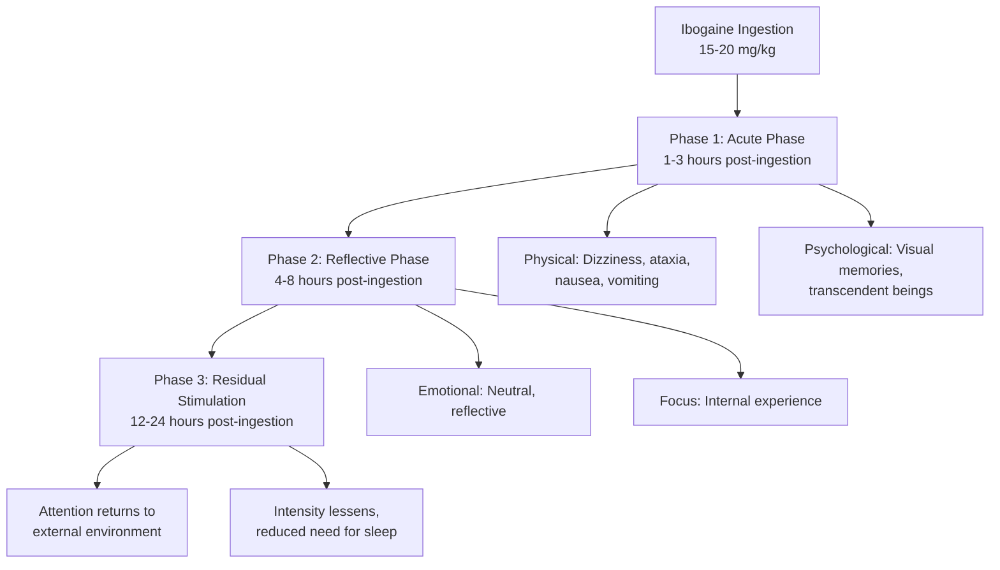

The first is the **acute phase**, with onset starting between one and 3 h following oral ingestion. Physical sensations include dizziness, a lack of coordination, nausea and vomiting. During this phase, participants report wanting to remain as still as possible, with some reporting a sensitivity to light and noise (Lotsof, 1995; Naranjo, 1969, 1973). Participants also experience dryness of the mouth, increased perspiration, and an increase in pulse rate (Popik et al., 1995). A review by Alper (2001) derived from interviews with participants and treatment guides, suggested that the visual experience during the acute phase involved revisiting memories as well as contact with seemingly transcendent beings.

The second phase is the **reflective phase**, commencing approximately 4 to 8 h after ingestion. The emotional tone of this phase is reportedly neutral and reflective, and the participants interviewed by Alper (2001) continued to focus on the internal experience.

The final phase is the **residual stimulation phase**, beginning approximately 12–24 h after ingestion. During this phase, Alper (2001) documented a return of attention to the external environment, and the intensity of the psychoactive experience gradually lessening, with some participants reporting a reduced need for sleep in the days or weeks to follow.

The Manual for Ibogaine Therapy (Lotsof & Wachtel, 2003) was published to offer guidelines for participants and practitioners regarding the screening, safety, monitoring and aftercare of ibogaine. The manual recommended medical evaluation of liver and kidney function tests as well as an electrocardiogram (ECG) prior to treatment. It also offered various recommendations on dosage, from high dosages to smaller and staggered dosages over time, and highlighted the importance of aftercare, suggesting integration of the ibogaine experience through continued psychotherapy.

Following the publication of this manual, the Global Ibogaine Therapy Alliance published clinical guidelines for ibogaine-assisted detoxification (Dickinson et al., 2015) that detail the context of care, procedures for intake, treatment, dosing, intervention and discharge. It also provided comprehensive information on medications and psychoactive substances that have interactions with ibogaine, such as selective serotonin reuptake inhibitors (SSRIs), benzodiazepines, alcohol, steroids and stimulants. The guidelines included a bill of rights for the ibogaine participant, and a list of recommended equipment and useful adjunct medications for practitioners.

### Classification of Ibogaine

Ibogaine has been considered both a psychedelic and an entheogen (Bogenschutz & Johnson, 2016; Ott, 1996). According to Grinspoon and Bakalar (1997) and Nichols (2016), psychedelics do not cause physical dependence, craving or major physiological disturbances, delirium, disorientation or amnesia. In addition, psychedelics, from the Latin roots meaning mind-manifesting, reliably produce thought, mood and perceptual changes otherwise rarely experienced except in dreams, contemplative and religious exaltation, flashes of vivid involuntary memory and acute psychosis.

In contrast, entheogens have been described as psychoactive substances ingested in the religious context for a spiritual purpose (Ott, 1996). According to this classification, ibogaine's well-documented use in the Bwiti tradition would render it an entheogen. The Latin roots of entheogen translate to "become divine within" (Ott, 1996, p. 205) and the term describes the shamanic and mystical states experienced through the ingestion of substances, which also correlate with descriptions of the ibogaine experience.

The ibogaine state of consciousness has also been described as **oneirophrenic** (Brown, 2013; Davis, Barsuglia, Windham-Herman, Lynch, & Polanco, 2017; Lotsof & Alexander, 2001), meaning waking dream – a dream state occurring outside of normal sleep. Much like psychedelic experiences, ibogaine can induce vivid imagery experienced with eyes both open and closed, ranging from geometric patterns to a wide variety of representational images that are often hypnagogic. This dream-like experience typically only constitutes the first phase of the ibogaine experience (Alper, 2001). Entheogens such as ibogaine not only induce a non-ordinary state of consciousness that can include mystical or peak experiences (Winkelman, 2014), they are also thought to deliver profound insights and induce lasting change in patterns of thought, emotional responses and behaviour (Hoffer, 1967 as cited by Bogenschutz & Johnson, 2016).

---

## METHODOLOGY

A narrative review was conducted that considered the pharmacological, cultural and psychological aspects of ibogaine, with a specific focus on understanding the ibogaine state of consciousness. In doing so, we aimed to provide a synthesised description of the landscape that describes ibogaine treatment. The first author (MU) began by immersing herself in the extant literature using mapping to understand the broad landscape that describes ibogaine treatment. In doing so, a visual representation of the literature was created, in which categories emerged and gaps were identified from which to commission the primary search. This was an ongoing iterative process.

The literature search was conducted between March 2019 and March 2020. The first step involved the identification of themes, followed by key words, and used nesting techniques to research key words and phrases. The word ibogaine was initially used to search across several databases. Information was grouped under the headings of pharmacological, cultural and psychological. Keywords and phrases were entered and searched in the following databases: ResearchGate, Sage, JSTOR, Science Direct, NCBI, Semantic Scholar, Wiley Online Library and the Canterbury Christ Church University library.

Given the relative limited availability of academic literature on ibogaine, as compared with other psychedelics such as psilocybin and ayahuasca, literature from the emergence of ibogaine in empirical research from 1969 onwards was considered and included where information was relevant. Titles and abstracts were read to screen for relevance. The criteria for inclusion included relevance to the topic, and incorporation of hypotheses that validated or contradicted known information or contributed new information. Articles were also included if they demonstrated differences between preclinical data and observational data. Articles were excluded based on their relevance, credibility of the information provided or if we deemed they did not add new information to existing reviews. A critical review of the remaining literature followed, which aimed to evaluate and synthesise the existing literature and models to review the conceptual contribution of each study.

---

## RESULTS

A total of 60 articles were identified and read in their entirety. Twenty-seven articles were subsequently excluded, with the remaining 33 articles highlighting particular themes or ideas not yet covered by the existing literature, with attention given to literature that contributed to the relevance of the ibogaine state of consciousness. Articles were categorised according to the mechanism of action, the set-and-setting, and the psychological aspects as contributing factors to the effectiveness of ibogaine. Emphasis was placed on the psychological aspects as a potential area requiring additional research, with the aim of mapping existing literature that defines the ibogaine state of consciousness.

### Pharmacological aspects that contribute to the effectiveness of ibogaine

#### Pharmacological profile

Ibogaine's psychopharmacological profile in preclinical data included interactions with multiple neurotransmitter systems related to substance use, including glutamatergic, sigma, nicotinic, mu- and kappa-opioid, dopaminergic and serotonergic systems (Alper, 2001; Floresta et al., 2019). Ibogaine is not a conventional dopamine or opioid agonist or antagonist, or a monoamine reuptake inhibitor.

While the exact mechanism for ibogaine is still speculative, preclinical studies have suggested antagonism of N-methyl-D-aspartate (NMDA) receptors within the glutamatergic system (Alper, 2001; Popik, Layer, & Skolnick, 1994, 1995) since ibogaine inhibited the binding of the NMDA antagonist MK801 to the NMDA receptor complex (Popik et al., 1994) in animal models. Further, the use of NMDA antagonists potentially offers a new paradigm for the treatment of substance use disorders. A review by Rodger (2018) of preclinical models and preliminary clinical trials suggested that NMDA receptor antagonism could be associated with the unlearning of fixed perceptions and responses, which could include the cravings and responses to environmental cues associated with substance use disorders.

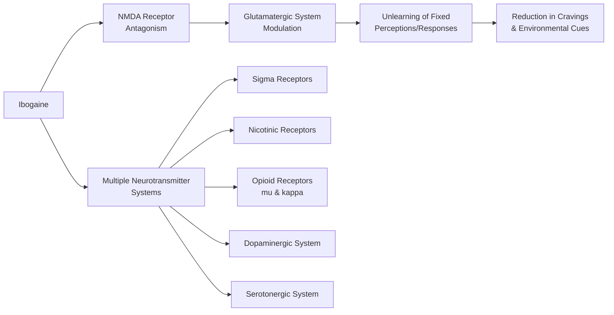

In animal models, the pharmacological and behavioural effects of ibogaine included a decrease in the self-administration of morphine and cocaine, reduced morphine withdrawal syndrome, and a decrease in locomotor activity, cardiovascular effects and tremor (Popik et al., 1995).

Ibogaine's main metabolite, **noribogaine**, was discovered by Mash (1998). Both ibogaine and noribogaine are mainly metabolised by cytochrome P4502D6 (CYP2D6) enzymes in the liver (Alper, 2001; Schenberg et al., 2016), and to a lesser extent other isoforms (Koenig & Hilber, 2015; Obach, Pablo, & Mash, 1998). Noribogaine displays a slow pharmacokinetic clearance rate in humans, demonstrating plasma elimination half-lives of approximately 28–49 h (Glue et al., 2015; Mash et al., 2000). In addition, noribogaine can be detected for several days in the blood following ingestion in part due to enterohepatic circulation (Glue et al., 2015) and its lipophilic profile (Hough, Pearl, & Glick, 1996; Kontrimaviciute et al., 2006). The delayed elimination of noribogaine is believed by Mash (2018) to contribute greatly to the therapeutic effects of ibogaine treatment, proposing that noribogaine continues to act as a highly effective antidepressant to alleviate cravings well after ibogaine has been eliminated.

#### Ibogaine as treatment for opioid use disorder

Four observational studies in humans were identified that demonstrate a representative cross section of the effectiveness of ibogaine for opioid dependency:

**Study 1 - Sheppard (1994):**
- **Sample:** 7 participants from vagrant community in Amsterdam
- **Dose:** 11.7-25 mg/kg single dose
- **Follow-up:** 18 weeks
- **Results:**
  - 1 participant (14%): Recontinued use after 2 days
  - 2 participants (28%): Relapsed after 10 and 12 weeks
  - 1 participant (14%): Intermittent heroin use after 8 months
  - 3 participants (43%): Remained substance-free at 18-week follow-up

**Study 2 - Alper et al. (1999):**
- **Sample:** 33 opioid-dependent participants
- **Dose:** 6-29 mg/kg
- **Setting:** Non-medical settings, open label conditions
- **Observation:** 72 hours
- **Results:**
  - 76%: Free of withdrawal symptoms at 24h, did not seek substances
  - 12%: No withdrawal evidence but chose to resume opioid use
  - No further follow-up reported

**Study 3 - Brown and Alper (2017):**
- **Sample:** 30 people with DSM IV opioid dependence
- **Dose:** ~12 mg/kg
- **Follow-up:** 12 months
- **Measures:** Subjective Opioid Withdrawal Scale, Addiction Severity Index Composite scores
- **Results (% reporting no opioid use):**
  - 1 month: 15 participants (50%)
  - 3 months: 10 participants (33%)
  - 6 months: 6 participants (20%)
  - 9 months: 11 participants (37%)
  - 12 months: 7 participants (23%)

**Study 4 - Noller, Frampton, and Yazar-Klosinski (2017):**
- **Sample:** 14 participants with opioid dependence
- **Dose:** 25-55 mg/kg (staggered)
- **Follow-up:** 12 months
- **Primary measure:** Addiction Severity Index-Lite (ASI-Lite)
- **Secondary measure:** Beck Depression Inventory II (BDI-II)
- **Results:**
  - 75%: Negative urine screen for opioids after 12 months
  - Significant reductions in BDI-II scores

| Study | Sample Size | Dose | Follow-up | Key Outcome |
|-------|-------------|------|-----------|-------------|
| Sheppard (1994) | 7 | 11.7-25 mg/kg | 18 weeks | 43% remained substance-free |
| Alper et al. (1999) | 33 | 6-29 mg/kg | 72 hours | 76% free of withdrawal at 24h |
| Brown & Alper (2017) | 30 | ~12 mg/kg | 12 months | 23% no opioid use at 12 months |
| Noller et al. (2017) | 14 | 25-55 mg/kg | 12 months | 75% negative urine at 12 months |

In addition to the observational studies reviewed in this paper, a systematic review by Dos Santos, Bouso, and Hallak (2017) identified four additional studies that further suggested ibogaine significantly reduced opioid withdrawal symptoms, and that many subjects remained drug-free from 24 h to weeks or months across the case series. Like the studies presented in our narrative review, the additional four studies were limited in that they lacked control groups and placebo, and most treatments were performed in a non-medical and unsupervised context with no standardised protocols.

#### Toxicity

According to a review by Alper, Staajic, and Gill (2012), data for 19 published human fatalities associated with the use of ibogaine contribute to concerns about its clinical use. Ibogaine presents complex pharmacokinetics, rendering it safest when administered under medical supervision following robust screening. Reports of ibogaine fatalities often lack information on the quantities of ibogaine or noribogaine present in the blood during autopsy (for review, see Alper et al., 2012). In some instances, such as the New Zealand study where ibogaine was administered to humans under medical supervision, one person died (Noller et al., 2017).

**Risk Factors for Ibogaine Fatalities:**

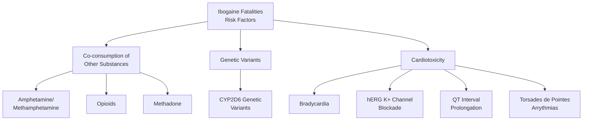

A number of the human fatalities documented in the academic literature can be linked to co-consumption of other substances, including the use of amphetamine or methamphetamine (Alper, 2001), opioids (Alper & Glick, 1992; Clavey, 2018; Mazoyer et al., 2013) and methadone (Mazoyer et al., 2013). Further, given that ibogaine is mainly metabolised by cytochrome P4502D6, some people with genetic variants of the cytochrome might be at higher risk of experiencing toxic effects such as those involving the cardiovascular system (for review, see Koenig & Hilber, 2015).

In addition to causing bradycardia, ibogaine interacts with the cardiac ion channels and these effects likely contribute to ibogaine's potentially life-threatening cardiotoxicity. Cardiotoxicity could be as a result of a blockade of the repolarising human ether-a-go-go-related gene (hERG) potassium channels; retardation of the repolarisation phase of the ventricular action potential (AC); and concomitant prolongation of the QT interval in the ECG, ultimately creating the possibility of life-threatening Torsades de Pointes (TdP) arrythmias.

---

### The cultural aspects associated with the use of ibogaine

#### The origins of ibogaine

In a paper submitted to the American Anthropological Association, Fernandes (1965) introduced information gathered in Gabon, Cameroon and Equatorial Guinea on the Bwiti. Bwiti is considered a monotheistic universal religion (Samorini, 1993, 1995), accessible to anyone who approaches it with humility and respect. It incorporates animism, ancestor worship, Christianity, and a rich history of using the entheogenic substance, iboga (Mash, 2018; Popik et al., 1995). In the mythology of the Bwiti, iboga is the tree of knowledge of good and evil, as depicted in the myths of the old testament of the Bible (Samoniri, 1993).

#### The use of ibogaine in the traditional context

During the Christmas and Easter periods, the Bwiti collectively take iboga over a four-day period as a form of communion while initiation rites are undertaken by individuals who have a desire to join the Bwiti.

**Bwiti Initiation Process:**

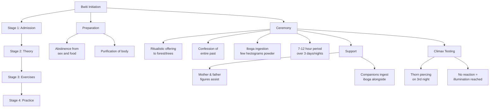

Initiation takes place in four stages including admission, theory, exercises and practice (Nyongo-Ndoua & Vaghar, 2018). Prior to the ceremony, the initiate is expected to abstain from sex and food as part of the purification of the body in preparation (Gollnhofer & Sillans, 1985). The initiation rite consists of making a ritualistic offering to the forest and its trees, followed by confession that concerns the entire past of the initiate to circumvent what are considered bad thoughts. This is followed by taking a much larger dose of iboga than would normally be consumed during the collective ceremonies. It consists of a few hectograms of the powdered rootbark, ingested in smaller quantities over a period of 7–12 h, lasting three consecutive days and nights (Samorini, 1995).

The initiate remains lying on the floor and is assisted by members who represent the mother and father figures of the initiation process. Other members may also ingest iboga during the ceremonies, acting as companions for the initiate during the journey. Around the third night, an officiating member will pierce the initiate with a thorn to test responsiveness – if the initiate does not react, it is understood that the person has reached the climax of the experience. This is considered the moment of illumination that the initiate receives, a defining moment that must carry the initiate during future times of difficulty (Samorini, 1995).

During the journey, adherents of the Bwiti believe that the initiate meets with the spirits of the dead who serve as mediators for encounters with the divine (Mazoyer et al., 2013). The spirits of the dead also provide an initiatory name, which is added to the initiate's proper names. The Bwiti understand their religion to be one of ongoing revelation, with new insights being revealed to initiates during the iboga ritual. Following the journey, the initiate wakes up to a new life. If the initiate lingers in a state of lost consciousness, it is understood as a positive sign of continued communion with the spirits. The Bwiti do not attribute a 'bad trip' to iboga, but rather consider any such occurrence as due to the impurities and bad thoughts of the initiate. Once the initiate is awake and has recounted the experience to the community, the initiate is considered an initiated member (Samorini, 1993). This final step consists of a ceremonial exit from the sacred space and presentation to the group (Nyongo-Ndoua & Vaghar, 2018). Following the rite of passage, the new member will spend a period in isolation where the person is cared for by a young woman who has recently given birth, as the member is considered a new-born (Gollnhofer & Sillans, 1983).

**Four Stages of the Bwiti Visionary Experience (Gollnhofer & Sillans, 1985):**

| Stage | Description | Significance |
|-------|-------------|--------------|
| **Stage 1** | Incoherent images devoid of religious significance | Preliminary phase |
| **Stage 2** | Menacing animals that break apart and reform rapidly | Confrontation phase |
| **Stage 3** | Mythical, peaceful and coherent images | Transition to spiritual |
| **Stage 4** | Encounter with higher spiritual entities | Ultimate spiritual contact |

From the Bwiti perspective, the contents of the visionary experience is described in four distinct stages (Gollnhofer & Sillans, 1985). The first stage consists primarily of incoherent images devoid of religious significance, while the second stage is characterised by a series of apparitions of menacing looking animals that break apart and form again rapidly. The third stage progresses to the mythical and the initiate sees more peaceful and coherent images. The fourth stage is marked by the encounter with higher spiritual entities.

Iboga is understood by the Bwiti to bring about the visual, tactile and auditory certainty of the existence of a realm beyond normal perception. By accessing this realm, the initiate is believed to belong to two planes between which he or she blends existence, not knowing where birth and death begin (Gollnhofer & Sillans, 1983; Nyongo-Ndoua & Vaghar, 2018). Iboga brings about the knowledge of existence on these planes, and death is understood to be the beginning of a new existence.

---

### The psychological aspects of ibogaine

#### The use of ibogaine as a catalyst for the therapeutic process

The psychedelic paradigm, as articulated by Winkelman (2014), refers to the changes in the worldview and perceptions of individuals following dramatic experiences produced by entheogens. These cathartic, sometimes mystical, experiences can result in permanent changes in personality and mood that can positively contribute to changes in the treatment of substance use disorders (Bright et al., 2017; Schenberg, 2018; Winkelman, 2014). Entheogenic substances could also lead to a heightened awareness of the negative consequences of substance use and a sense of self-liberation and relief.

Schenberg (2018) described the contemporary model of **psychedelic-assisted psychotherapy (PAP)**:

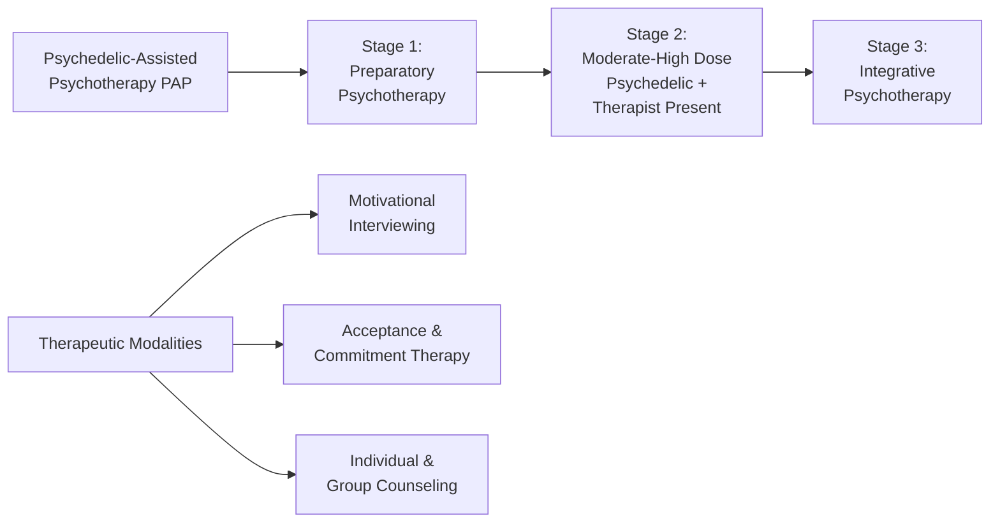

PAP involves preparatory psychotherapy, followed by a moderate to high dose of psychedelics in the presence of one or more therapist, followed by integrative psychotherapy. In the case of ibogaine, Schenberg (2018) notes that psychotherapeutic models used in the treatment of substance use disorders, such as individual and group counselling, are often used. PAP shifts the focus away from the efficacy of the substance to the efficacy of the contextual experience in which the emotional, cognitive and behavioural changes take place. Therapeutic modalities associated with PAP include Motivational Interviewing and Acceptance and Commitment Therapy (for review, see Schenberg, 2018).

A retrospective analysis of data from 75 people who were previously dependent on alcohol, cannabis, cocaine HCl and crack cocaine by Schenberg, de Castro Comis, Chaves, and da Silveira (2014) found individuals treated with a single dose of ibogaine reported abstinence for a median of **5.5 months**, while those treated in combination with psychotherapy remained abstinent for a median of **8.4 months**. This finding suggests that the combination of ibogaine with psychotherapy can facilitate prolonged periods of abstinence.

#### Phenomenological analysis of the ibogaine experience

In a phenomenological analysis of ibogaine experiences, Schenberg et al. (2017) catalogued the experiences of 22 participants into themes:

**Themes Identified (Schenberg et al., 2017):**
- Physical sensations
- Perceptual effects
- Visions
- Cognitive effects
- Emotional effects
- Spiritual phenomena
- Comparisons to other psychoactive substances

Insights arising included:
- Family dynamics through childhood memories and associated emotions
- Problematic issues in friendships
- Social interactions contributing to substance use or dysfunctional behaviours
- Role in society and career paths
- Renewed motivation and sense of purpose

Participants generally also reported a marked improvement in quality of life, with many citing improved approaches to nutritional habits and the enjoyment of food. For others, improved quality of life related to a fundamental desire to stay alive and to enjoy life more truthfully and meaningfully.

In a qualitative study by Kohek, Ohren, Hornby, Alcazar-Corcoles, and Bouso (2020) exploring the acute subjective effects of ibogaine among 20 participants, the researchers proposed similar categories to Schenberg et al. (2017) with some deviations:

**Categories (Kohek et al., 2020):**

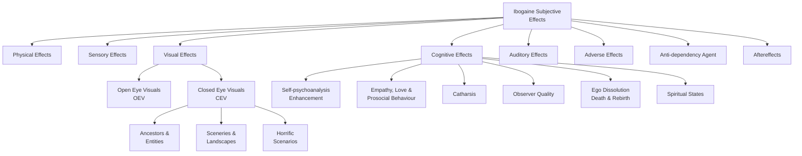

The visual effects were divided into two subcategories, namely open eye visuals (OEV) and closed eye visuals (CEV). CEV were further divided into three subcategories, namely ancestors and entities; sceneries and landscapes; and horrific scenarios. Cognitive effects were also divided into six categories, namely self-psychoanalysis enhancement; empathy, love and prosocial behaviour; catharsis; observer quality; ego dissolution (death and rebirth); and spiritual states.

#### Ibogaine and REM sleep

Goutarel, Gollnhofer, and Sillans (1993) hypothesised that the state induced by ibogaine resembles functional aspects shared by the brain states of Rapid Eye Movement (REM) sleep, including noteworthy effects on learning and memory. REM sleep is characterised by the appearance of fast, desynchronised rhythms in the cortical electroencephalogram (EEG), rapid eye movements, autonomic activation and loss of muscle tone. Since the cortical EEG of REM closely resembles that of the waking state, it has been termed active sleep (Fuller, 2007). During REM sleep, it is believed that a reconsolidation of learned information takes place in a state of heightened neural plasticity, with the reprocessing of previously learned information and the formation of new associations (McNamara & Bulkeley, 2015).

**However**, the putative link between the ibogaine state of consciousness and REM is challenged by a study by Gonzalez et al. (2018) that aimed to characterise the acute effects of ibogaine on wakefulness and sleep. The authors concluded that **ibogaine produces a waking state accompanied by robust and long-lasting REM sleep suppression**, thus casting doubt on REM as the mechanism responsible for insight and the formation of new associations.

| Hypothesis | Evidence For | Evidence Against |
|------------|--------------|------------------|
| Ibogaine mimics REM sleep | - Similar learning/memory effects proposed - Dream-like visual content | - Ibogaine suppresses REM sleep (Gonzalez et al., 2018) - Produces waking state, not sleep state |

#### Ibogaine and memory retrieval

Popik (1996) suggested that ibogaine's action involving memory retrieval plays an important role in its use as a treatment for substance use disorders. Reconsolidation-based interventions offer promising treatment for substance use disorders by disrupting reconsolidation of maladaptive instrumental and Pavlovian memories (Milton, 2013). This observation was made following an experiment with rats in a water maze, which is a reliable way of assessing the effects of psychoactive substances on spatial learning and memory processes. Under the influence of ibogaine, rats demonstrated rapid acquisition of spatial memory.

Rodger (2018) suggested that the experience of retrieving childhood memories and the creation-migration mythology experienced by the Bwiti are regressions. These regressions can be childhood memories, traumatic events or social dynamics that played a role in shaping the perceptions of the individual. The ibogaine experience reportedly eliminates the notion of time as the past, present and future blend into one. The Bwiti believe this experience to be necessary for the initiate to return to his birthplace. Individuals who undertake the ibogaine experience often describe it from the perspective of an observer of the self, seeing different perspectives play out that facilitate a new perspective on the dynamics of social situations.

Following an open nonblinded study, Regan (1992) suggested that the psychological mechanisms associated with the use of ibogaine involve:
1. The release of repressed memories
2. The intellectual re-evaluation of memories
3. Integration of new insights into the personality of the person

The ability to integrate new perspectives and reflect on the mental state of the self is called **mentalisation** (Choi-Kain & Gunderson, 2008, as cited by Rodger, 2018, p. 93) and has been demonstrated to be effective in enhancing secure relational attachments and emotional self-regulation.

#### Ibogaine in the context of states of consciousness

The pursuit of non-ordinary states of consciousness is a phenomenon found across time, culture, geographies and even species. Anthropological reports suggest that non-ordinary states of consciousness have been an integral part of human life since the earliest recorded times (Winkelman, 1997). Weil (1983, as cited in McPeak, Kennedy, and Gordon, 1991) suggested that the experience of non-ordinary states is so compelling and universal that they are part of the human experience. Children often freely seek out this experience through play, such as rolling down a hill or spinning until they feel dizzy. Even drug rehabilitation programmes such as Alcoholics Anonymous (AA) direct its members to seek a change in consciousness, a spiritual awakening (McPeak et al., 1991). Generally, social disapproval of non-ordinary states prevail as these are perceived to be dangerous, linked to depression, psychosis or self-destruction.

**Monophasic vs. Polyphasic Cultures (Laughlin, 2013):**

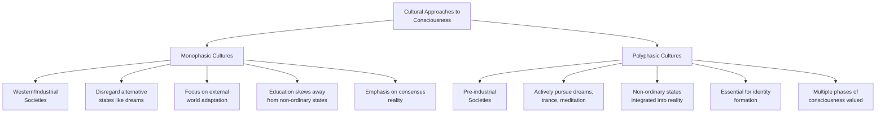

A body of work primarily developed by Laughlin (Laughlin, 2013; Laughlin, McManus, & d'Aquili, 1990; Laughlin & Throop, 2001) explores the difference between monophasic and polyphasic cultures. In **monophasic cultures**, such as those typical of the Western world, children are taught from a young age to disregard alternative states such as dreams, and to focus on adaptation to the external world. Formal and informal education models do not embrace the individual's dream life, and information obtained in the dream, which tends to skew the development of consciousness away from non-ordinary states and towards perceptual and cognitive processes directed towards consensus reality. In **polyphasic cultures**, found in pre-industrial societies, non-ordinary states such as dreams, trance and meditation states are actively pursued and integrated into the everyday understanding of the nature of reality. In polyphasic cultures it is accepted that experiences during non-ordinary states are an essential part of how an individual's identity is formed.

The ibogaine state of consciousness is a non-ordinary state of consciousness. Vaitl et al. (2005) divided non-ordinary states of consciousness into five categories according to how they are induced:

**Categories of Non-Ordinary States of Consciousness (Vaitl et al., 2005):**

| Category | Examples | Ibogaine Classification |
|----------|----------|-------------------------|
| **Spontaneous** | Day-dreaming, near-death experiences | - |
| **Physical/Physiological** | Fasting, sex | - |
| **Psychological** | Music, meditation, hypnosis | - |
| **Pathological** | Epilepsy, brain damage | - |
| **Pharmacological** | Psychoactive substances | ✓ Ibogaine |

Non-ordinary states of consciousness are considered catalysts for transformation. These experiences are extraordinary and intensely personal, occurring in unique circumstances that contribute to the difficulty of reproducing and studying them. Grof (2012) argues that experiencing a non-ordinary state of consciousness has the potential to lead to significant insight and may result in lasting transformation of the self-concept.

**Oneirophrenia Classification:**

Naranjo (1969) used the term **oneirophrenia** to describe the ibogaine-induced state of consciousness. Oneirophrenia is derived from the Greek words *oneiros* (dream) and *phren* (mind) meaning a dream-like state. Popik (1996) described this state being akin to a dream with full consciousness that is easily manipulated. Oneirophrenia has also been described as a hallucinatory state caused by prolonged sleep deprivation or sensory deprivation. The resulting dream-state does not produce interferences in thinking, identity distortions and space-time alterations usually associated with hallucinogenic substances (Gonzalez et al., 2018).

**However**, as highlighted by Alper (2001), the visual or dream-like state is typically only experienced during the first phase of the ibogaine journey. The visual effects of the ibogaine experience have been characterised as "high density images generally of an autobiographical nature and central to life narrative, although archetypal and cartoon-like imagery is also reported" (Winkelman, 2014, p. 106). These visions typically provide psychological insight, facilitating a level of psychotherapy through evoking repressed memories, and promoting introspection.

---

## DISCUSSION

Our narrative review of the pharmacological, cultural and psychological aspects of ibogaine found evidence that each of these aspects contributed to the effectiveness of ibogaine, and potentially contribute to its mechanism of action.

### Pharmacological Findings

Although the exact pharmacological mechanisms for ibogaine are still speculative, there is evidence that ibogaine interacts with one or more neurotransmitter systems. Ibogaine's main metabolite, noribogaine, reputed for its long-lasting effects that might assist people deal with post-treatment cravings and acting as an antidepressant, also still requires further investigation. In human trials conducted by Glue et al. (2015), single oral doses of 3–60 mg of noribogaine was safe and well-tolerated in healthy volunteers. However, clinical observations by Mash (2018) found that noribogaine, when administered alone, is ineffective for the treatment of opioid dependence, suggesting a potentially important pharmacodynamic interaction between noribogaine and ibogaine.

Further understanding about the psychopharmacology of ibogaine might be gleaned through research currently underway on 18-MC. 18-MC is being developed as a non-psychoactive analogue of ibogaine for use in opioid detoxification. This raises questions around the role of psychedelic experiences in the context of transformational healing as investigated by Majic, Schmidt, & Gallinat (2015).

Although preliminary evidence suggests that ibogaine may be effective in the treatment of opioid use disorder, further randomised controlled trials are required. Another area that requires further investigation is ibogaine's reputed effect in the treatment of depression as a contributing factor not only to substance use disorders, but also to mood disorders. Three studies included in this narrative review (Bastiaans, 2004; Davis et al., 2017; Noller et al., 2017) indicated varied results regarding the effects of ibogaine on depression, although this was not the primary objective of the studies.

### Cultural and Set-and-Setting Considerations

Our narrative review suggests that set-and-setting is given primacy during ingestion of ibogaine in the traditional context. However, more research is needed to understand the role of set-and-setting in the ibogaine state of consciousness and how this affects its efficacy in the treatment of substance use disorders, and the broader therapeutic application.

The hypothesis of set-and-setting was first formulated by Leary (as cited by Hartogsohn, 2017) and refers to the psychological, social and cultural parameters that shape the responses to psychedelic substances. It suggests that the state of consciousness occasioned by psychedelics is, among other factors, a function of both:
- **(i) the set**, which includes the intention, attitude, personality and mood of the participant, as well as
- **(ii) the setting**, which involves interpersonal, social and environmental aspects associated with the experience.

It also extends to the beliefs, attitudes, preferences, choices and motivations of individuals undertaking these experiences.

The ibogaine journey within its cultural context remains a largely unexplored area, apart from the work of Gollnhofer and Sillans (1985), who categorised experiences into four phases. Meanwhile, the phenomenology of the journey in the western context has been explored by both Schenberg et al. (2017) and Kohek, Ohren, Hornby, Alcazar-Corcoles, and Bouso (2020), who catalogued experiences into themes. This raises questions around the worldview of participants, and whether there are distinct differences in the experiences of the ibogaine journey as experienced by:
- Westerners in a western context
- Indigenous participants in the cultural context
- Westerners in the traditional indigenous context

### Psychological Aspects and States of Consciousness

From a psychological perspective, there is evidence to suggest that psychedelic and entheogenic substances enable the individual to transcend beyond the primary identification with the physical body to experience ego-free states of existence, and that this perspective leads to psychological insight. This heightened awareness of self also has the potential to illuminate the negative consequences of substance use. While definitions of the self-concept vary greatly, there is evidence to suggest that these cathartic, sometimes mystical experiences can result in permanent changes in personality and mood (Griffiths, Richards, Johnson, McCann, & Jesse, 2008; Griffiths, Richards, McCann, & Jesse, 2006; Naranjo, 1969; Schenberg, 2018; Winkelman, 2014). In the context of ibogaine, by transcending beyond the primary identification with the self, the experience can make a dysfunctional view of the self-concept visible through the peak experience. This suggests transformation of the self-concept, leading to self-acceptance and self-surrender. However, the construction and potential transformation of the self-concept as a result of the ibogaine journey requires further exploration.

#### Rejecting the Oneirophrenic Classification

While the term **oneirophrenia**, as first proposed by Naranjo (1969), might be deemed relevant to the waking dream aspect of the state induced by ibogaine, the term should be rejected for two principal reasons:

**Reasons for Rejecting "Oneirophrenia":**

1. **Inadequate Description of First Phase:**
   - The term oneirophrenia is also used to describe prolonged sleep deprivation or sensory deprivation, which seems inappropriate to the waking dream phase typically occurring during the first few hours of the ibogaine journey
   - During this stage, participants are in a heightened state of awareness
   - Although this stage contains hypnagogic elements, the phenomenology of this phase is more complex than would be suggested by referring to its content as that of a waking dream

2. **Fails to Account for Later Phases:**
   - The term fails to acknowledge the second and third phases of the ibogaine state, which comprise a substantial portion of the ibogaine journey
   - In all, this renders the classification of oneirophrenic inadequate, as it only partially describes the ibogaine state of consciousness

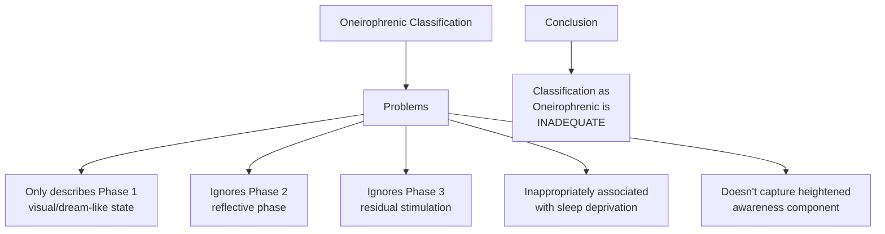

#### Holotropic States as Alternative Framework

Another way to understand the ibogaine state of consciousness is through the lens of **holotropic states** (Grof, 2016). Holotropic is derived from the Greek words *holos* (whole) and *trepin*, meaning moving towards. Thus, the implication is that holotropic states are inherently healing.

**Characteristics of Holotropic States (Grof, 2016):**

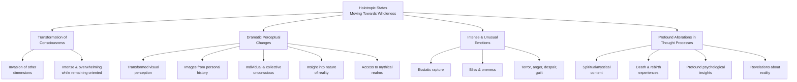

Holotropic states are characterised by the transformation of consciousness associated with dramatic perceptual changes in the senses, often accompanied by intense and unusual emotions, followed by profound alterations in thought processes. While in this state, the individual can experience an invasion of other dimensions that can be intense and overwhelming, while at the same time remaining fully orientated with reality. **These characteristics correlate not only with reports of the ibogaine experience, but also with other psychedelics more broadly.**

**Sensory Changes in Holotropic States:**

Sensory changes during holotropic states include significantly transformed visual perception, flooded by images from the individual's personal history as well as the individual and collective unconscious (Grof, 2016). Visions could also include insight into the nature of reality or access to mythical realms, and holotropic states can be accompanied by other sensory experiences such as physical sensations, smells and auditory experiences, **with the latter being very characteristic of the ibogaine experience**.

The emotional tone of holotropic states can vary from ecstatic rapture to bliss, and feelings of oneness, to terror, anger, despair or guilt (Grof, 2016). The contents of the holotropic state can be spiritual or mystical, and **the experience of death and rebirth is common**. The state of consciousness experienced by novice shamans during initiations is holotropic. Holotropic states are also used by more experienced shamans to facilitate the therapeutic process. This refers to the transformation of the self-concept, including the self-narrative, to bring about lasting changes in the personality and mood of the person.

**Comparison: Ibogaine Experience vs. Holotropic States**

| Feature | Ibogaine Experience | Holotropic States | Match? |
|---------|---------------------|-------------------|---------|
| **Transformed visual perception** | ✓ High-density autobiographical images, archetypal imagery | ✓ Images from personal/collective unconscious | ✓ Yes |
| **Auditory experiences** | ✓ Very characteristic | ✓ Present | ✓ Yes |
| **Emotional range** | ✓ Catharsis, empathy, terror (horrific scenarios) | ✓ Ecstasy to terror, anger, despair | ✓ Yes |
| **Death & rebirth** | ✓ Ego dissolution reported (Kohek et al., 2020) | ✓ Common experience | ✓ Yes |
| **Spiritual/mystical content** | ✓ Encounters with entities, spiritual states | ✓ Characteristic feature | ✓ Yes |
| **Remains oriented to reality** | ✓ Full consciousness maintained | ✓ Key characteristic | ✓ Yes |
| **Psychological insights** | ✓ Self-psychoanalysis, memory retrieval | ✓ Insights into personal history | ✓ Yes |
| **Access to mythical realms** | ✓ Bwiti cosmology, transcendent beings | ✓ Present | ✓ Yes |
| **Transformation of self-concept** | ✓ Lasting personality changes reported | ✓ Changes in self-narrative | ✓ Yes |

#### Cognitive Functioning in Holotropic States

Another significant aspect regarding the parallels between the waking dream state of ibogaine, other psychedelic states and holotropic states is the effect on thought processes – during this phase of the ibogaine journey **cognition is not impaired, yet it functions in a distinctly different way compared with ordinary states of consciousness**.

Holotropic states can bring about:
- Profound psychological insights concerning the personal history and unconscious dynamics of the individual
- Revelations about various aspects of the nature of reality that transcend our educational and intellectual background

These aspects align with reports that ibogaine can result in a change in thought processes, and the emotional tone of the ibogaine experience, as well as sensory and auditory experiences, are characteristic of holotropic states.

#### Measuring Holotropic States

While numerous means for inducing the holotropic state are explored by Grof (2016) and Valverde (2015), there are few explicit tools for measuring holotropic states. One tool that has been used in holotropic breathwork is the **Phenomenology of Consciousness Inventory** (Pekala, 1991, as cited by Rock, Denning, Harris, Clark, & Misso, 2015).

**We are currently using this tool to measure the ibogaine experience and explore its potential classification as a holotropic state.**

---

## CONCLUSION

Following the narrative review of the literature on ibogaine, there is room for exploring, defining and articulating aspects relating to:
- Its physiological mechanisms of action
- Experiences of participants as they relate to set-and-setting
- Providing a more accurate classification of the ibogaine state of consciousness
- Exploring its therapeutic application

**Key Findings Summary:**

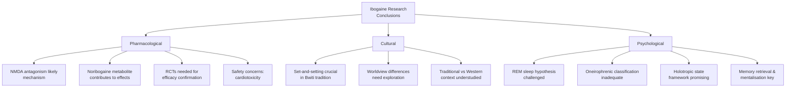

Ibogaine's reputation as a treatment for substance use disorder largely stems from observational studies, as well as preclinical data and data following clinical trials of noribogaine. The observational studies are limited, lacking in control groups and placebo, with most treatments performed in a non-medical and unsupervised context with no standard controls. **Randomised controlled trials are required to establish ibogaine's effectiveness, safety and potential therapeutic application.**

Our review also highlights gaps in the literature regarding the nature and contents of the ibogaine experience, specifically as it relates to the worldview of the participant. For example, it is unclear how the set-and-setting of the ibogaine experience influences the efficacy of the treatment, if at all.

**There appear to be strong correlations between the ibogaine state of consciousness, the state of consciousness produced by other psychedelic substances and holotropic states of consciousness.** How these states of consciousness influence therapeutic outcomes requires further investigation.

### Future Research Directions

**Priority Areas for Future Investigation:**

1. **Pharmacological Research:**
   - Randomised controlled trials for opioid use disorder
   - Investigation of ibogaine's effects on depression and mood disorders
   - Clarification of noribogaine's specific contributions
   - Understanding the role of psychedelic experience vs. pharmacology alone (18-MC comparison)

2. **Cultural and Phenomenological Research:**
   - Comparative studies of ibogaine experiences across different cultural contexts:
     - Western participants in Western clinical settings
     - Western participants in traditional Bwiti settings
     - Indigenous participants in traditional settings
   - Role of set-and-setting in therapeutic outcomes
   - Impact of worldview on experience content and integration

3. **Consciousness Research:**
   - Formal classification of ibogaine state using validated instruments (e.g., Phenomenology of Consciousness Inventory)
   - Exploration of holotropic state framework applicability
   - Relationship between mystical/peak experiences and therapeutic outcomes
   - Mechanisms of self-concept transformation

4. **Safety Research:**
   - Genetic screening protocols (CYP2D6 variants)
   - Cardiac risk stratification
   - Drug interaction profiles
   - Optimal medical supervision protocols

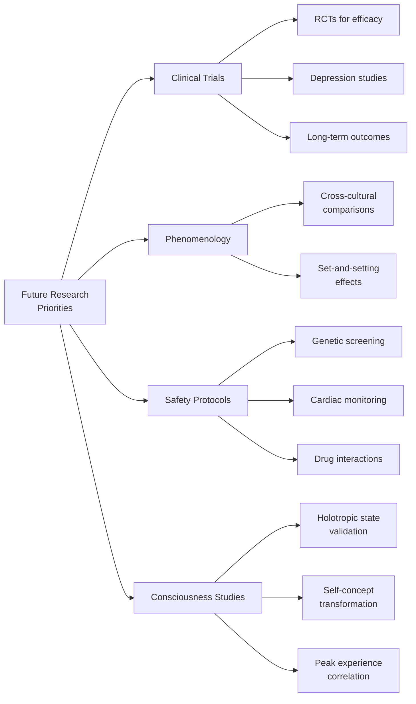

---

## REFERENCES

Alper, K. R. (2001). Ibogaine: A review. *The Alkaloids*, 56, 1–38. https://10.1016/S0099-9598(01)56005-8.

Alper, K. R., & Glick, S. D. (1999). *Ibogaine: Proceedings from the first international conference*. Academic Press.

Alper, K. R., Lotsof, H. S., Geerte, M., Frenken, M. F. A., Luciano, D. J., & Bastiaans, J. (1999). Treatment of acute opioid withdrawal with ibogaine. *The American Journal on Addictions*, 8, 234–242. https://doi.org/10.1080/105504999305848.

Alper, K. R., Lotsof, H. S., & Kaplan, C. D. (2008). The ibogaine medical subculture. *The Journal of Ethnopharmacology*, 115, 9–24. http://10.1016/j.jep.2007.08.034.

Alper, K. R., Staajic, M., & Gill, J. R. (2012). Fatalities temporally associated with the ingestion of ibogaine. *Journal of Forensic Science*, 57, 398–412. https://doi.org/10.1111/j.1556-4029.2011.02008.x.

Bastiaans, E. (2004). *Life after ibogaine: An exploratory study of the long-term effects of ibogaine treatment on drug addicts*. https://www.iceers.org/Documents_ICEERS_site/Scientific_Papers/ibogaine/Bastiaans%20E_Life_After_Ibogaine.pdf.

Bogenschutz, M. P., & Johnson, M. W. (2016). Classic hallucinogens in the treatment of addictions. *Progress in Neuro-Psychopharmacology & Biological Psychiatry*, 64, 250–258. http://dx.doi.org/10.1016/j.pnpbp.2015.03.002.

Bright, S., Williams, M., & Caldicott, D. (2017). Should addiction researchers be interested in psychedelic science?. *Drug and Alcohol Review*, 36(3), 285–287. https://doi.org/10.1111/dar.12544.

Brown, T. K. (2013). Ibogaine in the treatment of substance dependence. *Current Drug Abuse Reviews*, 6(1), 3–16. https://10.2174/15672050113109990001.

Brown, T. K., & Alper, K. (2017). Treatment of opioid use disorder with ibogaine: Detoxification and drug use outcomes. *The American Journal of Drug and Alcohol Abuse*, 44(1), 24–36. https://doi.org/10.1080/00952990.2017.1320802.

Clavey, T. (2018). *Psychedelic neuroscience: Progress in brain research*. Academic Press Elsevier.

Davis, A. K., Barsuglia, J., Windham-Herman, M., Lynch, M., & Polanco, M. (2017). Subjective effectiveness of ibogaine treatment for problematic opioid consumption: Short-and long term outcomes and current psychological functioning. *Journal of Psychedelic Studies*, 1(2), 65–73. https://doi.org/10.1556/2054.01.2017.009.

Dickinson, J., McAlpin, J., Wilkens, C., Fitzsimmons, C., Guion, P., Paterson, T., et al. (2015). *Clinical guidelines for ibogaine-assisted detoxification* (1st ed.). Global Ibogaine Therapy Alliance. https://www.ibogainealliance.org/guidelines/.

Dos Santos, R. G., Bouso, J. C., & Hallak, J. E. C. (2017). The antiaddictive effects of ibogaine: A systematic literature review of human studies. *Journal of Psychedelic Studies*, 1(1), 20–28. https://doi.org/10.1556/2054.01.2016.001.

Fernandes, J. W. (1965). Symbolic consensus in a Fang reformative cult. *Journal of American Anthropology*, 67, 902–929. https://doi.org/10.1525/aa.1965.67.4.02a00030.

Floresta, G., Dichiara, M., Gentile, D., Prezzavento, O., Marrazzo, A., Rescifina, A., et al. (2019). Morphing of ibogaine: A successful attempt into the search for sigma-2 receptor ligands. *International Journal of Molecular Sciences*, 20(3), 488. https://doi.org/10.3390/ijms20030488.

Fuller, P. M. (2007). The pontine REM switch: Past and present. *Journal of Physiology*, 584, 735–741. https://doi.org/10.1113/jphysiol.2007.140160.

Glick, S. D., Rossman, K. L., Rao, N. C., Maisonneuve, I. M., & Carlson, J. N. (1992). Effects of ibogaine on acute signs of morphine withdrawal in rats: Independence from tremor. *Journal of Neuropharmacology*, 31(5), 497–500. https://doi.org/10.1016/0028-3908(92)90089-8.

Glue, P., Lockhart, M., Lam, F., Hung, N., Hung, C. T., & Friedhoff, L. (2015). Ascending-dose study of noribogaine in healthy volunteers: Pharmacokinetics, pharmacodynamics, safety and tolerability. *Journal of Clinical Pharmacology*, 55(2), 189–194.

Gollnhofer, O., & Sillans, R. (1983). Iboga, and African psychotropic agent. *Journal of Psychotropes*, 1, 11–27.

Gollnhofer, O., & Sillans, R. (1985). Ritual uses of iboga in Gabon. *Journal of Psychotropes*, 2, 95–108.

Gonzalez, J., Prieto, J. P., Rodriguez, P., Cavelli, M., Benedetto, L., Mondino, A., et al. (2018). Ibogaine acute administration in rats promotes wakefulness, long-lasting REM sleep suppression, and a distinctive motor profile. *Frontiers in Pharmacology*, 9, 374. https://doi.org/10.3389/fphar.2018.00374.

Goutarel, R., Gollnhofer, O., & Sillans, R. (1993). Pharmacodynamics and therapeutic applications of iboga and ibogaine. *Psychedelic Monographs and Essays*, 6, 70–111. https://ibogainedossier.com/bwiti1.html.

Griffiths, R. R., Richard, W. A., McCann, U., & Jesse, R. (2006). Psilocybin can occasion mystical-type experiences having substantial and sustained personal meaning and spiritual significance. *Psychopharmacology*, 187(3), 268–283. https://10.1007/s00213-006-0457-5.

Griffiths, R. R., Richards, W. A., Johnson, M. W., McCann, U. D., & Jesse, R. (2008). Mystical-type experiences occasioned by psilocybin mediate the attribution of personal meaning and spiritual significance 14 months later. *Journal of Psychopharmacology*, 22(6), 621–632. https://10.1177/0269881108094300.

Grinspoon, L., & Bakalar, J. B. (1997). *Psychedelic drugs reconsidered*. The Lindesmith Centre.

Grof, S. (2012). Revision and re-enchantment of psychology: Legacy of half a century of consciousness research. *The Journal of Transpersonal Psychology*, 44, 137–163.

Grof, S. (2016). Psychology for the future: Lessons from modern consciousness research. *Spiritual Studies*, 2(1).

Hartogsohn, I. (2017). Constructing drug effects: A history of set and setting. *Drug Science, Policy and Law*, 3, 1–17. https://doi.org/10.1177/2050324516683325.

Hough, L. B., Pearl, S. M., & Glick, S. D. (1996). Tissue distribution of ibogaine after intraperitoneal and subcutaneous administration. *Life Sciences*, 58(7), 119–122.

Kaplan, C. D., Ketzer, E., De Jong, J., & De Vries, M. (1993). Reaching a state of wellness: Multistage explorations in social neuroscience. *Social Neuroscience Bulletin*, 6, 6–7.

Koenig, X., & Hilber, K. (2015). The anti-addiction drug ibogaine and the heart: A delicate relation. *Molecules*, 20, 2208–2228. https://doi.org/10.3390/molecules20022208.

Kohek, M., Ohren, M., Hornby, P., Alcazar-Corcoles, M. A., & Bouso, J. C. (2020). The ibogaine experience: A qualitative study on the acute subjective effects of ibogaine. *Anthropology of Consciousness*, 31(1), 91–199. https://doi.org/10.1111/anoc.12119.

Kontrimaviciute, V., Mathieu, O., Mathieu-Daude, J. C., Vainauskas, P., Casper, T., Baccino, E., et al. (2006). Distribution of ibogaine and noribogaine in a man following a poisoning involving root bark of the Tabernanthe iboga shrub. *Journal of Analytical Toxicology*, 30(7), 434–440. https://doi.org/10.1093/jat/30.7.434.

Krengel, F., Milangos, M. V., Reyes-Lezama, M., & Reyes-Chilpa, R. (2019). Extraction and conversion studies of the antiaddictive alkaloids coronaridine, ibogamine, voacangine, and the ibogaine from two Mexican tabernaemontana species (apocynaceae). *Chemistry & Biodiversity*, 19. https://doi.org/10.1002/cbdv.201900175.

Laughlin, C. D. (2013). The ethno-epistemology of transpersonal experience: A view from transpersonal anthropology. *International Journal of Transpersonal Studies*, 32(1), 43–50. http://dx.doi.org/10.24972/ijts.2013.32.1.43.

Laughlin, C. D., McManus, J., & d'Aquili, E. G. (1990). *Brain, symbol and experience: Towards a neurophenomenology of consciousness*. Columbia University Press.

Laughlin, C. D., & Throop, C. J. (2001). Imagination and reality: On the relations between myth, consciousness and the quantum sea. *Zygon*, 36, 709–736. https://doi.org/10.1111/0591-2385.00392.

Lotsof, H. S. (1995). Ibogaine in the treatment of chemical dependency disorders: Clinical perspectives. *Multidisciplinary Association for Psychedelics Studies Press*, No. 5. https://maps.org/news-letters/v05n3/05316ibo.html.

Lotsof, H. S., & Alexander, N. E. (2001). Case studies of ibogaine treatment: Implications for patient management strategies. *The Alkaloids*, 56. https://doi.org/10.1016/s0099-9598(01)56020-4.

Lotsof, H. S., & Wachtel, B. (2003). *Manual for ibogaine therapy: Screening, safety, monitoring and aftercare*. https://s3.ca-central-1.amazonaws.com/ibosafe-pdf-resources/Ibogaine/Manual+for+Ibogaine+Therapy.pdf.

Majic, T., Schmidt, T. T., & Gallinat, J. (2015). Peak experiences and the afterglow phenomenon: When and how do therapeutic effects of hallucinogens depend on psychedelic experiences?. *Journal of Psychopharmacology*, 29(3), 241–253. https://doi.org/10.1177/0269881114568040.

Mash, D. C. (2018). Breaking the cycle of opioid use disorder with ibogaine. *The American Journal of Drug and Alcohol Abuse*, 44(1), 1–3. https://doi.org/10.1080/00952990.2017.1357184.

Mash, D. C., Kovera, C. A., Buck, B. E., Norenberg, M. D., Shapshak-Hearn, P. W. L., & Sanchez-Ramos, J. (1998). Medication development of ibogaine as a pharmacotherapy for drug dependence. *Annals of the New York Academy of Sciences*, 844, 274–292.

Mash, D. C., Kovera, C. A., Pablo, J., Tyndale, R. F., Ervin, F. D., Williams, I. C., et al. (2000). Ibogaine: Complex pharmacokinetics, concerns for safety and preliminary efficacy measures. *Annals of the New York Academy of Sciences*, 914, 394–401. https://doi.org/10.1111/j.1749-6632.2000.tb05213.x.

Mazoyer, C., Carlier, J., Boucher, A., Péoc'h, M., Lemeur, C., & Gaillard, Y. (2013). Fatal case of a 27-year-old male after taking iboga in withdrawal treatment: GC-MS/MS determination of ibogaine and ibogamine in iboga roots and post-mortem biological material. *Journal of Forensic Sciences*, 58(6). https://doi.org/10.1111/1556-4029.12250.

McNamara, P., & Bulkeley, K. (2015). Dreams as a source of supernatural agent concepts. *Frontiers in Psychology*, 6, 283. https://doi.org/10.3389/fpsyg.2015.00283.

McPeak, J. D., Kennedy, B. P., & Gordon, S. M. (1991). Altered states of consciousness therapy: A missing component in alcohol and drug rehabilitation treatment. *Journal of Substance Abuse Treatment*, 8, 72–82. https://doi.org/10.1016/0740-5472(91)90030-e.

Milton, A. L. (2013). Drink, drugs and disruption: Memory manipulation for the treatment of addiction. *Current Opinion in Neurobiology*, 23(4), 706–712. https://doi.org/10.1016/j.conb.2012.11.008.

MindMed completes dosing 18-MC phase 1 study. (2020, July 28). Retrieved on 2 January 2021 from https://mindmed.co/news/press-release/mindmed-completes-dosing-18-mc-phase-1-study/.

Naranjo, C. (1969). Psychotherapeutic possibilities of new fantasy-enhancing drugs. *Journal of Clinical Toxicology*, 2, 209–224.

Naranjo, C. (1973). *The healing journey: New approaches to consciousness*. Pantheon.

Nichols, D. E. (2016). Psychedelics. *Pharmacological Reviews*, 68(2), 264–355. https://doi.org/10.1177/0269881111420188.

Noller, G. E., Frampton, C. M., & Yazar-Klosinski, B. (2017). Ibogaine treatment outcomes for opioid dependence from a twelve-month follow-up observational study. *The American Journal of Drug and Alcohol Abuse*, 44(1), 37–46. https://doi.org/10.1080/00952990.2017.1310218.

Nyongo-Ndoua, P. D., & Vaghar, K. (2018). Bwiti, iboga, trance and healing in Gabon. *Mental Health, Religion & Culture*, 21(8), 755–762. https://doi.org/10.1080/13674676.2018.1504012.

Obach, R. S., Pablo, J., & Mash, D. C. (1998). Cytochrome P4502D6 catalyses the o-demethylation of the psychoactive alkaloid ibogaine to 12-hydroxyibogamine. *Drug Metabolism and Disposition*, 26(8), 764–768.

Ott, J. (1996). Entheogens II: On entheology and ethnobotany. *Journal of Psychoactive Drugs*, 28, 205. https://doi.org/10.1080/02791072.1996.10524393.

Popik, P. (1996). Facilitation of memory retrieval by the anti-addictive alkaloid ibogaine. *Pharmacology Letters, Life Sciences Journal*, 59(24), 379–385.

Popik, P., Layer, R. T., & Skolnick, P. (1994). The putative anti-addictive drug ibogaine is a competitive inhibitor of [³H]MK-801 binding to the NMDA receptor complex. *Psychopharmacology*, 114, 672–674. https://doi.org/10.1007/bf02245000.

Popik, P., Layer, R. T., & Skolnick, P. (1995). 100 years of ibogaine: Neurochemical and pharmacological actions of a putative anti-addictive drug. *Pharmacological Reviews*, 47(2).

Regan, L. R. (1992). Ibogaine: A quick fix for addiction? *Justicia*, 1–4. September.

Rock, A. J., Denning, N. C., Harris, K. P., Clark, G. I., & Misso, D. (2015). Exploring holotropic breathwork: An empirical evaluation of altered states of awareness and patterns of phenomenological subsystems with reference to trans-liminality. *Journal of Transpersonal Psychology*, 47(4), 4–10.

Rodger, J. (2018). Understanding the healing potential of ibogaine through a comparative and interpretive phenomenology of the visionary experience. *Anthropology of Consciousness*, 29(1), 77–119. https://doi.org/10.1111/anoc.12088.

Samorini, G. (1993). Iboga adam and eve. *Integration*, 4, 4–10.

Samorini, G. (1995). The Bwiti religion and the psychoactive plant Tabernanthe iboga (Equatorial Africa). *Integration*, 5, 105–114.

Schenberg, E. E. (2018). Psychedelic-assisted psychotherapy: A paradigm shift in psychiatric research and development. *Frontiers in Pharmacology*, 9, 733. https://10.3389/fphar.2018.00733.

Schenberg, E. E., de Castro Comis, M. A., Alexandre, J. F. M., Chaves, B. D. R., Tófoli, L. F., Chaves, B. D. R., et al. (2017). A phenomenological analysis of the subjective experience elicited by ibogaine in the context of a drug dependence treatment. *Journal of Psychedelic Studies*, 1(2), 74–83. https://doi.org/10.1556/2054.01.2017.007.

Schenberg, E. E., De Castro Comis, M. A., Alexandre, J. F. M., Chaves, B. D. R., Tófoli, L. F., & da Silveira, D. X. (2016). Treating drug dependence with the aid of ibogaine: A qualitative study. *Journal of Psychedelic Studies*, 0, 1–10. https://doi.org/10.1556/2054.01.2016.002.

Schenberg, E. E., de Castro Comis, M. A., Chaves, B. D. R., & da Silveira, D. X. (2014). Treating drug dependence with the aid of ibogaine: A retrospective study. *Journal of Pharmacology*, 28(11), 993–1000. https://doi.org/10.1177/0269881114552713.

Schep, L. J., Slaughtera, R. J., Galeab, S., & Newcombec, D. (2016). Review of Ibogaine for treating dependence: What is a safe dose?. *Drug and Alcohol Dependence*, 166, 1–5. http://dx.doi.org/10.1016/j.drugalcdep.2016.07.005.

Sheppard, S. G. (1994). A preliminary investigation of ibogaine: Case reports and recommendations for further study. *Journal of Substance Abuse Treatment*, 11(4), 379–385.

Sisko, B. (1993). Interrupting drug dependency with ibogaine: A summary of four case histories. *Multidisciplinary Association for Psychedelics Studies Press*, IV, 15–24.

Touchette, N. (1993). Ibogaine neurotoxicity raises new questions in addiction research. *Journal of NIH Research*, 5, 50–55.

United Nations Office on Drug and Crime (2020). *World drug report*. Retrieved from https://wdr.unodc.org/wdr2020/.

Vaitl, D., Birhbaumer, N., Gruzelier, J., Jamieson, G. A. Kotchoubey, B., Kubler, A., et al. (2005). Psychobiology of altered states of consciousness. *Psychological Bulletin*, 131(1), 98–127.

Valverde, R. (2015). Neurotechnology as a tool for inducing and measuring altered states of consciousness in transpersonal psychotherapy. *Neuroquantology*, 13(4). https://doi.org/10.14704/nq.2015.13.4.870.

Winkelman, M. (1997). Altered states of consciousness and religious behaviour. *Anthropology of Religion: A Handbook of Method and Theory*, 393–428.

Winkelman, M. (2014). Psychedelics as medicines for substance abuse rehabilitation: Evaluating treatments with LSD, Peyote, Ibogaine and Ayahuasca. *Current Drug Abuse Reviews*, 7, 101–116. https://10.2174/1874473708666150107120011.

---

**Open Access.** This is an open-access article distributed under the terms of the Creative Commons Attribution-NonCommercial 4.0 International License (https://creativecommons.org/licenses/by-nc/4.0/), which permits unrestricted use, distribution, and reproduction in any medium for non-commercial purposes, provided the original author and source are credited, a link to the CC License is provided, and changes – if any – are indicated.

---

*Journal of Psychedelic Studies*
24/2404 21

---

## See Also

**Parent hub:** [[BLUE_Outcomes_Hub]]

- [[2022/Kock2022_Systemic_Review_Clinical_Trials_Therapeutic_Applications_Ibogaine]] — Systematic review complement
- [[2016/Belgers2016_Ibogaine_Addiction_Animal_Model_Review_Meta-analysis]] — Animal model review
- [[2018/Mash2018_Ibogaine_Detox_Opioid_Cocaine_Clinical_Observations_Tx_Outcomes]] — Major clinical outcomes
- [[2017/Noller2017_Ibogaine_Opioid_12Month_Outcomes]] — NZ observational study
- [[2024/Cherian2024_Magnesium_Ibogaine_TBI]] — Recent milestone