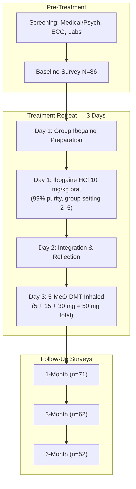

# Open-label study of consecutive ibogaine and 5-MeO-DMT assisted-therapy for trauma-exposed male Special Operations Forces Veterans

**Citation:** Davis, A. K., Xin, Y., Sepeda, N., & Averill, L. A. (2023). Open-label study of consecutive ibogaine and 5-MeO-DMT assisted-therapy for trauma-exposed male Special Operations Forces Veterans: prospective data from a clinical program in Mexico. *The American Journal of Drug and Alcohol Abuse*, 49(5), 587–596. DOI: [10.1080/00952990.2023.2220874](https://doi.org/10.1080/00952990.2023.2220874)

## Abstract

Background: Research in psychedelic medicine has focused primarily on civilian populations. Further study is needed to understand whether these treatments are effective for Veteran populations. Objectives: Here, we examine the effectiveness of psychedelic-assisted therapy among trauma-exposed Special Operations Forces Veterans (SOFV) seeking treatment for cognitive and mental health problems in Mexico. Methods: Data were collected from an ibogaine and 5-methoxy-N,N-dimethyltryptamine (5-MeO-DMT) clinical treatment program for SOFV with a history of trauma exposure. This clinical program collects prospective clinical program evaluation data, such as background characteristics, symptom severity, functioning (e.g., satisfaction with life, posttraumatic stress disorder symptoms, depression symptoms, anxiety symptoms, sleep disturbance, psychological flexibility, disability in functioning, cognitive functioning, neurobehavioral symptoms, anger, suicidal ideation), and substance persisting/enduring effects through online surveys at four timepoints (baseline/pre-treatment, one-, three-, and six-months after treatment). Results: The majority of the sample (n = 86; Mean Age = 42.88, SD = 7.88) were Caucasian (87.2%), non-Hispanic (89.5%), and males (100%). There were significant and large improvements in self-reported PTSD symptoms (p < .001, d = .414), depression (p < .001, d = .275), anxiety (p < .001, d = .276), insomnia severity (p < .001, d = .351), and post-concussive symptoms (p < .001, d = .389) as well as self-reported satisfaction with life (p < .001, d = .371), psychological flexibility (p < .001, d = .313) and cognitive functioning (p < .001, d = .265) from baseline to one-month follow-up. Conclusions: Data suggest combined ibogaine and 5-MeO-DMT assisted therapy has potential to provide rapid and robust changes in mental health functioning with a signal of durable therapeutic effects up to 6-months. Future research in controlled settings is warranted.

## Key Findings

This study represents the first prospective evaluation of combined ibogaine and 5-MeO-DMT treatment in a military veteran population, extending the authors' earlier retrospective work with a larger cohort and longitudinal follow-up. The central result is striking: a three-day intervention produced broad, statistically robust improvements across eleven clinical domains, with the majority of gains persisting to six months post-treatment.

The strongest treatment effects emerged for PTSD symptomatology (PCL-5 scores dropping from 35.16 to 18.44 at one month; partial η² = .414), anger regulation (η² = .402), and post-concussive neurobehavioural symptoms (η² = .389). These represent very large effect sizes by conventional standards (large ≥ 0.14). Notably, insomnia severity and life satisfaction also showed substantial shifts (η² = .351 and .371, respectively). Depression and anxiety improvements, while highly significant (both p < .001), yielded smaller though still meaningful effect sizes (η² = .275 and .276).

Suicidal ideation showed the smallest effect (η² = .050, p < .01), with improvement reaching significance only between baseline and one month — a finding worth contextualising given that baseline scores on the DSI-SS were already relatively low (M = 1.03), potentially constraining room for measurable reduction.

Post-hoc comparisons consistently showed the pattern BL > 1m = 3m = 6m, indicating that therapeutic gains achieved within the first month were maintained without significant erosion over the subsequent five months. This durability signal is particularly noteworthy for a single-episode intervention in a population characterised by treatment resistance.

Nearly half the cohort (48.6%) rated the combined experience as the single most spiritually significant event of their lives at one-month follow-up, and 42.9% described it as their most psychologically insightful experience.

## Methodology

This was a retrospective chart review of prospectively collected clinical programme evaluation data, approved by the Ohio State University IRB. The sample comprised 86 English-speaking US Special Operations Forces Veterans who attended a residential psychedelic-assisted therapy programme in Mexico between September 2019 and March 2021. Participants underwent comprehensive pre-treatment screening including medical and psychiatric history, blood panel, urine drug screen, and ECG.

### Treatment Protocol

Ibogaine was administered on day one in a group setting with continuous cardiac and blood pressure monitoring plus intravenous saline and electrolytes; participants remained supine throughout. Day two was dedicated to integration (individual reflection and group discussion with programme staff). On day three, participants received inhaled 5-MeO-DMT in incremental doses of 5, 15, and 30 mg (50 mg total), administered individually; optional fourth (30 mg) or fifth (45 mg) doses were given if peak effects were not observed. Group preparation and integration sessions bracketed both administrations.

### Sample Characteristics

| Characteristic | Value |
|:---|:---|
| Age, mean (SD) | 42.88 (7.88) |
| Sex: Male | 100% |
| Race: Caucasian/White | 87.2% |
| Hispanic/Latino | 10.5% |
| Education ≥ some college | 90.7% |
| Married/living with spouse | 61.6% |
| Employed (full/part-time) | 80.2% |
| **Military branch** | |
| Navy | 84.0% |
| Army | 9.3% |
| Marine Corps | 3.5% |
| Air Force | 1.2% |
| Active duty post-9/11 | 90.7% |
| Deployed (OEF/OIF) | 90.7% |

### Head Injury Profile

The cohort's TBI burden was exceptionally high — 81.4% reported traumatic brain injury and 86% sustained head injuries during deployment. Deployment-related injury mechanisms included blast (85.1%), fall (55.4%), vehicular (47.3%), fragment (2.7%), and bullet (1.4%). Following their worst deployment head injury, 85.7% reported being dazed/confused and 73.8% experienced prolonged symptoms (headache, dizziness, irritability, memory problems, balance issues). Beyond deployment, 79.1% reported additional non-deployed head injuries (47.1% with loss of consciousness), and 37.2% had pre-military sport-related head injuries, with 72% of those sustaining two or more concussions. Current symptoms attributed to deployment head injury included memory problems (82.1%), irritability (76.2%), sleep problems (72.6%), and tinnitus (70.2%).

### Assessment Battery and Analysis

Self-report surveys were administered at baseline (n = 86), one month (n = 71), three months (n = 62), and six months (n = 52); 44 participants completed all four timepoints. The battery comprised: PTSD (PCL-5), depression (PHQ-2), anxiety (GAD-2), insomnia (ISI), psychological flexibility (AAQ-II), disability (SDS), cognitive functioning (MOS-CF), neurobehavioural symptoms (NSI), anger (DEQ-A), and suicidal ideation (DSI-SS). Missing data were handled via last-observation-carried-forward within an intention-to-treat framework. Repeated-measures ANOVAs with Bonferroni-corrected post-hoc comparisons were used throughout; effect sizes were reported as partial η².

## Treatment Outcomes

### Primary Outcome Data

| Measure | Baseline M (SD) | 1-Month M (SD) | 3-Month M (SD) | 6-Month M (SD) | F | Partial η² |
|:---|:---|:---|:---|:---|:---|:---|
| SWLS (Life Satisfaction) | 19.15 (7.25) | 25.28 (6.99) | 24.99 (6.60) | 25.15 (6.39) | 50.23*** | .371 |
| PCL-5 (PTSD) | 35.16 (15.36) | 18.44 (16.23) | 17.77 (13.98) | 18.41 (15.08) | 60.14*** | .414 |
| PHQ-2 (Depression) | 2.88 (1.88) | 1.34 (1.59) | 1.42 (1.56) | 1.50 (1.54) | 32.30*** | .275 |
| GAD-2 (Anxiety) | 2.79 (1.74) | 1.34 (1.52) | 1.43 (1.43) | 1.57 (1.55) | 32.46*** | .276 |
| ISI (Insomnia) | 14.67 (5.85) | 9.90 (6.32) | 9.62 (6.08) | 9.29 (6.49) | 45.92*** | .351 |
| SDS (Disability) | 6.49 (3.37) | 4.35 (4.31) | 4.62 (4.42) | 5.09 (4.54) | 7.68*** | .083 |
| AAQ-II (Psych. Flexibility) | 24.69 (9.60) | 17.28 (8.98) | 17.06 (8.57) | 16.95 (8.84) | 38.67*** | .313 |
| MOS-CF (Cognitive Function) | 57.36 (19.15) | 73.84 (20.08) | 70.47 (20.64) | 73.14 (18.82) | 30.68*** | .265 |
| NSI (Neurobehavioural Sx) | 31.48 (13.95) | 18.84 (14.50) | 20.31 (13.15) | 19.35 (13.35) | 54.09*** | .389 |
| DEQ-A (Anger) | 15.06 (6.56) | 9.63 (5.72) | 9.44 (4.92) | 9.19 (4.96) | 57.12*** | .402 |
| DSI-SS (Suicidality) | 1.03 (1.68) | 0.60 (1.40) | 0.70 (1.47) | 0.67 (1.43) | 4.45** | .050 |

\*\*p < .01, \*\*\*p < .001. Partial η²: small = 0.01; medium = 0.06; large = 0.14.

### Prior Treatment History and Outcome Context

Participants reported seeking treatment for memory/concentration problems (84.9%), TBI (81.4%), depression (79.1%), anxiety (76.7%), PTSD (72.1%), sleep problems (67.4%), anger/rage (60.5%), and fatigue (57%). Prior interventions attempted included dietary/nutritional approaches (75.6%), nutraceutical supplements (62.8%), yoga (59.3%), acupuncture (54.7%), cannabis (52.3%), psychotherapy (51.2%), and psychiatric medications (46.5%). This extensive prior treatment history positions the cohort as functionally treatment-experienced, though the lack of detailed SSRI data limits characterisation of true treatment resistance.

The improvement in post-concussive symptoms (NSI reduction from 31.48 to 18.84, η² = .389) stands out as one of the study's most distinctive contributions, given the extreme TBI prevalence in this population. Whether this reflects genuine neurological recovery versus resolution of overlapping psychiatric symptomatology remains an open question that the authors appropriately flag for mechanistic investigation — a question subsequently addressed by the [Cherian et al. (2024)](../2024/Cherian2024_Magnesium_Ibogaine_TBI.md) MISTIC trial.

## Clinical Implications

The rapidity of onset — measurable within one month of a three-day intervention — contrasts sharply with conventional gold-standard approaches for PTSD (CPT, PE) that typically require 8–12 weeks of weekly sessions and suffer from high dropout rates (the authors note that only 11.4% of veterans at one VA clinic even initiated CPT or PE). For a population characterised by reluctance to engage with prolonged mental health treatment, the compressed treatment timeline may represent a meaningful advantage in engagement and completion.

The group administration format deserves attention. Ibogaine was delivered in a shared setting with 2–5 co-participants, reflecting indigenous ceremonial practice rather than the individualised dosing model predominant in Western psychedelic clinical trials. The authors suggest this communal element may be particularly well-suited to military populations who value peer connection and shared experience, though the design cannot isolate group effects from pharmacological ones.

The sustained six-month trajectory, achieved without booster sessions, raises important questions about whether these substances facilitate durable neuroplastic or psychological reorganisation — a hypothesis now being explored through neuroimaging approaches in the related [Williams et al. (2025)](../2025/Williams2025_Magnesium_Ibogaine_TBI.md) work.

## Limitations

The authors identify several substantive constraints. No adverse event data were collected, leaving the safety profile entirely uncharacterised — a critical gap for any intervention involving ibogaine's known cardiac risks. All outcomes relied on self-report instruments without clinician-administered confirmation. The sample lacked diversity across race, gender, and service era, limiting generalisability. Attrition was substantial: only 51% (44/86) completed all four assessment timepoints, and the last-observation-carried-forward imputation strategy, while conservative, may mask differential trajectories among completers and non-completers. The absence of a control group — neither active nor placebo — means that expectancy, regression to the mean, and the therapeutic milieu cannot be distinguished from pharmacological effects. Finally, incomplete data on prior and concurrent SSRI use complicates interpretation, given known pharmacokinetic interactions between SSRIs and both ibogaine and 5-MeO-DMT.

---

## See Also

**Parent hub:** [BLUE_Outcomes_Hub](../Hubs/BLUE_Outcomes_Hub.md)

- [Davis2020_SpecialOps_Veterans_Trauma](../2020/Davis2020_SpecialOps_Veterans_Trauma.md) — Retrospective predecessor study (n = 51) with the same population and programme
- [Cherian2024_Magnesium_Ibogaine_TBI](../2024/Cherian2024_Magnesium_Ibogaine_TBI.md) — MISTIC protocol: controlled investigation of ibogaine for TBI in veterans, addressing the mechanistic questions raised here
- [Williams2025_Magnesium_Ibogaine_TBI](../2025/Williams2025_Magnesium_Ibogaine_TBI.md) — Neuroimaging follow-up exploring neural mechanisms of ibogaine-related TBI improvement
- [Barsuglia2018_SPECT_Ibogaine_5-Meo-DMT_Alcohol_Use_Disorder](../2018/Barsuglia2018_SPECT_Ibogaine_5-Meo-DMT_Alcohol_Use_Disorder.md) — Case report establishing the sequential ibogaine + 5-MeO-DMT combination protocol with SPECT imaging
- [Kratina2023_Observational_Studies_Combo_Psychedelic_Use_Beyond_Regulated_Contexts](Kratina2023_Observational_Studies_Combo_Psychedelic_Use_Beyond_Regulated_Contexts.md) — Commentary on methodological challenges of studying combination psychedelic protocols outside clinical trials
- [Knuijver2021_Safety_Opioid_Detox](../2021/Knuijver2021_Safety_Opioid_Detox.md) — Cardiac safety considerations for ibogaine administration relevant to the absence of adverse event reporting in this study
