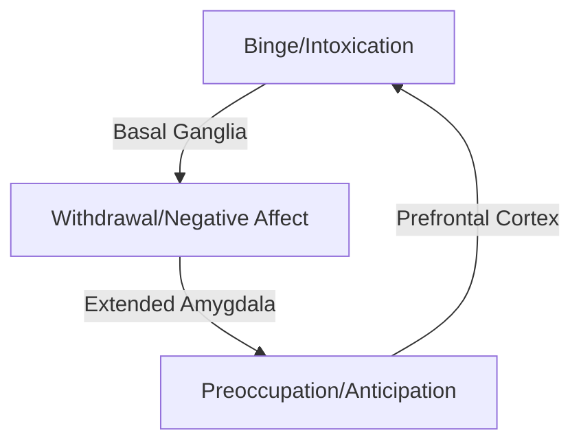
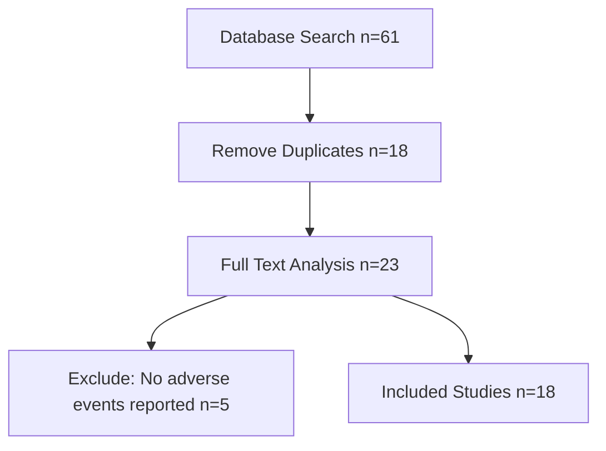
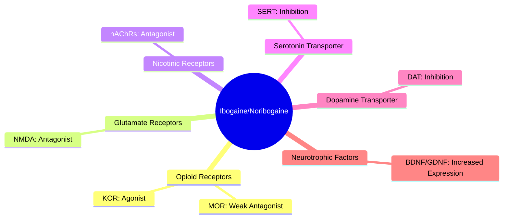

# UNIVERSITAT ROVIRA I VIRGILI

## IBOGAINE FOR THE TREATMENT OF OPIOID DEPENDENCE: FROM MECHANISMS OF ACTION TO CLINICAL EFFICACY

**Genís Oña Esteve**

> **ADVERTIMENT.** L'accés als continguts d'aquesta tesi doctoral i la seva utilització ha de respectar els drets de la persona autora. Pot ser utilitzada per a consulta o estudi personal, així com en activitats o materials d'investigació i docència en els termes establerts a l'art. 32 del Text Refós de la Llei de Propietat Intel·lectual (RDL 1/1996). Per altres utilitzacions es requereix l'autorització prèvia i expressa de la persona autora. En qualsevol cas, en la utilització dels seus continguts caldrà indicar de forma clara el nom i cognoms de la persona autora i el títol de la tesi doctoral. No s'autoritza la seva reproducció o altres formes d'explotació efectuades amb finalitats de lucre ni la seva comunicació pública des d'un lloc aliè al servei TDX. Tampoc s'autoritza la presentació del seu contingut en una finestra o marc aliè a TDX (framing). Aquesta reserva de drets afecta tant als continguts de la tesi com als seus resums i índexs.

> **WARNING.** Access to the contents of this doctoral thesis and its use must respect the rights of the author. It can be used for reference or private study, as well as research and learning activities or materials in the terms established by the 32nd article of the Spanish Consolidated Copyright Act (RDL 1/1996). Express and previous authorization of the author is required for any other uses. In any case, when using its content, full name of the author and title of the thesis must be clearly indicated. Reproduction or other forms of for profit use or public communication from outside TDX service is not allowed. Presentation of its content in a window or frame external to TDX (framing) is not authorized either. These rights affect both the content of the thesis and its abstracts and indexes.

---

**Genís Oña Esteve**

**Ibogaine for the Treatment of Opioid Dependence: From Mechanisms of Action to Clinical Efficacy**

**Doctoral thesis**

**Thesis supervised by**
Dr. Maria Teresa Colomina Fosch
Dr. José Carlos Bouso

**ICEERS**
**UNIVERSITAT ROVIRA I VIRGILI**

---

I STATE that the present study, entitled "Ibogaine for the treatment of opioid dependence: from mechanisms of action to clinical efficacy," presented by Genís Oña Esteve, was conducted under my supervision at Universitat Rovira i Virgili and the International Center for Ethnobotanical Education Research & Service (ICEERS), in fulfilment of the requirements for the degree of Doctor, and meets the requirements to qualify for International Mention.

**Doctoral Thesis Supervisors**
Maria Teresa Colomina Fosch
José Carlos Bouso

Reus, 15 July 2024

---

All the experimental phases of this thesis were carried out at the ICEERS Research Department, the Hospital Sant Joan Reus-Baix Camp, and the following groups and Departments at the Universitat Rovira i Virgili: the Neurobehavior and Health (NEUROLAB) research group, the Research Center for Behavior Assessment (CRAMC), the Department of Psychology, the Biochemistry and Biotechnology Department, and the Centre for Environmental, Food and Toxicological Technology (TecnATox).

**This work was funded by:**

* The Doctorats industrials program-AGAUR-Generalitat de Catalunya
* Dr. Bronner's
* The Riverstyx Foundation
* The Etheridge Foundation
* The Multidisciplinary Association for Psychedelic Studies
* The Nikean Foundation

---

> La simplicidad lógica característica de las ciencias nunca es alcanzada por la naturaleza sin alguna mezcla de ficción
> — F.P. Ramsey

---

## ACKNOWLEDGEMENTS

*(Original text in Catalan and other languages preserved)*

Vaig començar la tesi amb una llarga melena i una vista excel·lent, i l'acabo amb una extensa calva i amb ulleres per veure-hi de lluny, signes dels potencials efectes perjudicials d'embarcar-se en una tesi doctoral. O això és el que dirien alguns. En el transcurs d'aquests anys he anat adquirint les habilitats explícites i implícites, formals i informals, que configuren el saber i procedir científic i que m'impedeixen establir una relació de causalitat entre aquests trets físics actuals i el treball en la meva tesi i, per tant, em permeten donar les gràcies a moltes coses d'aquests anys en aquest famós apartat introductori d'agraïments.

Estic molt d'acord amb l'afirmació que diu que la investigació científica és més aviat un art, molt similar al treball de l'artesà que és capaç de perfeccionar les seves habilitats amb el pas dels anys. Així ho sentenciava Beveridge en un famós manual d'introducció a la matèria, que porta per títol, precisament, *The art of scientific investigation*. Si la recerca és un art, el procés de tesi doctoral és un dels tallers on s'aprèn. I per arribar en aquest taller, en el meu cas, han passat moltes coses. Moltíssimes. He pres males decisions moltes vegades, n'he pres algunes d'encertades només en algunes ocasions. Però agraeixo tot el que ha passat perquè avui en dia em trobi aquí, en una casa enmig de les muntanyes boscoses del sistema prelitoral central, escrivint aquestes línies.

Obviament, hi ha hagut elements que han jugat un paper més important que altres a l'hora de conduir-me cap al camí actual i els quals voldria fer explícits aquí, de la forma més exhaustiva que la meva consciència i memòria em permetin.

Primer que tot gràcies als meus pares per sempre estar allà, de forma incondicional, i educar-me de la millor manera possible. Gràcies a les plantes i productes que la terra ens dóna de forma incondicional; per la pluja, el Sol, la lluna i el vent, que sostenen en silenci la vida.

Gràcies a tots els autors i autores que m'han inspirat i en els quals he trobat racons impagables d'afinitat i comprensió. A Hermann Hesse, Aldous Huxley, Jack London o Goethe; i també gràcies a Judit Neddermann pel seu art, pel consol de les seves lletres, per les experiències meravelloses dels seus concerts i per la inspiració personal. Gràcies a Jim Morrison per obrir-me a un altre món, i a tants altres artistes (sobretot els clàssics, dels 70 cap enrere!).

Gràcies a molts dels meus professors, que durant l'etapa d'educació secundària i batxillerat m'insistien en continuar estudiant, mentre jo insistia en seguir fent campana. Gràcies a totes les persones que s'han preocupat per mi en algun moment i m'han donat un cop de mà. I gràcies també a aquelles que no ho han fet, doncs m'han obligat a persistir i trobar la manera.

Gràcies a totes les persones que han treballat incansablement pels psicodèlics, que han estat molt de temps lluitant contra murs inquebrantables, convençuts de que tothom hauria de tenir l'experiència profunda que aquestes eines poden induir. He d'afegir unes línies més sobre això. Encara que l'esforç d'aquestes persones sigui legítim i es faci des d'un desig bondadós, i que, efectivament, si aquesta experiència profunda apareix et pot canviar la vida, no podem esperar que tothom tingui les mateixes experiències. No tothom té experiències espirituals, transformadores, ni tant sols remotament positives. També hi ha persones que ho poden passar molt malament i patir les conseqüències durant molt de temps. Espero que ara que aquests murs han caigut i que tothom està entusiasmat amb aquestes substàncies es tingui això present.

Spuch, segueixes molt present en els nostres cors, sé que n'ets conscient. Vas ser més llest que ningú i t'has estalviat les responsabilitats de la vida adulta, una pandèmia global i altres coses que segur vindran. Però vas estar temps suficient en aquest món com per ensenyar-nos moltes coses. Gràcies per tot.

Gràcies a Jordi Riba, amb qui vaig aprendre molt, no només sobre farmacologia. T'hauria d'haver escoltat més, Jordi.

I ja entrant en el context de la meva tesi, gràcies a tantes persones que l'han fet possible. Tècnics, administratius, analistes, telefonistes, secrataris, avaluadors, infermers, metges, caps de servei, coordinadors, etc. Gràcies al meravellós equip de l'Hospital de Reus (que cada dos per tres canvia de nom i de gerent, així que poso el nom popular) que hem format per dur a terme l'estudi. Al super equip de infermeria (Edu, Neus i Andrés), que ha estat sempre al peu del canó, a l'Eulàlia i la Lourdes, la Carme Ligero, el Josep Mª Alegret, en Toni Llort, i sobretot gràcies a la Tre Borràs, capitana incansable del vaixell, per la valentia, la paciència i la mà esquerra.

Muito obrigado também a Rafael Guimarães e a Jaime EC Hallak por facilitar em todos os aspectos possíveis minha estadia de doutorado em seu laboratório no Brasil, por me receber de forma tão calorosa e amável e permitir que eu conhecesse não apenas seu trabalho pioneiro com substâncias psicoativas, mas também a complexa e rica cultura de um país que sempre levarei no coração.

Moltes gràcies a la Teresa Colomina, qui des d'un principi va confiar en mi, i en moments delicats sempre m'ha brindat el seu suport i consell. Per mi no hi pot haver millor exemple de investigadora, mentora i professora. Com en el meu cas, també hi ha moltes altres persones que han sentit la seva presència i professionalitat com una benedicció, i no ho podem agrair prou. Donades les circumstàncies del món universitari i especialment els escandols que surten de tant en tant sobre el món de les tesis doctorals, són les persones així les que marquen una diferència. Així que gràcies Teresa!

Gràcies també a Judit Biosca per tota la feina i suport durant la redacció dels articles en que ha col-laborat. Si m'enduc algun mèrit en relació a les òmiques aquest serà ilegítim, tot el mèrit és seu.

Moltes gràcies a José Carlos Bouso per oferir-me la possibilitat de fer aquesta tesi. Tu vas moure fils, vas muntar l'estructura i les relacions, deixant-me entrar a casa teva i fer la feina que s'havia de fer. Considero els anys que he treballat amb tu com un llegat que sempre m'acompanyarà i del qual he après molt.

I com no? Gràcies infinites a Pinotxo, Kenya i Freeda per tot el seu amor, i a la Eva, per ser, per estar, per florir, per tota ella. Tamos juntos mor.

Cal Junts (Ranxos de Bonany), 2024.

---

## GENERAL SUMMARY

Substance use disorders remain one of the most challenging health problems to address. Specifically, opioid dependence has caused serious public health issues in countries such as the United States and Canada over the last decade, underscoring the need for innovative and effective treatments. Recently, mental health researchers have shown a renewed interest in psychedelic drugs. Substances such as lysergic acid diethylamide (LSD), psilocybin mushrooms, and ayahuasca have shown promising results in treating conditions including major depression and anxiety disorders. Among these, ibogaine, an alkaloid found naturally in the West African plant *Tabernanthe iboga*, appears particularly effective in treating substance use disorders. However, despite its widespread underground and unsupervised use, controlled trials evaluating the safety and efficacy of ibogaine are lacking, and its mechanisms of action remain largely unknown.

In this thesis, we conducted both clinical and preclinical studies on ibogaine to provide more evidence about this molecule and to expand our understanding of it. Clinically, we performed a systematic review of adverse events in humans associated with ibogaine to collect updated safety data. Subsequently, we designed a Phase II, randomized, double-blind clinical trial. In this trial, low, single doses of ibogaine (100 mg) were administered in the context of methadone detoxification. Plasma samples from the trial were analyzed using a metabolomic approach. The systematic review and clinical trial data were complemented with a narrative review, which identified all potential ibogaine targets associated with its anti-addictive effect and provided updated mechanistic literature. Preclinically, we designed a study with mice to elucidate further mechanisms of action. Following acute administration of ibogaine, brain tissue was analyzed using transcriptomic analysis to determine the expression levels of a wide array of genes.

The clinical results were highly promising. The systematic review highlighted the need for medical supervision during ibogaine treatments due to its potential to prolong the QT interval and its complex metabolism. In the clinical trial, which included 20 patients, we observed a significant decrease in both tolerance to methadone and opioid withdrawal syndrome (OWS). As a result, 17 out of 20 patients were able to halve their methadone dose over seven days without experiencing OWS symptoms and discontinue their daily methadone use for an average of 18.03 hours. No serious adverse events were reported. Results from the metabolomic analysis suggest that ibogaine can potentially reverse the effects of chronic opioid use on energy metabolism. These findings align with the multi-target profile of ibogaine identified in the narrative review. The preclinical study revealed new potential pathways associated with ibogaine's anti-addictive effects. Specifically, genes related to hormonal pathways and synaptogenesis showed increased expression after acute ibogaine administration. Additionally, gender differences were observed, with females exhibiting changes in 28 genes compared to eight in males.

This thesis provides the first evidence of ibogaine's safety and efficacy in a Phase II study and delves deeper into its mechanisms of action through a review, a preclinical study, and an analysis of human plasma samples using innovative techniques. We conclude that ibogaine represents a promising candidate for the treatment of opioid use disorders, warranting further research.

---

## ABBREVIATIONS

* **ABC**: ATP-binding cassette
* **APA**: American Psychiatric Association
* **ATP**: Adenosine triphosphate
* **BCRP**: Breast cancer resistance protein
* **BDNF**: Brain-derived neurotrophic factor
* **cAMP**: Cyclic adenosine monophosphate
* **CNS**: Central Nervous System
* **CPP**: Conditioned place preference
* **CRF**: Corticotropin-releasing factor
* **CYP2D6**: Cytochrome P450 2D6
* **CYP3A4**: Cytochrome P450 3A4
* **DAT**: Dopamine transporter
* **DOR**: Delta opioid receptor
* **DSM-V-TR**: Diagnostic and statistical manual of mental disorders V - Text revision
* **eCRF**: Electronic case report form
* **EDDP**: 2-ethylidene-1,5-dimethyl-3,3-diphenylpyrrolidine
* **GABA**: Gamma-aminobutyric acid
* **GDNF**: Glial cell line-derived neurotrophic factor
* **hERG**: Human ether-a-go-go-related gene
* **IBO**: Ibogaine
* **KOR**: Kappa opioid receptor
* **LC**: Locus coeruleus
* **MOR**: Mu opioid receptor
* **NAc**: Nucleus accumbens
* **nAChR**: Nicotinic acetylcholine receptor
* **NIDA**: National Institute on Drug Abuse
* **NMDA**: N-Methyl-d-aspartate
* **NMR**: Nuclear magnetic resonance
* **NOR**: Noribogaine
* **NTFs**: Neurotrophic factors
* **OUD**: Opioid use disorder
* **OWS**: Opioid withdrawal syndrome
* **PAG**: Periaqueductal gray
* **P-gp**: P-glycoprotein
* **PNSD**: Plan Nacional Sobre Drogas
* **RCT**: Randomized and controlled clinical trial
* **RT-qPCR**: Real-time quantitative polymerase chain reaction
* **SERT**: Serotonin transporter
* **SUD**: Substance use disorder
* **US**: United States
* **VTA**: Ventral tegmental area

---

## Table of Contents

1. **Introduction** (p. 25)
1. Substance use disorders (p. 25)
2. Opioid use disorder (p. 27)
1. Pharmacological and clinical aspects of the opioid use disorder (p. 29)
2. The current opioid use disorder epidemic (p. 32)
3. Available treatments for opioid use disorder (p. 33)
* Methadone (p. 33)

3. Ibogaine as a potential solution (p. 35)
1. Ibogaine as a treatment for opioid use disorder: Preclinical and clinical evidence (p. 37)
2. Overall pharmacology of ibogaine (p. 38)

2. **Hypotheses and Objectives** (p. 43)
1. Hypotheses (p. 43)
2. Objectives (p. 43)

3. **General Methodology** (p. 47)
4. **Results** (p. 51)
* **Publication 1:** The adverse events of ibogaine in humans: An updated systematic review of the literature (2015-2020) (p. 53)
* **Study 2 (Submitted):** Reversing tolerance in methadone detoxification with a low dose of ibogaine (p. 91)
* **Publication 3:** Main targets of ibogaine and noribogaine associated with its putative anti-addictive effects: A mechanistic overview (p. 127)
* **Publication 4:** A transcriptomic analysis in mice following a single dose of ibogaine identifies new potential therapeutic targets (p. 155)

5. **Discussion** (p. 167)
1. General Discussion (p. 167)
2. Limitations and Future Perspectives (p. 172)

6. **Conclusions** (p. 177)
1. General Conclusion (p. 178)

7. **References** (p. 181)

---

## List of Figures and Tables

### Figures

* **Figure 1:** Phases of drug use with the main associated brain areas. (p. 26)
* **Figure 2:** Chemical structures of different opioids. (p. 28)
* **Figure 3:** Chemical structure of ibogaine. (p. 35)

**Publication 1**

* **Figure 1:** Flowchart of the systematic review. (p. 62)

**Study 2**

* **Figure 1:** Hourly QTc values obtained across the 24h period of ibogaine sessions. (p. 102)
* **Figure 2:** SOWS scores obtained over the 12 hours after ibogaine administration. (p. 103)
* **Figure 3:** Mean VAS scores obtained 12 hours after ibogaine administration. (p. 105)
* **Figure 4:** Principal component analysis, random forest representation, and Student’s t-test results of changes in aqueous metabolites 24h after ibogaine administration. (p. 106)
* **Figure 5:** Principal component analysis, random forest representation, and Student’s t-test results of changes in aqueous metabolites after 24h of ibogaine administration in patients using low, daily methadone doses. (p. 107)
* **Figure 6:** Principal component analysis, random forest representation, and Student’s t-test results of changes in aqueous metabolites after 24h of ibogaine administration in patients using high, daily methadone doses. (p. 108)
* **Supplementary Figure 1:** Main metabolic pathways modulated by ibogaine. (p. 123)
* **Supplementary Figure 2:** Principal component analysis and random forest representation of lipid metabolites changes after 24h of ibogaine administration. (p. 123)
* **Supplementary Figure 3:** Principal component analysis, random forest representation, and Student’s t-test results of changes in lipid metabolites after 24h of ibogaine administration in the group using low, daily doses of methadone. (p. 124)
* **Supplementary Figure 4:** Principal component analysis and random forest representation of changes in lipid metabolites after 24h of ibogaine administration in the group using high, daily doses of methadone. (p. 124)
* **Supplementary Figure 5:** Main metabolic pathways modulated by ibogaine. (p. 125)

**Publication 3**

* **Figure 1:** Main targets of ibogaine and noribogaine related to the treatment of substance use disorders and the respective effects they convey. (p. 132)

**Publication 4**

* **Figure 1:** Frontal cortex gene expression determined by qPCR. (p. 161)
* **Figure 2:** Frontal cortex gene expression determined by qPCR with treatment differences. (p. 162)

### Tables

* **Table 1:** Summary of studies included in this thesis. (p. 51)

**Study 2**

* **Table 1:** Decreases in methadone dose use after ibogaine administration. (p. 104)
* **Supplementary Table 1:** Psychometric measures administered over a 12h timeframe in ibogaine sessions. (p. 119)
* **Supplementary Table 2:** Number of samples per group in the metabolomic analysis. (p. 120)
* **Supplementary Table 3:** Information on smokers and medications used. (p. 121)
* **Supplementary Table 4:** Blood pressure means at each time point. (p. 121)
* **Supplementary Table 5:** AUC scores in each metabolite for aqueous and lipid extractions and high or low methadone dose. (p. 122)

**Publication 3**

* **Table 1:** Binding affinities of ibogaine and noribogaine to the main targets related to substance use disorders. (p. 140)

**Publication 4**

* **Table 1:** Animals used in the study. (p. 158)
* **Table 2:** DESeq2 results of differentially expressed genes comparing control and ibogaine-treated groups. (p. 159)
* **Table 3:** DESeq2 results of differentially expressed genes comparing male control and ibogaine-treated groups. (p. 160)
* **Table 4:** DESeq2 results of differentially expressed genes comparing female control and ibogaine-treated groups. (p. 160)

---

## 1. Introduction

Drug use has been highly prevalent throughout human cultures and historical periods, serving various purposes such as medicinal, recreational, and religious (Crocq, 2007). Often, drugs have been mixed and combined for these purposes. Drug use is also a common behavior among other mammals and is thus considered a trait shared by certain animals, including humans (Siegel, 2005). However, while drug use may be, to some extent, normal across different species, the development of drug dependence is more characteristic of humans since there is little evidence to suggest that animals become addicted to substances in nature (Siegel, 2005).

Opioids, which include extracts or substances isolated from the opium poppy (*Papaver somniferum*) as well as semi- or fully synthesized molecules that bind to opioid receptors, are one of the drug classes most strongly associated with the development of dependence. Due to their unique analgesic properties, opioids have been highly valued and widely consumed. The problems associated with opioid dependence, or opioid use disorder (OUD), began to escalate on a larger scale after the 1980s. During this period, the attitude towards the use of opioids shifted from "opiophobia" to increased demands from both pain specialists and patients for the expanded use of these drugs in appropriate medical care (Lyden & Binswanger, 2019; Morgan, 1985). A publication (Porter & Jick, 1980) consisting of a single paragraph was often cited as evidence of the low dependence potential of opioids. This situation was exacerbated by misleading techniques and fraudulent practices used by pharmaceutical companies, leading to a nationwide public health crisis in certain countries, especially the United States (Humphreys et al., 2022; Keefe, 2021).

Unfortunately, effective treatments for tackling substance use disorders (SUDs), particularly OUD, are lacking. Currently, only substitution therapies are available, and there is no commercialized drug specifically indicated for treating symptoms of OWS, craving, or tolerance. Interestingly, recent interest in the potential applications of psychedelic drugs has highlighted the "anti-addictive" effects of ibogaine, a naturally-occurring alkaloid found in the plant *Tabernanthe iboga*. Case reports and observational studies suggest that this molecule could diminish OWS, craving, and tolerance to various drugs, including opioids. In the context of this thesis, the mechanisms of ibogaine will be explored through a narrative review and a preclinical study involving transcriptomic analysis. In addition, the adverse event profile of ibogaine in humans and its preliminary safety and efficacy will be assessed through a systematic review and the first Phase-II, randomized and double-blind trial with this substance.

### 1.1. Substance use disorders

The use of drugs by non-human animals tends to be seasonal and does not affect their survival or reproduction (Calvey, 2019). In contrast, humans are at risk of becoming dependent on drugs and can potentially suffer lethal consequences. Some authors have adopted evolutionary perspectives, suggesting that this difference between humans and other animals may be due to the self-domestication process that humans underwent during the last 2000-5000 years (Calvey, 2019). This process could have altered the function of the dopaminergic system, leading to specific vulnerabilities to SUDs. A similar process has been observed in domesticated versus wild monkeys; the former show interest in psychedelic mushrooms, while the latter are generally afraid of them (Siegel, 2005).

The phenomenon of drug dependence should be framed within the bio-psycho-social model, as various factors, including the environment, stress, socioeconomic status, and epigenetic changes, modulate this behavior in a complex manner (Pedrero-Pérez, 2015). However, we can also describe the establishment of drug dependence from a biochemical perspective. Most people who use drugs of abuse do not develop SUDs (Cruz, 2015; Nicholson et al., 2002). Therefore, the main interest in the field of drug dependence is to elucidate the brain mechanisms responsible for the transition from hedonic, non-problematic drug use to the development of SUDs. This transition involves multiple reinforcing cycles that lead to the establishment of pathologic behavioral patterns. This process can be divided into three different phases: the binge/intoxication phase, the withdrawal/negative stage, and the preoccupation/anticipation (craving) stage (Koob & Volkow, 2010).

*Figure 1: Conceptual Cycle of Addiction Phases (Based on Koob & Volkow, 2010)*

The first phase of binge/intoxication is related to the "reward system," which was initially described in the brain through electrical stimulation and intracranial self-stimulation (Olds & Milner, 1954). Although this system involves extended neurocircuitry, the most sensitive areas, defined by the lowest thresholds, are localized in the trajectory of the medial forebrain bundle that connects the ventral tegmental area (VTA) to the basal forebrain (Olds & Milner, 1954). Initially, it was thought that dopamine released in these areas, also known as the mesolimbic dopamine system, played the primary role in creating the feeling of reward and thus perpetuating drug use. However, it was later discovered that other neurotransmitters also play a significant role in creating feelings of reward (Lewis et al., 2021). Dopamine function is currently understood more in terms of generating salience to stimuli (Robinson & Berridge, 1993). Additionally, the speed at which dopamine is released is essential in determining whether something is potentially rewarding and susceptible to impulsive or pleasurable behaviors (Schultz, 2007).

Concerning the withdrawal/negative stage, the extended amygdala plays a central role as a substrate that integrates different brain systems for stress and arousal. The extended amygdala receives numerous afferents from limbic structures such as the basolateral amygdala and hippocampus and sends efferences to the medial part of the ventral pallidum and a large projection to the lateral hypothalamus (Volkow et al., 2019). This substrate contributes to the emergence of negative emotional states in the absence of acute drug use, thus reinforcing drug dependence. Dopamine is also strongly associated with the withdrawal stage, as chronic drug use leads to neuroadaptations that compromise dopamine systems during withdrawal. This results in decreased dopamine release in response to non-drug rewards, diminishing motivation for other activities (Melis et al., 2005; Volkow & Morales, 2015). In addition, the activity of the hypothalamic-pituitary-adrenal axis and the corticotropin-releasing factor (CRF) is enhanced during withdrawal, leading to anxiety-like responses (Koob & Volkow, 2010).

The preoccupation/anticipation (craving) stage appears to be a key element for relapse, and as a result, SUDs are sometimes categorized as chronic disorders. In preclinical research, two dimensions of craving have been defined: drug-induced reinstatement (McFarland & Kalivas, 2001) and cue-induced reinstatement (when elements or contexts related to drug use are present and trigger craving) (Everitt & Wolf, 2002). The former is more associated with the medial prefrontal cortex/nucleus accumbens/ventral pallidum circuit, primarily mediated by glutamate, while the latter involves the basolateral amygdala, which may interact with the prefrontal cortex in drug-induced reinstatement (Kalivas & O'Brien, 2008; Shaham et al., 2003). Animal studies on this stage have shown deficits in tasks involving the orbitofrontal, the prefrontal cortex, and the hippocampus (Jentsch et al., 2002; Schoenbaum et al., 2004). Similar results have been found in studies involving humans. For instance, individuals with cocaine use disorder exhibit impaired cognitive functions mediated by the medial and orbital prefrontal cortices, as well as memory deficits mediated by the hippocampus, which can predict treatment outcomes (Aharonovich et al., 2006).

### 1.2. Opioid use disorder

Opioid use disorder specifically refers to the problematic use of opioid drugs. Products derived from the plant *Papaver somniferum* (opium poppy) are known as opiates, with morphine and codeine being among them. Both drugs are extensively used to treat certain types of pain or dry cough. In addition to substances naturally found in the *P. somniferum*, semi-synthetic (heroin) or synthetic opioids (fentanyl, methadone) have been developed to create highly efficacious pain treatments. Natural opiates, and more recently, synthetic opioid drugs, have been utilized for countless years in European and Asian territories. Aside from their analgesic properties, these substances also induce psychoactive/euphoric effects. Their potential to generate dependence has also been recognized since antiquity. For instance, the Persian physician Imad al-Din Mahmud Shirazi wrote a treatise on opium in the 16th century (Shirazi, 2011), dedicating several chapters to its harmful aspects. He noted the difficulties faced by several individuals who were unable to cease their use of opium during Ramadan due to withdrawal symptoms. He suggested using rectal and slow-release oral opium products at night to prevent these symptoms.

*[Figure 2 Placeholder: Chemical structures of different opioids including Codeine, Morphine, Fentanyl, and Methadone.]*

The latest edition of the Diagnostic and Statistical Manual of Mental Disorders (DSM-V-TR) (APA, 2022) states that OUD can be diagnosed when at least two of the following criteria are met:

1. Opioids are often taken in larger amounts or over a longer period than was intended.
2. There is a persistent desire or unsuccessful efforts to cut down or control opioid use.
3. A great deal of time is spent on activities necessary to obtain the opioid, use the opioid, or recover from its effects.
4. Craving or a strong desire or urge to use opioids.
5. Recurrent opioid use resulting in a failure to fulfill major role obligations at work, school, or home.
6. Continued opioid use despite having persistent or recurrent social or interpersonal problems caused or exacerbated by the effects of opioids.
7. Important social, occupational, or recreational activities are given up or reduced because of opioid use.
8. Recurrent opioid use in situations in which it is physically hazardous.
9. Continued opioid use despite knowledge of having a persistent or recurrent physical or psychological problem that is likely to have been caused or exacerbated by the substance.
10. **Tolerance**, as defined by either of the following:
* A need for markedly increased amounts of opioids to achieve intoxication or desired effect.
* A markedly diminished effect with continued use of the same amount of an opioid.

11. **Withdrawal**, as manifested by either:
* The characteristic opioid withdrawal syndrome.
* Taking opioids (or a closely related substance) to relieve or avoid withdrawal symptoms.

In terms of severity, 2-3 criteria are considered mild, 4-5 moderate, and 6 or more indicates severe OUD on the spectrum (APA, 2022). Three key aspects of these criteria are particularly relevant in clinical terms. First, the overwhelming desire to obtain and use opioids despite personal, social, and professional consequences. Second, the development of opioid tolerance, where increasing doses are needed to achieve the same effect. Third, the onset of OWS upon cessation of opioid use.

### 1.2.1. Pharmacological and clinical aspects of the opioid use disorder

Opiates are characterized by their agonistic activity on opioid receptors, which are G-protein coupled receptors with seven transmembrane subunits. In the human body, there are three main opioid receptors: mu (μ; MOR), delta (δ; DOR), and kappa (k; KOR). These receptors derive their names from their prototypical agonists (morphine, N-allylnormetacine, and ketocyclazocine, respectively; Martin, 1979). Endogenous opioid peptides (endorphins, enkephalins, and dynorphins) modulate distinct functions by interacting with central or peripheral MOR, DOR, and KOR receptors. These functions include nociception, appetite, respiration, reward processing, and gastrointestinal motility. These peptides generally show low selectivity for specific receptor types, except for endomorphins (Zadina et al., 1997). In contrast, synthetic peptides and alkaloids can demonstrate high selectivity for KOR, MOR, or DOR receptors, which is why these compounds have been used to define the distinct pharmacological properties of each receptor (Feng et al., 2012). Synthetic opioids can be broadly categorized into four chemical groups: morphinan derivatives, diphenylheptane derivatives, benzomorphan derivatives, and phenylpiperidine derivatives (Pathan & Williams, 2012).

Activation of MOR primarily produces desired effects such as analgesia and euphoria (Bodnar, 2013), but it also leads to undesired effects, including dependence, tolerance development, respiratory depression, nausea and vomiting, and constipation (Akbarali et al., 2014; Brownstein, 1993; Christie, 2009; Mutolo et al., 2007). The prototypical MOR agonist is morphine. Analgesia induced by morphine and other MOR agonists involves the activation of MOR receptors located on the presynaptic terminals of nociceptive C-fibers and A-delta fibers. This activation indirectly inhibits voltage-dependent calcium channels, thereby reducing cyclic adenosine monophosphate (cAMP) levels and inhibiting the release of neurotransmitters, including glutamate, substance P, and calcitonin gene-related peptide from the nociceptive fibers (Trescot et al., 2008).

The analgesic and other desired effects of MOR agonists are unfortunately accompanied by certain undesired effects, most notably the induction of drug dependence and abuse potential (Zhang et al., 2022). MOR agonists likely induce drug dependence by suppressing a potent GABAergic input originating from the rostromedial tegmental nucleus. Additionally, evidence suggests that inhibiting GABAergic input from D2-expressing neurons in the nucleus accumbens (NAc) may contribute, albeit to a lesser extent, to these rewarding effects (Matsui et al., 2014).

Opioid tolerance develops quickly, necessitating higher doses over time to achieve the same effect. The phenomenon of drug tolerance is highly complex and not yet fully understood. However, it is at least partially mediated through MOR desensitization and internalization. Another potential mechanism involved in opioid tolerance is mediated through ATP-binding cassette transporters, mainly P-glycoprotein (P-gp) and Breast Cancer Resistance Protein (BCRP). Both P-gp and BCRP are highly involved in effluxing the drug from the cell. Notably, animals that have developed tolerance to opioids show elevated levels of P-gp and BCRP (Mercer & Coop, 2011).

OWS is another significant phenomenon associated with OUD. OWS manifests with symptoms such as pain, muscle spasms, tremors, abdominal cramps, nausea, diarrhea, anxiety, insomnia, and sweating (Kosten & Baxter, 2019). While the cessation of short-acting opioids (heroin, oxycodone) is associated with severe OWS that can persist up to 7 days, OWS associated with the cessation of long-acting opioids (methadone, buprenorphine) is characterized by milder symptoms that can last for two weeks or longer (Kosten & Baxter, 2019; Kosten & O'Connor, 2003).

### 1.2.2. The current opioid use disorder epidemic

During the 19th century, morphine and heroin, along with whole extracts or refined opium from *P. somniferum*, were commercially promoted to physicians and patients as reliable and effective means of relieving pain and other conditions (Lyden & Binswanger, 2019). By 1914, the problems associated with opioid dependence had become evident, leading to the introduction of the first United States law regulating the production, importation, and distribution of opiates.

In the late 20th century, the synthetic opioid oxycodone was marketed as a non-addictive medication. This led to three major "waves" of opioid overdoses:

1. **1990s:** Increased prescription opioids (natural/semi-synthetic and methadone).
2. **2010:** Sharp rise in heroin overdose deaths.
3. **2013:** Significant increases in overdose deaths involving synthetic opioids, particularly illicitly manufactured fentanyl (CDC, 2023).

Between 2005 and 2014, opioid-related hospitalizations in the US increased by 64%, and opioid overdose death rates rose by 27% between 2015 and 2019 (Jones et al., 2015; Martins et al., 2015; Weiss et al., 2018). In Spain, the most severe opioid crisis occurred during the 1980s and part of the 1990s (heroin). The problems associated with oxycodone and fentanyl have been mostly restricted to the US and Canada.

### 1.2.3. Available Treatments for Opioid Use Disorder

The first approach to treating OUD often involves detoxification. However, these interventions rarely yield results over the mid- or long-term and may increase the risk of overdose as the patient's tolerance diminishes (Strang et al., 2003). To achieve detoxification without the onset of OWS, two main treatments are used: methadone and buprenorphine. These treatments are based on opioid replacement therapy.

#### 1.2.3.1. Methadone

Methadone is a synthetic opioid and diphenylheptane derivative that acts as a full agonist at the μ opioid receptor and a noncompetitive antagonist at the N-methyl-d-aspartate (NMDA) receptor. Methadone has a half-life of 8-59 hours, which is longer in opioid naïve individuals and shorter in opioid-dependent subjects (Grissinger, 2011). Methadone is mostly metabolized through the CYP3A4 and CYP2D6 enzymes (Fonseca, 2010; Foster et al., 1999). Its main metabolite is EDDP (2-ethylidene-1,5-dimethyl-3,3-diphenylpyrrolidine), an inactive molecule.

Methadone maintenance programs were established in different countries under a harm reduction approach in the 1980s and 1990s. Despite benefits, missing a daily dose can lead to severe OWS, making it challenging to discontinue use (Amato et al., 2013; Mattick et al., 2014). Consequently, a significant portion of patients are unable to stop using it, resulting in iatrogenic drug dependence. Long-term adverse effects include cognitive decline, oral health issues, and potential risk of respiratory depression.

### 1.3. Ibogaine as a Potential Solution

Ibogaine is one of the alkaloids found in the *Tabernanthe iboga* shrub. Known for its powerful psychoactive effects, it is often described as an "atypical psychedelic" due to its distinct binding profile ([[Wasko2018_Ibogaine_DARK_Classics_in_Chemical_Neuroscience|Wasko et al., 2018]]). It exhibits affinity for various receptors, including opioid and glutamate receptors. Unlike other psychedelic drugs, ibogaine also carries cardiovascular risks.

*[Figure 3 Placeholder: Chemical structure of ibogaine]*

The serendipitous discovery of ibogaine's potential anti-addictive properties is credited to [[Howard_Lotsof_MOC|Howard Lotsof]] ([[Kenneth_Alper_MOC|Alper]] & Lotsof, 2007). In 1962, Lotsof and other heroin users observed that symptoms of OWS disappeared in five out of seven people the following day after taking ibogaine. Preclinical studies following this discovery demonstrated a reduction in the self-administration of cocaine, opioids, and alcohol. Ibogaine appears to be particularly effective in treating OUD (Brown & Alper, 2018; [[2017/Davis2017_Ibogaine_Opioid_Outcomes|Davis, 2017]]).

Preclinical studies have demonstrated that ibogaine effectively eliminates the withdrawal syndrome induced by naloxone or naltrexone in morphine-dependent rats (Dzoljic et al., 1988; [[1992/Glick1992_Ibogaine_Morphine_Withdrawal_Rats|Glick et al., 1992]]). Human studies have also provided data on the effectiveness of ibogaine in treating drug dependence, as indicated by case reports and observational studies ([[2001/Alper2001_Ibogaine_Review|Alper et al., 1999]]; [[2017/Noller2017_Ibogaine_Opioid_12Month_Outcomes|Noller et al., 2018]]; [[2018/Mash2018_Ibogaine_Detox_Opioid_Cocaine_Clinical_Observations_Tx_Outcomes|Mash et al., 2018]]; [[2018/Brown2018_OUD_Detoxification_Outcomes|Brown & Alper, 2018]]).

#### 1.3.2. Overall pharmacology of ibogaine

Ibogaine undergoes extensive first-pass metabolism in the liver, primarily by cytochrome P4502D6 ([[2015/Glue2015_Ibogaine_CYP2D6_Activity|CYP2D6]]) enzymes, converting it to **noribogaine**, the active metabolite.

* **Ibogaine:**  1.75–4 hours; Half-life (t½) 2.4–7.6 hours.
* **Noribogaine:**  4–10 hours; Half-life much longer (up to 49 hours for low doses).

Both exhibit large volumes of distribution. Slow elimination is attributed to lipophilic nature and enterohepatic circulation. The mechanisms of action are not fully understood but involve interaction with multiple receptor systems:

* NMDA receptors (antagonist)
* Opioid receptors (κ1, κ2, μ, δ2)
* Serotonin receptors (5-HT2, 5-HT3) and transporter (SERT)
* Muscarinic receptors (M1, M2)
* Nicotinic receptors (α3β4)
* Dopamine transporter (DAT)

Ibogaine inhibits [[2015/Koenig2015_Cardiac_Mechanisms|hERG channels]], delaying repolarization and prolonging the QT interval, potentially causing arrhythmias. It also has an inhibitory effect on P-glycoprotein (P-gp), which may contribute to reducing opioid tolerance.

---

## 2. Hypotheses and Objectives

### 2.1. Hypotheses

* Low doses of ibogaine administered in a controlled clinical setting are safe and efficacious in reducing drug tolerance and OWS severity and produce short-term metabolic changes.
* Multiple targets are involved in the anti-addictive effects produced by ibogaine and these targets are affected in a sex dependent manner.

### 2.2. Objectives

**Objective 1:** To assess the efficacy of adverse effects of low doses of ibogaine for the treatment of opioid withdrawal syndrome associated with a process of opioid detoxification.

* *Secondary objectives:*
* To review the existing literature analyzing the adverse events of ibogaine in humans.
* To assess the adverse events and cardiac effects associated with a low dose of ibogaine (100 mg) administered during methadone detoxification within a Phase-II clinical trial.
* To assess the acute subjective effects of a low dose of ibogaine (100 mg).
* To identify metabolic changes associated to an acute low dose of Ibogaine (100 mg).

**Objective 2:** To identify the potential mechanisms of action and molecular targets of ibogaine.

* *Secondary objectives:*
* To review the existing literature to provide a comprehensive and updated overview of the mechanisms of action of ibogaine.
* To identify potential targets and suggest mechanisms of action of ibogaine by conducting a transcriptomic analysis in brain tissue of mice previously exposed to ibogaine.
* To describe gender differences in the potential targets identified for ibogaine.

---

## 4. Results

### Publication 1: The adverse events of ibogaine in humans: an updated systematic review of the literature (2015-2020)

> [!note] Standalone vault file
> This chapter is also indexed separately as [[Ona2021_Adverse_Events_Ibogaine_Updated_Review_2015-2020]].

**Publication details:** Genís Ona, Juliana Mendes Rocha, José Carlos Bouso, Jaime EC Hallak, Tre Borràs, Maria Teresa Colomina, Rafael G. dos Santos. *Psychopharmacology*, 2022; 239(6), 1977-1987.

**Overview:**
This systematic review updates the literature on adverse events reported with ibogaine use between 2015 and 2020.

* **Acute adverse events (<24h):** Mainly cardiac (QTc prolongation, tachycardia, hypotension), gastrointestinal (nausea, vomiting), and neurological (seizures, ataxia).
* **Prolonged adverse events (>24h):** Persistent cardiac alterations, psychiatric (insomnia, delusions, mania), and neurological signs.
* **Conclusion:** High heterogeneity in products and doses ([[Bouso2019_Product_Quality|Bouso et al., 2019]]). Most serious events occur in informal settings. Need for Phase I-II trials to assess safety.

*Figure 1 Simplified Flowchart of Study Selection*

### Study 2 (Submitted): Reversing tolerance in methadone detoxification with a low dose of ibogaine

**Authors:** Genís Ona, Eulàlia Sabater, Carmen Ligero, Neus Vilalta, Edu Beas, Andrés Ferreira, Judit Biosca-Brull, Toni Llort, Josep M. Alegret, Juliana Mendes Rocha, Rafael G. dos Santos, Jaime E.C. Hallak, Miguel Ángel Alcázar-Córcoles, [[Clare_Wilkins_MOC|Clare Wilkins]], Maria Teresa Colomina, Tre Borràs, José Carlos Bouso.

**Overview:**
This Phase-II clinical trial assessed the safety and efficacy of a single low dose of ibogaine (100 mg) in 20 patients on methadone maintenance.

* **Results:**
* **Tolerance:** 17/20 patients reduced their methadone dose by 50% for at least one week.
* **Withdrawal:** Mean time without methadone was 18.03 hours. OWS scores decreased initially but trended up slightly by 12h due to methadone clearance.
* **Safety:** No serious adverse events. One patient excluded due to QTc prolongation (not clinically significant but precautionary). See also [[Schep2016_Ibogaine_Safe_Dose|Schep et al., 2016]] and [[GITA2015_Clinical_Guidelines|GITA guidelines]] for dose-safety context.
* **Metabolomics:** Ibogaine administration decreased lactate and increased valine/phenylalanine (in high dose methadone group), suggesting reversal of opioid effects on energy metabolism.

**Table 1: Decreases in methadone dose use after ibogaine administration**

| Participant code | Initial dose of MTD (mg) | Dose of MTD (mg) during 6 days after ibogaine administration |
| --- | --- | --- |
| R-001 | 20 | 10 |
| R-002 | 100 | 50 |
| R-003 | 30 | 15 |
| R-004 | 50 | 23 |
| R-005 | 45 | 23 |
| R-006 | 60 | 30 |
| R-007 | 60 | 30 |
| R-008 | 55 | 28 |
| R-009 | 60 | 30 |
| R-010 | 32 | 26 |
| R-011 | 40 | 20 |
| R-012 | 28 | 14 |
| R-013 | 40 | 20 |
| R-014 | 100 | 50 |
| R-015 | 75 | 35 |
| R-016 | 14 | 7 |
| R-017 | 16 | 8 |
| R-018 | 60 | 30 |
| R-019 | 5 | 3 |
| R-020 | 40 | 20 |

### Publication 3: Main targets of ibogaine and noribogaine associated with its putative anti-addictive effects: A mechanistic overview

> [!note] Standalone vault file
> This chapter is also indexed separately as [[Ona2023_Ibogaine_Noribogaine_Putative_Anti-Addictive_Effects]].

**Publication details:** Genís Ona, Ingrid Reverte, Giordano N. Rossi, Rafael G. dos Santos, Jaime E.C. Hallak, Maria Teresa Colomina, José Carlos Bouso. *Journal of Psychopharmacology*, 2023.

**Overview:**
A narrative review describing the pharmacological targets of ibogaine and noribogaine.

* **Key Targets:**
* **Opioid Receptors:** Weak MOR antagonists (anti-craving), KOR agonists (modulate dopamine).
* **NMDA Receptors:** Antagonists (attenuate withdrawal and tolerance).
* **Nicotinic Receptors:**  antagonists (reduce withdrawal). See [[Arias2010_Interactions_Ibogaine_NicotinicAChR_Human|Arias et al., 2010]] for binding characterisation.
* **Transporters:** SERT inhibition (antidepressant), DAT inhibition (modulate dopamine).
* **Neurotrophic Factors:** Increases GDNF ([[He2005_GDNF_Ibogaine_Alcohol|He et al., 2005]]; [[Carnicella2010_Noribogaine_18MC_GDNF|Carnicella et al., 2010]]) and BDNF ([[Marton2019_Ibogaine_GDNF_BDNF|Marton et al., 2019]]) — neuroplasticity.

* **Conclusion:** Ibogaine acts via complex polypharmacology rather than a single mechanism.

### Publication 4: A transcriptomic analysis in mice following a single dose of ibogaine identifies new potential therapeutic targets

> [!note] Standalone vault file
> This chapter is also indexed separately as [[Biosca-Brull2024_Transcriptomic_Analysis_Single_Ibogaine_Dose]].

**Publication details:** Judit Biosca-Brull, Genís Ona, Lineth Alarcón-Franco, Maria Teresa Colomina. *Translational Psychiatry*, 2024; 14(1):41.

**Overview:**
Transcriptomic analysis of mouse frontal cortex 4h after acute ibogaine administration (60 mg/kg).

* **Results:**
* **Upregulated:** Genes related to hormonal pathways (*Oxt* [oxytocin], *Avp* [vasopressin]) and synaptogenesis (*Cbln2*, *Cbln4*).
* **Downregulated:** Genes involved in apoptosis (*Usp35*) and endosomal transport (*Ap5b1*).
* **Sex differences:** Females showed changes in 28 genes, males in 8 genes.

* **Validation:** qPCR confirmed changes in *Cbln4* and *Usp35*.

---

## 5. Discussion

### 5.1. General Discussion

This thesis addresses the safety profile and mechanisms of action of ibogaine.

* **Safety:** Systematic review and clinical trial data suggest ibogaine is safe in controlled settings at low doses (100 mg), but risks (QT prolongation) exist, necessitating monitoring. High doses in uncontrolled settings are associated with severe adverse events.
* **Efficacy:** Low dose ibogaine (100 mg) effectively reduced methadone tolerance, allowing significant dose reduction without withdrawal. This challenges the "flood dose" paradigm, suggesting lower, safer doses can be therapeutic. For comparative outcomes data at higher doses, see [[2017/Davis2017_Ibogaine_Opioid_Outcomes|Davis et al., 2017]] and [[Faerman2025_MISTIC_12Month_Followup|Faerman et al., 2025]].
* **Mechanisms:**
* **Clinical:** Metabolomic analysis shows reversal of opioid-induced metabolic changes (lactate, valine, phenylalanine).
* **Review:** Ibogaine acts on multiple targets (NMDA, Opioid, nAChR, SERT).
* **Preclinical:** Transcriptomics reveal upregulation of neuroplasticity (cerebellins) and hormonal (oxytocin/vasopressin) genes, with significant sex differences.

### 5.2. Limitations and Future Perspectives

* **Limitations:** Small sample size in clinical trial (n=20), few women (n=3), open-label nature of the first dose analysis. Transcriptomic study used a single time point (4h).
* **Future:** Need for larger RCTs, studies specifically in women, exploration of long-term gene expression changes, and investigation of identified pathways (oxytocin, plasticity) in addiction models.

---

## 6. Conclusions

1. **Systematic Review:** Ibogaine use is potentially associated with serious adverse events (cardiovascular, gastrointestinal, neurological), mainly in non-medical settings. QT prolongation is the most common complication.
2. **Clinical Trial (Efficacy):** A single 100 mg dose of ibogaine effectively reduced opioid withdrawal syndrome, allowing patients to abstain from methadone for ~18 hours and halve their dose for at least one week.
3. **Clinical Trial (Safety):** 100 mg ibogaine was safe, well-tolerated, and did not cause clinically significant cardiovascular alterations (though monitoring is essential).
4. **Clinical Trial (Subjective):** 100 mg produced mild relaxation, not intense psychedelic effects.
5. **Biomarkers:** Valine, phenylalanine, and lactate are potential biomarkers of ibogaine action, reversing chronic opioid metabolic effects.
6. **Mechanisms (Review):** Ibogaine is a multi-target drug (opioid, glutamate, serotonin, dopamine systems).
7. **Mechanisms (Preclinical):** Acute ibogaine upregulates genes for hormonal pathways (oxytocin, vasopressin) and synaptogenesis (*Cbln4*, *Cbln2*) and downregulates apoptosis genes (*Usp35*).
8. **Sex Differences:** Significant sex differences exist in gene expression response to ibogaine (females > males).

**General Conclusion:** Ibogaine holds promise for treating opioid dependence, particularly methadone detoxification. Its mechanisms involve multiple targets including hormonal and plasticity pathways. Further research is warranted to fully explore its therapeutic potential.

---

## 7. References

*(A selection of key references from the document)*

* Alper, K. R., et al. (2012). Fatalities temporally associated with the ingestion of ibogaine. *Journal of Forensic Sciences*.
* APA. (2022). *Diagnostic and Statistical Manual of Mental Disorders* (5th ed., text rev.).
* Biosca-Brull, J., et al. (2024). A transcriptomic analysis in mice following a single dose of ibogaine... *Translational Psychiatry*.
* Brown, T. K., & Alper, K. (2018). Treatment of opioid use disorder with ibogaine... *American Journal of Drug and Alcohol Abuse*.
* Glue, P., et al. (2015). Influence of CYP2D6 activity on the pharmacokinetics... *Journal of Clinical Pharmacology*.
* Koenig, X., & Hilber, K. (2015). The anti-addiction drug ibogaine and the heart... *Molecules*.
* Koob, G. F., & Volkow, N. D. (2010). Neurocircuitry of addiction. *Neuropsychopharmacology*.
* Mash, D. C., et al. (2018). Ibogaine Detoxification Transitions Opioid and Cocaine Abusers... *Frontiers in Pharmacology*.
* Ona, G., et al. (2022). The adverse events of ibogaine in humans... *Psychopharmacology*.
* Popik, P., et al. (1995). [[1995/Popik1995_100Years_Ibogaine_Review|100 years of ibogaine...]] *Pharmacological Reviews*.

---

## See Also

### Oña's Published Thesis Chapters (standalone vault files)
- [[Ona2021_Adverse_Events_Ibogaine_Updated_Review_2015-2020]] — Publication 1: systematic review of adverse events (2015–2020)
- [[Ona2023_Ibogaine_Noribogaine_Putative_Anti-Addictive_Effects]] — Publication 3: mechanistic targets review
- [[Biosca-Brull2024_Transcriptomic_Analysis_Single_Ibogaine_Dose]] — Publication 4: transcriptomic analysis in mice

### Clinical Outcomes & Trial Evidence
- [[2018/Brown2018_OUD_Detoxification_Outcomes]] — largest observational OUD detox dataset (Brown & Alper)
- [[2017/Noller2017_Ibogaine_Opioid_12Month_Outcomes]] — 12-month follow-up, New Zealand observational study
- [[2018/Mash2018_Ibogaine_Detox_Opioid_Cocaine_Clinical_Observations_Tx_Outcomes]] — detoxification transitions, opioid and cocaine abusers
- [[2017/Davis2017_Ibogaine_Opioid_Outcomes]] — opioid outcomes data, observational
- [[Malcolm2018_Opioid_Withdrawal_Craving_Ibogaine]] — withdrawal and craving reduction
- [[Faerman2025_MISTIC_12Month_Followup]] — MISTIC 12-month follow-up (comparator for dose-response)

### Cardiac Safety & Pharmacokinetics
- [[2015/Koenig2015_Cardiac_Mechanisms]] — hERG channel inhibition mechanisms
- [[2016/Alper2016_hERG_Blockade]] — hERG binding characterisation
- [[2015/Glue2015_Ibogaine_CYP2D6_Activity]] — CYP2D6 pharmacogenomics
- [[Schep2016_Ibogaine_Safe_Dose]] — dose-safety relationship analysis
- [[GITA2015_Clinical_Guidelines]] — clinical screening and monitoring guidelines

### Mechanisms & Neurotrophic Factors
- [[He2005_GDNF_Ibogaine_Alcohol]] — GDNF upregulation by ibogaine
- [[He2006_Ibogaine_and_GDNF]] — GDNF signalling pathway
- [[Carnicella2010_Noribogaine_18MC_GDNF]] — noribogaine and 18-MC GDNF release
- [[Gassaway2015_Iboga_Alkaloid_Skeleton_GDNF_Release]] — structural requirements for GDNF
- [[Marton2019_Ibogaine_GDNF_BDNF]] — GDNF and BDNF expression
- [[Arias2010_Interactions_Ibogaine_NicotinicAChR_Human]] — nicotinic receptor binding
- [[Glick2000_18-MC]] — 18-methoxycoronaridine, ibogaine congener
- [[1995/Popik1995_100Years_Ibogaine_Review]] — foundational pharmacology review

### Key Researchers & Overviews
- [[Kenneth_Alper_MOC]] — key researcher in fatalities, mechanisms, and clinical evidence
- [[Howard_Lotsof_MOC]] — discoverer of ibogaine's anti-addictive properties
- [[Clare_Wilkins_MOC]] — co-author on Study 2; clinical expertise in methadone detox
- [[Wasko2018_Ibogaine_DARK_Classics_in_Chemical_Neuroscience]] — comprehensive pharmacology overview
- [[Malcolm2022_Addiction_Pharmacology_Ibogaine]] — updated addiction pharmacology review

### Vault Hubs
- [[BLUE_Outcomes_Hub]] — clinical outcomes evidence base
- [[ORANGE_Mechanisms_Hub]] — mechanisms of action synthesis
- [[RED_Cardiac_Safety_Hub]] — cardiac safety evidence
- [[GREEN_Clinical_Protocols_Hub]] — clinical protocols and guidelines
- [[Hub_PK-PD_Synthesis]] — pharmacokinetics and pharmacodynamics
