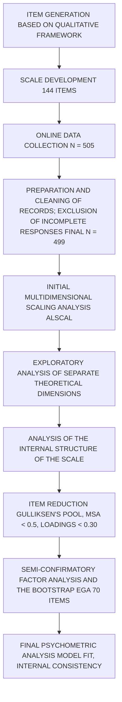

# The Ibogaine Experience Scale (IES): Development and psychometric properties of a multidimensional measure of ibogaine's subjective effects

> **Format note:** This paper retains its original academic structure. All YAML metadata and cross-references are complete. A full analytical conversion to vault format is planned for v1.1.


**Citation:** González Espejito F, Esteban Rodríguez L, Pedrero Pérez EJ, Dickinson J, Kohek M, Guimaraes dos Santos R, et al. (2025) The Ibogaine Experience Scale (IES): Development and psychometric properties of a multidimensional measure of ibogaine's subjective effects. *PLoS One* 20(10): e0333296.

**Authors:**
Francisco González Espejito, Laura Esteban Rodríguez, Eduardo J. Pedrero Pérez, Jonathan Dickinson, Maja Kohek, Rafael Guimaraes dos Santos, Jaime Hallak, Miguel Ángel Alcázar-Córcoles, Breanna Lee Morgan, José Carlos Bouso*

**Affiliations:**

1. Department of Biological and Health Psychology, Faculty of Psychology, Autonomous University of Madrid, Madrid, Spain

2. Psychiatry Service, 12 de Octubre University Hospital; Health Research Institute Hospital 12 de Octubre (imas12), Madrid, Spain

3. Faculty of Psychology, Complutense University of Madrid, Madrid, Spain

4. Department of Psychobiology, National Distance Education University (UNED), Madrid, Spain

5. Ambio Life Sciences Inc, Vancouver, Canada

6. International Center for Ethnobotanical Education, Research & Service (ICEERS), Barcelona, Spain

7. Medical Anthropology Research Center (MARC), Department of Anthropology, Philosophy and Social Work, University Rovira i Virgili, Tarragona, Spain

8. Department of Neurosciences and Behavior, University of São Paulo, São Paulo, Brazil

9. National Institute of Translational Science and Technology in Medicine (INCT-TM), CNPq, Ribeirão Preto, São Paulo, Brazil

**Correspondence:** jcbouso@iceers.org

---

## Abstract

Ibogaine, an indole alkaloid derived from the root bark of *Tabernanthe iboga*, has long been used in traditional Bwiti healing rituals and shows promise for treating opioid dependence and neurological conditions, but existing psychometric tools fail to capture its distinctive subjective/oneiric (dream-like) effects. To address this gap, we developed the 70-item Ibogaine Experience Scale (IES) through an iterative process informed by a prior qualitative study (n = 20) that identified eight experiential domains. A preliminary 144-item version was completed on site with a mobile device within 48 hours of treatment by 499 participants across two clinical settings—cohort neuropsychiatric treatments (n = 381) and substance use disorder treatments (n = 118). We employed exploratory graph analysis, parallel analysis on polychoric correlations, and iterative item-reduction (Gulliksen’s Pool, MIREAL, MSA) to refine the scale. Semi-confirmatory factor analysis used Robust Unweighted Least Squares (RULS) with LOSEFER correction, oblimin rotation, and multiple fit indices (CFI, NNFI, GFI, AGFI, RMSR, WRMR). Cronbach’s , McDonald’s , H indices, EAP reliability, FDI, ORION, SR, and EPTD assessed internal consistency and factorial quality. The final structure comprises seven factors—**Narrative and symbolic visions; Visual changes; Discomfort and challenge; Cosmic/Archetypal Visions; Introspection and personal transformation; Somatosensory hypersensitivity and physiological activation; Dissociation**—explaining 53.9% of variance, with excellent fit (; ; ; ) and high internal consistency (; ; subscale ). Two subscales exhibited small gender effects. The IES provides a reliable, phenomenologically rich instrument for quantifying ibogaine’s distinctive subjective effects. It supports research and clinical assessment by capturing the multidimensional, oneiric/dream-like nature of the ibogaine experience. Future work should confirm this structure in independent, culturally diverse cohorts and explore predictive links between IES domains and therapeutic outcomes.

---

## Introduction

Ibogaine is a psychedelic indole alkaloid found in high concentrations in the root bark of *Tabernanthe iboga* (iboga), a perennial shrub endemic to Gabon and surrounding regions of the Central African rainforest. The plant itself has been used for centuries in the spiritual practice of the Bwiti, where it serves as a central sacrament in rituals of initiation and healing [1]. Within this traditional context, music, mantras, perfumes, colors, movement, and intricate symbolism are used to intentionally strengthen and guide the subjective dreamlike (oneiric) experience of banzis (initiates) toward a variety of beneficial ends.

Ibogaine has a complex pharmacological profile. Unlike classical psychedelics such as LSD or psilocybin, which exert their effects primarily via strong agonism at the 5-HT2A receptor, ibogaine and its metabolite noribogaine display very low affinity for this receptor and do not produce the typical serotonergic hallucinogenic effects evidenced by the absence of the head-twitch response in animal models. Instead, ibogaine’s psychoactive and therapeutic effects are mediated through a multifaceted pharmacology, including kappa-opioid receptor agonism, NMDA receptor antagonism, serotonin and dopamine transporter inhibition, and enhancement of neurotrophic factors like brain-derived neurotrophic factor (BDNF) and glial cell-derived neurotrophic factor (GDNF). Notably, noribogaine promotes structural neural plasticity, increasing dendritic complexity in a manner comparable to ketamine. These properties support its classification as an atypical psychedelic, with anti-addictive effects emerging from synergistic modulation across diverse neural systems rather than through classical serotonergic pathways [2].

In the West, extracted and purified ibogaine has been used for decades within medical and holistic contexts to mitigate withdrawal and cravings from opioids [3–5]. More recently, it has been used to reverse symptoms of traumatic brain injury (TBI) in combat veterans [6,7]. While most research has focused on the physiological outcomes of ibogaine’s unique pharmacology [3,8], studies frequently reveal the importance that subjects place upon their subjective experience when describing their overall healing process [9–13].

Precisely, one of the challenges of investigating the influence that ibogaine’s subjective effects have on patient outcome has been the failure of existing psychometric tools to quantify its distinctive phenomenology. Past studies investigating ibogaine outcomes have employed measurements like the Mystical Experience Questions (MEQ), which was designed to assess the very different effects of psilocybin and other classic psychedelics. However, researchers have commented on the obvious misalignment between the items measured by these instruments and the ibogaine experience, suggesting that "it may be that ibogaine’s unique properties require the development of an instrument sensitive to its oneiric [dream-like] effects" [10, (p162)].

The Ibogaine Experience Scale (IES) was developed to address the need for a state-specific measure of the distinctive phenomenology of ibogaine. This paper outlines the rationale, development, and psychometric properties of the IES, designed to facilitate a more accurate understanding of the experiential dimensions associated with ibogaine treatment.

---

## Materials and Methods

### Scale Development

The development of the IES was based on the prior qualitative study by Kohek and colleagues [13], which identified key dimensions of the acute subjective experience of ibogaine consumption (**Fig 1**). This study involved in-depth, semi-structured interviews with 20 individuals who had recently undergone ibogaine treatment, primarily for addiction recovery or personal growth. The interviews, conducted between February and April 2016, were analyzed using grounded theory methodology. This inductive approach enabled the researchers to derive a conceptual framework of eight primary categories of effects—physical, sensory, visual, cognitive, auditory, adverse, anti-dependency, and after-effects—and ten additional subcategories addressing specific experiential phenomena such as ego dissolution, empathy, and spiritual experiences [13].

#### Fig 1. Theoretical categories of acute subjective effects of ibogaine consumption

*(Retrieved from Kohek and colleagues [13])*

```mermaid
graph LR
    Root[Categories of acute subjective effects]
    
    %% Main Categories
    Physical[Physical]
    Visual[Visual]
    Auditory[Auditory]
    Sensory[Sensory]
    Cognitive[Cognitive]
    AntiDep[Anti-dependency agent]
    Adverse[Adverse]
    After[After-effects]

    %% Connections from Root
    Root --> Physical
    Root --> Visual
    Root --> Auditory
    Root --> Sensory
    Root --> Cognitive
    Root --> AntiDep
    Root --> Adverse
    Root --> After

    %% Subcategories for Visual
    Visual --> CEV[Closed eye visuals]
    Visual --> OEV[Open eye visuals]
    
    CEV --> Ancestors[Ancestors and entities]
    CEV --> Sceneries[Sceneries and landscapes]
    CEV --> Horrific[Horrific scenarios]

    %% Subcategories for Cognitive
    Cognitive --> SelfPsy[Self-psychoanalysis enhancement]
    Cognitive --> Observer[Observer quality]
    Cognitive --> Catharsis[Catharsis]
    Cognitive --> EgoDiss[Ego dissolution (death and rebirth)]
    Cognitive --> Empathy[Empathy, love and prosocial behavior]
    Cognitive --> Spiritual[Spiritual states]

```

These categories served as the conceptual basis for developing the IES and represent a broad spectrum of effects reported by participants.

* 
**Physical effects:** Changes in bodily perception (weight, temperature, coordination), gastrointestinal sensations, and less common experiences like electricity or tremors.

* 
**Sensory effects:** Changes in perception of light, sound, smell, taste, touch, sensitivity, and synesthesia.

* 
**Visual effects:** Open- and closed-eye imagery, geometric patterns, fractals, environmental alterations, and internal reality scenes.

* 
**Cognitive effects:** Altered thought processes, introspection, self-reflection, focus, ego dissolution, and personal insights.

* 
**Adverse effects:** Challenging aspects like fear, confusion, existential distress, and anxiety related to death or loss of self.

* 
**Anti-dependency & After-effects:** Therapeutic potential (reduced cravings, diminished withdrawal) and sustained psychological benefits (emotional clarity, optimism).

The item pool was generated by a group of authors (JD, MK, RGdS, JH, MÁAC, and JCB). Each major category was represented by a minimum of five items, resulting in an initial set of 130 items. 11 general items were included to assess overall impression, and 3 supplementary questions captured temporal aspects, totaling **144 items**. All items used a 4-point Likert scale ( None;  Slightly;  Moderately;  Strongly).

### Participants

Participants were clients of Ambio Life Sciences in Tijuana, Mexico. The center serves individuals seeking to overcome substance use disorders or treating psychological/neurological conditions. Treatment was provided in a non-medical but supported setting.

* **Cohort approach:** Groups of 4–6 individuals (typically without active substance use disorders) (n = 381; 76.4%).
* **Detoxification model:** Individuals with polysubstance use treated individually after medical stabilization (n = 118).

**Total Sample:**  (after excluding 6 incomplete responses).

**Demographics:** Mean age 44 years (SD = 9.2), 80.96% male.

Table 1. Sample descriptives

|  | Males | Females | DK/NA | Total |
| --- | --- | --- | --- | --- |
| **n** | 404 | 94 | 1 | 499 |
| **Age** |  |  |  |  |
| Mean | 43.9 | 44.8 |  | 44 |
| Standard deviation | 9.1 | 9.5 |  | 9.2 |
| Rank | 18-71 | 23-69 |  | 18-71 |
| **Highest level of education completed** |  |  |  |  |
| Primary school | 1 | 1 |  | 2 |
| High school | 121 | 20 |  | 141 |
| University degree | 190 | 47 |  | 237 |
| Postgraduate or doctorate degree | 92 | 26 |  | 118 |
| **Country of birth** |  |  |  |  |
| U.S.A. | 365 | 72 | 1 | 438 |
| Canada | 15 | 8 |  | 23 |
| Mexico | 4 | 4 |  | 8 |
| European Union | 7 | 3 |  | 10 |
| Other European Countries | 5 | 2 |  | 7 |
| Asian Countries | 5 | 2 |  | 7 |
| Central and South American Countries | 4 | 1 |  | 5 |
| African Countries |  | 1 |  | 1 |
| **Current country of residence** |  |  |  |  |
| U.S.A. | 380 | 79 | 1 | 460 |
| Canada | 12 | 7 |  | 19 |
| European Union | 3 | 3 |  | 6 |
| Other European Countries | 1 |  |  | 1 |
| Central and South American Countries | 7 | 5 |  | 12 |
| New Zealand | 1 |  |  | 1 |

### Procedure

Recruitment spanned October 9, 2020, to May 17, 2024. Participants completed the questionnaire voluntarily and anonymously after their session (typically on the evening of the fourth day). No incentives were offered. The study was approved by the Ethics Committee of the Autonomous University of Madrid (reference: CEI-66-1174).

### Data Analysis

The dataset was anonymized. Analysis steps are depicted in **Fig 2**.

Fig 2. Schematic of the phases in the psychometric analysis



**Analytical Procedure:**

1. 
**Initial Dimensional Analysis:** Multidimensional scaling (ALSCAL) and exclusion of "Antidependency-agent" dimension from general analysis (analyzed separately).

2. **Item-level Analysis:** Tested appropriateness (MSA > 0.50), unidimensionality (MIREAL < 0.300), and fit (GFI > 0.80). Internal consistency estimated via Cronbach's alpha (αs) and McDonald's omega (ω).

3. 
**Structure Determination:** Parallel analysis (polychoric correlations) and bootstrap Exploratory Graph Analysis (EGA).

4. 
**Exploratory Factor Analysis (EFA):** Using Robust Unweighted Least Squares (RULS) with LOSEFER correction.

5. **Item Reduction:** Gulliksen’s Pool, MSA < 0.50, and removing items with loadings < 0.30. This yielded a final **70-item scale**.

6. 
**Semi-Confirmatory Factor Analysis (70 items):** Assessed model fit (CFI/NNFI > 0.90/0.95; RMSR  0.04; WRMR < 1.0) and factorial quality (H > 0.80, FDI > 0.90, EPTD > 90%).

---

## Results

### General Questionnaire

The EFA applied to theoretical dimensions showed generally adequate indicators (**Table 2**). GFI values exceeded 0.95 for most dimensions. "Mood effects" showed lower fit (GFI = .86). Physical and sensory subscales had lower reliability but were retained for the global structure analysis.

Table 2. Properties of the obtained theoretical dimensions

| Dimension | No. of items | MSA (normed) | GFI | MIREAL | H-latent | H-observed | SR | EPTD |  |  |
| --- | --- | --- | --- | --- | --- | --- | --- | --- | --- | --- |
| **Physical effects** | 8 | .73–.83 | .97 | .28 | .76 | .68 | 1.8 | 87.6 | .76 | .76 |
| **Sensory effects** | 6 | .70–.87 | .97 | .32 | .78 | .70 | 1.9 | 88.2 | .77 | .78 |
| **Visual effects open eyes** | 6 | .78–.89 | .99 | .28 | .86 | .79 | 2.5 | 90.9 | .84 | .85 |
| **Visual effects closed eyes** | 6 | .76–.93 | .99 | .22 | .91 | .80 | 3.1 | 92.7 | .86 | .86 |
| **Ancestors and entities** | 5 | .80–.93 | .99 | .22 | .95 | .84 | 4.2 | 95.1 | .91 | .91 |
| **Sceneries and landscapes** | 6 | .80–.90 | .99 | .24 | .89 | .77 | 2.8 | 91.9 | .85 | .86 |
| **Horrific scenarios** | 4 | .61–.79 | .99 | .28 | .86 | .86 | 2.5 | 90.8 | .67 | .70 |
| **Self-psychoanalysis enhancement** | 8 | .68–.92 | .98 | .22 | .90 | .82 | 2.9 | 92.3 | .83 | .84 |
| **Empathy, love and prosocial behavior** | 5 | .68–.88 | .99 | .29 | .91 | .77 | 3.2 | 93.0 | .86 | .87 |
| **Catharsis** | 7 | .90–.96 | .99 | .15 | .95 | .79 | 4.4 | 95.4 | .92 | .92 |
| **Observer quality** | 5 | .74–.79 | .99 | .27 | .84 | .77 | 2.3 | 89.9 | .83 | .83 |
| **Ego dissolution** | 10 | .63–.85 | .95 | .27 | .86 | .76 | 2.5 | 90.8 | .83 | .83 |
| **Spiritual states** | 7 | .72–.91 | .98 | .29 | .92 | .83 | 3.5 | 93.7 | .89 | .89 |
| **Auditory effects** | 6 | .64–.89 | .99 | .25 | .88 | .75 | 2.7 | 91.6 | .84 | .84 |
| **Mood effects** | 6 | .59–.75 | .86 | .39 | .99 | .75 | 8.6 | 98.6 | .63 | .72 |

*Note: MSA = Measure of Sampling Adequacy; GFI = Goodness of Fit Index; MIREAL = Mean of Item REsidual Absolute Loadings; H = Generalized H Index; SR = Sensitivity Ratio; EPTD = Expected Percentage of True Differences; αs = Standardized Cronbach Alpha; ω = McDonald Omega.*

### Global Scale Structure (70 Items)

The final 70-item version showed excellent KMO (.922) and significant Bartlett’s test (χ² = 5455.2; df = 2415; p < .001). Parallel analysis and bootstrap EGA supported a **7-factor solution** (retained in 35.8% of bootstrap samples). This structure explained **53.9%** of the total variance.

**Robust goodness-of-fit:**

* NNFI = .989
* CFI = .991
* GFI = .983; AGFI = .979
* RMSR = .0414 (reference value .0448 per Kelley's criterion)
* WRMR = .0382

The scale demonstrated high internal consistency (α = .948; ω = .946).

Table 3. Communalities (h²) and factor loadings

*(Factor loadings < .10 omitted for brevity in some cases; Primary loadings shown)*

| Item | NSV | VC | DC | C/AV | IPT | SHPA | DI |  |
| --- | --- | --- | --- | --- | --- | --- | --- | --- |
| **Factor 1: Narrative and Symbolic Visions (NSV)** |  |  |  |  |  |  |  |  |
| 17. Dream-like sequences, moving/changing | **.77** | .14 | .02 | .00 | .10 | -.02 | -.05 | .73 |
| 18. Sequences involving characters/stories | **.69** | .08 | .06 | .08 | .12 | .03 | -.08 | .67 |
| 16. Closed eye visuals (colors, fractals) | **.57** | .26 | -.03 | -.06 | -.04 | -.03 | .16 | .52 |
| 21. Cartoonish or exaggerated quality | **.52** | .13 | .03 | .03 | -.05 | .05 | .10 | .40 |
| 22. Faces or masks | **.51** | .20 | -.06 | .19 | -.02 | -.02 | .08 | .48 |
| 23. Others interact or communicate with you | **.47** | -.02 | .02 | .26 | .33 | .09 | -.10 | .66 |
| 24. Interactions feel impactful or meaningful | **.45** | -.01 | .06 | .25 | .44 | -.03 | -.10 | .73 |
| 19. Scenes that repeated themselves | **.45** | .16 | .06 | .07 | -.06 | .16 | -.03 | .37 |
| 25. Specific information/insights from interactions | **.44** | -.09 | .02 | .25 | .44 | .01 | -.05 | .67 |
| 31. Images/visions had meaningful messages | **.38** | -.06 | -.02 | .38 | .26 | .06 | -.03 | .58 |
| 20. Paradoxical images (light-dark, bad-good) | **.35** | .16 | .32 | .26 | .09 | -.04 | .04 | .58 |
| **Factor 2: Visual Changes (VC)** |  |  |  |  |  |  |  |  |
| 14. Objects/people/shadows appearance change | .17 | **.71** | .04 | -.06 | .03 | -.11 | .07 | .61 |
| 12. Changes in colors of environment | .02 | **.70** | -.01 | -.03 | .14 | .14 | -.08 | .61 |
| 11. Patterns/details in external environment | .00 | **.65** | -.06 | .06 | .11 | .13 | -.08 | .55 |
| 13. Trails of light or other visual distortions | .07 | **.64** | .05 | -.05 | .02 | .00 | .11 | .50 |
| 15. Visions of things/characters in room (open eyes) | .14 | **.60** | .00 | .02 | -.07 | .01 | .05 | .45 |
| 10. Vision sharper or clearer than normal | -.03 | **.32** | -.15 | .18 | .23 | .29 | -.10 | .44 |
| **Factor 3: Discomfort and Challenge (DC)** |  |  |  |  |  |  |  |  |
| 68. Sadness or despair | -.09 | -.05 | **.73** | .11 | -.11 | .10 | .05 | .58 |
| 70. Psychological discomfort/negative feelings | .12 | -.01 | **.62** | -.20 | -.07 | .23 | .07 | .56 |
| 40. Guilt or remorse | .10 | .17 | **.62** | .04 | .09 | -.06 | -.13 | .47 |
| 32. Darkness and aloneness | -.11 | .07 | **.62** | .09 | -.14 | .01 | .07 | .42 |
| 69. Cry, or feel an urge to | .00 | -.05 | **.57** | .02 | .31 | .05 | -.06 | .46 |
| 33. Scenes of violence among humans | .11 | .07 | **.53** | .46 | -.08 | -.13 | -.04 | .56 |
| 51. Feel afraid of dying | .19 | .06 | **.52** | -.26 | .00 | .13 | .32 | .58 |
| 50. Feel like you were dying or dead | -.17 | -.13 | **.42** | -.07 | .17 | .10 | .40 | .51 |
| **Factor 4: Cosmic/Archetypal Visions (C/AV)** |  |  |  |  |  |  |  |  |
| 28. Visions of origin of life/universe | .08 | .05 | .02 | **.73** | .05 | .10 | .03 | .70 |
| 30. Visions of futuristic technology | .15 | .04 | .05 | **.48** | -.06 | .06 | .08 | .34 |
| 26. Visions from space (planets, galaxies) | .20 | .15 | -.05 | **.47** | .01 | -.03 | .16 | .45 |
| 57. Themes of decay and rebirth | .18 | .06 | .28 | **.45** | -.10 | .07 | .17 | .50 |
| 29. Visions of indigenous tribes | .09 | .09 | -.07 | **.45** | .06 | .18 | .07 | .39 |
| 27. Visions of places in different times | .28 | .10 | .10 | **.42** | .18 | .02 | -.02 | .57 |
| 34. Images had meaningful messages (Duplicate?) | .20 | .02 | .31 | **.41** | .23 | -.19 | -.05 | .53 |
| 64. Auditory effects had meaningful messages | .16 | .09 | .09 | **.27** | .23 | .12 | .00 | .39 |
| **Factor 5: Introspection & Personal Transformation (IPT)** |  |  |  |  |  |  |  |  |
| 44. Emotional/spiritual weight lifted | .05 | .09 | .02 | -.08 | **.84** | .04 | -.02 | .74 |
| 60. Greater sense of acceptance | -.05 | .10 | .00 | .07 | **.79** | -.01 | -.01 | .69 |
| 43. Feel rejuvenated | .06 | .06 | -.08 | -.06 | **.77** | -.01 | -.05 | .59 |
| 61. Understanding past happened for a reason | -.06 | .04 | .01 | .04 | **.72** | .05 | .04 | .58 |
| 67. Feel less anxious | .08 | .10 | -.19 | -.13 | **.70** | -.03 | .04 | .50 |
| 37. Introspection helped process personal issues | .19 | -.07 | .06 | .06 | **.68** | .12 | -.07 | .67 |
| 41. Desire to make amends | .07 | .15 | .22 | -.05 | **.61** | -.09 | -.06 | .47 |
| 58. Sense of unity/interconnectedness | .04 | .02 | -.03 | .28 | **.57** | .09 | .11 | .65 |
| 52. Less fear of death | -.16 | .10 | .02 | .18 | **.52** | -.03 | .25 | .46 |
| 42. Surrender to the experience | .13 | .01 | .15 | -.16 | **.51** | .19 | .15 | .48 |
| 38. Memory of past events improve | .03 | .06 | .08 | .15 | **.50** | .10 | -.03 | .44 |
| 39. Relive emotional significant event | .16 | .06 | .39 | .11 | **.46** | -.02 | -.08 | .57 |
| 45. Less attached to things | -.07 | .00 | -.02 | .00 | **.45** | .15 | .22 | .33 |
| 36. Increased capacity to focus attention | .11 | .05 | -.16 | .14 | **.40** | .17 | -.03 | .37 |
| 35. Analytic thinking enhanced | .10 | -.04 | .00 | .29 | **.40** | .14 | -.03 | .45 |
| 48. Other intelligence guiding thoughts | .17 | -.11 | .02 | .30 | **.36** | .12 | .18 | .50 |
| 46. Distant/detached from sense of self | .10 | .01 | -.02 | .14 | **.36** | .17 | .30 | .47 |
| 59. Timelessness | .04 | .11 | .03 | .13 | **.30** | .11 | .21 | .33 |
| **Factor 6: Somatosensory Hypersensitivity (SHPA)** |  |  |  |  |  |  |  |  |
| 6. More sensitive to sound | .02 | .02 | .04 | -.06 | -.11 | **.75** | -.05 | .53 |
| 62. Auditory sensitivity enhanced | .18 | -.02 | -.03 | .09 | .05 | **.63** | .04 | .54 |
| 5. More sensitive to light or color | .00 | .15 | .04 | -.06 | -.04 | **.57** | -.10 | .36 |
| 7. More sensitive to tastes | -.10 | -.04 | .04 | .12 | .20 | **.48** | -.19 | .34 |
| 63. Sound of buzzing or vibrating | .09 | .06 | -.01 | -.02 | .11 | **.47** | .10 | .36 |
| 4. Electricity in brain or body | -.02 | .06 | .07 | .09 | .10 | **.46** | .11 | .36 |
| 8. Skin more sensitive to touch | -.10 | .11 | .06 | .27 | .07 | **.45** | -.03 | .39 |
| 65. Sounds coming from distance/elsewhere | .37 | .00 | -.07 | .02 | -.01 | **.41** | .12 | .39 |
| 9. Different senses at same time | -.07 | .33 | -.08 | .26 | .01 | **.40** | .08 | .50 |
| 1. Body lighter or heavier | .01 | .04 | .12 | .04 | .22 | **.38** | -.02 | .31 |
| 66. See or feel sounds | -.09 | .27 | .03 | .21 | .12 | **.36** | .09 | .45 |
| 3. Hands trembling | .05 | .03 | .08 | -.16 | -.05 | **.32** | .16 | .19 |
| 2. Heart beating faster or slower | .01 | .06 | .24 | -.16 | -.02 | **.30** | .15 | .26 |
| **Factor 7: Dissociation (DI)** |  |  |  |  |  |  |  |  |
| 54. Feel that your body was not yours | -.25 | .14 | .10 | .17 | .22 | -.07 | **.61** | .56 |
| 49. Separated from body/unaware of presence | .14 | .00 | -.10 | .24 | .10 | -.05 | **.57** | .46 |
| 55. Environment was not real | .12 | .14 | .03 | -.09 | -.13 | .01 | **.47** | .32 |
| 53. Things you knew/felt were disappearing | -.07 | .09 | .16 | .02 | .32 | .03 | **.37** | .39 |
| 47. Distant/detached from sense of vision | .09 | .04 | .02 | .25 | .20 | .10 | **.33** | .39 |
| 56. Memory capacities were disturbed | -.04 | .21 | .21 | -.09 | -.19 | .09 | **.32** | .29 |

*Note: NSV: Narrative and Symbolic Visions; VC: Visual Changes; DC: Discomfort and Challenge; C/AV: Cosmic/Archetypal Visions; IPT: Introspection and Personal Transformation; SHPA: Somatosensory Hypersensitivity and Physiological Activation; DI: Dissociation.*

Table 4. Intercorrelations Between the Seven Factors of the IES

|  | NSV | VC | DC | C/AV | IPT | SHPA | DI |
| --- | --- | --- | --- | --- | --- | --- | --- |
| **NSV** | 1.00 | .52 | .32 | .69 | .62 | .45 | .38 |
| **VC** |  | 1.00 | .21 | .46 | .45 | .50 | .39 |
| **DC** |  |  | 1.00 | .36 | .29 | .35 | .39 |
| **C/AV** |  |  |  | 1.00 | .61 | .44 | .40 |
| **IPT** |  |  |  |  | 1.00 | .51 | .44 |
| **SHPA** |  |  |  |  |  | 1.00 | .42 |
| **DI** |  |  |  |  |  |  | 1.00 |

*All correlations significant at p < .01*

### Subscale Analysis

1. **Antidependency-agent (n = 118):** Unidimensional, excellent fit (GFI = .99; AGFI = .99; CFI = .99), high reliability (αs = .96; ω = .96).
2. 
**Global Experience (11 items):** Unidimensional, adequate fit (GFI = .95; AGFI = .94; CFI = .99), acceptable reliability (αs = .90; ω = .92).

* **Timing:** 67.3% reported onset 2–4 hours post-dose. Peak lasted 4–6 hours for 38.6%. Mean total duration 18.9 hours (SD = 1.8).

### Gender Differences

MANCOVA revealed no significant gender differences overall, with two exceptions:

1. **Somatosensory hypersensitivity:** Women scored higher (M = 23.77, SD = 0.78 vs M = 21.77, SD = 0.38; F = 5.27, p = .022, ω² = 0.01).
2. **Antidependency-agent:** Men scored higher (M = 11.65, SD = 4.26 vs M = 8.88, SD = 5.89; F = 4.69, p = .011, ω² = 0.08).

Table 5. Adjusted Means and MANCOVA Results by Gender

| Scales | Total (M/SD) | Males (M/SD) | Females (M/SD) | F | p |  |
| --- | --- | --- | --- | --- | --- | --- |
| **Narrative and symbolic visions** | 19.53 (8.46) | 19.59 (0.42) | 19.14 (0.87) | 0.22 | 0.64 | 0.00 |
| **Visual changes** | 10.42 (4.75) | 10.51 (0.24) | 10.04 (0.49) | 0.74 | 0.39 | 0.00 |
| **Discomfort and challenge** | 8.41 (5.82) | 8.48 (0.28) | 8.13 (0.59) | 0.28 | 0.60 | 0.00 |
| **Cosmic/Archetypal visions** | 7.66 (5.88) | 7.79 (0.29) | 7.05 (0.60) | 1.25 | 0.26 | 0.00 |
| **Introspection and personal transformation** | 33.14 (12.67) | 33.18 (0.62) | 32.89 (1.30) | 0.04 | 0.84 | 0.00 |
| **Somatosensory hypersensitivity** | 22.15 (7.71) | 21.77 (0.38) | **23.77 (0.78)** | 5.27 | 0.02 | 0.01 |
| **Dissociation** | 5.53 (3.85) | 5.63 (0.19) | 5.04 (0.40) | 1.79 | 0.18 | 0.00 |
| *Global experience* | 28.64 (4.15) | 28.75 (3.95) | 28.19 (4.91) | 0.69 | 0.50 | 0.00 |
| *Antidependency-agent* | 11.25 (4.61) | **11.65 (4.26)** | 8.88 (5.89) | 4.69 | 0.011 | 0.08 |

---

## Discussion

The study successfully developed the Ibogaine Experience Scale (IES), a 70-item instrument capturing 53.9% of variance across seven factors. This is the first scale specifically designed for ibogaine’s oneiric and multimodal phenomenology, overcoming limitations of serotonergic-focused tools like the MEQ.

**Interpretation of Factors:**

* **Narrative/Symbolic & Cosmic/Archetypal:** Match reports of "life-review" and "ancestral" encounters.
* **Visual Changes:** Correspond to geometric/environmental distortions common in opioid treatments.
* **Somatosensory:** Reflects the "physical-vegetative" load (tremors, buzzing), explaining higher scores in women.
* 
**Introspection:** Captures the "reset" and insight crucial for behavioral change.

**Cross-loadings:** Some items (e.g., violent scenes) loaded on both "Discomfort" and "Cosmic" factors, suggesting that challenging content often carries deep archetypal meaning. These were retained to preserve phenomenological richness.

**Limitations:** Convenience sampling, moderate reliability for the Dissociation factor (ω = .65), and scale length (70 items) which may limit clinical utility. Future work aims to validate a short form.

---

## References

1. Fernandez JW, Fernández RL. Bwiti: An ethnography of the religious imagination in Africa. Princeton (NJ): Princeton University Press; 2019.
2. Ona G, et al. Main targets of ibogaine and noribogaine associated with its putative anti-addictive effects: a mechanistic overview. *J Psychopharmacol.* 2023;37(12):1190–200.
3. Alper KR. Ibogaine: a review. *Alkaloids Chem Biol.* 2001;56:1–38.
4. Brown TK. Ibogaine in the treatment of substance dependence. *Curr Drug Abuse Rev.* 2013;6(1):3–16.
5. Alper KR, Lotsof HS, Kaplan CD. The ibogaine medical subculture. *J Ethnopharmacol.* 2008;115(1):9–24.
6. Davis AK, et al. Psychedelic treatment for trauma-related psychological and cognitive impairment... *Chronic Stress.* 2020;4.
7. Cherian KN, et al. Magnesium-ibogaine therapy in veterans with traumatic brain injuries. *Nat Med.* 2024;30(2):373–81.
8. Iyer RN, et al. The iboga enigma... *Nat Prod Rep.* 2021;38(2):307–29.
9. Brown TK, Alper K. Treatment of opioid use disorder with ibogaine... *Am J Drug Alcohol Abuse.* 2018;44(1):24–36.
10. Brown TK, Noller GE, Denenberg JO. Ibogaine and subjective experience... *J Psychoactive Drugs.* 2019;51(2):155–65.
11. Schenberg EE, et al. A phenomenological analysis of the subjective experience elicited by ibogaine... *J Psychedelic Stud.* 2017;1(2):74–83.
12. Davis AK, et al. Subjective effectiveness of ibogaine treatment... *J Psychedelic Stud.* 2017;1(2):65–73.
13. Kohek M, et al. The Ibogaine experience: a qualitative study... *Anthropol Consciousness.* 2020;31(1):91–119.
14. Dickinson J. Transpersonal intersubjectivity in Ibogaine Experiences... *Anthropol Consciousness.* 2023;34(1):161–80.
15. Horn JL. A rationale and test for the number of factors... *Psychometrika.* 1965;30:179–85.
16. Golino HF, Epskamp S. Exploratory graph analysis... *PLoS One.* 2017;12(6):e0174035.
17. Garrido LE, Abad FJ, Ponsoda V. A new look at Horn’s parallel analysis... *Psychol Methods.* 2013;18(4):454–74.
18. Lorenzo-Seva U, Ferrando PJ. Factor (version 12.06.07). 2025.
19. Mardia KV. Measures of multivariate skewness... *Biometrika.* 1970;57(3):519–30.
20. Lloret-Segura S, et al. El análisis factorial exploratorio... *analesps.* 2014;30(3).
21. Timmerman ME, Lorenzo-Seva U. Dimensionality assessment... *Psychol Methods.* 2011;16(2):209–20.
22. Lorenzo-Seva U, Ferrando PJ. A simulation-based scaled test statistic... *Methodology.* 2023;19(2):96–115.
23. Lorenzo-Seva U, Ferrando PJ. MSA: the forgotten index... *Methodology.* 2021;17(4):296–306.
24. Ferrando PJ, Lorenzo-Seva U. Assessing the quality and appropriateness of factor solutions... *Educ Psychol Meas.* 2018;78(5):762–80.
25. Ferrando PJ, et al. Gulliksen’s pool... *PLoS One.* 2023;18(8):e0290611.
26. Schmitt TA, Sass DA. Rotation criteria... *Educ Psychol Measure.* 2011;71(1):95–113.
27. Kaiser HF. A second generation little Jiffy. *Psychometrika.* 1970;35(4):401–15.
28. Lorenzo-Seva U, Ferrando PJ. Not positive definite correlation matrices... *Struct Equ Model.* 2020;28(1):138–47.
29. Bentler PM, Bonett DG. Significance tests and goodness of fit... *Psychol Bull.* 1980;88(3):588–606.
30. Brown TA. Confirmatory factor analysis for applied research. 2015.
31. Byrne BM. Structural equation modelling with EQS... 1994.
32. Escobedo Portillo MT, et al. Modelos de ecuaciones estructurales... *Cienc Trab.* 2016;18(55):16–22.
33. Hu L, Bentler PM. Cutoff criteria for fit indexes... *Struct Equ Model.* 1999;6(1):1–55.
34. Kline RB. Principles and practice of structural equation modeling. 2011.
35. Cho G, et al. Cutoff criteria for overall model fit indexes... *J Market Anal.* 2020;8(4):189–202.
36. Gaskin J. SmartPLS factor analysis. 2012.
37. Kelley TL. Essential traits of mental life. 1935.
38. Yu CY, Muthén B. Evaluation of model fit indices... 2002.
39. Child D. The essentials of factor analysis. 2006.
40. MacCallum RC, et al. Sample size in factor analysis. *Psychol Methods.* 1999;4(1):84–99.
41. Campo-Arias A, Oviedo HC. Psychometric properties... *Rev Salud Publica.* 2008;10(5):831–9.
42. Cronbach LJ. Coefficient alpha... *Psychometrika.* 1951;16(3):297–334.
43. McDonald RP. Test theory: a unified treatment. 1999.
44. Kalkbrenner MT. Alpha, Omega, and H... *Counseling Outcome Res Evaluation.* 2021;14(1):77–88.
45. Pahnke WN. Drugs and mysticism... 1963.
46. Dittrich A. The standardized psychometric assessment... *Pharmacopsychiatry.* 1998;31(Suppl 2):80–4.
47. Rodríguez-Cano BJ, et al. Underground ibogaine use... *Drug Alcohol Rev.* 2023;42(2):401–14.
48. Noller GE, et al. Ibogaine treatment outcomes... *Am J Drug Alcohol Abuse.* 2018;44(1):37–46.
49. Ozmat EE, et al. Subjective ibogaine experiences... *JPS.* 2024.
50. Camlin TJ, et al. A phenomenological investigation... *J Psychedelic Stud.* 2018;2(1):24–35.
51. Schenberg EE, et al. Treating drug dependence... *J Psychopharmacol.* 2014;28(11):993–1000.
52. Floyd FJ, Widaman KF. Factor analysis... *Psychol Assess.* 1995;7(3):286–99.
53. Tabachnick BG, Fidell LS. Using multivariate statistics. 2013.
54. Clark LA, Watson D. Constructing validity... *Psychol Assess.* 2019;31(12):1412–27.
55. DeVellis RF. Scale development. 2016.
56. Cohen J. Statistical power analysis for the behavioral sciences. 2013.

---

## See Also

- [Kohek2020_Qualitive_Study_Acute_Subjective_Effects_of_Ibogaine](../2020/Kohek2020_Qualitive_Study_Acute_Subjective_Effects_of_Ibogaine.md) — Qualitative foundation this scale was built upon; identified the 8 experiential domains operationalised by the IES
- [Naranjo1969_Psychotherapeutic_Possibilities_Fantasy-Enhancing_Drugs](../1969/Naranjo1969_Psychotherapeutic_Possibilities_Fantasy-Enhancing_Drugs.md) — Original "oneirophrenic" phenomenological characterisation the IES validates psychometrically
- [Dickinson2023_Transpersonal_Intersubjectivity_in_Ibogaine_Experiences](../2023/Dickinson2023_Transpersonal_Intersubjectivity_in_Ibogaine_Experiences.md) — Qualitative phenomenological analysis from same ICEERS research network
- [Ozmat2024_Subjective_Ibogaine_Experiences_Intersection_Social-Ecological_Dimensions](../2024/Ozmat2024_Subjective_Ibogaine_Experiences_Intersection_Social-Ecological_Dimensions.md) — Complementary qualitative study examining social-ecological dimensions of experience
- [PURPLE_Phenomenology_Hub](../Hubs/PURPLE_Phenomenology_Hub.md) — Hub context for phenomenology and subjective experience research
