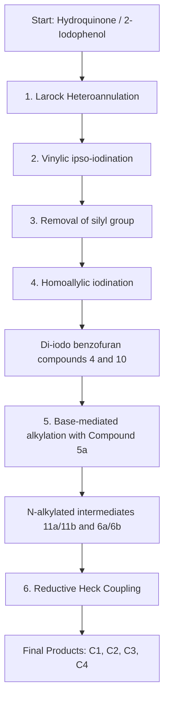

# Development of Bioisosteric *Iboga*-alkaloids as Antinociceptive and Anxiolytic Agents with Neuroprotective Effects

**Authors:** Abhishek Gupta, Tuhin Bhattacharya, Subhamoy Pratihar, Sabnur Parvage, Swrajit Nath Sharma, Arnab Sarkar, Akash De, Sanmoy Karmakar, Sanjit Dey\*, and Surajit Sinha\*

**Affiliations:**
*   *School of Applied and Interdisciplinary Sciences, Indian Association for the Cultivation of Sciences, Kolkata, India*
*   *Department of Physiology, UGC-CPEPA and UGC-CRNN, University of Calcutta, Kolkata, India*
*   *Department of Pharmaceutical Technology, Bioequivalence Study Centre, University of Jadavpur, Kolkata, India*

**Corresponding Authors:** ocss5@iacs.res.in and sdeyphys@caluniv.ac.in

**Keywords:** Bioisostere, Benzofuran-containing iboga, Antinociception, Antiallodynic activity, Neuromodulation, Anti-inflammation

---

## Abstract

The clinical importance of iboga alkaloids lies in their efficacy in reversing drug addiction and modulating drug tolerance. However, due to safety concerns, their use is restricted to appropriate medical supervision. These alkaloids often cause severe hallucinogenic effects due to differential binding to various brain receptors and cardiotoxicity by blocking the human ether-a-go-go-related gene (hERG) potassium channel. To create safer analogs, our group previously synthesized various benzofuran-containing iboga analogs with good opioid binding selectivity and excellent antinociceptive property. However, the present manuscript disclosed a step-economical and cost-effective synthesis of modified ibogaine/ibogamine analogs (**C1, C2, C3 & C4**) with bio-isosteric replacement of the indole scaffold with a benzofuran moiety, and comparing their antinociceptive/anxiolytic activity with their natural counterparts. Among the synthesized iboga analogs, the *Endo*-iboga analogs (**C2 & C4**, epimers of **C1** and **C3**, respectively) not only exhibited superior anti-inflammatory and oxidative stress-relieving activity, but also effectively improved restricted locomotor activity in a formalin-induced acute pain model in mice. These *Endo*-iboga analogs significantly elevated the levels of inhibitory neurotransmitters (GABA and dopamine) and brain-derived neurotrophic factor (BDNF) compared to their *Exo*-counterparts or previously published benzofuran-containing iboga analogs lacking the tetrahydroazepine ring. Amongst, **C2** and **C4**, the latter exhibited superior cardiac safety profile in C2C12 cells ($IC_{50} = 235$ µM) and showed no adverse effects on rat hearts during *in vivo* ECG tests, indicated by no significant QTc prolongation. Overall, the development of bioisosteric iboga analogs, particularly **C4**, demonstrated significant potential for acute pain management without notable cardiotoxicity, representing a breakthrough in pain therapy innovation.

---

## 1. Introduction

The management of acute or chronic pain, post-traumatic stress and surgical injury requires intensive supportive care to restore the appropriate health condition of a patient [1]. Till date, opioid and nonopioid analgesics remain as the two major categories of medications for the effective first-line treatment of severe pain and psychiatric disorder [2-4]. Despite having the potential in treating pain and mental illness, opioids side-by-side exert different systematic side effects and eventually develop drug dependence, tolerance, addiction and withdrawal symptoms [5-7].

In this context, Ibogaine, a monoterpene indole alkaloid isolated from the root bark of West African shrub *Tabernanthe iboga* (apocynaceae family) was reported as the potent psychedelic compound which had the capability of reversing substance use disorder (SUD) and pain alleviation even after a single dose of administration [8-11]. Such a long-lasting effect of ibogaine was mainly attributed to its long-lived active metabolite noribogaine, generated via O-demethylation when metabolized by CYP2D6 enzyme [12,13]. The actual reason for the exertion of psychedelic behavior of ibogaine still remains elusive because it targets multiple brain receptors and neurotransmitters simultaneously [14]. The differential binding of ibogaine with a wide variety of brain receptors and transporters like $\kappa$-opioid receptor (KOR), $\mu$-opioid receptor (MOR), nicotinic $\alpha3\beta4$, serotonin 5-HT2A, sigma ($\sigma1$ and $\sigma2$) and N-methyl-D-aspartate (NMDA) receptors, perhaps rendered for its chronic hallucinogenic side effects [15-18]. Along with this, the irreversible blockage of human ether-a-go-go-related gene (hERG) potassium channel and prolonged QT interval and development of TdP arrhythmias remained as the other major risk factors associated with ibogaine when administered at low micromolar concentration [19-23]. The limited number of case studies (mainly anecdotal reports) and lack of extensive clinical research had raised questions about ibogaine’s efficacy and safety as an antiaddictive and analgesic agent in humans [24-27]. This major shortcoming, however, motivated scientists to develop safer iboga congeners with fewer side effects, while retaining their anti-addictive properties and reducing the simultaneous targeting of multiple brain receptors [28-31].

In this regard, our previous disclosure of benzofuran-containing iboga analogs with no tetrahydroazepine ring showed efficient KOR and MOR binding affinity in the radiolabeled ligand displacement assay [32,33]. This seminal work demonstrated that the biological activity of such benzofuran-containing iboga scaffold was still retained in the absence of the seven membered tetrahydroazepine ring. Further validation of this proof-of-concept was justified when different functional group-modified benzofuran analogs were investigated as anti-nociceptive as well as neuromodulatory agents in formalin-induced acute pain model in mice [34].

In connection with this, the present manuscript disclosed the step-economical synthesis of modified ibogaine and ibogamine analogs, featuring bioisosteric replacement of indole moiety with benzofuran scaffold, and their corresponding antinociceptive as well as anxiolytic effects in formalin-induced acute pain model in mice. The purpose of such bioisosteric replacement was to address the stability issues associated with the natural compounds, such as aerial oxidation and sensitivity to heat and light [35]. Importantly, the toxicity of ibogaine in human hERG channels is mainly attributed to its interaction through the indolyl –NH and the tertiary 'N' present in the isoquinuclidine ring. The former exhibited H-bonding interaction with Ser624 residue in the pore loop of the receptor, while the latter having pKa = 8.1, preferably remained in the protonated state under physiological pH, causing the blockage of the channels from the intracellular side and thereby inhibiting repolarization [20]. As a result, we hypothesized to replace the indole functionality of natural ibogaine/ibogamine with its bio-isosteric benzofuran scaffold while keeping the rest of the skeleton intact (**Figure 1**).

Consistent with our idea, we practically synthesized four benzofuran-containing iboga analogs: **C1, C2, C3 and C4**. All modifications were designed by ensuring that the structural connection between the three fused rings (benzofuran, tetrahydroazepine, and isoquinuclidine) would remain intact. Having synthesized these four analogs, we speculated that our proposed modification would not attenuate the overall amphipathic character of the above-mentioned molecules, a parameter crucial for penetrating blood-brain-barrier (BBB) *in vivo* [36].

> **Figure 1 Description:**
> *   **(A) Natural:** Ibogaine (C5, C6) and Ibogamine (C7, C8). These contain the indole ring.
> *   **(B) Bioisosteric:** Benzofuran-containing iboga-analogs (C1-C4). These contain a benzofuran ring replacing the indole.
> *   **Previously Published (Controls):** C9 & C10 (Benzofuran analogs *without* the tetrahydroazepine ring).

In our present set of experiments, the incorporation of the *Endo* and *Exo*-isomers of natural ibogaine and ibogamine along with two previously published iboga scaffolds (i.e. *Exo*-methyl iboga ester and *Endo*-iboga alcohol) served as the appropriate choice of controls. Altogether, such cumulative incorporation of the compounds in a single set, would help us to find the most potent iboga analog in a single shot. The denotation of the above included controls was as follows:
*   **C5** : (*Exo*)-ibogaine
*   **C6** : (*Endo*)-ibogaine
*   **C7** : (*Exo*)-ibogamine
*   **C8** : (*Endo*)-ibogamine
*   **C9** : (*Exo*)-iboga methyl ester
*   **C10** : (*Endo*)-iboga alcohol

All the synthesized bioisosteres of iboga analogs, along with their natural counterparts, were initially screened for pain-alleviating and anxiolytic activities using the formalin-induced acute pain model in mice. The results demonstrated that, among the sets, the *Endo*-analogs of the benzofuran-containing ibogaine or ibogamine (**C2** and **C4**, respectively) along with the natural one (**C6** and **C8**) exclusively retained the antihyperalgesic or antinociceptive activity when compared with their corresponding *Exo*-counterparts just after the formalin administration.

---

## 2. Results and Discussion

### 2.1. Chemical synthesis of bioisosteric iboga analogs

The chemical synthesis of the bioisosteric benzofuran-containing ibogaine (**C1 & C2**) and ibogamine (**C3 & C4**) analogs was initiated using commercially available hydroquinone and 2-iodophenol, respectively, adopting the previously published methodology.

The synthesis involved the following general steps (represented below as a diagram):
1.  Larock heteroannulation
2.  Vinylic ipso-iodination
3.  Removal of silyl protection group
4.  Homoallylic iodination
5.  Base-mediated coupling with isoquinuclidine ring
6.  Reductive Heck coupling

**Scheme 1 Details:**
*   **Synthesis of Ibogamine analogs (A):** Started with 2-Iodophenol. Yielded **C3** (*Exo*) & **C4** (*Endo*).
*   **Synthesis of Ibogaine analogs (B):** Started with Hydroquinone. Yielded **C1** (*Exo*) & **C2** (*Endo*).
*   **Key Reaction:** The reductive Heck coupling successfully accomplished the installation of the tetrahydroazepine ring, connecting the benzofuran motif with the isoquinuclidine skeleton.

The total synthesis of the benzofuran-containing ibogaine and ibogamine was achieved in 12 and 8 synthetic steps with an overall yield of ~11% and ~20%, respectively.

### 2.2. Acute pain model and experimental design

The formalin-induced acute pain model is an established method for assessing a compound's analgesic effect. Two phases:
1.  **Phase 1 (Acute):** Direct chemical stimulation of nociceptors.
2.  **Phase 2 (Tonic):** Spinal cord hyperexcitability and inflammation.

### 2.3. Antihyperalgesic, antinociceptive and antiallodynic activity of iboga analogs after formalin administration

Although natural ibogaine was well-documented for antinociceptive properties, the *Endo*-compounds (**C2, C4, C6, C8**) were found to be effective, while the *Exo*-analogs (**C1, C3, C5, C7**) failed to show significant antinociceptive effects.

#### **Figure 2 Data Representation: Paw Licking & Withdrawal Latency**
*(Data approximated from bar charts)*

| Group | Paw Licking Phase 1 (Events/min) | Paw Licking Phase 2 (Events/min) | Tail Flick Latency Phase 2 (s) | Paw Withdrawal Latency Phase 2 (s) |
| :--- | :---: | :---: | :---: | :---: |
| **Control** | ~0 | ~0 | ~12 | ~12 |
| **Formalin Only** | ~23 | ~22 | ~4 | ~4 |
| **For+C1 (Exo)** | ~20 | ~18 | ~5 | ~5 |
| **For+C2 (Endo)** | **~13** | **~8** | **~11** | **~10** |
| **For+C3 (Exo)** | ~19 | ~18 | ~5 | ~5 |
| **For+C4 (Endo)** | **~12** | **~10** | **~10** | **~10** |
| **For+C5 (Exo)** | ~21 | ~19 | ~5 | ~5 |
| **For+C6 (Endo)** | **~12** | **~10** | **~10** | **~10** |

*Note: The Endo-analogs (C2, C4, C6, C8) significantly reduced paw licking and restored latency times compared to Formalin alone, while Exo-analogs (C1, C3, C5) did not.*

#### **Figure 3: Mechanical Allodynia (Von Frey Test)**
The paw withdrawal threshold (g) was recorded over 24 hours.

| Time Point | Control (g) | Formalin (g) | For+C1 (Exo) | For+C2 (Endo) | For+C4 (Endo) |
| :--- | :---: | :---: | :---: | :---: | :---: |
| **15 min** | ~1.5 | ~0.2 | ~0.3 | ~1.1 | ~1.2 |
| **6 h** | ~1.5 | ~0.3 | ~0.4 | ~1.2 | ~1.3 |
| **24 h** | ~1.5 | ~0.7 | ~0.8 | ~1.4 | ~1.4 |

**Observation:** *Endo*-iboga analogs (**C2, C4**) significantly prevented the decrease in paw withdrawal threshold (allodynia), whereas *Exo*-analogs did not.

### 2.4. Amelioration of compromised locomotor activity and anxiety-like behavior

Formalin treatment reduces spontaneous movement. The *Endo*-iboga epimers effectively restored movement to an extent like the untreated control.

#### **Figure 4: Locomotor Activity (Open Field)**
| Metric | Control | Formalin | For+C2 | For+C4 | For+C1 (Exo) |
| :--- | :---: | :---: | :---: | :---: | :---: |
| **Dist. Traveled (m)** | ~17 | ~6 | ~15 | ~16 | ~7 |
| **Mean Speed (m/s)** | ~0.06 | ~0.02 | ~0.05 | ~0.055 | ~0.025 |

#### **Figure 5: Anxiety-Like Behavior (Elevated Plus Maze)**
| Metric | Control | Formalin | For+C2 | For+C4 | For+C1 (Exo) |
| :--- | :---: | :---: | :---: | :---: | :---: |
| **Open Arm Entries** | ~25 | ~8 | ~22 | ~21 | ~9 |
| **Time in Open Arm (s)** | ~45 | ~12 | ~40 | ~39 | ~12 |

**Heat Map Observation:** The heat maps in Figure 5A show that formalin-treated mice stayed in the closed arms (blue/dark zones), while mice treated with **C2** and **C4** showed activity patterns (yellow/red zones in open arms) very similar to the Control group.

### 2.5. Reduction of oxidative stress by iboga analogs

Formalin injection induces oxidative stress (ROS). Treatment with iboga analogs restored antioxidant markers.

#### **Figure 6: ROS Scavenging Activity (Paw Lysate)**
| Marker | Control | Formalin | For+C2 | For+C4 | For+C1 |
| :--- | :---: | :---: | :---: | :---: | :---: |
| **GSH** (µmol/mg) | ~25 | ~12 | ~18 | ~20 | ~15 |
| **SOD1** (U/mg) | ~10 | ~3 | ~9 | ~10 | ~6 |
| **Catalase** (µmol/mg) | ~2.5 | ~1.0 | ~2.5 | ~2.6 | ~1.2 |
| **LPO** (Lipid Perox.) | ~6 | ~14 | ~6 | ~7 | ~12 |

**Key Finding:** *Endo*-analogs (**C2, C4**) significantly reduced Lipid Peroxidation (LPO) and increased GSH/SOD/Catalase, while *Exo*-analogs were less effective.

### 2.6. Effects of iboga analogs on inflammatory onset in paw tissue

Substance P, CGRP, and NK1R are inflammatory mediators.

#### **Figure 7: Inflammatory Markers**
| Marker | Control | Formalin | For+C2 | For+C4 | For+C1 |
| :--- | :---: | :---: | :---: | :---: | :---: |
| **Substance P** (pg/µg) | ~1.8 | ~2.8 | ~1.9 | ~1.9 | ~2.6 |
| **CGRP** (ng/µg) | ~1.8 | ~4.5 | ~2.8 | ~2.9 | ~3.8 |
| **NK1R** (pg/µg) | ~2.2 | ~7.0 | ~4.5 | ~4.2 | ~6.5 |

**Western Blot (p65):** Immunoblot analysis (Fig 7D) showed that formalin promoted nuclear localization of p65 (inflammation). **C2** and **C4** significantly reduced this expression.

### 2.7. Neuromodulatory effects in spinal L4-L6 region

#### **Figure 8: Neurotransmitters & BDNF**
| Analyte | Control | Formalin | For+C2 | For+C4 | For+C1 |
| :--- | :---: | :---: | :---: | :---: | :---: |
| **Glutamate** (ng/µg) | ~22 | ~33 | ~23 | ~23 | ~31 |
| **GABA** (ng/µg) | ~3.5 | ~1.5 | ~3.4 | ~3.6 | ~1.6 |
| **Dopamine** (ng/µg) | ~3.0 | ~1.2 | ~2.8 | ~2.9 | ~1.3 |
| **Serotonin** (ng/µg) | ~1.2 | ~2.1 | ~1.2 | ~1.3 | ~2.0 |
| **BDNF** (Blot Density) | ~2.0 | ~0.8 | ~1.5 | ~1.8 | ~1.0 |

**Conclusion:** Formalin increases Glutamate/Serotonin and decreases GABA/Dopamine/BDNF. **C2** and **C4** reversed this imbalance.

### 2.8. Toxicological evaluation

#### **Cytotoxicity (C2C12 cells)**
*   **C2** ($IC_{50}$ = 60 µM)
*   **C4** ($IC_{50}$ = 235 µM) — *1.5-fold safer than natural ibogamine C7*.
*   **C10** ($IC_{50}$ = 325 µM) — *Safest*.

#### **Cardiotoxicity (Figure 9)**
Natural ibogaine is known to prolong QT interval (hERG channel block).

**ECG Results (QTc Interval):**
| Group | Day 0 (s) | Day 14 (s) | Significance |
| :--- | :---: | :---: | :--- |
| **C5 (Natural Ibogaine)** | 0.140 | 0.154 | ***P < 0.001 (High Risk)* |
| **C2 (Endo-analog)** | 0.148 | 0.157 | *P < 0.05 (Moderate)* |
| **C4 (Endo-analog)** | 0.135 | 0.137 | **Not Significant (Safe)** |

**Molecular Docking (hERG Channel):**
*   **C5 (Natural):** Forms H-bonds with Ser624 in the hERG pore.
*   **C4 (Bioisostere):** Lacks the H-bonding interaction with Ser624 (due to absence of Indole -NH). This explains the reduced cardiotoxicity.

---

## 3. Conclusion

Our prior work on the benzofuran-iboga scaffolds with or without tetrahydroazepine ring laid the foundation for their potential use as antinociceptive and anxiolytic agents. These promising results motivated us to design bioisosteric scaffolds of natural ibogaine/ibogamine.

Consistent with this idea, four different benzofuran-containing iboga-alkaloids were synthesized. To our surprise, particularly the *Endo*-analogs (**C2, C4**) turned out to be effective as compared to their corresponding *Exo*-counterparts. The potency was manifested by reduction in paw licking and elevation in withdrawal latency.

Critically, **C4** exhibited a superior cardiac safety profile in C2C12 cells and showed no significant QTc prolongation in rats, unlike natural ibogaine (**C5**). This is attributed to the absence of H-bonding interaction between **C4** and the serine equivalents of the S624 residue of the hERG channel. In summary, **C4** represents a potential breakthrough for acute pain management without notable cardiotoxicity.

---

## 4. Materials and Methods

**4.1. Materials:** Reagents included Hydroquinone, 2-iodophenol, Glutathione (GSH), TBA, TCA, SDS, etc., purchased from Merck SA. Antibodies for p65, $\beta$-actin, H3 were from Cell Signaling Technology.

**4.2. In vivo experimental study:** Approved by IAEC, University of Calcutta. Swiss albino mice (22-25 g) were used.
*   *Dose:* 30 mg/kg via IP injection.
*   *Groups (n=6):* Control, Formalin, Formalin + Iboga analogs.

**4.3. Tail flick and paw withdrawal:** Measured using radiant heat and hot plate (52 ± 1 °C).

**4.4. Paw licking:** Recorded in Phase 1 (0-10 min) and Phase 2 (10 min+).

**4.5. Von Frey:** Monofilament test for tactile sensory threshold.

**4.6. Open Field Test:** Circular arena to measure locomotor activity (speed/distance).

**4.7. Elevated Plus Maze (EPM):** Measure of anxiety (time spent in open vs closed arms).

**4.8. Biochemical Assays:**
*   **GSH:** Measured at 412 nm with DTNB.
*   **Catalase:** Measured at 240 nm ($H_2O_2$ breakdown).
*   **SOD1:** Inhibition of pyrogallol auto-oxidation at 420 nm.
*   **Lipid Peroxidation (TBARS):** Measured at 535 nm.

**4.9. Neurotransmitter Estimation:** ELISA kits used for Substance P, CGRP, NK1-R, Glutamate, GABA, Dopamine, Serotonin.

**4.10. Cytotoxicity:** MTT assay in C2C12 cells.

**4.11. CK-MB and LDH:** Serum markers for heart damage.

**4.12. Histopathology:** H&E staining of cardiac tissue.

**4.13. ECG-Based Cardiotoxicity:** BIOPAC MP36 system used to measure QT intervals in rats over 14 days.

**4.14. In silico toxicity:** AutoDockTools 1.5.6 used to dock compounds into hERG protein (PDB: 5VA1).

---

## References

1.  N. M. Alorfi, *Int. J. Gen. Med.* 16 (2023) 3247-3256.
2.  R. Kanjhan, *Clin. Exp. Pharmacol. Physiol.* 22 (1995) 397-403.
3.  D. Tauben, *Phys. Med. Rehabil. Clin.* 26 (2015) 219-248.
4.  P. L. Tenore, *J. Addict. Dis.* 27 (2008) 49-65.
5.  A. K. Paul, et al., *Pharmaceuticals* 14 (2021) 1091.
6.  L. A. Colvin, et al., *Lancet*, 393 (2019) 1558.
7.  P. Kupnicka, et al., *J. Trace Elem. Med. Biol.* 60 (2020) 126495.
8.  D. C. Mash, et al., *Frontiers in pharmacology* 9 (2018) 345105.
9.  L. P. Cameron, et al., *Nature* 589 (2021) 474-479.
10. D. C. Mash, *Am. J. Drug Alcohol Abuse* 44 (2018) 1-3.
11. T. J. Camlin, et al., *J. Psychedel. Stud.* 2 (2018) 24-35.
12. P. Rodríguez, et al., *ACS Chem. Neurosci.* 11 (2020) 1661-1672.
13. L. Rubi, et al., *Cardiovasc. Toxicol.* 17 (2017) 215-218.
14. M. J. Wasko, et al., *ACS Chem. Neurosci.* 9 (2018) 2475-2483.
15. J. K. Staley, et al., *Psychopharmacol.* 127 (1996) 10-18.
16. D. C. Deecher, et al., *Brain Res.* 571 (1992) 242.
17. H. H. Molinari, et al., *Brain Res.* 737 (1996) 255.
18. K. Waters, *J. Clin. Pharmacol.* 61 (2021) S100.
19. J. A. Meisner, et al., *Ther. Adv. Psychopharmacol.* 6 (2016) 95-98.
20. X. Koenig, et al., *Molecules*, 20 (2015) 2208-2228.
21. P. Thurner, et al., *J. Pharmacol. Exp. Ther.* 348 (2014) 346-358.
22. L. Vlaanderen, et al., *Clin. Toxicol.* 52 (2014) 642-643.
23. X. Koenig, et al., *Toxicol. Appl. Pharmacol.* 273 (2013) 259-268.
24. P. Köck, et al., *J. Subs. Abuse Treat.* 138 (2022) 108717.
25. R. G. dos Santos, et al., *J. Psychedel. Stud.* 1 (2017) 20-28.
26. G. Ona, et al., *Psychopharmacol.* 239 (2022) 1977-1987.
27. T. Aćimović, et al., *Forens. Sci. Med. Pathol.* 17 (2021) 126-129.
28. M. E. Kuehne, et al., *J. Med. Chem.* 46 (2003) 2716-2730.
29. A. H. Rezvani, et al., *Pharmacol. Biochem. Behav.* 150 (2016) 153-157.
30. A. V. Kalueff, et al., *Behav. Brain Res.* 330 (2017) 63-67.
31. E. L. Maillet, et al., *Neuropharmacol.* (2015) 675-688.
32. S. Paul, et al., *Tetrahedron Lett.* 52 (2011) 6166.
33. T. S. Banerjee, et al., *Bioorg. Med. Chem.* 22 (2014) 6062.
34. T. Bhattacharya, et al., *ChemBioChem*, (2024) e202400162.
35. B. González, et al., *J. Nat. Prod.* 86 (2023) 1500-1511.
36. S. Marton, et al., *Front. Pharmacol.* 10 (2019) 193.
37. G. K. Jana, S. Sinha, *Tetrahedron* 68 (2012) 7155-7165.
38. V. Havel, et al., *Nat. Comm.* 15 (2024) 8118.
39. J. L. Amorim, et al., *Biomedicines*, 9 (2021) 455.
40. S. S. Sharma, H. N. Bhargava, *Pharmacology* 57 (1998) 229.
41. A. A. Bagal, et al., *Brain Res.* 741 (1996) 258.
42. N. Massaly, et al., *Pain* 161 (2020) 2798.
43. D. D. Gregorio, et al., *Pain* 160 (2019) 136.
44. F. E. Mohammad, et al., *J. Biochem. Mol. Toxicol.* 31 (2017) e21896.
45. F. A. Pinho-Ribeiro, et al., *Neuropharmacol.* 105 (2016) 508.
46. C. DeFelipe, et al., *Nature* 392 (1998) 394.
47. Q. Liu, et al., *Mol. Pain.* 15 (2019).
48. A. M. Cowie, et al., *J. Neurosci.* 38 (2018) 5807.
49. J. Santamaria-Anzures, et al., *Drug Dev. Res.* 84 (2023) 253.
50. R. Bardoni, *Curr. Neuropharmacol.* 11 (2013) 477-483.
51. S. W. Ryu, et al., *Eur. J. Pharmacol.* 899 (2021) 174029.
52. D. Y. Kim, et al., *Korean J. Pain.* 29 (2016) 164.
53. G. B. Wells, et al., *Brain research bulletin* 48 (1999) 641-647.
54. S. M. B. Asdaq, et al., *Molecules* 26 (2021) 3203.
55. P. Sen, et al., *Cardiovasc. Toxicol.* 21 (2021) 517.
56. M. A. Shaharyar, et al., *J. Clin. Med.* 11 (2022) 4628.
57. P. F. Rosales, et al., *Bioorg. Chem.* 85 (2019) 66-74.
58. J. Meng, et al., *Toxicology*, 464 (2021) 153018.
59. B. Das, et al., *Front. Pharmacol.* 13 (2023) 990926.

---

## See Also

### Cardiac Safety Research
- [[RED_Cardiac_Safety_Hub]] — Central cardiac safety hub
- [[2015/Koenig2015_Cardiac_Mechanisms]] — hERG mechanism review
- [[2017/Rubi2017_hERG_iPSC_Cardiomyocytes|Rubi 2017]] — iPSC cardiac models
- [[2024/Mestre2024_Cardiac_Arrest_Case_Report]] — Why cardioprotection matters

### Analog Development
- [[2025/Hwu2025_Matrix_Pharmacology_VMAT2_SERT]] — Columbia matrix pharmacology (VMAT2, SERT, OCT2)
- [[2024/Havel2024_OxaIboga_Alkaloids_Lack_Cardiac_Risk_Disrupt_Opioid_Use]] — Oxa-iboga compounds
- [[2024/Heinsbroek2024_Tabernanthalog_Reduces_Motivation_for_Heroin_Alcohol]] — Tabernanthalog

### Mechanism Context
- [[ORANGE_Mechanisms_Hub]] — Pharmacology hub
- [[2016/Alper2016_hERG_Blockade]] — hERG structure-activity

### Clinical Protocols
- [[2024/Cherian2024_Magnesium_Ibogaine_TBI]] — MISTIC cardioprotection approach
- [[GREEN_Clinical_Protocols_Hub]] — Protocol development
