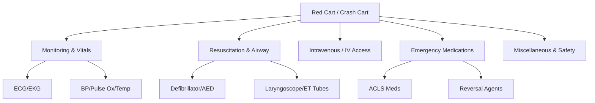

# List of Required Medical Equipment & Medications (Red Cart)

**Document Status:** Needs Completion 

**Revision Date:** October 2, 2025 

**Standard TOC:** Included 

---

## I. Overview of the "Red Cart"

A "Red Cart," often referred to as a **crash cart** or **code cart**, is a wheeled cabinet used in hospital and medical facilities. It is stocked with emergency supplies needed to treat life-threatening situations quickly.

---

## II. Required Medical Equipment

### 1. Cardiac Monitoring & Vital Signs

* 
**Cardiac Monitoring Equipment:** ECG/EKG machine used to monitor heart rate and rhythm continuously.

* 
**Vital Signs Monitoring:** Used to regularly check blood pressure, oxygen saturation via pulse oximeter, and temperature.

* 
**Respiratory Monitoring:** Monitoring of respiratory rate.

* 
**Blood Pressure Cuff:** Manual or digital cuff for pressure readings.

* 
**Stethoscope:** For clinical assessment and auscultation.

* 
**Glucometer:** For checking blood glucose levels.

### 2. Resuscitation & Airway Management

* 
**Defibrillator/AED:** Used for CPR in cases of cardiac arrest.

* 
**External Pacemaker:** For emergency cardiac pacing.

* 
**Bag Valve Mask (BVM):** For ventilation support.

* 
**Endotracheal Tubes:** Various sizes for advanced airway management.

* 
**Laryngoscope:** Equipment for intubation procedures.

* 
**Airway Adjuncts:** Oropharyngeal and nasopharyngeal airways.

* 
**Suction Setup:** Including suction catheters.

### 3. Intravenous (IV) Access & Fluids

* 
**IV Supplies:** Catheters, adhesive pads/tape, and collection products.

* 
**IV Fluids:** Normal Saline and Ringer's Lactate.

---

## III. Required Medications List

The following medications are typically found in the Red Cart and categorized by clinical use.

| Category | Medication | Clinical Indication / Use |
| --- | --- | --- |
| **ACLS / Cardiac** | **Epinephrine** | For cardiac arrest and severe allergic reactions.

 |
|  | **Atropine** | Treatment for bradycardia.

 |
|  | **Amiodarone / Lidocaine** | Antiarrhythmics for heart rhythm management.

 |
|  | **Adenosine** | For cardiac rate correction.

 |
|  | **Magnesium Sulfate** | Specifically for Torsades de Pointes.

 |
|  | **Sodium Bicarbonate** | For metabolic acidosis management.

 |
| **Neurological** | **Midazolam / Lorazepam** | Benzodiazepines for seizure management or sedation.

 |
|  | **Levetiracetam** | Anticonvulsant therapy.

 |
| **Reversal Agents** | **Naloxone** | For opioid overdose.

 |
| **Blood Pressure** | **Clonidine** | For withdrawal symptoms.

 |
|  | **Labetalol / Metoprolol** | For heart rate and blood pressure control.

 |
| **Symptomatic** | **Ondansetron / Metoclopramide** | Anti-nausea and anti-vomiting.

 |
|  | **Acetaminophen / Ibuprofen** | For pain management.

 |
|  | **Antihistamines** | For allergic reactions.

 |
| **Misc** | **Electrolyte Balance Therapy** | For metabolic stabilization.

 |

---

## IV. Miscellaneous, Protocols, and Staffing

### Support Equipment & First Aid

* 
**Personal Protective Equipment (PPE):** Gloves and protective gear.

* 
**Tools:** Scissors, bandages, and medical tape.

* 
**Basic First Aid:** Antiseptics for minor issues.

* 
**Pads:** Resuscitation pads and adhesive pads.

### Documentation & Protocols

* 
**ACLS Protocols:** Current algorithms and documentation for emergency procedures.

* 
**Record Keeping:** Tools for ongoing observation and recording.

### Staffing & Training

* 
**Staff Requirements:** Staff including those with specific experience in stabilization should be listed.

* 
**Local Standards:** Each facility may have specific requirements or guidelines based on local standards.

* 
**Transfer Procedures:** Defined processes for when patient transfer is necessary.

---

**Note:** This inventory includes equipment and medications which are currently contained in the Red Cart but still needs completion to meet full facility standards.